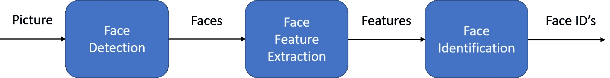
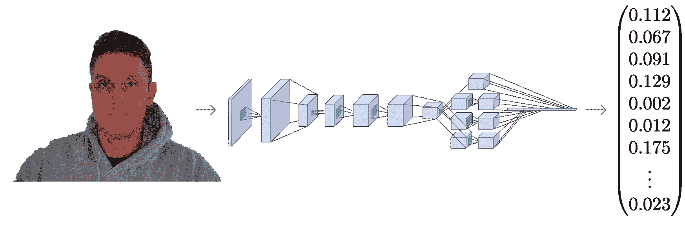
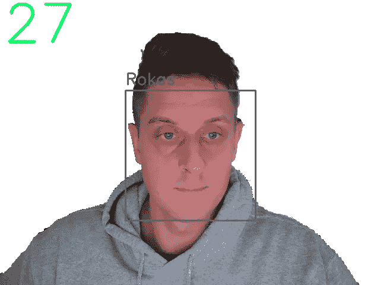

# 用 Python 和 Facenet 在 CPU 上实现实时人脸识别

> 原文：<https://pub.towardsai.net/real-time-face-recognition-on-cpu-with-python-and-facenet-3e7b3a0c0279?source=collection_archive---------3----------------------->

## 我将介绍一种简单的方法，通过我的定制框架来构建和使用任何定制的人脸识别模型。

**您见过的最先进的数据科学路线图！附带数以千计的免费学习资源和 ChatGPT 集成！**

**在本文中，我将介绍一种简单的方法，通过我的自定义框架来构建和使用任何自定义人脸识别模型。完成本教程后，您将学习如何使用预先训练的模型创建一个具有任何 CPU 的实时人脸识别系统。**

**官方将人脸识别定义为验证或识别图像中人脸的问题。但是通常，有一个问题，我们到底是如何在图像中识别人脸的？**

**人脸识别过程可以分为多个步骤。下图是人脸识别管道的一个例子:**

****

**作者图片:人脸识别管道**

**人脸识别流水线步骤:**

*   **人脸检测—检测图像中的一个或多个人脸；**
*   **特征提取——从图片中检测到的人脸中提取本质特征；**
*   **面匹配-匹配面以锚定面特征。**

**有许多方法可以实现人脸识别流程中的每一步。在本文中，我们将重点关注一种流行的深度学习技术，该技术使用第一篇教程中介绍的 MediaPipe 人脸检测模型进行人脸检测，使用 FaceNet 进行特征提取，以及使用余弦或欧几里德距离进行人脸匹配。**

**让我们一步一步地解决这个问题。在每一步中，我们将了解不同的机器学习算法。我不打算完全解释每个算法，这样就不会成为一篇没完没了的文章。尽管如此，我还是会向你展示每一个背后的主要思想。您将学习使用 MediaPipe 面部检测器和 FaceNet 面部特征提取器在 Python 中构建面部识别系统。**

## **使用 MediaPipe 进行面部检测:**

**人脸识别管道的第一步是人脸检测。我们需要先定位图像中的人脸，然后才能区分它们！即使我在之前的教程中详细介绍了 MediaPipe 人脸检测器，我们仍然需要提到它。如果你在过去十年中使用过任何相机，你可能会注意到人脸检测的发展。**

****

**人脸检测是当今大多数相机使用的一项重要功能。例如，当相机可以自动定位人脸时，它可以确保在拍照之前所有人脸都聚焦。但现在我们将把它用于一个不同的目的——找到面部区域，我们将把这些区域传递给管道中的另一个步骤，“面部特征提取器”。**

**这篇文章将使用我最喜欢的超轻 MedaPipe 探测器。但是，假设您对应用提到的任何其他检测方法感兴趣。在这种情况下，您可以参考我以前的教程，在那里我演示了如何轻松地创建您的对象以在我的引擎上运行。我已经探索了多种面部检测器。其中包括 MTCNN，Dlib，MediaPipe，pure CNN，以及其他一些最近发布的人脸检测器。**

**但是让我们继续我们对定位的脸所做的。**

## **FaceNet 人脸特征提取；**

**与其他面部识别模型类似，FaceNet 是一个深度神经网络，用于提取人脸图像的特征。它是由谷歌研究人员 Schroff 等人发表的。2015 年。**

****

**作者图片**

**FaceNet 将人脸图像作为输入，输出是一个由 128 个数字组成的向量，代表人脸的基本特征。这个向量被称为嵌入，因为来自人脸图像的所有相关信息都被嵌入到这个向量中。基本上，FaceNet 将人脸压缩成一个 128 位数的向量。但是如果我们看这个向量，我们人类就不可能知道那个人的脸是什么样子。**

**在机器学习中，将高维数据(例如图像)与低维图像(向量嵌入)相关联已经成为相当普遍的做法。**

**在看不见的图像中识别一个人的一种常见方法是获得他们的嵌入并计算与已知人的照片的距离。我们通常使用余弦或欧几里德距离数学公式来计算距离。如果计算的面部距离足够接近人 A 的嵌入，我们假设该面部是同一个人的。**

**听起来很简单，对吧？我们通过 FaceNet 输入图像，获得一个神奇的矢量数，并检查计算出的距离是否足够接近我们已知的任何人脸。尽管如此，还有一个问题，FaceNet 如何知道从人脸图像中提取什么？嵌入向量中的这些数字是什么意思？这不是本教程的目的，但我们可以简单地介绍一下，以便熟悉它。**

**为了训练人脸识别器，我们需要许多人脸图像。像每个机器学习问题一样，训练通常需要几千张不同的图像。当我们开始训练过程时，模型为每个图像生成随机向量，这意味着图像是随机分布的。但以下是学习步骤:**

1.  **随机选择锚图像；**
2.  **随机选择同一个人的正面样本图像作为基准图像；**
3.  **随机选择与主图像不同的人的负样本图像；**
4.  **调整 FaceNet 神经网络参数，以便正样本比负样本更接近锚点。**

**我们重复这四个步骤，直到没有更多的变化要做，或者这些变化很小，没有影响。当训练完成后，同一个人的所有面孔在距离上是相互靠近的，而不同的面孔是相互远离的。**

**你可能会问，嵌入向量中的数字是什么意思？事实上，我们不知道这些数字代表什么，也很难解读它们。我们知道这些特征对于人脸识别来说似乎是必不可少的，而且它确实有效。**

**如果你是开发者，你可以把 face matcher 想象成一个哈希函数。它将同一个人的脸映射到(大约)坐标系中的相同位置，其中嵌入是 hashcode。**

**但是这个理论就够了。让我们开始写代码吧。和以前一样，我专门为人脸识别编写了整个对象，我们将把它和一个引擎对象一起使用。这个对象有它需要做的一切，从运行推理、加载锚图像、测量距离、在一个框架上绘图识别，等等；您可以随时添加您需要的功能。以下是完整的`faceNet.py`目标代码:**

**我不是一步一步地跟这个对象走；我将在我的 YouTube 视频教程中介绍这一点。但是我必须提到，这里我们加载的是`.onnx`模型，我们可以用`faceNet/convert_to_onnx.py`脚本转换它:**

**首先，您必须从代码中的给定链接下载权重，并将它们放在 models 文件夹中。然后用`python faceNet/convert_to_onnx.py`运行下面的代码，它应该将模型转换成`.onnx`格式。**

**就这么简单。当我们有了模型后，我们可以打开`main.py`脚本并使用以下代码运行网络摄像头实时人脸识别:**

**正如我提到的，要提取人脸嵌入，首先，在定义 FaceNet 对象时，我们需要在一个框架上定位人脸。为此，我们使用我的 MPFaceDetection 对象；更多细节你可以在我的第二个教程[中找到。然后我们告诉模型我们保存的`.onnx`模型的路径。然后我们给它锚被保存的路径；它必须是有脸作物的图像。例如，我在图像"`Rokas.png`"上有我的，那是我被裁剪的脸。这意味着，模型将加载这个锚，并显示我的名字，如果它找到一个与之匹配。](../face-detection)**

**好的，很好。接下来，我们需要创建一个引擎对象，负责处理图像、视频或网络摄像头流；我选择处理网络摄像头。使用“show”参数，我告诉对象在屏幕上为我显示这个帧。此外，我还添加了一个 FPSmetric 来了解人脸识别的工作速度。最后，我必须将我的“facenet”对象传递给“custom_objects”参数。在这里，我们可以添加更多，如“铅笔素描”，“背景去除”或其他我们想要的实体。**

**现在，如果我们没有将裁剪保存在光盘上，我创建了一个函数来抓取第一个网络摄像头帧，如果它在其中找到一张脸，它就会裁剪并保存它:**

**保存锚面后，它移动到“`engine.run()`”函数，该函数处理每一帧，我们应该看到与我的下图类似的结果:**

****

**作者图片**

**我们可以清楚地看到 FPS 的左上角和我脸上的一个带有锚图像名称的方块。太神奇了！**

# **结论:**

**最后，我们创建了一个可以在我们的 CPU 上进行实时人脸识别的系统，它的运行速度在 30 fps 左右，这对我们来说足够了！**

**我发现这个教程对我所能达到的结果很有吸引力。我们可以进一步研究这个项目，将它放在 raspberry pi 上进行实时人脸识别，为我们打开一些入口。或者我们可以把它放在我们家门口，以了解是否有陌生人在我们家门口。有很多可能的使用方法！**

**感谢阅读！一如既往，本教程给出的所有代码都可以在我的 [GitHub](https://github.com/pythonlessons/background_removal) 页面上找到，并且免费使用！**

***原载于*[*【https://pylessons.com/face-recognition】*](https://pylessons.com/face-recognition)**