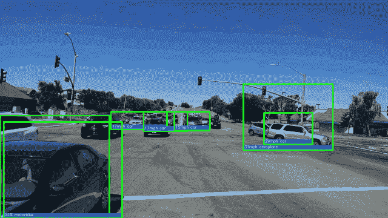
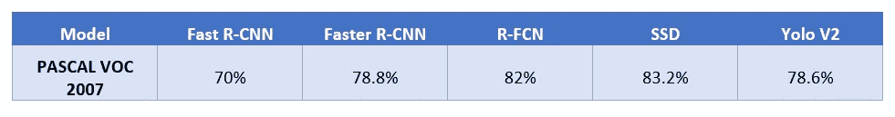
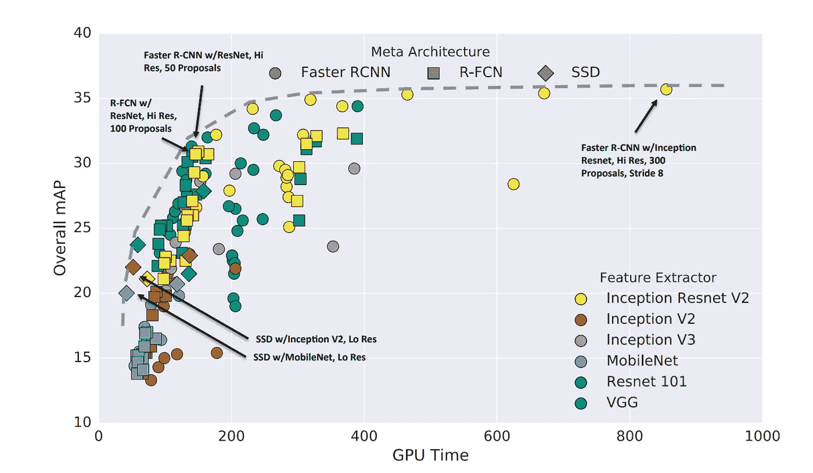
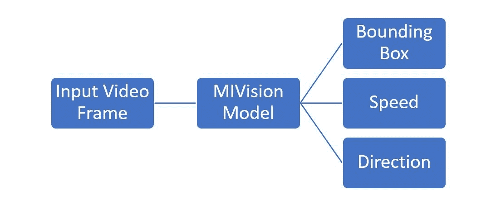
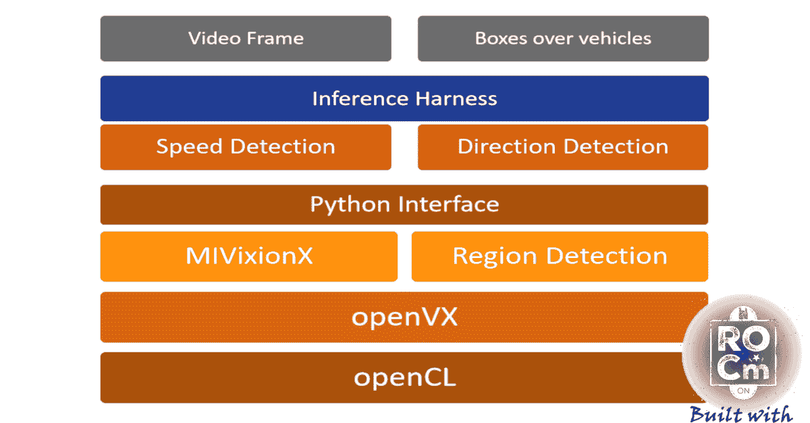
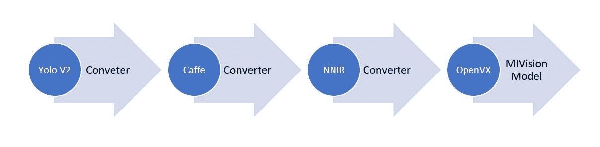
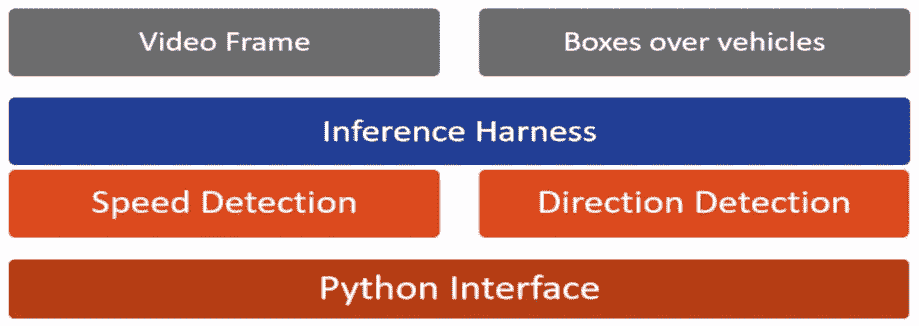
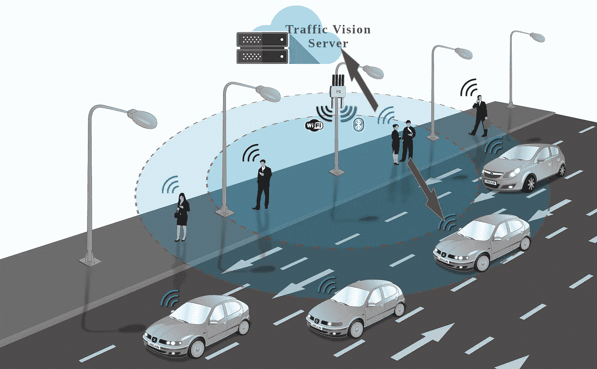

# AMD GPU 上 50 高清帧/秒的实时车辆检测

> 原文：<https://pub.towardsai.net/real-time-hd-vehicle-detection-with-amd-rocm-e9c2eea73852?source=collection_archive---------2----------------------->

## 实时车辆检测| [走向人工智能](https://towardsai.net)

高清分辨率为 50 帧/秒的实时车辆检测

# 什么是车辆检测？

车辆检测是[交通监控方法](https://arxiv.org/ftp/arxiv/papers/1410/1410.5894.pdf)的一部分，在实时交通反馈中，包括检测所有类型的车辆，包括轿车、货车、卡车、自行车等。有几种方法，从图像处理方法，如 [HOG(梯度方向直方图](https://scikit-image.org/docs/dev/auto_examples/features_detection/plot_hog.html))、 [SIFT(尺度不变特征变换)](https://en.wikipedia.org/wiki/Scale-invariant_feature_transform)到深度学习对象检测，如 [RCNN](https://arxiv.org/abs/1311.2524) 、 [SSD](https://arxiv.org/abs/1512.02325) 、 [Yolo](https://pjreddie.com/darknet/yolo/) 等。

在这里，我们重点关注深度学习对象检测模型，因为它们具有卓越的准确性。神经网络是运算符(如卷积、RelU 等)及其参数(也称为权重和偏差矩阵)的图形。对象检测网络是一个特殊的子类，被训练来定位图像或视频帧中的对象。物体检测的输入是物体的清晰图像。该图像被传递给软件，该软件输出位置，或输入对象周围的边界框，如上图所示。

# 如何选择检测型号？

性能和准确性是对象检测模型的两个基石。[图(平均精度)](https://medium.com/@jonathan_hui/map-mean-average-precision-for-object-detection-45c121a31173)是测量物体检测器精度的常用度量。

不同对象检测模型的 mAP(平均精度)分数概述

虽然 SSD 和 R-FCN 等型号更准确，但 Yolo 是唯一一个在直播视频中每秒帧数最高的型号。

# 为什么我们需要一个高端的 GPU？

我们的主要目标是找到一种能够在高清分辨率的视频馈送上通过现代 GPU 提供每秒 30 帧以上的对象检测器。下面的图片来自[谷歌研究论文](https://arxiv.org/pdf/1611.10012.pdf)在一台配备 32GB RAM、英特尔至强 E5–1650 v2 处理器和 Nvidia GeForce GTX Titan X GPU 卡的台式机上，我们可以感受到精确度(mAP)与速度(ms)之间的权衡。

现代卷积物体探测器的速度/精度权衡(来源和参考:谷歌研究论文[https://arxiv.org/pdf/1611.10012.pdf](https://arxiv.org/pdf/1611.10012.pdf)

上图非常清楚地表明，很少有型号能够达到 30 fps，相当于 33 毫秒。

由于我们的硬件仅限于 16GB 内存，采用 AMD 锐龙 8 核处理器和镭龙 Instinct MI25 GPU，我们选择 YoloV2 作为起点。

# 应用设计

下图是一个典型交通视觉应用的高层架构。

交通视觉应用程序的高级设计

下一张图片提供了我们应用软件的底层组件，其中底层 3 个组件由 AMD MIVisionX 工具集提供。

交通视觉应用的低层组件

# 如何翻译模型来使用 GPU？

如上所述，神经网络是操作符(如卷积、RelU 等)及其参数(也称为权重和偏差矩阵)的图形。下载约罗·V2 图表及其参数的链接如下:

1.  [Yolo V2 网络](https://raw.githubusercontent.com/pjreddie/darknet/master/cfg/yolov2-tiny-voc.cfg)
2.  [约罗·V2 举重](https://pjreddie.com/media/files/yolov2-tiny-voc.weights)

这是一个原始图形，必须翻译成一组可以在 AMD 桌面上使用 CPU-cores 和 GPU 的指令。 [AMD MIVisionX](https://gpuopen-professionalcompute-libraries.github.io/MIVisionX/) 包提供了一种使用 [AMD openVX](https://gpuopen.com/compute-product/amd-openvx/) 和 [OpenCL](https://en.wikipedia.org/wiki/OpenCL) 库转换到 MI-xx GPU 基础系统的简单方法。 [AMD openVX](https://gpuopen.com/compute-product/amd-openvx/) 是一个用于加速计算机视觉应用的底层库，而 [OpenCL](https://en.wikipedia.org/wiki/OpenCL) 是一个用于编写跨异构平台(如 CPU & GPU)执行的程序的框架。

MIVisionX 模型是使用下图所示的模型转换过程生成的。该过程将 Yolo V2 转换为 MIVision 模型，作为 openVX 库(带有。so extension)准备好在基于 x86 的 CPU 内核和 MI-xx GPU 上执行。

基于 AMD 系统的视觉应用 Yolo 模型转换流程

# 应用前端

一旦我们有了模型(一个动态库)，我们就把它包装成一个 python 包。MIVisionX 模型是应用程序中计算最密集的部分，在 GPU 上执行。我们将其余组件实现为 python 模块，在主机 CPU 上执行，如下图所示。

交通视觉前端组件

# 如何部署

虽然我们将它开发为一个桌面应用程序，带有作为 IP 网络摄像头的实时提要，但人们可以很容易地在云中或雾中将其扩展为 HTTP 服务。这种服务预计将使用 nodeJS/javascript 来支持其他类型的摄像头，包括手机、交通摄像头等。并在 V8 支持的浏览器中运行。

交通监控即云服务

# 结果

这个应用程序在 AMD 锐龙公司的 MI25 AI 加速器桌面上以 **50 高清(1920x1080)帧/秒**的速度运行。

克里斯·帕拉特对我们结果的反应令人震惊。😲

你可以在 [GitHub](https://github.com/srohit0/trafficVision/) 上下载源代码。更多信息请参考下面像我一样好奇的灵魂。

# 参考

1.  [交通视觉 app](https://github.com/srohit0/trafficVision/)
2.  [车辆检测与跟踪技术](https://arxiv.org/ftp/arxiv/papers/1410/1410.5894.pdf)
3.  [测量交通速度](https://medium.com/datadriveninvestor/measuring-traffic-speed-with-deep-learning-object-detection-efc0bb9a3c57)
4.  [yoloV2 纸](https://arxiv.org/pdf/1612.08242.pdf)
5.  [Tiny Yolo 又名暗网参考网](https://pjreddie.com/darknet/imagenet/#reference)
6.  [MiVisionX 设置](https://github.com/kiritigowda/MIVisionX-setup)
7.  [AMD OpenVX](https://gpuopen.com/compute-product/amd-openvx/)
8.  [深度学习专家](https://www.toptal.com/deep-learning)