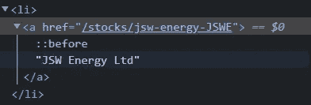
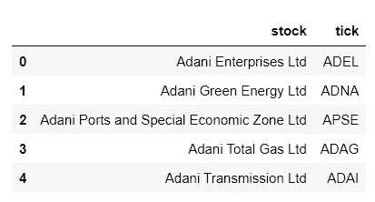
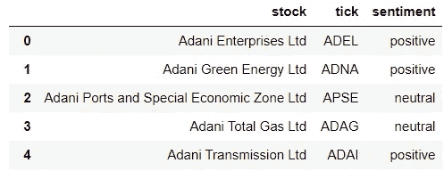

# 实时股票新闻情绪分析器

> 原文：<https://pub.towardsai.net/real-time-stock-news-sentiment-analyzer-54eaa91c5634?source=collection_archive---------0----------------------->

## [自然语言处理](https://towardsai.net/p/category/nlp)

投资股市是应对通货膨胀的一个好方法。通货膨胀是指大多数日常或普通使用的商品和服务的价格上涨，如食品、服装、住房、娱乐、交通、消费品等。基本上，有了 100 卢比，你就买不到去年能买到的那么多瓦达帕夫了。

在受到疫情冲击的 2020-2021 财年，多达 1420 万新投资者开始在股市交易。

在股票市场进行良好投资所需的一项关键技能是能够正确分析与金融和商业部门相关的新闻。哪家公司正在进行行业多元化，或者哪家公司有走向破产的迹象？你需要随时了解市场上发生的每一笔小交易和影响。金融新闻可能有点难以理解，尤其是对那些金融界的新手来说。

为了让这个过程变得简单一点，我计划制作一个工具，提取印度股市上每只股票的最新头条，并通过一个经过专门金融新闻培训的情绪分析器进行分析，为每只股票创建一个总体情绪，以帮助股票投资新手更好地理解新闻。

**实时股票新闻分析**

**要求:**

1.  美丽的声音
2.  拥抱脸变形金刚库
3.  Urllib
4.  Numpy
5.  熊猫

**获取数据**

让我们从可靠来源的网络搜集财经新闻开始。

在浏览了多个网站后，我发现 **tickertape** 按字母顺序分类其股票，并在其 URL 中使用一个 tick(关键字)来导航到特定的股票。事实证明，这种接口对于网络抓取数据非常有用。

首先，让我们创建 tickertape 中所有分笔成交点的列表。

我创建了一个 get_ticks()函数来从 **tickertape/stocks** 中一次性提取所有的 ticks。这里每只股票的名字都链接到它的筛选页面。链接格式为“/股票/ **股票名称勾选**”。

我们需要提取这个**记号**来无缝导航到每只股票。

使用 BeautifulSoup 和 urllib，我提取了股票的价格和名称，并按字母顺序将它们存储在 Pandas 数据框架中。

输出如下所示:

现在转到新闻部分。为此，我们遵循与 **get_ticks()** 类似的模式。与每只股票相关的新闻位于**“ticker tape/stock-tick/news？核对表=基本&ref =股票-概览 _ 概览-栏目&type =新闻"**。同样，通过使用 BeautifulSoup 和 urllib，我们可以提取这条新闻。

运行一个 for 循环，用数据帧的 **tick** 列中的元素替换 **stock-tick** 部分，我们可以提取每只股票的新闻，并将其存储在一个名为 ***news*** 的列表中。

现在我们已经有了我们需要的新闻格式，我们可以继续进行情绪分析部分。

**财经新闻的情感分析**

对于这个项目，我计划使用一个名为 **FinBERT** 的预训练模型。

FinBERT 是一个专门设计用于财经新闻和文本的模型。这是一个基于 BERT 架构的模型。加上 HuggingFace transformers 库，FinBERT 变得非常容易实现。

关于伯特和芬伯特的更多细节，你可以参考我的博客:

[**利用芬伯特进行财经新闻情绪分析**](https://medium.com/@ravirajshinde2000/financial-news-sentiment-analysis-using-finbert-25afcc95e65f)

现在 FinBERT 已经加载，我们开始分析过程。

由于 FinBERT 以数字格式返回情感，我们需要将输出映射到一种更加人性化的格式。为此，我们将创建一个名为 labels 的 python 字典。

好的部分来了。这里，我们使用 tokenizer 对象根据良好的 NLP 实践对文本进行预处理，然后将来自 tokenizer 的输出传递给 finbert 对象进行情感分析。

我们对列表中的每只股票都这样做。每个标题的情绪都存储在一个列表中，这样我们以后可以将它们分组，以创建每只股票的总体情绪。我们将函数的输出存储在一个名为 **tot_val** 的列表列表中。一些列表看起来是空的，因为网站上没有新闻。对于那些股票，我只是回归中性作为情绪。

最后，我们继续通过组合每只股票的每个标题的观点来创建观点的集合。为此，如果标题是正面的，我简单地将 **+1** 添加到 **agg** 变量，如果标题是负面的，则添加 **-1** 。基于 **agg** 变量的最终值，我给股票分配正、负或中性。

最后，我们通过 **get_sent()** 传递我们的情感列表，并获得总的情感。我们将这些情感存储在一个列表中，然后将它分配到我们原始的 **tick_df** 数据帧的**情感**列中。

输出如下所示:

因此，我们成功地基于金融新闻为印度股票市场创建了一个情绪分析器。

*   本项目仅用于教育目的，不应用于投资决策。
*   **此外，本博客绝不是 tickertape 或博客中提到的任何其他实体的赞助**

我的 git 档案中有完整的代码:

 [## GitHub-ravi Raj 2000/实时股票新闻情绪分析器

### 在 GitHub 上创建一个帐户，为 ravi Raj 2000/实时股票新闻情绪分析器的开发做贡献。

github.com](https://github.com/Raviraj2000/Realtime-Stock-News-Sentiment-Analyzer.git) 

感谢阅读！😄