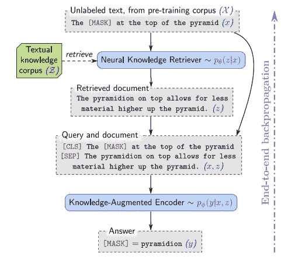
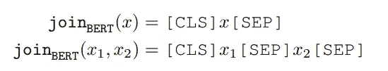
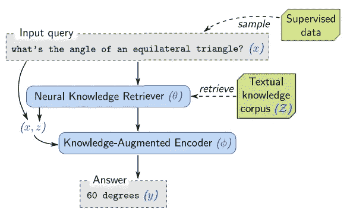
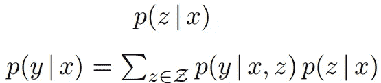
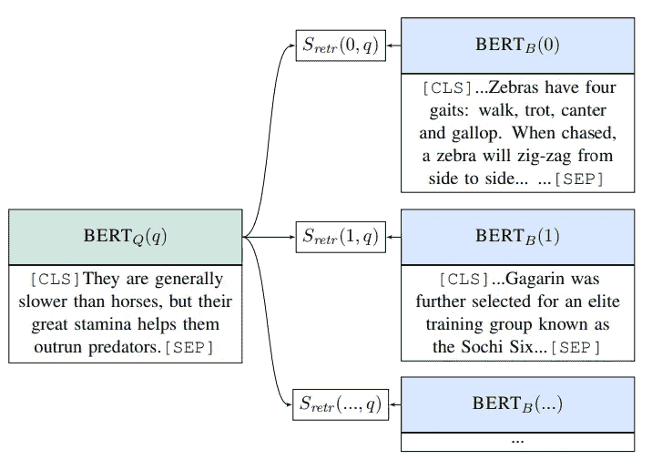

# 领域:检索增强语言模型预训练

> 原文：<https://pub.towardsai.net/realm-retrieval-augmented-language-model-pre-training-534feae7ab98?source=collection_archive---------3----------------------->

## [自然语言处理](https://towardsai.net/p/category/nlp)

## 检索增强语言模型预训练导论

[马志威](https://unsplash.com/@makcedward?utm_source=medium&utm_medium=referral)在 [Unsplash](https://unsplash.com/?utm_source=medium&utm_medium=referral) 上拍照

自 2018 年以来，基于 transformer 的语言模型已被证明在开放领域问答(Open-QA)等许多 NLP 下游任务中取得了良好的性能。为了获得更好的结果，模型打算增加模型参数(例如，更多的头、更大的尺寸)，以便在神经网络中存储世界知识。

Google Research 的 Guu 等人(2020 年)发布了最先进的模型(检索增强语言模型预训练，aks REALM)，该模型利用了来自其他大型语料库(如维基百科)的`knowledge retriever`增强数据。给定一个额外的信号，它有助于模型提供一个更好的结果。在这个故事中，我们将讲述这个模型是如何达到最先进的效果的。

# 领域概述

总体思想是利用额外的文档向模型提供更多的信号，以便它可以准确地预测屏蔽令牌。将这种方法命名为`retrieve-then-predict`方法。下图显示了预训练工作流程。

1.  给出一个带面具的句子(金字塔顶端的面具)
2.  向神经知识检索器输入屏蔽语句。它将返回一个与输入相关的文档(不一定是整篇文章)。
3.  将原始句子和增强文档传递给知识增强编码器。它将预测屏蔽令牌(金字塔)。

对于微调阶段，它使用非屏蔽语句而不是包含屏蔽标记的语句。

# 模型架构

从前面的概述中，你可能知道 REALM (Guu et al .，2020)包含两个模型，即知识检索器和知识扩充编码器。我们将一个接一个地检查它。

## 知识检索器

首先，知识检索器的目标是为下一步输出一个有用的文档。对于输入，它使用 **BERT-style 将句子转换为一个令牌**，分别以【CLS】和【SEP】作为前缀和前缀。对于外部文档，它还包括文档的标题和正文。因此，我们需要通过[SEP]来连接它，这是遵循 BERT 风格的。你可以访问这个[故事](https://towardsdatascience.com/how-bert-leverage-attention-mechanism-and-transformer-to-learn-word-contextual-relations-5bbee1b6dbdb)来获得更多关于伯特风格格式的信息。

伯特风格格式。x、x1 和 x2 指的是句子(Guu 等人，2020 年)

然后，它使用向量嵌入(来自知识语料库的输入和文档)的内积。Softmax 将应用于内部产品结果，以便挑选最相关的文档。

## 知识扩充编码器

与 knowledge retreiver 相同，Guu 等人遵循 BERT 机制来训练和微调该编码器。

在预训练阶段，它使用掩蔽语言建模(Devlin et al .，2018)。基本上，训练目标是通过非屏蔽令牌预测屏蔽令牌。您可以访问[故事](https://towardsdatascience.com/how-bert-leverage-attention-mechanism-and-transformer-to-learn-word-contextual-relations-5bbee1b6dbdb)来更好地了解 MLM 机制(Devlin et al .，2018)

预训练阶段示例(无监督学习)(Guu 等人，2020 年)

在 Open-QA 微调阶段，没有屏蔽令牌，Guu 等人**假设答案可以从文档**(知识检索器的输出)中找到。它遵循 BERT 风格来构造矢量嵌入，并将其传递给 transformer 模型。

开放式质量保证微调阶段(监督学习)示例(Guu 等人，2020 年)

## 最大内积搜索

这种`retrieve-then-predict`架构的主要挑战是从更大的外部语料库中选择一个好的文档。Guu 等人提出使用 MIPS 来缩短检索时间。

上公式:给定输入句子，从语料库中选择文档。下式:给出输入句子和选择的文档，选择答案(Guu et al .，2020)

为了减少计算时间，Guu 等人提出了两步计算。首先，通过提供输入句子 x. **利用**[**MIPS**](https://arxiv.org/pdf/1202.6101v1.pdf)**(Ram and Gary，2012)从更大的语料库中计算文档的可能性，以挑选前 k 个概率文档**作为下一步的输入。MIPS 使用构建球树来将数据点(即向量)分成不同的簇。数据点将被分割成集群，并且它将只属于一个集群(同一级别的集群)。因此，Guu 等人可以使用少得多的运行时间来找到顶部 k 个文档。

球树示例(Ram 和 Gray，2012 年)

# 培训前的数据处理

除了使用 MIPS 来选择最相关的文档之外，Guu 等人还在预训练中注入额外的信息来辅助模型训练。

## 显著跨度

由于领域聚焦于开放问答领域，他们倾向于强调命名实体和日期。那些命名的实体和日期将被屏蔽为显著的跨度。为了不费力地找出命名实体，训练基于 BERT 的标记器来识别命名实体和日期。

## 空文档

Guu 等人认为，并不是所有的屏蔽记号都需要额外的知识来预测。空文档被注入到前 k 个检索文档来类似这种情况。

## 丢弃琐碎的检索

前 k 个文档可能包括相同的输入句子。为了防止编码器通过关注未屏蔽的标记来预测结果，这种琐碎的训练数据将在预训练阶段被排除。

## 向量初始化

好的向量导致更好的预测结果。为了简单起见，我们可以使用随机初始化，但它会引入冷启动问题。因此 Guu 等人使用****逆向完形填空任务进行预训练**。简而言之，它是屏蔽令牌预测的逆版本。给出一个查询(下图的左侧)，目标是从候选项中挑选一个真实的上下文(下图的右侧)**

****

**逆向完形填空任务示例(Lee et al .，2019)**

# **外卖**

*   **命名实体和日期的显著跨度很重要。由于这个模型着眼于 OpenQA。让模型关注那些命名的实体和日期是很重要的。**
*   **从更大的语料库中选择文档是重要的。假设最终结果存在于额外的文档中。挑选 k 个相关文档也很重要。**

# **关于我**

**我是湾区的数据科学家。专注于数据科学、人工智能，尤其是 NLP 和平台相关领域的最新发展。你可以通过[媒体博客](http://medium.com/@makcedward/)、 [LinkedIn](https://www.linkedin.com/in/edwardma1026) 或 [Github](https://github.com/makcedward) 联系我。**

# **参考**

*   **页（page 的缩写）拉姆和 A. G .格雷。[使用树形数据结构的最大内积搜索](https://arxiv.org/pdf/1202.6101v1.pdf)。2012**
*   **放大图片作者:Jeffrey j ... [BERT:用于语言理解的深度双向转换器的预训练](https://arxiv.org/pdf/1810.04805.pdf)。2018**
*   **K.古、李刚、董子珍、帕苏帕特和张明威。[领域:检索-增强语言模型预训练](https://arxiv.org/pdf/2002.08909.pdf)。2020**