# 🍖🍲Recibrew！用深度学习预测食物成分！🍲🍖

> 原文：<https://pub.towardsai.net/recibrew-find-out-the-foods-ingredients-dbc2a4e37383?source=collection_archive---------2----------------------->

## [深度学习](https://towardsai.net/p/category/machine-learning/deep-learning)，[教程](https://towardsai.net/p/category/tutorial)

## 在 Pytorch Lightning 中实现的深度学习中使用 seq2seq 预测食品成分的▶️▶️循序渐进教程。◀️◀️

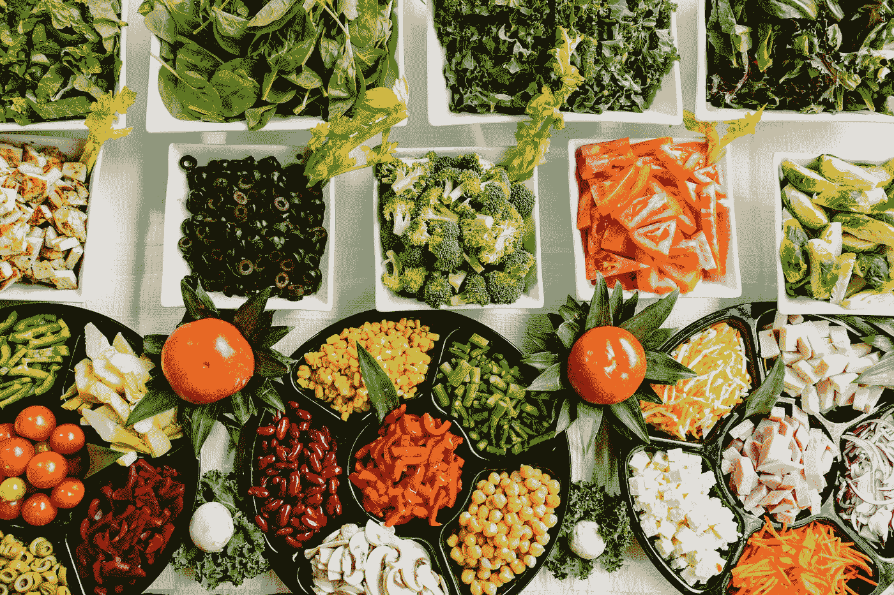

照片由[丹金](https://unsplash.com/@danielcgold?utm_source=medium&utm_medium=referral)在 [Unsplash](https://unsplash.com?utm_source=medium&utm_medium=referral) 上拍摄

嗨，伙计们，欢迎来到我的新文章。距离上次写东西已经很久了。今天，我想写一写我的简单有趣的项目，叫做**配方酿酒师** (Recibrew)。Recipe Brewer 是我在空闲时间做的有趣项目之一，以满足我的好奇心。因此，我想尽可能诚实地分享我是如何完成这个有趣的小项目的😄。所以你可以复制和学习我做的东西。

# 概述

1.  介绍
2.  贮藏室ˌ仓库
3.  模型
4.  数据集、EDA 和数据预处理
5.  评估指标
6.  解码策略
7.  履行
8.  实验
9.  结果
10.  建议
11.  趣味配料生成器
12.  结论
13.  编后记

# 介绍

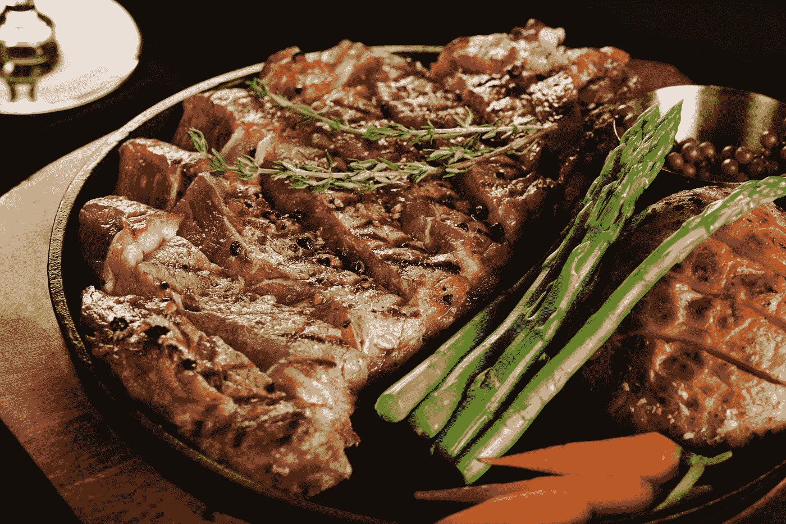

照片由 [Loija Nguyen](https://unsplash.com/@loija?utm_source=medium&utm_medium=referral) 在 [Unsplash](https://unsplash.com?utm_source=medium&utm_medium=referral) 上拍摄

该项目是关于建立一个配料生成器应用程序。它是基于配方标题作为输入的配料预测器。我使用**深度学习**作为创建生成食谱名称的模型的方法。

当我妈妈做饭时，想知道用什么配料来做一些新的食物，这个想法就来了。然后我想，‘嗯，不如我建一个程序，可以从食物名称中提取配料。’既然我有开发一些深度学习(DL)应用的经验，为什么不从中获得乐趣呢，✌️.

总之，我想建立一个程序，它接收食物名称作为输入，并输出配料。下面是我想开发的一个例子:

```
Input : 'fried rice'
Model Output : '1 gr rice || 1 gr salt' 
```

这篇文章将主要是关于在自然语言处理(NLP)中试验一些深度学习 **Seq2Seq** 架构。分别是**门控循环单元(GRU)+巴丹瑙注意**和**变压器**。因为我对它们在低参数下的性能很好奇，所以我把这些架构做得很小。它们每个都有几乎相似的参数(1M 左右)。稍后，我们将比较它们中的每一个，看看哪个架构是最好的。我还想介绍一些在 **Pytorch** 中开发深度学习应用的伟大工具，这就是 **Pytorch Lightning** 。我会告诉你让我的代码库更加结构化是多么有帮助。

本文的主要焦点将主要是一步一步地讲述如何实现和试验**配方酿造器**。这篇文章不会过多地讨论这个概念的细节。尽管如此，我还是会提供一些好的读物来帮助你更好地理解这个概念。如果你是新来的，不要担心！我将对这些概念进行温和的描述。如果你还不明白。不要担心！

这是我从一位医学大师那里得到的终极名言，它可能会让你精神振奋😆。

> 如果你不明白，不要担心
> 
> ~吴恩达

# 贮藏室ˌ仓库

对于任何想深入研究代码的人来说，这里是存储库链接:

[](https://github.com/haryoa/ingredbrew.git) [## haryoa/ingredbrew

### 在 GitHub 上创建一个帐户，为 haryoa/ingredbrew 开发做贡献。

github.com](https://github.com/haryoa/ingredbrew.git) 

几个注意事项:

*   源代码在' **recibrew** '中源代码主要用 Pytorch 写，用 Pytorch Lightning 包装。
*   存储库中的笔记本是构建代码库的“草稿本”。对于任何对我如何沮丧地实现我的想法感兴趣的人，请看笔记本。(EDA 除外)
*   要运行 GRU +巴赫达瑙注意力实验，请访问这个 [Colab 链接](https://colab.research.google.com/drive/1T_Bp_RSsNpp16wu001YF3REwAYkkD00d?usp=sharing)
*   要运行变压器实验，使用这个 [Colab 链接](https://colab.research.google.com/drive/1S91goRUhoSEu6JcflPuhhm55BUjBTC6g?usp=sharing)

# 模型

我在简介里说过，我用了 2 个 **Seq2Seq 架构**，分别是 **GRU +巴赫达瑙注意**和**变压器**。我将简要描述它们中的每一个。

## Seq2Seq

顾名思义，seq2seq 是深度学习中的一种架构“模式”，它接收顺序输入(文本、音频、视频)，也产生顺序输出(文本、音频、视频)。该架构主要包含**编码器**和**解码器**。**编码器**是一个深度学习模型，它对输入 seq2seq 进行编码，编码后的输入将由**解码器解码，以帮助产生输出序列。**解码器也是深度学习模型。请参见图像 0 以查看可视化效果。

实现 seq2seq 的一些示例:

1.  **机器翻译**:输入源语言，输出目标语言
2.  **摘要**:输入文章，输出文章摘要
3.  **食品配料**:(本项目)

在本文中，我们将只探讨 **GRU** 和**变压器 seq2seq** 架构。

关于 seq2seq 的更多信息，可以看这个[链接](https://www.geeksforgeeks.org/seq2seq-model-in-machine-learning/)。

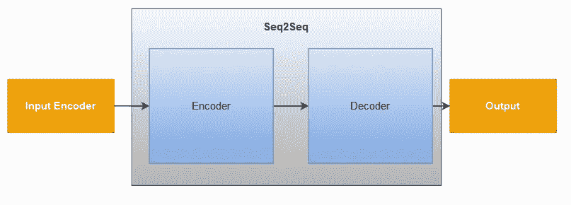

图 0 : Seq2Seq 可视化

## GRU +注意 seq2seq

我建造的一个 **seq2seq** 由 **GRU** 编码器和 **GRU** 解码器组成，带有 **Bahdanau 注意**。我将在下面逐一介绍。

**门控循环单元(GRU)** 是 RNN 的变体，处理顺序(例如文本)输入。输入序列由**复位门**和**更新门**进行“门控”。**更新门**增加或删除序列中每一步的信息。同时，**复位门**决定在过去步骤中忘记多少信息。

如果你想了解更多关于 GRU 的细节，我建议你阅读这篇文章(感谢迈克尔·皮):

[](https://towardsdatascience.com/illustrated-guide-to-lstms-and-gru-s-a-step-by-step-explanation-44e9eb85bf21) [## LSTM 和 GRU 的图解指南:一步一步的解释

### 嗨，欢迎来到长短期记忆(LSTM)和门控循环单位(GRU)的图解指南。我是迈克尔…

towardsdatascience.com](https://towardsdatascience.com/illustrated-guide-to-lstms-and-gru-s-a-step-by-step-explanation-44e9eb85bf21) 

**注意力，**简单来说，学习变量之间什么重要什么不重要来做一些任务。在情感分析任务中，当使用注意力时，它可能会学习使用什么令牌来使模型更容易学习。图 1 告诉我们一些例子，当看到一个单词对其他单词进行“自我关注”时。

直觉上，注意力是一种记住输入顺序的机制。在给定一个输出的情况下，它学习什么样的输入是最好的。给定单词，注意力选择性地决定需要什么输入。它可能会提高模型的性能。

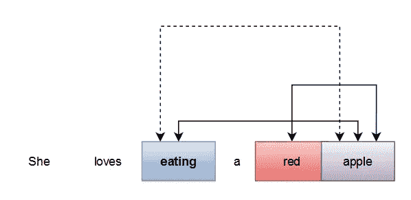

图 1:其他注意直观例子。

在我们的例子中，模型想要了解输入(源)和输出标记(目标)的重要性。这里有一些例子

```
Source : **fried** rice
Current token in target : **oil**
The model should learn that **oil** should become attentiveto the **fried** token in the **source.** 
```

> **注**:
> 
> 你用油来做油炸食品，对吗？告诉我，如果我错了，因为我在这方面一无所知 **XD。**

注意力公式如下:

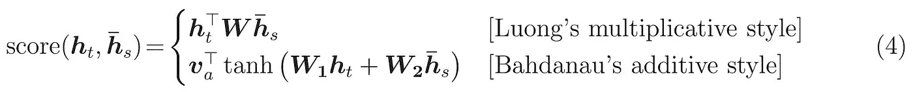

图二:注意力公式[来源:https://www . tensor flow . org/tutorials/text/NMT _ with _ attention](https://www.tensorflow.org/tutorials/text/nmt_with_attention)

我们使用 Bahdanau 的注意力公式。注意力的输入是作为**值(h_t)** 的源编码输出(编码器的输出)和作为**查询(h_s)的解码器 GRU 层的隐藏状态。** v，W 是学习到的参数。

要了解更多信息，我鼓励你阅读这篇关于注意力的技术细节的文章。

[](https://lilianweng.github.io/lil-log/2018/06/24/attention-attention.html) [## 注意？立正！

### 近年来，注意力已经成为深度学习社区中一个相当流行的概念和有用的工具。在这个…

lilianweng.github.io](https://lilianweng.github.io/lil-log/2018/06/24/attention-attention.html) 

## 变压器序列 2 序列

变压器是**当前元炒作基础**深度学习架构。现有的 NLP 架构主要使用变压器作为基础架构。这种架构催生了很多芝麻街命名的深度学习架构，像伯特和 GPT。

**转换器**本身是一个 **seq2seq** 架构，由编码器和解码器端的几个**自关注层**组成(GRU seq2seq 在编码器和解码器端使用 GRU)。该变压器缓解了 GRU **需要等待每个顺序步骤的进程**的弱点。转换器同时处理它们中的每一个，使转换器能够并行化。

架构可视化如图 3 所示。关于 Transformer 如何工作更多信息，我强烈建议您访问这篇优秀的文章。

[](http://jalammar.github.io/illustrated-transformer/) [## 图示的变压器

### 讨论:黑客新闻(65 分，4 条评论)，Reddit r/MachineLearning (29 分，3 条评论)翻译…

jalammar.github.io](http://jalammar.github.io/illustrated-transformer/) 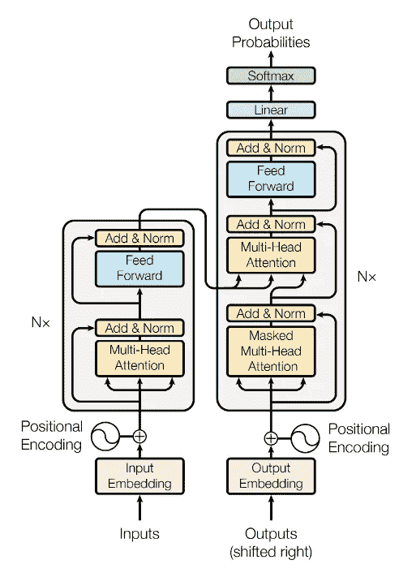

图 3:变形金刚在[注意你所需要的一切](https://papers.nips.cc/paper/7181-attention-is-all-you-need.pdf)

# 数据集、EDA 和数据预处理

## 资料组

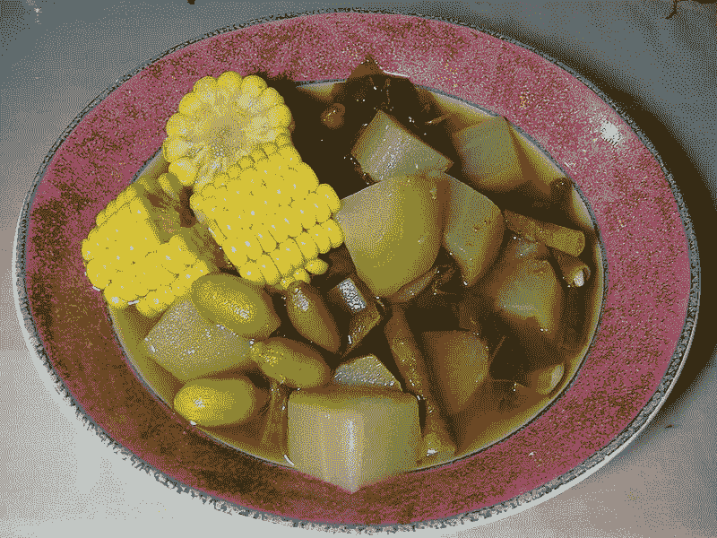

再见阿萨姆。来源:[维基百科](https://id.wikipedia.org/wiki/Berkas:Sayur_asem_vegetable_soup.jpg) ( CC BY-SA 2.0)

在这个项目中，我使用了一个食物食谱数据集。我试着在谷歌搜索食物食谱，在 **Kaggle** 找到了一个印尼食物食谱数据集。因为这是我想要的数据，所以我决定用它作为我项目的数据集。

数据集使用印度尼西亚语言。我试图用英语搜索数据集食物食谱，但我没有找到。所以，我放弃了，决定用印尼的。

不要担心语言。我将提供一些关于数据含义的解释(如有必要)。我想强调的是我做这个项目的过程。你可以把数据转换成你想要的其他食物食谱数据集。

这是数据集:

[](https://www.kaggle.com/canggih/indonesian-food-recipes) [## 印度尼西亚食物食谱

### 14000 份鸡肉、羊肉、牛肉、鸡蛋、豆腐、豆豉和鱼的食谱

www.kaggle.com](https://www.kaggle.com/canggih/indonesian-food-recipes) 

在这个项目中，我探索和分析数据，以确定我处理什么样的数据。之后，我根据 seq2seq 模型的需要对数据进行了预处理。

## 探索性数据分析

我做的第一件事就是看数据的格式。数据在里面。csv '格式。所以我做了这个:

```
df = pd.read_csv("../data/raw/indonesia_food_recipe.csv")
```

以下是一些例子:

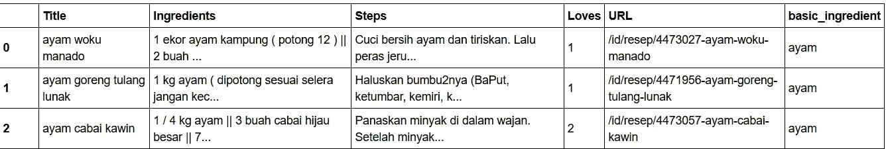

该数据包含'**标题**'、**配料**'、**步骤**'、**爱**'、**网址**'、【基本 _ 配料】。**Title’**是食物名称， **Steps** 是如何烹饪食物，Loves 是用户喜欢在网站中，“basic_ingredient”是制作食物所需的核心配料

> **注**
> 
> (' ayam' ==鸡)。

因为这个项目是**‘预测配料给出食物名称’**此项目需要的列是“标题”、“成分”和“基本成分”。分割数据集需要“basic_ingredient”。

然后，我决定提取这些统计数据来回答这个描述性的问题:

1.  令牌数量
2.  唯一令牌的数量
3.  前 20 个频率唯一令牌

为此，我使用我的 python 包来提取它们中的每一个。我把它命名为 **Exploda(探索数据)。**该包提取数据的基本统计数据。

> 我的故事/观点
> 
> 目前这个包是私有的。然而，如果有人对它感兴趣，我可能会想开源它。

**EDA 成分**

```
from exploda.explore import get_stat
result = get_stat(df, 'Ingredients', ['get_total_instances', 'get_value_counts_column_and_unique_token', 'get_sum_count_token',
                                      'get_stat_token'])
print('total_instance : ', result['get_total_instances'])
print('total token : ', result['get_sum_count_token'])
print('unique token : ', result['get_value_counts_column_and_unique_token']['total_unique'])
```

**输出:**

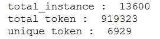

**数据集中前 20 个令牌**

```
[('1', 48903),
 ('2', 30534),
 ('bawang', 27729),
 ('secukupnya', 20039),
 ('merah', 16548),
 ('buah', 15676),
 ('siung', 14954),
 ('putih', 14403),
 ('3', 13590),
 ('garam', 12228),
 ('sdm', 11257),
 ('daun', 10905),
 ('4', 10013),
 ('sdt', 9542),
 ('cabe', 9451),
 ('5', 9141),
 ('gula', 7777),
 ('bumbu', 6922),
 ('air', 6892),
 ('iris', 6244)]
```

所以在数据集中，‘1’和‘2’出现的频率最高。它们可能是一种成分的数量(例如，1 件，2 公斤)。“王霸”或**洋葱是印度尼西亚一种相当常见的食材，其出现频率位居第三。**

总而言之，大多数前 20 个令牌是关于如何应用“secukupnya”(充分)、“buah”(水果)、1，2，3，4，5、sdm、SDT“iris”(切片)等成分的度量。

它还含有受欢迎的成分，如“王霸普提”(大蒜)、“王霸梅拉”(香葱)、“道恩”(叶子)、“卡布”(辣椒)、“古拉”(糖)、“空气”(水)。

**EDA 食品名称**

```
result2 = get_stat(df, 'Title', ['get_total_instances', 'get_value_counts_column_and_unique_token', 'get_sum_count_token'])
print('total_instance : ', result2['get_total_instances'])
print('total token : ', result2['get_sum_count_token'])
print('unique token : ', result2['get_value_counts_column_and_unique_token']['total_unique'])
```

**输出:**

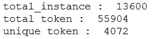

正如所料，食品名称的总的和唯一的令牌低于配料。

**数据集中前 20 个令牌**

```
[('tahu', 2557),
 ('tempe', 2269),
 ('ayam', 1999),
 ('telur', 1768),
 ('sapi', 1611),
 ('kambing', 1442),
 ('goreng', 1000),
 ('daging', 928),
 ('ikan', 842),
 ('tumis', 748),
 ('pedas', 733),
 ('bumbu', 607),
 ('ala', 572),
 ('kecap', 485),
 ('telor', 453),
 ('balado', 434),
 ('sambal', 428),
 ('dan', 426),
 ('sate', 417),
 ('beef', 406)]
```

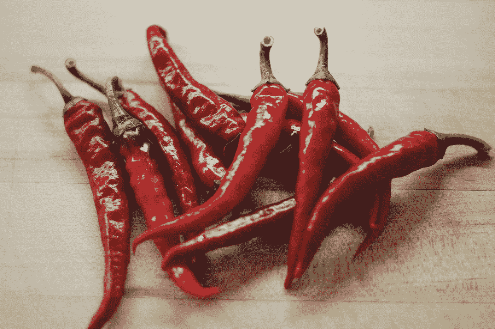

由[瑞安·昆塔尔](https://unsplash.com/@ryanquintal?utm_source=medium&utm_medium=referral)在 [Unsplash](https://unsplash.com?utm_source=medium&utm_medium=referral) 上拍摄的照片

食品名称中前 20 个最高频率标记中的大多数是主要成分，如“tahu”(豆腐)、tempe、“ayam”(鸡肉)、“telur”(鸡蛋)、“sapi”(牛肉)、“kambing”(山羊)、“daging”(肉)、“ikan”(鱼)、“telor”(也是鸡蛋)、“sate”(沙爹)。除此之外，它们是食物的味道(“辣”)

通过这种探索，我相信该模型可以识别给定食物名称的成分。几个成分名称标记成为食品名称的一部分。让我们稍后测试。我相信像‘pedas’(辣)这样的食物名称一定会输出‘cabe’(辣椒)

> **我的故事/观点**
> 
> 我希望这些数据不是很糟糕，例如，包含“炸鸡”的食品名称，以及用鱼代替鸡肉作为配料😅。

—

> **我的故事/观点**
> 
> 出现频率最高的两个食物名称是“tahu”(豆腐)和“tempe”(谷歌搜索)。供你参考,‘tahu’和 tempe 是我们在印度尼西亚吃的最常见的基本食物。

## 数据预处理

以下是我对数据进行的预处理:

1.  将“/n”改为“||”作为配料分隔符
2.  小写字母
3.  删除重复项
4.  删除非字母数字字符
5.  分开配料及其尺寸(“15 克”->“15 克”)
6.  删除一些超过 120 个令牌的实例。我选择这个超参数是因为它可以被 4 除(对于变压器中的多头)并且大于 Q3 (84) +标准差(31)。

以下是基于**基本成分**的最终统计数据:

```
tempe      1958 
telur      1931  # egg
tahu       1931  # tofu
ikan       1858  # fish
ayam       1772  # chicken
sapi       1760  # beef
kambing    1590  # goat meat
Name: basic_ingredient, dtype: int64
```

然后，我使用**sk learn . model _ selection . train _ test _ split 到**确保平衡分割**将数据集分割成训练集、开发集和测试集。**我根据‘基本 _ 配料’列进行了拆分。比例是 80% 10% 10%。

```
train_df, remainder_df, _, _ = train_test_split(df, df['basic_ingredient'], test_size=0.2, random_state=234)
dev_df, test_df, _, _ = train_test_split(remainder_df, remainder_df['basic_ingredient'], test_size=0.5, random_state=345)
```

然后，我将它们输出到“已处理”文件夹中

```
train_df.to_csv('../data/processed/train.csv',index_label='no')
dev_df.to_csv('../data/processed/dev.csv', index_label='no')
test_df.to_csv('../data/processed/test.csv', index_label='no')
```

数据操作和探索已经完成:)

有关 EDA 的实施，请参见本笔记:

[](https://github.com/haryoa/ingredbrew/blob/master/notebooks/00001-eda-data-and-split-train-dev-test.ipynb) [## haryoa/ingredbrew

### 笔记本

github.com](https://github.com/haryoa/ingredbrew/blob/master/notebooks/00001-eda-data-and-split-train-dev-test.ipynb) 

# 评估指标

在这个项目中，我们使用 **BLEU** 作为评估指标来比较 GRU 和 Transformer 的性能。

## 蓝色

BLEU ( **双语评估替补**)是一个流行的指标，广泛用于 seq2seq 任务，如机器翻译。BLEU 的主要思想是检查在预测输出和地面真实中是否有许多记号重叠。使用的 n-克是 1 克、2 克、3 克和 4 克。

要了解更多关于 BLEU 及其问题的信息，我推荐阅读这篇文章(谢谢你， [Rachael Tatman](https://medium.com/u/703b09baff4e?source=post_page-----dbc2a4e37383--------------------------------) 关于 BLEU 的精彩文章:)

[](https://towardsdatascience.com/evaluating-text-output-in-nlp-bleu-at-your-own-risk-e8609665a213) [## 评估 NLP: BLEU 中的文本输出风险自担

### 刚进入 NLP 的人经常问我的一个问题是，当系统的输出…

towardsdatascience.com](https://towardsdatascience.com/evaluating-text-output-in-nlp-bleu-at-your-own-risk-e8609665a213) 

> **我的故事/看法**
> 
> TIL(今天我才知道)关于 BLEU 的缩写来源于(**双语评估候补**)。在我写这篇文章之前，我以为 BLEU 是随机命名的。

# 解码策略

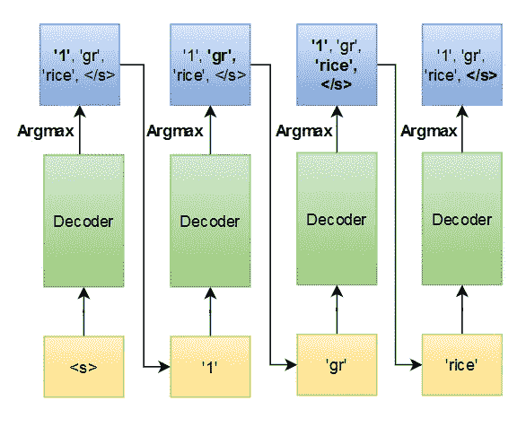

图 4:贪婪解码策略

当我们实现一个生成机器学习系统时，我们必须决定如何生成输出序列。在我们的 seq2seq 系统中，**解码器**将为每一步输出**置信度得分** (softmax 概率分布)。问题是，我们如何使用每一步的置信度？

一种通用的方法是**贪婪搜索解码器。**策略足够简单；只需选择每一步的**最高**置信度得分，直到您找到停止标记(<EOS>’)。就是这样。

> **注**
> 
> 记住解码策略是做推理的时候用的，不是训练。

提醒一下，seq2seq 由解码器和编码器组成。输入将被编码成某种东西(实际上是一个矢量)，由解码器对每一步进行解码。然后，它将生成词汇表中每个单词的置信度得分。然后，我们选择最高分。

让我们来看一些例子:

```
Encoder : Encoder of seq2seqDecoder : Decoder of seq2seq
<s> and </s> are start and end special token respectivelyinput = "<s> fried chicken </s>"
encoder_output, hidden_variable = Encoder(input)**STEP 1:**target_input = "<s>"
decoded, hidden_variable : Decoder(target_input, encoder_output, hidden_variable)Output decoded example:.
.
chili 0.01
**chicken 0.95 <- we choose the highest (greedy)**
fish 0.03
egg 0.01
.
.target_input = "<s> chicken"**STEP 2:
target_input = "<s> chicken"** decoded, hidden_variable : Decoder(target_input, encoder_output, hidden_variable)Output decoded example:.
.
|| 1.00 **<- we choose the highest (greedy)**
chicken 0.00
fish 0.00
egg 0.00
.
.target_input = "<s> chicken || "**STEP 3:
target_input = "<s> chicken ||"** decoded, hidden_variable : Decoder(target_input, encoder_output, hidden_variable)Output decoded example:.
.
|| 0.00 
chicken 0.00
fish 0.00
egg 0.00
**oil 1.00  <- we choose the highest (greedy)**
.
.target_input = "<s> chicken || oil "**STEP 4:
target_input = "<s> chicken || oil"** decoded, hidden_variable : Decoder(target_input, encoder_output, hidden_variable)Output decoded example:.
.
|| 0.00 
chicken 0.00
fish 0.05
egg 0.30
oil 0.20 **</s>**  **0.55 <- we choose the highest (greedy)**
.
.target_input = "<s> chicken || oil </s>"
**END**
```

上面的例子基本上就是 seq2seq 贪婪解码的工作原理。

还有其他解码策略，如**波束搜索、Top-k 采样和 top-p 采样。**阻止我创作 60 分钟阅读文章😜，我决定只用贪心搜索解码。

> **我的故事/观点**
> 
> 作为一个引子，我计划将来发布一篇关于采样策略的新文章，并对它们进行比较:)

# 履行

## 使用的库

1.  Pytorch 1.5.1 :一个流行的深度学习框架是用 Python 写的
2.  Torchtext 0.6.0 :一个专注于在 Pytorch 上处理文本的库
3.  Sacrebleu 1.4.10 :计算 bleu 的工具包
4.  **py torch Lightning 0 . 8 . 1:**py torch 新的强大扩展。如果你发现 Pytorch 中需要类似 **Keras 的**框架(回调！)和一个使你的代码更整洁和更高的可重用性的伟大的节省者，我强烈**鼓励**你使用这个包！谢谢你，威廉·法尔肯和他的团队，感谢你们令人敬畏的包裹😄
5.  **Pandas 1.0.5: Python 常用数据表格操作包. 3**

来自`pytorch-lightning` GitHub 包:

> **注**
> 
> Lightning 是组织 PyTorch 代码的一种方式，可以将科学代码从工程中分离出来。它更像是 PyTorch 风格指南，而不是框架。
> 
> 在 Lightning 中，您将代码组织成 3 个不同的类别:
> 
> 研究代码(在照明模块中)。
> 
> 工程代码(你删除，并由培训师处理)。
> 
> 非必要的研究代码(日志等…这在回调中)。

—

> **我的故事/观点**
> 
> 只有我在用纯 Pytorch 编写代码时，在解决代码可读性和结构化方面有困难吗？这就是为什么我以前的文章都是用 Keras 写的。

## 令牌表示

我用的是词索引顺序表示，会被模型转化为词嵌入。使用`nltk.word_tokenizer`从句子中对标记进行标记化(拆分)。我用 torchtext 库对它进行了处理，它将把每个标记顺序编码成数组中的索引表示。我基于训练集构建了令牌词汇表。我将 init 和 end token 分别设置为< s >和< /s >。

在生成模型使用的迭代器时，我使用了 torchtext.data.BucketIterator，它将根据食品名称标记的长度对批次进行排序。下面是关于如何处理和构造迭代器的代码(摘自我的源代码)。

```
Example:
'fried rice' -> '<s> fried rice </s>' -> [2, 4342, 42432, 3]
```

## 建模

我用 PyTorch lightning 来构建 PyTorch 代码。

## **GRU +关注**

我使用了来自 [Tensorflow NMT 注意力教程](https://www.tensorflow.org/tutorials/text/nmt_with_attention)的代码，并将它们改写成 Pytorch。我还添加了一些小功能，比如在解码器端启用双向和多层 GRU(虽然我没有使用它😛).你可以在这个链接里看到代码(我的回购):

[](https://github.com/haryoa/ingredbrew/blob/master/recibrew/nn/gru_bahdanau.py) [## haryoa/ingredbrew

### 在 GitHub 上创建一个帐户，为 haryoa/ingredbrew 开发做贡献。

github.com](https://github.com/haryoa/ingredbrew/blob/master/recibrew/nn/gru_bahdanau.py) 

我将它们组合在 Pytorch Lightning 模型界面中。参见上面的代码片段。

在 forward 函数中，我把 forward 分为`forward_encoder` 和`forward_decoder_train` 。`forward_encoder` 将接收信号源输入，并将其编码成`enc_out` 和`hidden`。它们将作为解码器的输入，解码器将输出每一步的置信度得分。解码器和编码器使用共享嵌入(意味着共享词汇)。

在训练中，我使用了全**老师强制**(下一步的输入是地面真相)使其类似于**变压器设置**。使用 AdamW optimizer 优化培训。

> **Noob 建议:**
> 
> 请确保根据您的标准(交叉熵)和嵌入来设置 padding_idx，以确保不会对填充进行任何操作。在过去，当我开发一些 NER 系统时，我忽略了这一点，并得到了糟糕的模型结果。

## 变压器

我通过使用内置的 Pytorch transformer 包来实现转换器。这个包不包括位置嵌入和单词嵌入。所以我从 Pytorch 教程(见[https://py torch . org/tutorials/beginner/transformer _ tutorial . html](https://pytorch.org/tutorials/beginner/transformer_tutorial.html))中拿了位置嵌入的实现。

在这一节中，我将重点描述 Transformer 中 mask 实现的实现，尤其是如何实现 mask。我们开始吧:

编码器和解码器正向传递实现是直接的。我想强调的是掩码变量。

```
out_trf = self.trfm(out_emb_enc, out_emb_dec, **src_mask**=None, **tgt_mask**=tgt_mask, **memory_mask**=None,                                                   **src_key_padding_mask**=src_pad_mask, **tgt_key_padding_mask**=tgt_pad_mask,                                                   **memory_key_padding_mask**=src_pad_mask
```

**src_mask:在源输入(编码器的输入)**中，一个位置，如果在**布尔张量**中提供了一个“**真**标志(意味着被屏蔽)，将不会关注任何其他序列(记住变压器有自我关注)。该变量将用于变压器的编码器。转换器的默认实现会将此设置为**无**。

**tgt_mask:** 类似于 src_mask，**但是在目标输入(解码器的输入)**。该变量将用于变压器的解码器。正如我上面所说，转换器可以同时处理，所以它需要一个掩码来防止在注意力过程上进行计算。

```
Easy way to visualize tgt_mask
Remember: decoder output sequence of text in sequential order.
For example, If the model want to output 'Fried Rice is delicious'. In the first step (**Fried**), it will not attend 'Rice is delicious'
In the second step (**Rice), It will attend 'Fried' and will not attend 'is delicious'** In the third step (**is**), **It will attend 'Fried' and 'Rice and will not attend 'delicious'**
In the forth step (**delicious), It will attend 'Fried, Rice, and is'**
```

**memory_mask:在内存(编码器变压器的输出)中，**在第二次注意上使用时(记住，解码器层的注意过程包含两个步骤，自我注意和编码器-解码器注意)，不会参加任何其他序列。变压器默认实现将此设置为**无**。

**src_key_padding_mask** :基本上是在信源上填充掩码。这个过程将作为掩蔽注意过程中的关键

**tgt_key_padding_mask** :基本上是在目标上填充遮罩。这个过程将作为掩蔽注意过程中的关键

**memory_key_padding_mask** :基本上是编码器输出的存储器上的填充掩码。这个过程会在注意力过程中起到掩蔽关键的作用。编码的记忆是信源的填充。

实现 padding_mask 很容易(见`mask_pad_mask`)，对于 tgt_mask，实现应该使用`pytorch.nn.Transformer`中的`transformer.generate_square_subsequent_mask`。

在 Pytorch Lightning 实现中，只需像这样正常操作即可:

简单明了，易于设置！请记住下面我给你的建议。一些傻傻的小问题由此而来。

> **Noob 建议:**
> 
> 看到这个了吗？
> 
> **logits = self.forward(src，TGT[:-1])
> loss = loss _ criterion(logits . view(-1，output_dim)，tgt[1:]。视图(-1))**
> 
> 不要忘记将**接地**真值设置为 tgt[1:]并将**编码器输入**设置为 tgt[:-1]
> 
> 我们希望模型学会预测解码器中的下一个单词，不是吗？
> 
> 例如:当前令牌是“”我们要确保模型学习下一个单词“鸡”

—

> **我的故事:**
> 
> 让我来讲述一下我实现转换器的故事。我搜索了一个内置的 easy copy pasta 代码(懒得调试，从头实现)。我偶然发现 Pytorch 内置了 transformer 包，并有相关教程。我看到了教程，并得出结论，该教程不能适用于我的情况。它不处理**填充遮罩。我到底该怎么做？**我看了文档，找到一个变量叫做[src/tgt/memory]_mask 和[src/tgt/memory]_padded _mask。是..仍然困惑，因为描述太短。我搜索所有的堆栈溢出和 Github 问题。最后，我发现了一些启示，有人用 Colab 编写了一个实现。此外，我不知道还有关于这些掩码变量附加文档(我应该在文档中向下滚动一点)。
> 
> 嗯……问题还是解决了。如果有人有这样的困扰，就看看我实现 Pytorch 转换器的实现吧。

## 贪婪解码器

贪婪搜索解码实现很简单。见下文:

以上是 GRU 的推理源代码。在推理步骤，模型逐个循环每个实例。对于解码器中的每一步，它都会进行贪婪搜索，直到找到句尾令牌`‘</s>’`。

对变压器的推论也与 GRU 的相似。您可以在这里看到我的实现:

[](https://github.com/haryoa/ingredbrew/blob/master/recibrew/core_nn.py) [## haryoa/ingredbrew

### 此时您不能执行该操作。您已使用另一个标签页或窗口登录。您已在另一个选项卡中注销，或者…

github.com](https://github.com/haryoa/ingredbrew/blob/master/recibrew/core_nn.py) 

# 实验

我不做超参数调整，以避免在训练模型上花费大量时间。

## 变压器

这是我为变压器模型选择的超参数:

```
"dim_feedforward":   100
"dropout":           0.1
"lr":                0.001
"nhead":             2
"num_decoder_layer": 4"num_embedding":     100  # Also act as hidden unit in decoder and encoder layer"num_encoder_layer": 4
"padding_idx":       1
```

总参数:

```
| Name             | Type            | Params
-----------------------------------------------------
0 | full_transformer | FullTransformer | 1 M
```

## 苏军总参谋部情报总局

以下是 GRU seq2seq 模型的超参数:

```
embedding_dim=100hidden_dim=100enc_bidirectional=Trueenc_gru_layers=1dropout=0.1
```

总参数:

```
| Name             | Type             | Params
------------------------------------------------------
0 | encoder          | Encoder          | 121 K 
1 | decoder          | Decoder          | 945 K 
2 | shared_embedding | Embedding        | 300 K 
3 | criterion        | CrossEntropyLoss | 0
```

他们使用 Colab GPU 进行训练，并使用**贪婪搜索解码器进行推理。**

> **注**
> 
> Colab 笔记本将作为调用 Pytorch Lightning 实现的主程序。

在做实验之前，我将种子设置为 888，以确保重现性

```
from pytorch_lightning import Trainer, seed_everythingseed_everything(888)
```

我用批量 64 和`accumulated_grad_batches=2`。这意味着用于计算损失的批量将是 128。

# 结果

关键时刻到了。🎃


照片由 [Arseny Togulev](https://unsplash.com/@tetrakiss?utm_source=medium&utm_medium=referral) 在 [Unsplash](https://unsplash.com?utm_source=medium&utm_medium=referral) 上拍摄

训练之后，我加载用`pytorch_lightning` ModelCheckpoint 产生的最佳模型。我预测测试数据集，并使用`sacrebleu`计算它的 BLEU。表 0 显示了 GRU 和变压器的结果。从表中，我们可以得出结论，变压器真正主导 GRU +注意 Seq2Seq。由于两者具有几乎相似的低参数，Transformer 击败了 gru。BLEU 差异幅度约为 13。

> **我的故事/观点**
> 
> 我认为 Transformer 输给了 GRU，因为根据我的经验，Transformer 倾向于过度适应数据，并且经常产生错误的输出。

表 0:结果

让我们采集一些数据样本，了解更多信息！

> **注**
> 
> 我运行存储库中笔记本内`00007_eda_result.ipynb`中的代码。

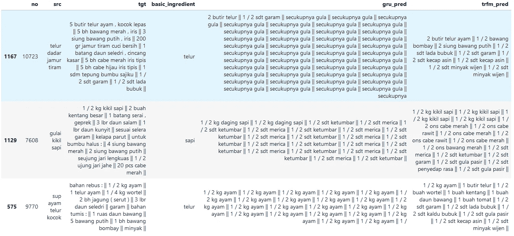

图 5

图 5 显示了 3 个样本作为我们训练模型的输出。从上面的例子中，我们可以看出 GRU 经常重复成分而不停顿。这可能是由 GRU 引起的，它对某些成分摄入过多。当使用贪婪解码器时，每个步骤的最高置信水平总是产生相同的成分。

变形金刚和 GRU 倾向于生产“1/2”令牌。从我们在 EDA 中看到的情况来看，“1”和“2”出现的频率最高，我认为我们可以推断出模型可能会过度拟合这些数字。

虽然《变形金刚》比《GRU》有更好的品种输出，但还是重复了一些成分。从图 5 中，我们可以看到，在总结中，它重复了第 4 次“kikil sapi”(牛肉)。在那之后，它最终把输出变成别的东西。总而言之，这个变形金刚和 GRU 模型不知道一个成分不能出现两次或更多次。

无论如何，Transformer 的输出可能代表原始配方。我们知道烹饪食物有很多种方法。因此，即使它有不同于地面真相的输出，我们也不能判定它是错误的。

# 建议

1.  我应该做过超参数调优(中小型号)。有了它，也许它能生产得更好。这也是我要写的待办事项文章。
2.  使用其他解码策略。正如我前面所说，我将很快就此写一篇新文章。让我们看到贪婪与他人的区别。
3.  避免重复。为了避免重复，也许我可以加一个解码的限制？
4.  用其他(大)数据对模型进行预训练。我认为有了一个预先训练好的模型，可以进一步提高结果。
5.  用半监督学习如**反向翻译**添加数据。这是目前的热点，也可能提高模型的质量

# 有趣的配方啤酒生成器

😆让我们一起享受模型的乐趣吧！😆。

你也可以试试下面的 Colab 链接。注意，配料是生成的！

## **随机输入 1:**


照片由[莫哈末·阿拉姆](https://unsplash.com/@ambientpictures?utm_source=medium&utm_medium=referral)在 [Unsplash](https://unsplash.com?utm_source=medium&utm_medium=referral) 上拍摄

```
Food : nasi goreng pedas (spicy fried rice)
Ingredients:
 1 piring nasi putih (rice)
 1 butir telur (egg)
 1 buah wortel (carrot)
 1 buah timun  (cucumber)
 1 buah bawang putih  (garlic)
 1 buah bawang merah  (onion)
 1 buah cabe merah  (red chili)
 1 buah cabe rawit  (cayenne pepper)
 1 buah tomat  (tomato)
 1 / 2 sdt terasi  (shrimp paste)
 1 / 2 sdt garam  (salt)
 1 / 2 sdt merica (pepper)
```

我们试试一般的吧，‘香辣炒饭’。如您所见，即使食品名称中没有辣椒，它也会输出辣椒。

## 随机输入 2:


Indom [ie 源](https://commons.wikimedia.org/wiki/File:2016_Indomie_Mi_Goreng_Rendang_NL_02.jpg) ( CC BY-SA 2.0)

```
Food : indomie lodeh 
Ingredients :
 1 bungkus indomie goreng 
 1 / 2 kg toge (sprouts)
 1 / 2 kg kacang tanah  (peanuts)
 1 / 2 kg bawang bombay  (onion)
 1 / 2 kg cabe merah   (red chili)
 1 / 2 ons cabe rawit  (cayenne pepper)
 1 / 2 ons cabe merah  (red chili)
 1 / 2 sdt garam  (salt)
 1 / 2 sdt gula   (sugar)
 1 / 2 sdt merica bubuk  (pepper powder)
 1 / 2 sdt penyedap rasa  (flavoring)
 1 / 2 sdt gula pasir   (granulated sugar)
```

对于任何想知道 lodeh 是什么的人来说:

[](https://en.wikipedia.org/wiki/Sayur_lodeh) [## 萨尤尔·洛德

### Sayur lodeh 是一种印度尼西亚蔬菜汤，由椰奶中的蔬菜制成，在印度尼西亚很受欢迎，但大多数…

en.wikipedia.org](https://en.wikipedia.org/wiki/Sayur_lodeh) 

营多面是一种在印尼很受欢迎的方便面。你应该已经知道了。

仅供参考，我认为没有人结合洛德与营多面，也许有人想尝试这些成分？😜

**随机输入 3**


照片由 [Masaaki Komori](https://unsplash.com/@gaspanik?utm_source=medium&utm_medium=referral) 在 [Unsplash](https://unsplash.com?utm_source=medium&utm_medium=referral) 上拍摄

```
Food : sop nasi goreng  (FRIED RICE SOUP)
Ingredients:
 1 piring nasi putih  (rice)
 1 buah wortel    (carrot)
 1 buah kentang   (potato)
 1 buah tomat    (tomato)
 1 buah bawang bombay   (onion)
 2 siung bawang putih   (garlic)
 1 / 2 sdt lada bubuk   (ground pepper)
 1 / 2 sdt garam     (salt)
 1 / 2 sdt kaldu bubuk  (broth powder)
 1 / 2 sdt bubuk   (any powder? LOL)
 1 / 2 sdt minyak goreng    (cooking oil)
```

**汤炒饭！😰**

在印尼，它是一种反主流的食物(还是只有我？).有人想试试吗？

## Colab 链接:

这里是任何想尝试生产原料的人的合作链接。它将使用我自己训练过的最好的变形金刚模型。如果你愿意，你可以在这里评论你生产的食物成分😃。

[](https://colab.research.google.com/drive/1yBHIbBLd2Um6CWpxZfEXvNkNHGDNuH_1?usp=sharing) [## 谷歌联合实验室

### 编辑描述

colab.research.google.com](https://colab.research.google.com/drive/1yBHIbBLd2Um6CWpxZfEXvNkNHGDNuH_1?usp=sharing) 

# 结论

这篇文章分享了如何制作配方(成分)啤酒，这是我在业余时间做的一个项目。它还告诉您它背后的技术以及如何实现它。文章还告诉你，在几乎相同的参数下，GRU 和 Transformer 之间最好的深度学习架构是什么。实验表明，变形金刚战胜了格鲁。之后，本文还尝试生成一些无意义的食物成分。

我希望它可以让你更好地理解如何实现 seq2seq 深度学习系统，并激励你做一些有趣的项目并与大家分享。:)

# 编后记


Zhdana Iyuleva 在 [Unsplash](https://unsplash.com?utm_source=medium&utm_medium=referral) 上拍摄的照片

终于！我又能写文章了。已经过了很长时间了。仅供参考，我几年前就想写这篇文章了。但随着我的生活继续，它被转移了，我忘记了它。不久前，我做自我评价。我评价我最近没有写任何文章，这是我分享一些东西的‘媒介’之一。爱是关心，你知道。瞧，这就是文章！

所以，我希望我能继续写更多的文章。我希望分享我的知识再次成为我的习惯。我希望我的知识不仅留在我的大脑里，还能和其他人一起交流，帮助他们取得成就。

如果你想知道为什么我的文章这么长。嗯…我没想到我的文章会这么长，当我意识到这一点时，没关系…我写的信息越多，就越好。事实上，我可以把我的文章缩短到 5-10 分钟。我想给你关于我的有趣项目的最详细的信息，以便更好地理解它。

无论如何，如果你发现我的文章需要改进，你可以通过评论或者发邮件给我来反馈。我已经在我的存储库中共享了我的电子邮件。我喜欢这些反馈！

如果你对我的文章感兴趣并想关注，仅供参考我的文章将主要是关于自我发展和人工智能(特别是深度学习)。对这些领域感兴趣的可以关注我:)。

因此，

> 我欢迎任何可以提高我自己和这篇文章的反馈。我正在学习写作，学习变得更好。我感激能让我变得更好的反馈。


来源: [Pixabay](https://pixabay.com/illustrations/thank-you-polaroid-letters-2490552/) 作者:[杰洛特](https://pixabay.com/illustrations/thank-you-polaroid-letters-2490552/)

# 来源

 [## 蓝色

### BLEU(双语评估替补)是一种算法，用于评估文本的质量已经…

en.wikipedia.org](https://en.wikipedia.org/wiki/BLEU) [](https://github.com/PyTorchLightning/pytorch-lightning) [## 火炬之光/火炬之光

### 阅读此快速启动页面系统/ PyTorch 版本。1.3(最小。请求。)1.4 1.5(最新)Linux py 3.6[CPU]Linux py 3.7[GPU]…

github.com](https://github.com/PyTorchLightning/pytorch-lightning)