# 使用协同过滤的 Python 推荐系统教程

> 原文：<https://pub.towardsai.net/recommendation-system-in-depth-tutorial-with-python-for-netflix-using-collaborative-filtering-533ff8a0e444?source=collection_archive---------0----------------------->

## [机器学习](https://towardsai.net/p/category/machine-learning)，[编辑](https://towardsai.net/p/category/editorial)，[编程](https://towardsai.net/p/category/programming)，[教程](https://towardsai.net/p/category/tutorial)

## 使用 Python 和协同过滤为网飞用例构建一个[机器学习](https://mld.ai/mldcmu)推荐系统教程。

**作者:**萨妮娅·帕维斯，[罗伯托·伊里翁多](https://mktg.best/vguzs)

最后更新，2021 年 3 月 7 日

[](https://members.towardsai.net/) [## 加入我们吧↓ |面向人工智能成员|数据驱动的社区

### 加入人工智能，成为会员，你将不仅支持人工智能，但你将有机会…

members.towardsai.net](https://members.towardsai.net/) 

# 什么是推荐系统？

推荐系统根据用户对项目的当前选择的相互性，生成用户可能感兴趣的项目的编辑列表。它扩展了用户的建议，没有任何干扰或单调，它不推荐用户已经知道的项目。

例如，网飞推荐系统通过匹配和搜索相似用户的习惯来提供推荐，并推荐与用户高度评价的电影有共同特征的电影。

在本教程中，我们将致力于为网飞建立一个推荐系统。

**本教程的代码可在**[**Github**](https://github.com/towardsai/tutorials/tree/master/recommendation_system_tutorial)**上获得，其完整实现也可在**[**Google Colab**](https://colab.research.google.com/drive/1eMXGSHMNmekBkyBbHW4RYNZZcVYv5A2U?usp=sharing)**上获得。**

> 📚查看我们的[主成分分析](https://towardsai.net/p/data-science/principal-component-analysis-pca-with-python-examples-tutorial-67a917bae9aa)教程。📚

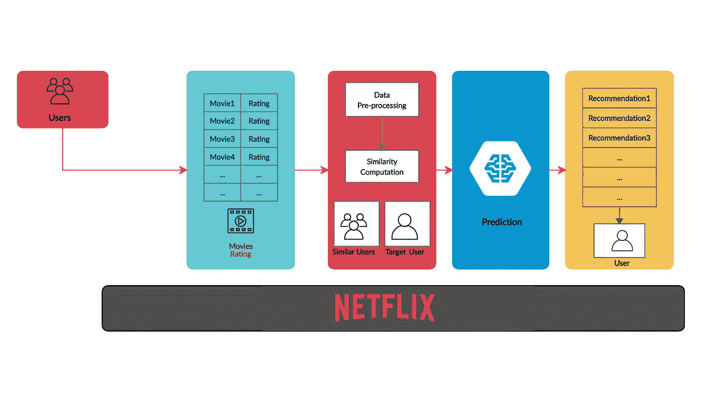

图 1:网飞推荐工作流。

上图所示的推荐系统工作流程显示了用户在不同电影或节目评级方面的协作。新用户基于现有用户的推荐获得他们的推荐。

根据麦肯锡的研究:

> *人们在网飞上看的东西，75%来自推荐[* [*1*](https://www.mckinsey.com/industries/retail/our-insights/how-retailers-can-keep-up-with-consumers) *]。*

网飞实时数据案例:

*   超过 20，000 部电影和节目。
*   200 万用户。

# 并发症

推荐系统是基于机器学习的系统，扫描所有可能的选项并提供预测或推荐。然而，建立推荐系统具有以下复杂性:

*   用户的数据是可以互换的。
*   数据量很大，包括大量电影、节目、客户档案和兴趣、评级和其他数据点。
*   新注册的客户过去拥有非常有限的信息。
*   为用户实时预测。
*   老用户可能有过多的信息。
*   它不应该显示非常不同或过于相似的项目。
*   用户可以在改变主意时改变项目的评级。

# 推荐系统的类型

推荐系统有两种类型:

*   内容过滤推荐系统。
*   基于协同过滤的推荐系统。

有趣的事实:网飞的推荐系统过滤架构基于协同过滤[ [2](https://help.netflix.com/en/node/100639) ] [ [3](https://research.netflix.com/research-area/recommendations) ]。

# 内容过滤

内容过滤需要附带信息，如歌曲的属性(歌曲名、歌手名、电影名、语言等。).推荐系统表现良好，即使新的项目被添加到库中。推荐系统的算法期望包括其图书馆项目的所有侧面属性。

内容过滤的一个重要方面:

*   需要项目信息。
*   项目信息应该在文本文档中。

# 协同过滤

协同过滤背后的思想是考虑用户对不同视频的意见，并根据用户之前的排名和其他类似类型用户的意见向每个用户推荐最佳视频。

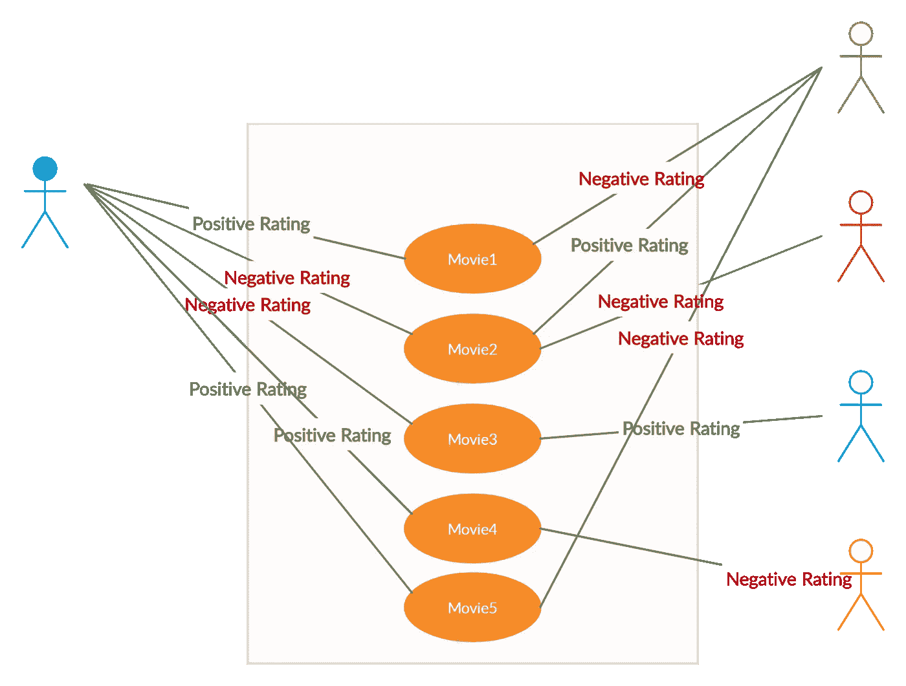

图 2:协同过滤。

## 优点:

*   它不需要一部电影的侧面知识，如类型。
*   它使用从其他用户那里收集的信息向当前用户推荐新商品。

## 缺点:

*   它不能推荐没有分级的新电影或节目。
*   它需要用户社区，并且可能存在稀疏性问题。

## 不同的协同过滤技术:

**非概率算法**

*   基于用户的最近邻。
*   基于项目的最近邻。
*   降低维度。

**概率算法**

*   贝叶斯网络模型。
*   EM 算法。

# 协同过滤中的问题

协作过滤面临几个挑战，如下所述:

## 稀疏

网飞推荐系统的数据集是庞大的，并且用于该算法的用户-项目矩阵可能是巨大且稀疏的，因此这遇到了性能问题。

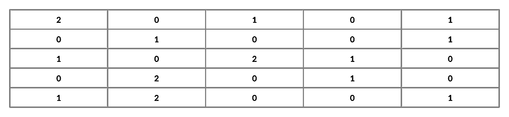

图 3:稀疏。

数据的稀疏性来源于用户项矩阵中的空记录与总记录之比。

**稀疏度= 1 — |R|/|I|*|U|**

在哪里，

**R** =评级

**I** =物品

**=用户**

## **冷启动**

**当系统没有信息为新用户提供建议时，就会遇到这个问题。因此，矩阵分解技术不能应用。**

**这个问题带来两个观察结果:**

*   **如何给用户推荐一个新视频？**
*   **有什么视频推荐给新用户？**

****解决方案:****

*   **建议或要求用户给视频评分。**
*   **视频默认投票。**
*   **在初始阶段使用其他技术，如基于内容的技术或人口统计学技术。**

# **基于用户的最近邻**

**基于用户的最邻近用户的基本技术约翰:**

**约翰是网飞的活跃用户，还没有看过视频“ **v** ”。这里，基于用户的最近邻算法将如下工作:**

*   **该技术找到一组用户或最近邻居，这些用户或最近邻居在过去喜欢与 John 相同的项目，并且对视频“ **v** ”进行了评级**
*   **算法预测。**
*   **执行 John 没有看过并推荐的所有项目。**

> ***本质上，基于用户的最近邻算法通过分析来自* ***u 的*** *邻域中的用户对* ***i*** *的评级，生成对项目* ***i*** *的预测。***

**让我们为预测计算用户相似性:**

****

**图 4:相似性的计算。**

**其中:**

****a，b** =用户**

****r(a，p)** =用户 a 对项目 p 的评级**

****P** =一套物品。由用户 a 和 b 评级**

****

**图 5:相似性计算。**

**基于相似性函数的预测:**

**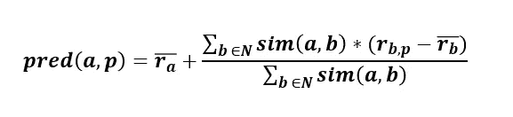**

**图 6:预测。**

**这里，相似用户是指那些喜欢相似电影或视频的人。**

## **挑战**

*   **对于大量的数据，该算法遇到了严重的性能和缩放问题。**
*   **O(MN) 在最坏的情况下可能遇到的计算扩展性。其中， **M** 是顾客的数量， **N** 是商品的数量。**
*   **应用降维方法可以提高性能。但是，它会降低推荐系统的质量。**

# **基于项目的最近邻**

**这种技术基于不同视频或电影或项目之间的相似性来生成预测。**

> ***对一个用户***和项目* ***i*** *的预测是由一个用户***对与项目* ***i*** *最相似的项目的评分的加权和组成。*****

****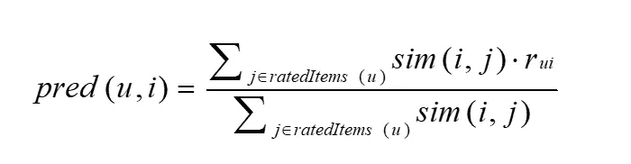****

****图 7:基于项目的最近邻预测。****

****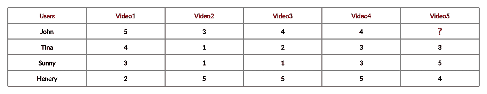****

****图 8:基于项目的预测。****

****如图 8 所示，寻找与 **video5** 相似的视频。因此，该建议与 **video4** 非常相似。****

# ****余弦相似度在构建推荐器中的作用****

****余弦相似性是一种度量标准，用于找出项目/产品之间的相似性，而不考虑它们的大小。我们通过测量多维空间中任意两个向量之间的距离来计算角度的余弦值。由于尺寸原因，它适用于支持相当大的文件。****

****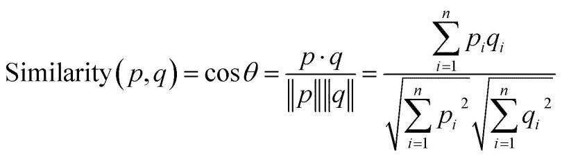****

****图 9:相似性的计算。****

****其中:****

******余弦**是在-1 到 1 之间计算的角度，其中-1 表示不相似的项目，1 表示正确匹配的项目。****

******cos p. q** —给出向量之间的点积。****

******| | p | | | q | |**—表示向量的大小的乘积****

# ****为什么推荐人的基线预测很重要？****

****基线预测值独立于用户的评级，但它们为新用户的评级提供预测****

## *****通用基线表*****

```
**bu,i = µ + bu + bi**
```

****在哪里，****

******bu 和 bi** 是用户和项目基线预测器。****

******基线动机******

*   ****用基线值对缺失值进行插补。****
*   ****将精确度与高级模型进行比较****

# ****网飞电影推荐系统****

## ****问题陈述****

****网飞是一个提供在线电影和视频流的平台。网飞希望建立一个推荐系统，根据其他电影的好恶为用户预测电影列表。该推荐将基于每个用户的独特兴趣而针对他/她。****

## ****网飞数据集****

*   ******combine_data_2.txt** :该文本文件包含电影 id、客户 id、收视率、日期****
*   ******movie_title.csv** :该 csv 文件包含 movie_id 和 movie_title****

## ****加载数据集****

```
**from datetime import datetime
import pandas as pd
import numpy as np
import seaborn as sns
import os
import random
import matplotlib
import matplotlib.pyplot as plt
from scipy import sparse
from sklearn.metrics.pairwise import cosine_similarity
from sklearn.metrics import mean_squared_errorimport xgboost as xgb
from surprise import Reader, Dataset
from surprise import BaselineOnly
from surprise import KNNBaseline
from surprise import SVD
from surprise import SVDpp
from surprise.model_selection import GridSearchCVdef load_data():
    netflix_csv_file = open("netflix_rating.csv", mode = "w")
    rating_files = ['combined_data_1.txt']
    for file in rating_files:
        with open(file) as f:
            for line in f:
                line = line.strip()
                if line.endswith(":"):
                    movie_id = line.replace(":", "")
                else:
                    row_data = []
                    row_data = [item for item in line.split(",")]
                    row_data.insert(0, movie_id)
                    netflix_csv_file.write(",".join(row_data))  
                    netflix_csv_file.write('\n')

    netflix_csv_file.close()
    df = pd.read_csv('netflix_rating.csv', sep=",", names = ["movie_id","customer_id", "rating", "date"])
    return dfnetflix_rating_df = load_data()
netflix_rating_df.head()**
```

****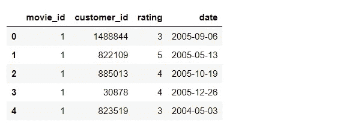****

****图 10:网飞评级数据。****

# ****数据集的分析****

****查找重复评分:****

```
**netflix_rating_df.duplicated(["movie_id","customer_id", "rating", "date"]).sum()**
```

****分割训练和测试数据:****

```
**split_value = int(len(netflix_rating_df) * 0.80)
train_data = netflix_rating_df[:split_value]
test_data = netflix_rating_df[split_value:]**
```

****计算训练数据集中的评分数:****

```
**plt.figure(figsize = (12, 8))
ax = sns.countplot(x="rating", data=train_data)ax.set_yticklabels([num for num in ax.get_yticks()])plt.tick_params(labelsize = 15)
plt.title("Count Ratings in train data", fontsize = 20)
plt.xlabel("Ratings", fontsize = 20)
plt.ylabel("Number of Ratings", fontsize = 20)
plt.show()**
```

****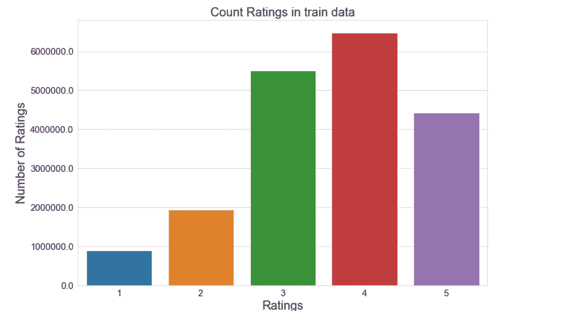****

****图 11:统计训练数据中的评级数量。****

****查找每个用户的分级电影数量:****

```
**no_rated_movies_per_user = train_data.groupby(by = "customer_id")["rating"].count().sort_values(ascending = False)
no_rated_movies_per_user.head()**
```

****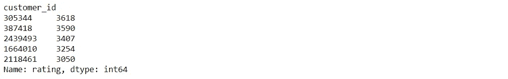****

****图 12:每个用户的分级电影数量。****

****查找每部电影的分级数字:****

```
**no_ratings_per_movie = train_data.groupby(by = "movie_id")["rating"].count().sort_values(ascending = False)
no_ratings_per_movie.head()**
```

****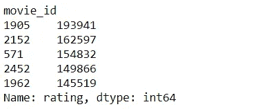****

****图 13:每部电影的收视率。****

## ****创建用户项目稀疏矩阵****

****在用户-项目稀疏矩阵中，项目的值出现在列中，用户的值出现在行中。用户的评级显示在单元格中。这是一个稀疏矩阵，因为可能存在用户不能对每个电影项目进行评级的可能性，并且许多项目可以是空的或零。****

```
**def get_user_item_sparse_matrix(df):
    sparse_data = sparse.csr_matrix((df.rating, (df.customer_id, df.movie_id)))
    return sparse_data**
```

****用户项目训练稀疏矩阵****

```
**train_sparse_data = get_user_item_sparse_matrix(train_data)**
```

****用户项目测试稀疏矩阵****

```
**test_sparse_data = get_user_item_sparse_matrix(test_data)**
```

****全球平均评级****

```
**global_average_rating = train_sparse_data.sum()/train_sparse_data.count_nonzero()
print("Global Average Rating: {}".format(global_average_rating))**
```

****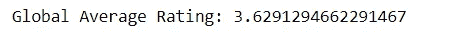****

****图 14:全球平均评级。****

## ****检查冷启动问题****

********

****来源:埃里克·麦克林在 [Unsplash](https://unsplash.com/photos/3rWUgxu7RWM) 上拍摄的照片****

****计算平均评分****

```
**def get_average_rating(sparse_matrix, is_user):
    ax = 1 if is_user else 0
    sum_of_ratings = sparse_matrix.sum(axis = ax).A1  
    no_of_ratings = (sparse_matrix != 0).sum(axis = ax).A1 
    rows, cols = sparse_matrix.shape
    average_ratings = {i: sum_of_ratings[i]/no_of_ratings[i] for i in range(rows if is_user else cols) if no_of_ratings[i] != 0}
    return average_ratings**
```

****平均评级用户****

```
**average_rating_user = get_average_rating(train_sparse_data, True)**
```

****平均分级电影****

```
**avg_rating_movie = get_average_rating(train_sparse_data, False)**
```

******检查冷启动问题:用户******

```
**total_users = len(np.unique(netflix_rating_df["customer_id"]))
train_users = len(average_rating_user)
uncommonUsers = total_users - train_users

print("Total no. of Users = {}".format(total_users))
print("No. of Users in train data= {}".format(train_users))
print("No. of Users not present in train data = {}({}%)".format(uncommonUsers, np.round((uncommonUsers/total_users)*100), 2))**
```

****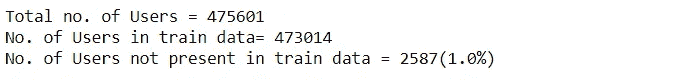****

****图 15:冷启动问题-用户。****

****这里，总用户的 1%是新用户，他们没有合适的评级。因此，这会带来冷启动问题。****

******检查冷启动问题:电影******

```
**total_movies = len(np.unique(netflix_rating_df["movie_id"]))
train_movies = len(avg_rating_movie)
uncommonMovies = total_movies - train_movies

print("Total no. of Movies = {}".format(total_movies))
print("No. of Movies in train data= {}".format(train_movies))
print("No. of Movies not present in train data = {}({}%)".format(uncommonMovies, np.round((uncommonMovies/total_movies)*100), 2))**
```

****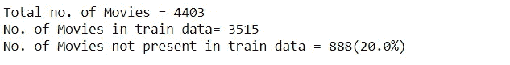****

****图 16:冷启动问题-电影。****

****这里，全部电影的 20%是新的，它们的分级可能在数据集中不可用。因此，这会带来冷启动问题。****

## ****相似矩阵****

****相似性矩阵对于测量和计算用户简档和电影之间的相似性以生成推荐是至关重要的。从根本上说，这种矩阵计算两个数据点之间的相似性。****

****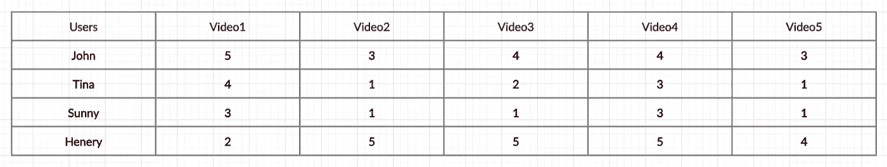****

****图 17:相似性矩阵。****

****在图 17 所示的矩阵中，视频 2 和视频 5 非常相似。相似性矩阵的计算是非常繁琐的工作，因为它需要强大的计算系统。****

******计算用户相似度矩阵******

****计算用户相似性以找到前 100 个用户的相似性:****

```
**def compute_user_similarity(sparse_matrix, limit=100):
    row_index, col_index = sparse_matrix.nonzero()
    rows = np.unique(row_index)
    similar_arr = np.zeros(61700).reshape(617,100)

    for row in rows[:limit]:
        sim = cosine_similarity(sparse_matrix.getrow(row), train_sparse_data).ravel()
        similar_indices = sim.argsort()[-limit:]
        similar = sim[similar_indices]
        similar_arr[row] = similar

    return similar_arrsimilar_user_matrix = compute_user_similarity(train_sparse_data, 100)**
```

******计算电影相似度矩阵******

****加载电影标题数据集****

```
**movie_titles_df = pd.read_csv("movie_titles.csv",sep = ",", header = None, names=['movie_id', 'year_of_release', 'movie_title'],index_col = "movie_id", encoding = "iso8859_2")movie_titles_df.head()**
```

****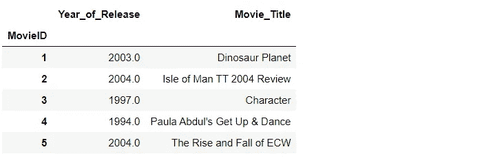****

****图 18:电影标题列表。****

****计算相似的电影:****

```
**def compute_movie_similarity_count(sparse_matrix, movie_titles_df, movie_id):
    similarity = cosine_similarity(sparse_matrix.T, dense_output = False)
    no_of_similar_movies = movie_titles_df.loc[movie_id][1], similarity[movie_id].count_nonzero()
    return no_of_similar_movies**
```

****获取类似的电影列表:****

```
**similar_movies = compute_movie_similarity_count(train_sparse_data, movie_titles_df, 1775)
print("Similar Movies = {}".format(similar_movies))**
```

********

****图 19:相似电影列表。****

# ****构建机器学习模型****

## ****创建一个样本稀疏矩阵****

```
**def get_sample_sparse_matrix(sparseMatrix, n_users, n_movies):
    users, movies, ratings = sparse.find(sparseMatrix)
    uniq_users = np.unique(users)
    uniq_movies = np.unique(movies)
    np.random.seed(15) 
    userS = np.random.choice(uniq_users, n_users, replace = False)
    movieS = np.random.choice(uniq_movies, n_movies, replace = False)
    mask = np.logical_and(np.isin(users, userS), np.isin(movies, movieS))
    sparse_sample = sparse.csr_matrix((ratings[mask], (users[mask], movies[mask])), 
                                                     shape = (max(userS)+1, max(movieS)+1))
    return sparse_sample**
```

****训练数据的样本稀疏矩阵:****

```
**train_sample_sparse_matrix = get_sample_sparse_matrix(train_sparse_data, 400, 40)**
```

****测试数据的样本稀疏矩阵:****

```
**test_sparse_matrix_matrix = get_sample_sparse_matrix(test_sparse_data, 200, 20)**
```

## ****展示数据****

****特征是通过添加变量的不同方面来创建新特征的过程。这里，将创建五个相似的简档用户和相似类型的电影特征。这些新功能有助于将不同电影和用户之间的相似之处联系起来。以下新要素将在数据特征化后添加到数据集中:****

****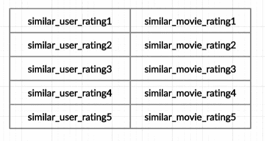****

****图 20:新特性。****

```
**def create_new_similar_features(sample_sparse_matrix):
    global_avg_rating = get_average_rating(sample_sparse_matrix, False)
    global_avg_users = get_average_rating(sample_sparse_matrix, True)
    global_avg_movies = get_average_rating(sample_sparse_matrix, False)
    sample_train_users, sample_train_movies, sample_train_ratings = sparse.find(sample_sparse_matrix)
    new_features_csv_file = open("/content/netflix_dataset/new_features.csv", mode = "w")

    for user, movie, rating in zip(sample_train_users, sample_train_movies, sample_train_ratings):
        similar_arr = list()
        similar_arr.append(user)
        similar_arr.append(movie)
        similar_arr.append(sample_sparse_matrix.sum()/sample_sparse_matrix.count_nonzero())

        similar_users = cosine_similarity(sample_sparse_matrix[user], sample_sparse_matrix).ravel()
        indices = np.argsort(-similar_users)[1:]
        ratings = sample_sparse_matrix[indices, movie].toarray().ravel()
        top_similar_user_ratings = list(ratings[ratings != 0][:5])
        top_similar_user_ratings.extend([global_avg_rating[movie]] * (5 - len(ratings)))
        similar_arr.extend(top_similar_user_ratings)

        similar_movies = cosine_similarity(sample_sparse_matrix[:,movie].T, sample_sparse_matrix.T).ravel()
        similar_movies_indices = np.argsort(-similar_movies)[1:]
        similar_movies_ratings = sample_sparse_matrix[user, similar_movies_indices].toarray().ravel()
        top_similar_movie_ratings = list(similar_movies_ratings[similar_movies_ratings != 0][:5])
        top_similar_movie_ratings.extend([global_avg_users[user]] * (5-len(top_similar_movie_ratings)))
        similar_arr.extend(top_similar_movie_ratings)

        similar_arr.append(global_avg_users[user])
        similar_arr.append(global_avg_movies[movie])
        similar_arr.append(rating)

        new_features_csv_file.write(",".join(map(str, similar_arr)))
        new_features_csv_file.write("\n")

    new_features_csv_file.close()
    new_features_df = pd.read_csv('/content/netflix_dataset/new_features.csv', names = ["user_id", "movie_id", "gloabl_average", "similar_user_rating1", 
                                                               "similar_user_rating2", "similar_user_rating3", 
                                                               "similar_user_rating4", "similar_user_rating5", 
                                                               "similar_movie_rating1", "similar_movie_rating2", 
                                                               "similar_movie_rating3", "similar_movie_rating4", 
                                                               "similar_movie_rating5", "user_average", 
                                                               "movie_average", "rating"]) return new_features_df**
```

****训练数据的特征(添加新的相似特征):****

```
**train_new_similar_features = create_new_similar_features(train_sample_sparse_matrix)train_new_similar_features.head()**
```

****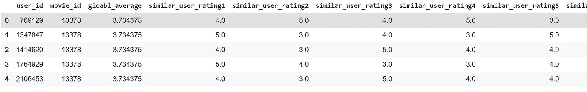****

****图 21:训练数据集的特征数据集。****

****测试数据的特征(添加新的相似特征):****

```
**test_new_similar_features = create_new_similar_features(test_sparse_matrix_matrix)test_new_similar_features.head()**
```

****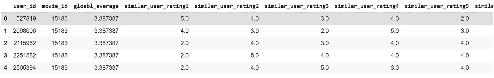****

****图 22:测试数据集的特征数据集。****

## ****模型的训练和预测****

****从 similar_features 数据集中划分训练和测试数据:****

```
**x_train = train_new_similar_features.drop(["user_id", "movie_id", "rating"], axis = 1)x_test = test_new_similar_features.drop(["user_id", "movie_id", "rating"], axis = 1)y_train = train_new_similar_features["rating"]y_test = test_new_similar_features["rating"]**
```

****检查准确性的实用方法:****

```
**def error_metrics(y_true, y_pred):
    rmse = np.sqrt(mean_squared_error(y_true, y_pred))
    return rmse**
```

****适合具有 100 个估计量的 XGBRegressor 算法:****

```
**clf = xgb.XGBRegressor(n_estimators = 100, silent = False, n_jobs  = 10)clf.fit(x_train, y_train)**
```

****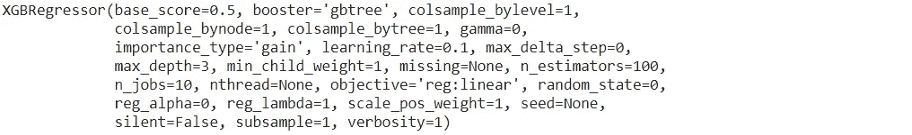****

****图 23: XGB 回归器算法****

****预测测试数据集的结果:****

```
**y_pred_test = clf.predict(x_test)**
```

****检查预测数据的准确性:****

```
**rmse_test = error_metrics(y_test, y_pred_test)print("RMSE = {}".format(rmse_test))**
```

********

****图 24: RMSE****

****如图 24 所示，预测模型数据集的 RMSE(均方根误差)为 0.99。****

## ****地块特征重要性****

******特征重要性**是一项重要的技术，它根据特征在预测目标变量方面的价值来选择输入特征的分数。****

```
**def plot_importance(model, clf):
    fig = plt.figure(figsize = (8, 6))
    ax = fig.add_axes([0,0,1,1])
    model.plot_importance(clf, ax = ax, height = 0.3)
    plt.xlabel("F Score", fontsize = 20)
    plt.ylabel("Features", fontsize = 20)
    plt.title("Feature Importance", fontsize = 20)
    plt.tick_params(labelsize = 15)

    plt.show()plot_importance(xgb, clf)**
```

****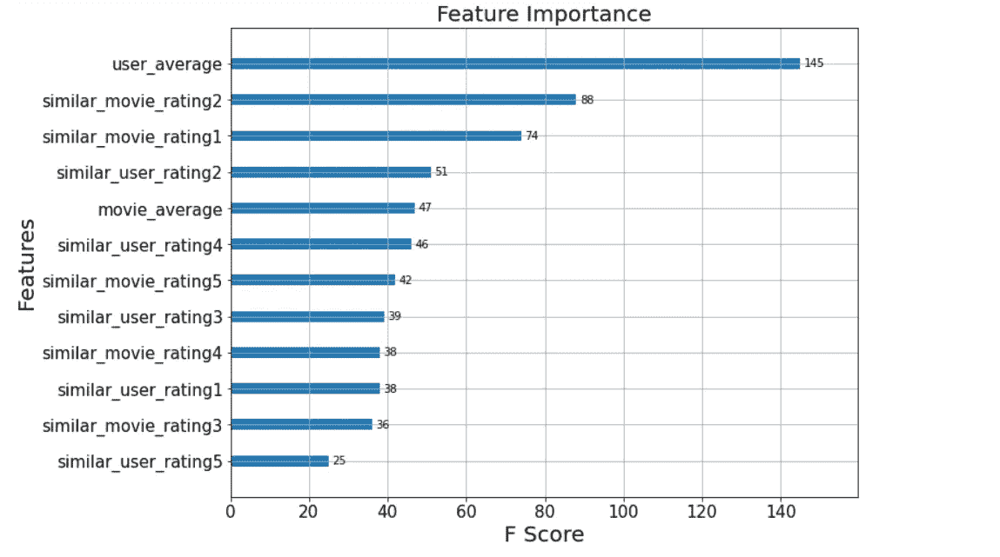****

****图 25:特性重要性图。****

****图 25 显示了每个特性的特性重要性。在这里，user_average 评级是一个关键特性。它的得分高于其他特征。已经创建了类似用户评级和类似电影评级的其他特征来关联不同用户和电影之间的相似性。****

# ****结论****

****多年来，机器学习已经为网飞、亚马逊、谷歌、脸书等公司解决了几个挑战。网飞的推荐系统帮助用户根据他/她的选择在大量的电影和节目列表中过滤信息。推荐系统必须与用户交互以了解他们的偏好来提供推荐。****

****协同过滤(CF)是一种非常流行的推荐系统算法，用于根据其他用户的评分和协作进行预测和推荐。基于用户的协同过滤是第一个自动化的协同过滤机制。它也被称为 *k-NN* 协同过滤。*协同过滤的问题是在给定一组用户群体的现有选择判断的情况下，预测用户对他尚未评价的项目的喜欢程度[* [*4*](https://pitt.edu/~peterb/2480-122/CollaborativeFiltering.pdf) *]。*****

******免责声明:**本文表达的观点仅代表作者个人观点，不代表卡内基梅隆大学或其他(直接或间接)与作者相关的公司的观点。这些文章并不打算成为最终产品，而是当前思想的反映，同时也是讨论和改进的催化剂。****

****通过[向 AI](https://towardsai.net/) 发布****

******除非另有说明，所有图片均来自作者。******

# ****资源:****

****[Google Colab 实现](https://colab.research.google.com/drive/1eMXGSHMNmekBkyBbHW4RYNZZcVYv5A2U?usp=sharing)。****

****[Github 库](https://github.com/towardsai/tutorials/tree/master/recommendation_system_tutorial)。****

# ****参考资料:****

****[1]零售商如何跟上消费者，麦肯锡公司，[https://www . McKinsey . com/industries/retail/our-insights/How-retailers-can-keep-up-consumers](https://www.mckinsey.com/industries/retail/our-insights/how-retailers-can-keep-up-with-consumers)****

****[2]https://help.netflix.com/en/node/100639 网飞《推荐系统的工作原理》，网飞研究，****

****[3]建议，弄清楚如何给每个成员带来独特的快乐，https://research.netflix.com/research-area/recommendations 网飞研究，****

****[4]协同过滤，匹兹堡大学，Peter Brusilovsky，Sue Yeon 和 Danielle Lee，[https://Pitt . edu/~ peterb/2480-122/Collaborative Filtering . pdf](https://pitt.edu/~peterb/2480-122/CollaborativeFiltering.pdf)****