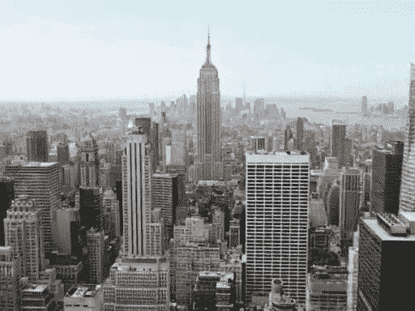
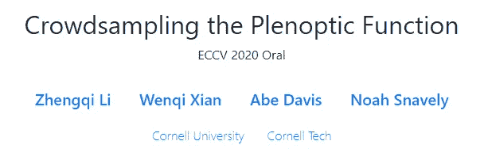
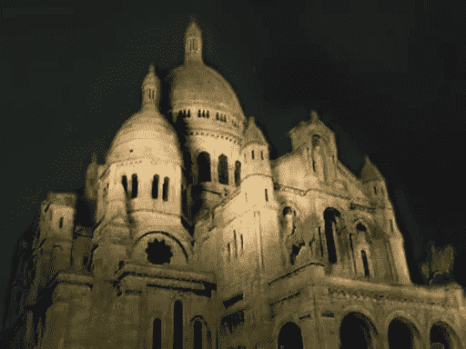
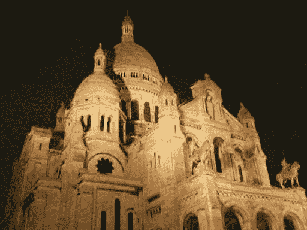
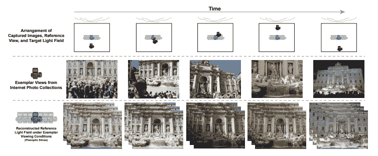
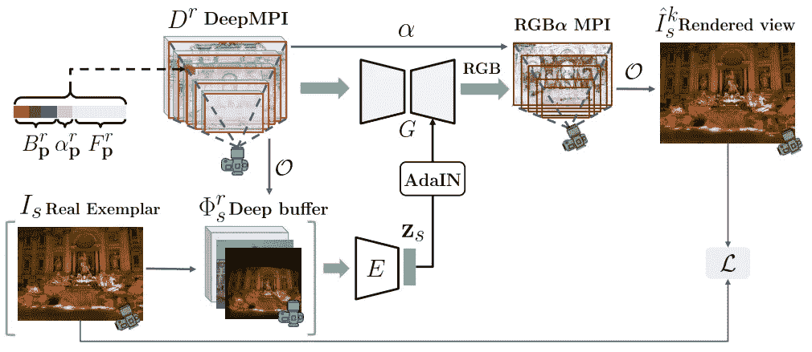
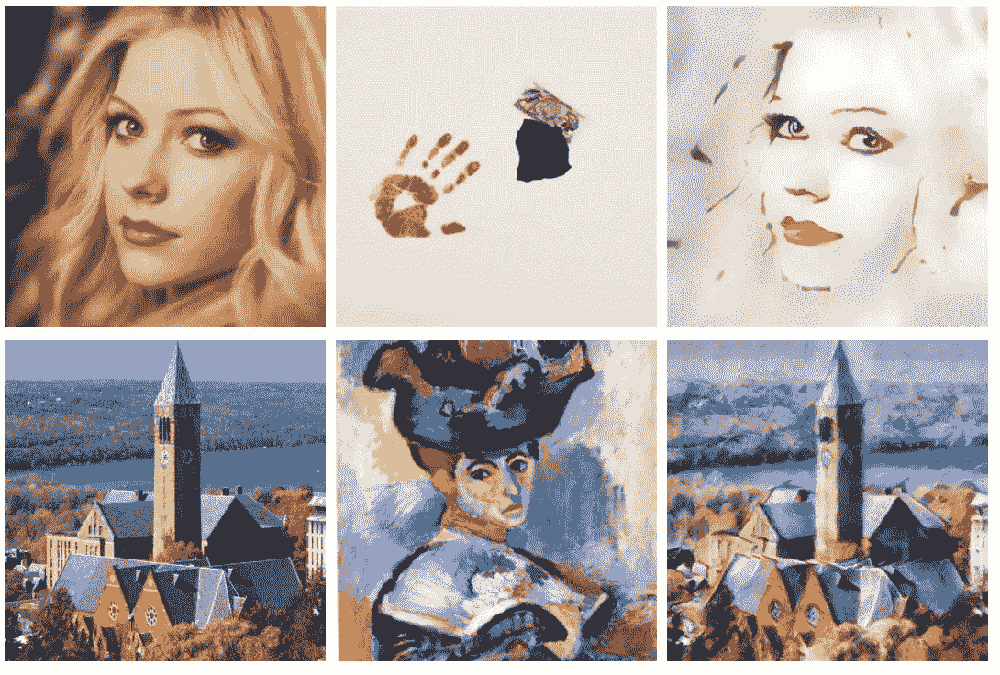

# 从游客在网上公开的照片中重建出真实感场景！

> 原文：<https://pub.towardsai.net/reconstruct-photorealistic-scenes-from-tourists-public-photos-on-the-internet-bb9ad39c96f3?source=collection_archive---------0----------------------->

## [计算机视觉](https://towardsai.net/p/category/computer-vision)

使用 https://research.cs.cornell.edu/crowdplenoptic/[制作的场景](https://research.cs.cornell.edu/crowdplenoptic/)

使用游客从互联网上公开的照片，他们能够重建一个场景的多个视点，保存真实的阴影和照明！
这是真实感场景渲染技术的巨大进步，他们的效果简直令人惊叹。
让我们看看他们是如何做到的，以及更多的例子。

## 论文简介

[https://research . cs . Cornell . edu/crowd plen optic/templates/comparison _ i2i . html](https://research.cs.cornell.edu/crowdplenoptic/templates/comparison_i2i.html)

康奈尔大学的研究人员介绍了一种新的方法，使用游客拍摄的在线公开照片来构建一组连续的光场，并合成捕捉全天场景外观的新颖视图。这项任务的复杂性在于，所有的照片都是在一天的不同时间、不同季节和不同方位拍摄的。为了回答这个问题，他们引入了 DeepMPI。这是一种新的多平面图像表示法，正好满足了他们的需求。他们的方法是完全无人监管的，除了来自互联网的照片本身之外，不需要任何信息，并允许实时合成在空间和光照上都连续的照片级真实感视图。

左，最先进的弹药方法。对，他们的。场景来自[https://research . cs . Cornell . edu/crowd plen optic/templates/comparison _ i2i . html](https://research.cs.cornell.edu/crowdplenoptic/templates/comparison_i2i.html)

你可以看到他们的结果比以前最先进的模型好得多。

图片来自[https://research . cs . Cornell . edu/crowd plen optic/templates/comparison _ i2i . html](https://research.cs.cornell.edu/crowdplenoptic/templates/comparison_i2i.html)

既然我们已经介绍了他们所做的事情以及为什么会如此令人印象深刻，那么让我们来看看他们是如何实现的以及更多的成果。

简而言之，他们通过使用来自多个照明和角度源的互联网的图片，合成具有连续观看条件(如照明)的场景的任意视图。
它拍摄特定地点的非结构化互联网照片，并学习如何重建尊重现实世界阴影物理的光场表示。

左，最先进的弹药方法。对，他们的。场景来自[https://research . cs . Cornell . edu/crowd plen optic/templates/comparison _ i2i . html](https://research.cs.cornell.edu/crowdplenoptic/templates/comparison_i2i.html)

正如你刚才看到的，之前作品的光场通过场景是不一致的，这是论文最大的贡献。

## 他们是如何做到的？

这是通过两阶段模型的架构实现的。

图片来自[https://research . cs . Cornell . edu/crowd plen optic/templates/comparison _ i2i . html](https://research.cs.cornell.edu/crowdplenoptic/templates/comparison_i2i.html)

首先，他们使用新的 DeepMPI 表示。他们首先将每个图像重新投影到参考视点，并在每个深度平面上对所有这些重新投影的图像进行平均，从而创建平均 RGB 平面扫描体积(PSV ),这是一组在给定范围内具有视差的扭曲视图。由于这意味着 RGB PSV 无法准确地模拟参考视图中被遮挡的场景内容，因此他们引入了网络的第二阶段。

第二部分使用编码器和渲染网络优化了 DeepMPI 表示中的潜在特性。它能够捕捉并重新呈现随时间变化的外观。

编码器的作用是从样本图像和辅助深度缓冲区产生“外观向量”，包含场景的语义和深度信息。深度缓冲器允许编码器通过使用在 DeepMPI 表示中编码的场景内在属性来对准样本图像中的照明信息，从而学习复杂的外观。如果没有这种比对，结果将和我们之前看到的一样不一致。这种对齐的深度缓冲是渲染场景中真实阴影和照明的主要原因。

图片来自[https://research . cs . Cornell . edu/crowd plen optic/templates/comparison _ i2i . html](https://research.cs.cornell.edu/crowdplenoptic/templates/comparison_i2i.html)

然后，在该模型的架构中由 G 表示的渲染网络获取投影到特定目标视点的 DeepMPI 及其从编码器产生的外观向量，并预测相应的 RGB 颜色层。

摘自阿丹的结果[https://arxiv.org/abs/1703.06868](https://arxiv.org/abs/1703.06868)

该渲染网络是 U-Net 架构的变体，具有称为 AdaIN 的编码器-解码器架构，用于风格传递应用。该模型在稳定训练的同时产生自然的场景外观。
保留样本图像的颜色和风格。为了获得更多信息，我在本文末尾链接了 AdaIN 的架构论文。

## 结果

简而言之，给定一张特定的样本照片，他们能够合成接近参考视点的新视图，同时保留样本的外观。这是惊人的准确，只需花一分钟来看看他们在这个短视频中使用多种照明获得的结果:

项目网站链接如下，代码和数据集将很快由作者提供。

当然，这只是对这项新技术的简单概述。我强烈推荐阅读下面链接的文章以获取更多信息。

> **项目页面、代码和论文**:[https://research.cs.cornell.edu/crowdplenoptic/](https://research.cs.cornell.edu/crowdplenoptic/)
> **阿丹的架构论文**:[https://arxiv.org/abs/1703.06868](https://arxiv.org/abs/1703.06868)

如果你喜欢我的工作并想支持我，我会非常感谢你在我的社交媒体频道上关注我:

*   支持我的最好方式就是在 [**中**](https://medium.com/@whats_ai) 关注我。
*   订阅我的 [**YouTube 频道**](https://www.youtube.com/channel/UCUzGQrN-lyyc0BWTYoJM_Sg) 。
*   在 [**LinkedIn**](https://www.linkedin.com/company/what-is-artificial-intelligence) 上关注我的项目
*   一起学 AI，加入我们的 [**不和谐社区**](https://discord.gg/SVse4Sr) ，*分享你的项目、论文、最佳课程、寻找 kaggle 队友等等！*