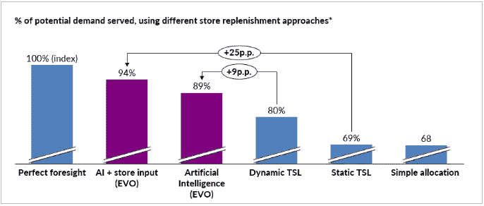

# 从惨淡的周五中恢复过来

> 原文：<https://pub.towardsai.net/recovering-from-bleak-friday-b19e52d00b30?source=collection_archive---------3----------------------->

## [商业科学](https://towardsai.net/p/category/business-science)

## 如何利用数据与亚马逊 post-Covid 竞争


[CardMapr](https://unsplash.com/@cardmapr?utm_source=medium&utm_medium=referral) 在 [Unsplash](https://unsplash.com?utm_source=medium&utm_medium=referral) 上拍摄的照片

**我对黑色星期五** [**的预测并不好**](https://fab-evo.medium.com/covids-black-friday-what-s-new-1b672f6efb08) 。我警告说，黑色星期五通常的抽奖活动已经消失了。深度折扣已经成为公司试图从新冠肺炎复苏的主要策略，这意味着大规模销售已经成为常态。此外，70%的美国成年人表示难以支付账单，留给黑色星期五和网络星期一的可支配收入更少。看起来对价格敏感的顾客暂时消失了，使得降价不如过去有效。

我写了一篇文章，预测黑色星期五和网络星期一将会令人失望。毕竟，超过 60%的消费者没有计划在感恩节前几天的周末购物。即使有更多的人最终浏览了销售，黑色星期五的失望似乎是肯定的。

这不是一个流行的观点。没有出版物想突出我的文章。我不完全责怪他们。谁想听到更多关于 2020 年零售业的悲观论调？然而，作为一名数据科学家，我认为我们必须直面这些数字并处理它们的现实——从统计数据来看，我们正朝着黑色星期五周末长达十年的销售趋势逆转的方向前进。

## 从黑色星期五到凄凉星期五

然而，不知何故，现实更加糟糕。尽管感恩节期间网上销售额超过 90 亿美元——比去年[增长 21.6%](https://www.adobe.com/special/retail-shopping-insights/)——整体**黑色星期五销售额** [**下降 20%**](https://www.nytimes.com/2020/11/30/business/black-friday-retail-sales.html) 。自 2008 年金融危机以来，这种下跌从未出现过。创纪录的网上销售可能成为最耀眼的头条新闻，但这些销售被所谓的年度最大购物周末的整体收入下降所掩盖。**除非你是** [**亚马逊**](https://www.cnbc.com/2020/12/01/amazon-announces-black-friday-cyber-monday-2020-results.html) **，报告创纪录的销售额，否则假日购物季看起来并不乐观**。

> 分析家们将 2020 年感恩节后的日子命名为*。对零售商来说，这是一个不祥的数据点。*

*“凄凉的星期五”:这是我一直无法忘记的一句话。2020 年感觉像是黯淡的一年，所以这似乎是恰当的。这不是我希望任何零售商出现的结果，但却是我预见到的结果。我们拉响了警报，但没有人愿意听。*

*然而，尽管表现令人失望，但这可能只是个例外。或许，一旦疫情结束，上涨趋势将会恢复？*

*我不这么认为。为什么？这只是我多年来一直谈论的拉动零售趋势的一个特别鲜明的例子。*

*那么有什么办法可以挽回呢？零售商能和亚马逊这样的庞然大物竞争吗？当你有效地使用数据时，这是可能的。*

## *零售业的拉动模式在 Covid 之后变得更加重要*

**

*照片由[海蒂·芬](https://unsplash.com/@heidifin?utm_source=medium&utm_medium=referral)在 [Unsplash](https://unsplash.com?utm_source=medium&utm_medium=referral) 上拍摄*

*几年来，我们一直在 [**远离**](https://towardsdatascience.com/fashion-is-broken-science-is-fixing-it-b771b1ab5b59) **传统的零售推动模式**，在这种模式下，零售商自己可以决定消费者购买什么。我们能选择的只有当地商店里能买到的东西。网上购物的兴起改变了零售业。消费者不再局限于他们所在地区的几家商店。商品可以从世界各地运来，这让消费者能够将市场拉向他们的偏好和需求。*

> *换句话说，今天的人们不是从他们能找到的东西中选择，而是寻找他们想要的东西。*

*新冠肺炎放大了这一趋势。毕竟，我们现在都在网上购物，为什么不去搜索我们想要的东西呢？我们可以决定我们购买的东西的颜色、尺寸、风格，甚至是最微小的细节，然后把它们直接运到我们家。**梦想中的产品只需点击一下**。*

*虽然一旦疫苗变得广泛可用，我们可能会再次走出家门，但我们的购物习惯可能已经永远改变了。联合国贸易和发展会议的一项研究表明，人们不太可能停止网上购物，即使它再次变得安全。德勤[和麦肯锡](https://www2.deloitte.com/content/dam/Deloitte/dk/Documents/strategy/e-commerce-covid-19-onepage.pdf)[的研究也有类似的发现。**网购在此长盛不衰**，永远扼杀推送零售模式。](https://www.mckinsey.com/~/media/mckinsey/industries/retail/our insights/how covid 19 is changing consumer behavior now and forever/how-covid-19-is-changing-consumer-behaviornow-and-forever.pdf)*

*零售拉动模式的胜利对公司意味着什么？成功需要在正确的时间向客户提供他们想要的产品。*

## *为什么亚马逊是拉动式零售世界的完美选择*

**

*克里斯蒂安·威迪格在 [Unsplash](https://unsplash.com?utm_source=medium&utm_medium=referral) 上拍摄的照片*

*难怪亚马逊在疫情期间增长如此之快。几乎任何你想要的东西每天都可以在一个网站上找到。人们甚至在亚马逊上购买了预制房屋！亚马逊是消费者驱动零售的终极载体。提出要求，你就会得到。*

*有了亚马逊模式，成功孕育了更多的成功。随着销售的增加，他们收集了更多的消费者数据，这使得他们能够进一步根据消费者的需求定制产品。我们买的越多，他们知道的就越多。随着时间的推移，竞争优势呈指数增长。*

## *如何打败庞然大物:数据*

*大多数零售商不可能成为亚马逊:他们无法提供如此丰富的选择或如此低的价格来击败竞争对手。*

> *那么如何与庞然大物竞争呢？数据。*

*你需要预测你的客户想要什么，并在合适的时候提供给他们，而不是无休止地打折那些甚至可能不会引起消费者兴趣的商品。数据使这成为可能。当你使用数据来决定库存时，你会获得更高的回报。即使整体消费活动低迷，收入也会增加。*

**

*由[布雷克·维斯](https://unsplash.com/@blakewisz?utm_source=medium&utm_medium=referral)在 [Unsplash](https://unsplash.com?utm_source=medium&utm_medium=referral) 上拍摄的照片*

*如果零售商做出正确的报价，而不是假设任何足够大的折扣都会推动商品，这个黑色星期五可能不会如此惨淡。在拉动式零售的世界里，销售取决于正确的报价，而不是最便宜的价格。*

> *数据，而不是折扣，转换。*

## *假期及以后的更好模式*

*但是亚马逊有更多的数据，对吗？普通零售商只收集亚马逊收集的内部和交易数据的一小部分。任何一家零售商如何才能跟上？*

*这就是数据科学专业知识的用武之地。有了正确的模型，你仍然可以获得非常准确的需求预测，精确到每个商店需要的 SKU。那需要什么？两件事:*

1.  ***更多更好的数据***
2.  ***精心设计的算法***

*对亚马逊海量数据缓存的最好攻击是访问你自己的大数据。在我的公司 Evo，我们接入了一个数据库，其中包含超过 12 亿人的交易数据，以及从天气到经济趋势的所有数据。信息越多越好。*

**

*卢克·切瑟在 [Unsplash](https://unsplash.com?utm_source=medium&utm_medium=referral) 上的照片*

*当然，您必须仔细选择您的数据，以确保您没有向您的模型添加噪声。[数据质量](https://towardsdatascience.com/how-to-increase-your-data-value-in-2-simple-steps-dad4944054b9)和数量一样重要。仔细选择传统和[替代数据](https://medium.com/swlh/why-alternative-data-is-critical-to-digital-transformation-93bf877ff202)，这将引导你理解客户想要什么。*

*接下来，你需要很好地处理你的数据。这需要一个设计良好的算法。你必须训练你的模型有效地利用数据，对客户想要什么以及如何在正确的时间把产品送到他们手中做出越来越准确的预测。*

*结果呢？ [**94%的准确率**](https://towardsdatascience.com/94-perfect-the-surprising-solution-to-the-200-billion-inventory-problem-b6ba0bc1417a) **预测您的客户何时何地想要什么，而库存却少得多**。它可能无法与亚马逊的商业模式直接竞争，但数据驱动的方法意味着任何零售商都可以用更少的库存卖得更多。现在就改变你的路线，收获假期剩余的收益——甚至更多。*

**

*作者图片(版权所有)*

## *通过 Covid 的数据驱动路径*

*这个假期的挣扎不会在一夜之间消失。过渡到真正的后 Covid 世界需要时间。即使我们恢复了某种正常的外表，事情也不会完全一样。对于努力在亚马逊时代保持相关性和蓬勃发展的零售商来说，有效利用数据至关重要。*

*像过去一样用自己的数据是不够的。为了与亚马逊这样的大公司竞争，你必须增加数据并有效地部署它。一个[数据驱动的零售商](https://towardsdatascience.com/9-tips-for-data-driven-decision-making-c51fedbafbe3)今天需要**致力于拉式零售模式，然后创建最好的算法来支持该策略**。*

*我试图敲响关于黑色星期五的警钟为时已晚，但让 2021 年成为零售业更光明的一年还为时不晚。任何人都可以找到走出这些困难时期的方法，只要他们**遵循数据**。你会发现，用数据驱动的决策颠覆传统的“最佳实践”会带来更好的实践，以及更高的假期回报。*

*PS 我定期写关于[商业科学](https://medium.com/tag/business-science)的文章。推荐后续阅读:*

*[](https://towardsdatascience.com/supply-chain-optimization-worth-it-or-not-20ae4c6e635) [## 供应链优化:值得还是不值得？

### 数学最优化的悖论

towardsdatascience.com](https://towardsdatascience.com/supply-chain-optimization-worth-it-or-not-20ae4c6e635) [](https://towardsdatascience.com/how-to-increase-your-data-value-in-2-simple-steps-dad4944054b9) [## 如何通过一个简单的步骤增加您数据的价值

### 为什么数据审计很重要，以及如何做得更好

towardsdatascience.com](https://towardsdatascience.com/how-to-increase-your-data-value-in-2-simple-steps-dad4944054b9) 

```
Monthly Business Science in your inbox, new software, and University-level learning:[**Free access**](https://evouser.com/register)Questions? Please reach out on [Linkedin](https://www.linkedin.com/in/fabrizio-fantini/)
```