# 用于假人的递归神经网络

> 原文：<https://pub.towardsai.net/recurrent-neural-networks-for-dummies-8d2c4c725fbe?source=collection_archive---------0----------------------->

## [深度学习](https://towardsai.net/p/category/machine-learning/deep-learning)，[自然语言处理](https://towardsai.net/p/category/nlp)

## 递归神经网络完美指南

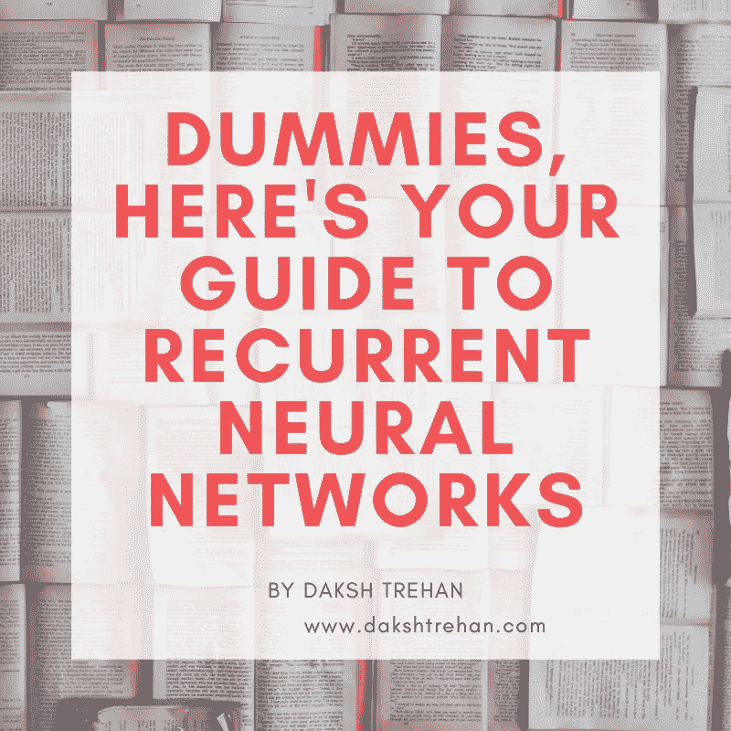

你向 Siri 询问今天的天气，它出色地解决了你的疑问。

但是，这是怎么发生的呢？它是如何把你的演讲转换成文本，然后输入搜索引擎的？

照片由[晨酿](https://unsplash.com/@morningbrew?utm_source=medium&utm_medium=referral)在[破浪](https://unsplash.com?utm_source=medium&utm_medium=referral)

这就是**递归神经网络的神奇之处。**

**递归神经网络(RNN)** 隶属于[**深度学习**](https://medium.com/towards-artificial-intelligence/diving-deep-into-deep-learning-f34497c18f11) **。**它们被用于涉及自然语言处理的操作中。如今，由于人工智能的范围正在极大地扩展，我们可以很容易地定位我们周围的重复操作。从语音翻译、音乐创作到预测手机键盘上的下一个单词，这些都扮演着重要的角色。

RNN 迎合的问题类型有:

*   输出取决于先前的输入。(顺序数据)
*   输入的长度不固定。

# 顺序数据

照片由[埃里克·麦克林](https://unsplash.com/@introspectivedsgn?utm_source=medium&utm_medium=referral)在 [Unsplash](https://unsplash.com?utm_source=medium&utm_medium=referral) 上拍摄

为了理解序列数据，让我们假设你有一只静止不动的狗。

现在，你应该预测他会朝哪个方向移动？那么，只有这些有限的信息传授给你，你会怎么做呢？好吧，你可以毫无疑问地猜一猜，但在我看来，你想出来的将是一个随机的猜测。不知道狗去过哪里，你就没有足够的数据来预测它会去哪里。

[马库斯·贝内迪克斯](https://unsplash.com/@mbx?utm_source=medium&utm_medium=referral)在 [Unsplash](https://unsplash.com?utm_source=medium&utm_medium=referral) 上拍摄的照片

但是，现在如果狗开始朝一个特定的方向跑，如果你试着记录狗的运动，你会很确定它会选择哪个方向。因为在这一瞬间你有足够的信息来做出更好的预测。

所以一个序列是一个事物跟随另一个事物的特殊顺序。有了这些信息，你现在可以看到狗正向你走来。

文本、音频也是序列数据的示例。

当你和某人说话时，你说出的单词是有顺序的。同样，当你给某人发电子邮件时，根据你的短信，你肯定会说出下一句话。

# 时序存储器

如前所述，RNNs 解决了涉及输出和先前输入之间相互依赖的问题。这间接意味着，有一些记忆附属于这类神经网络。

顺序记忆是帮助 RNN 实现其目标的东西。

为了更好地理解，我想请你回忆一下你脑中的字母表。

杰西卡在 [Unsplash](https://unsplash.com?utm_source=medium&utm_medium=referral) 上的

这是一个简单的任务，如果你学会了这个特定的顺序，你应该很快就会明白。

现在，如果我让你以相反的方式回忆字母表。

我打赌这个任务很可靠。而且在我看来，会让你不好过。

所以，前一个任务之所以被证明是有弹性的，是因为你已经按顺序学习了字母。顺序记忆让你的大脑更容易识别模式。

# 递归神经网络与神经网络有何不同？

如前所述，递归神经网络属于深度学习，但神经网络也是如此。但是由于缺乏内部状态，人工神经网络不是我们用来处理序列数据的东西。

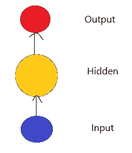

前馈网络

为了开发一个对序列数据稳健的神经网络，我们给前馈神经网络添加了一个内部状态，为我们提供了内部记忆。或者简单地说，递归神经网络是具有内部记忆的前馈神经网络的推广。 **RNN 实现了顺序记忆的抽象概念**，通过提供以前的经验来帮助他们，从而允许它更好地预测顺序数据。

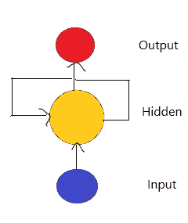

递归神经网络

RNN 通过对每个输入执行相同的函数来证明它的递归性质，而当前输入的输出取决于过去的输入。与前馈神经网络相比，在 RNN，所有的输入都是相互依赖的，不像传统的形式。

# RNN 的工作

好吧，但是 RNN 是如何复制这些内部记忆并实际运作的呢？

假设，一个用户问，“*你叫什么名字？*”

由于 RNN 完全依赖于顺序记忆，我们希望我们的模型能把句子分解成单个的单词。

起初，“什么”被输入 RNN。然后，我们的模型对其进行编码，并向我们呈现一个输出。

对于下一部分，我们输入单词“is”和我们从单词“What”得到的前一个输出。RNN 现在可以获得“是什么”和“是什么”这两个词所传递的信息。

相同的过程将被重复，直到我们到达序列的末尾。最后，我们可以预期 RNN 已经从我们的序列中的所有单词中编码了信息。

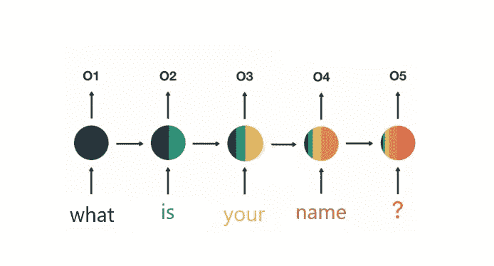

你叫什么名字？

由于最后的输出是由前面的输出和最后的输入组合而成的，所以我们可以将最后的输出传递给前馈层来实现我们的目标。

为了创建上下文，让我们模拟 x 输入的**；**由 y** 输出；和**状态向量由 a.****

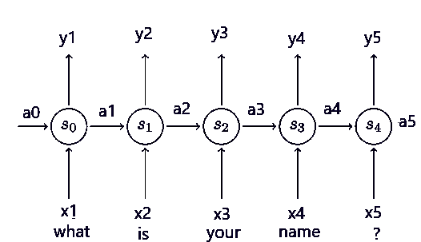

当我们传递我们的第一个输入，即 x0(“什么”)，我们被提供输出 y1 和状态向量 a1，其被传递到下一个函数 s1 以适应 x0 的过去输出。

这个过程不断重复，直到我们到达序列的末尾。最后，我们剩下状态向量 a5，它向我们保证所有的输入<x1 x2="" x3="" x4="" x5="">已经被馈送到我们的模型，并且产生一个由所有输出贡献的输出。</x1>

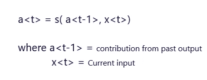

状态向量

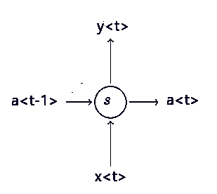

单 RNN 细胞

# RNN 的伪代码

# RNN 建筑的类型

*   **一对一**

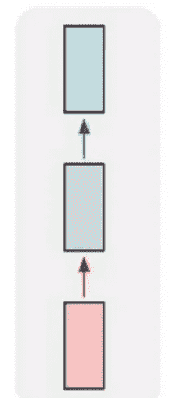

*   **一对多** —这类 RNN 架构通常用于图像字幕/故事字幕。

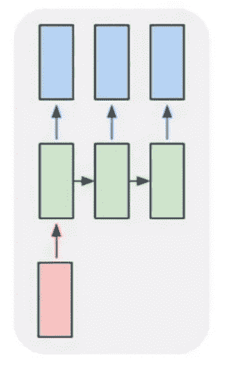

*   **多对一** —这类 RNN 架构用于情感分析。

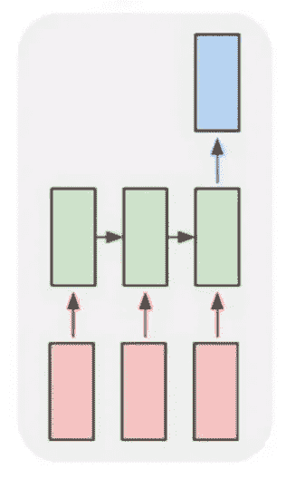

*   **多对多** —这些类型的 RNN 体系结构在词性中使用，也就是说，我们期望在词性中找到每个单词的属性。

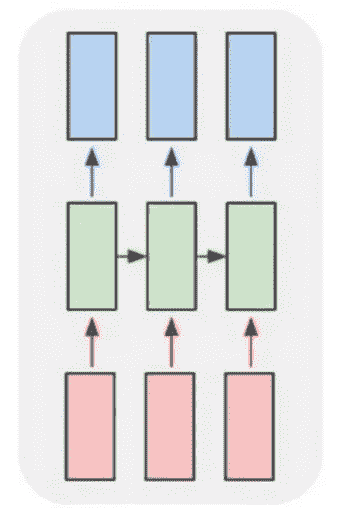

*   **编码器-解码器** —这些类型的 RNN 是最复杂的，用于语言翻译。

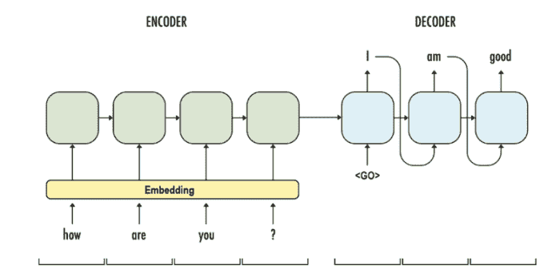

[来源](https://6chaoran.wordpress.com/2019/01/15/build-a-machine-translator-using-keras-part-1-seq2seq-with-lstm/)

# RNN 的缺点

## 短期记忆

我希望你已经思考了我们最后的 RNN 细胞奇怪的颜色分布。

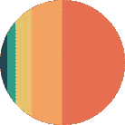

RNN 的最终产量

这是对短期记忆的一种解释。在 RNN，在每个新的时间戳(新的输入)，旧的信息被当前的输入所改变。人们可以想象，在“ *t* ”时间戳之后，在时间步长 *(t-k)* 存储的信息会完全变形。

因此，RNNs 不能用于很长的序列。

## 消失梯度

这就是短期记忆的原因。由于[反向传播](https://medium.com/towards-artificial-intelligence/diving-deep-into-deep-learning-f34497c18f11)的性质，消失梯度存在于每种类型的神经网络中。

当我们训练一个神经网络时，有三个主要步骤与我们的训练相关联。首先，进行正向传递以进行预测。之后，它将预测值与理论值进行比较，产生一个损失函数。最后，我们的目标是使我们的预测更好，因此，我们实现了反向传播，修改每个节点的值。

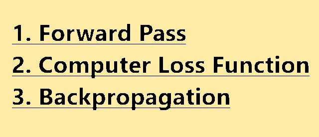

“在计算损失函数后，我们非常确定我们的模型有问题，我们需要检查，但是，检查每个神经元实际上是不可能的。但是，我们挽救模型的唯一可能的方法就是逆行。

**反向传播步骤**

*   我们计算输出端的某些损耗，并试图找出哪个节点造成了低效率。
*   为此，我们将回溯整个网络。
*   假设，我们发现第二层(w3h2+b2)对我们的损失负有责任，我们会努力改变它。但是如果我们仔细考虑我们的网络，w3 和 b2 是独立的实体，但是 h2 依赖于 w2、b1 和 h1，h1 进一步依赖于我们的输入，即 x1、x2、x3……，xn。但是由于我们无法控制输入，我们将尝试修改 w1 和 b1。

为了计算我们的变化，我们将使用链式法则。"

反向传播的链式法则，[来源](https://dzone.com/articles/the-very-basic-introduction-to-feed-forward-neural)

当我们执行反向传播时，我们计算每个节点的权重和偏差。但是，如果前几层的改进很少，那么对当前层的调整就会小得多。这导致梯度急剧减小，从而导致我们的模型几乎没有变化，由于这一点，我们的模型不再学习，不再改进。

# LSTMs 和 GRUs

为了克服 RNNs 的缺点，我们有 **LSTM** ( *长短期记忆*)和 **GRU** ( *门控循环单元*)。LSTMs 和 GRUs 基本上是 RNNs 的高级版本，稍加调整以克服梯度消失的问题，并使用称为“门”的组件学习长期依赖性。门是一种张量运算，可以学习信息流，因此短期记忆对他们来说不是问题。

*   在**正向传播**期间，门控制信息流。从而防止任何不相关的信息被写入状态。
*   在**反向传播**过程中，门控制梯度的流动，这些门能够倍增梯度以避免梯度消失。

要了解更多关于 LSTM 和格鲁的信息，您可以查看:

 [## LSTM 和 GRU 的图解指南:一步一步的解释

### 嗨，欢迎来到长短期记忆(LSTM)和门控循环单位(GRU)的图解指南。我是迈克尔…

towardsdatascience.com](https://towardsdatascience.com/illustrated-guide-to-lstms-and-gru-s-a-step-by-step-explanation-44e9eb85bf21) 

> LSTM 没有解决爆炸梯度的问题，因此，我们倾向于在实现 lstm 时使用梯度裁剪。

# 结论

希望这篇文章能帮助你以最好的方式理解递归神经网络，并帮助你实际使用它。

一如既往，非常感谢您的阅读，如果您觉得这篇文章有用，请分享！

请随意连接:

> *领英~*[https://www.linkedin.com/in/dakshtrehan/](https://www.linkedin.com/in/dakshtrehan/)
> 
> *insta gram ~*[*https://www.instagram.com/_daksh_trehan_/*](https://www.instagram.com/_daksh_trehan_/)
> 
> *Github ~*[https://github.com/dakshtrehan](https://github.com/dakshtrehan)

关注更多机器学习/深度学习博客。

> *中等~*[【https://medium.com/@dakshtrehan】T21](https://medium.com/@dakshtrehan)

# 想了解更多？

[利用深度学习检测新冠肺炎](https://towardsdatascience.com/detecting-covid-19-using-deep-learning-262956b6f981)

[无法逃脱的人工智能算法:抖音](https://towardsdatascience.com/the-inescapable-ai-algorithm-tiktok-ad4c6fd981b8)

[使用机器学习的卡通化内幕指南](https://medium.com/towards-artificial-intelligence/an-insiders-guide-to-cartoonization-using-machine-learning-ce3648adfe8)

为什么你要为乔治·弗洛伊德的谋杀和德里的骚乱负责？

[虚拟卷积神经网络](https://medium.com/towards-artificial-intelligence/convolutional-neural-networks-for-dummies-afd7166cd9e)

[深入钻研深度学习](https://medium.com/towards-artificial-intelligence/diving-deep-into-deep-learning-f34497c18f11)

[为什么选择随机森林而不是决策树](https://medium.com/towards-artificial-intelligence/why-choose-random-forest-and-not-decision-trees-a28278daa5d)

[聚类:它是什么？什么时候用？](https://medium.com/@dakshtrehan/clustering-what-it-is-when-to-use-it-a612bbe95881)

[从 k 个最近邻居开始你的 ML 之旅](https://medium.com/@dakshtrehan/start-off-your-ml-journey-with-k-nearest-neighbors-f72a122f428)

[朴素贝叶斯解释](https://medium.com/swlh/things-you-never-knew-about-naive-bayes-eb84b6ee039a)

[激活功能说明](https://medium.com/analytics-vidhya/activation-functions-explained-8690ea7bdec9)

[参数优化解释](https://towardsdatascience.com/parameters-optimization-explained-876561853de0)

[梯度下降解释](https://towardsdatascience.com/gradient-descent-explained-9b953fc0d2c)

[逻辑回归解释](https://towardsdatascience.com/logistic-regression-explained-ef1d816ea85a)

[线性回归解释](https://medium.com/towards-artificial-intelligence/linear-regression-explained-f5cc85ae2c5c)

[确定最适合您的 ML 模型](https://medium.com/datadriveninvestor/determining-perfect-fit-for-your-ml-model-339459eef670)

> *干杯！*