# 回归 A-Z 简要说明

> 原文：<https://pub.towardsai.net/regression-a-z-briefly-explained-618e5d5c89f8?source=collection_archive---------2----------------------->

## **快速提醒完整备忘单刷新**

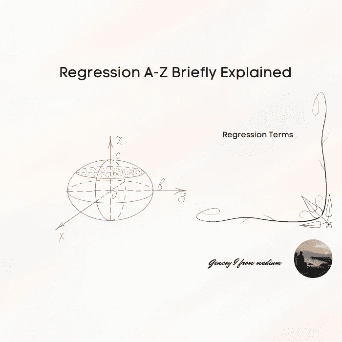

作者图片

回归是机器学习中的著名术语之一。

如果你想深入机器学习，回归和它的术语肯定是需要的。

快速提醒你赶上机器学习术语；

[](/machine-learning-a-z-briefly-explained-4ff86bd81e3a) [## 机器学习 A-Z 简要说明

### 在这篇文章中，我试着向你简单解释一下机器学习 A-Z。

pub.towardsai.net](/machine-learning-a-z-briefly-explained-4ff86bd81e3a) 

## **内容**

```
· [Introduction](#e8ff)
· [Terms](#0d22)
  ∘ [Linear Regression](#6456)
  ∘ [Multiple Regression](#e0b6)
  ∘ [Evaluation Metrics](#e7c1)
  ∘ [Mean Squared Error](#1261)
  ∘ [Root Mean Squared Error](#4a78)
  ∘ [Cost Function](#240b)
  ∘ [The Normal Equation](#b26a)
  ∘ [Polynomial Regression](#7f92)
  ∘ [Quadratic Function](#e4f9)
  ∘ [bodycal](#ad07)
· [Conclusion](#42ed)
```

# 介绍

这篇文章被中等用户保存了太多次，所以我决定从 A-Z 拆分模型类型。

现在是回归的时候了，当然如果你对那类文章的兴趣还会继续，我也会写分类 A-Z 和聚类 A-Z。

那种简要的说明文章可以帮助你找到你在那个话题上的弱点。

或者只是在你的个人或工作项目之前的一个提醒，甚至是有趣的，为了你的工作面试。

现在，让我们跳过闲聊，进入线性回归术语。

# 条款

## 线性回归

它只是一个线性函数。

假设你想预测一辆汽车的价格，它只取决于发动机的大小。

那么，一辆汽车的价格将是 ***y*** ，发动机的大小将是 ***x.***

**θ**

*假设* **θ** *= 2，*如果你改变发动机尺寸 1，价格变化 2，就这么简单。

**公式**

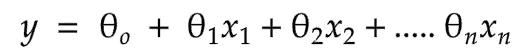

作者图片

**变量**

*y =预测值*

*n =特征数量*

*在简单线性回归中，n = 1，如果 n > 1 那将是多元线性回归。*

*θ =模型参数*

**图形**

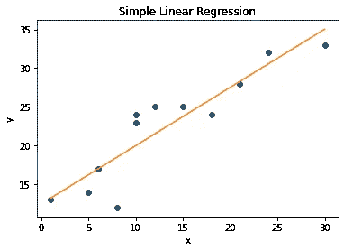

作者图片

假设我们的函数是。

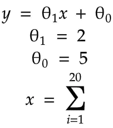

作者图片

那么我们的图表将会是。

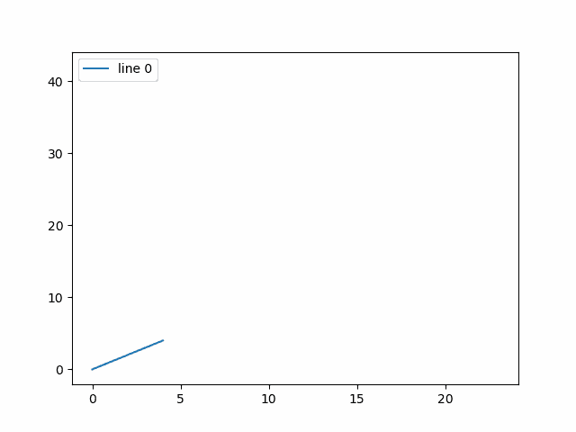

作者图片

## 多次回归

这次汽车 ***y*** 的价格取决于发动机尺寸**X1** 和里程数 ***X2。***

**功能**

同样的函数与线性回归，但是，这一次 n > 1。


作者图片

**变量**

*y =预测值*

*n =特征数量*

*θ =模型参数*

x =特征

**图形**

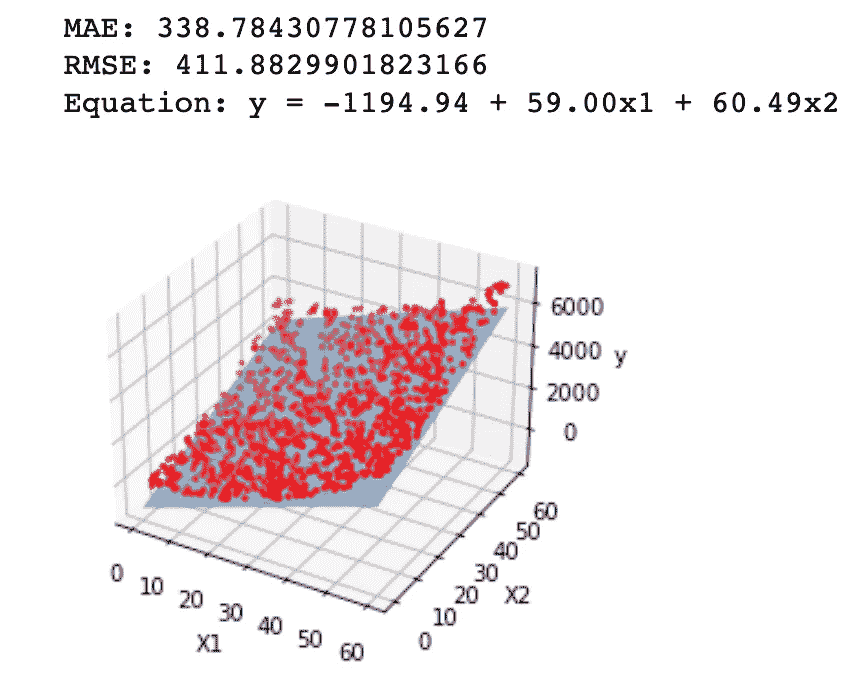

作者图片

## 评估指标

RMSE 和 MSE(将在下面解释)都是评估指标，让我们有机会对模型的性能进行评级。

## 均方误差

这是我们模型的一个评估指标&性能度量。

假设你预测 y 是 5000，实际上是 4000，你得到了 y 值的 10。

现在，5000–4000 等于 1000。你必须找到 10 个这样的值，你将把这些值相加，取一个正方形，然后把这些值的个数相加。

一开始看起来有点混乱，但是试着从函数中理解它或者在现实生活的例子中查找它。

**功能**

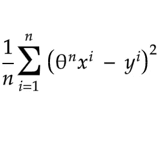

作者图片

**变数**

*y =预测值*

*n =特征数量*

*θ =模型参数*

x =特征

## 均方根误差

如上所述，只是数学上的根函数。

**功能**

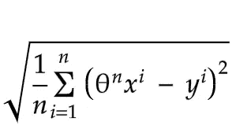

作者图片

**变量**

*y =预测值*

*n =特征数量*

*θ =模型参数*

x =特征

## 价值函数

成本函数是您选择的函数之一，通过它，您可以评估模型的性能，如均方根或均方误差。

## 正规方程

现在，这个等式被用于寻找最佳模型参数( ***θ*** *)* ，其最小化线性模型中的成本函数。

它看起来在数学上有点复杂，但是如果你熟悉 NumPy，它很容易编码。

如果你不熟悉 NumPy 或编程语言，不要担心，互联网上有很多课程，而且大部分是免费的。

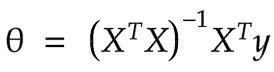

作者图片

**变量**

*y =预测的*

*θ =最小化成本函数*的值

x =特征

## 多项式回归

如果数据更复杂，无法用直线显示，则可以向要素添加幂来解释曲线。

**功能**

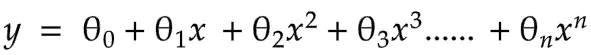

作者图片

**图形**

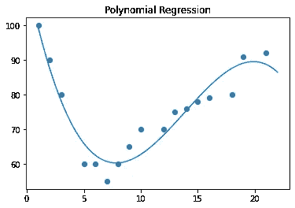

作者图片

**变量**

*y =预测值*

*n =特征数量*

*θ =模型参数*

x =特征

## 二次函数

这是一个简单的乘幂函数(x**2)

**功能**

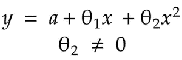

作者图片

**变量**

*y =预测值*

*a =截距*

*θ =模型参数*

x =特征

**图形**

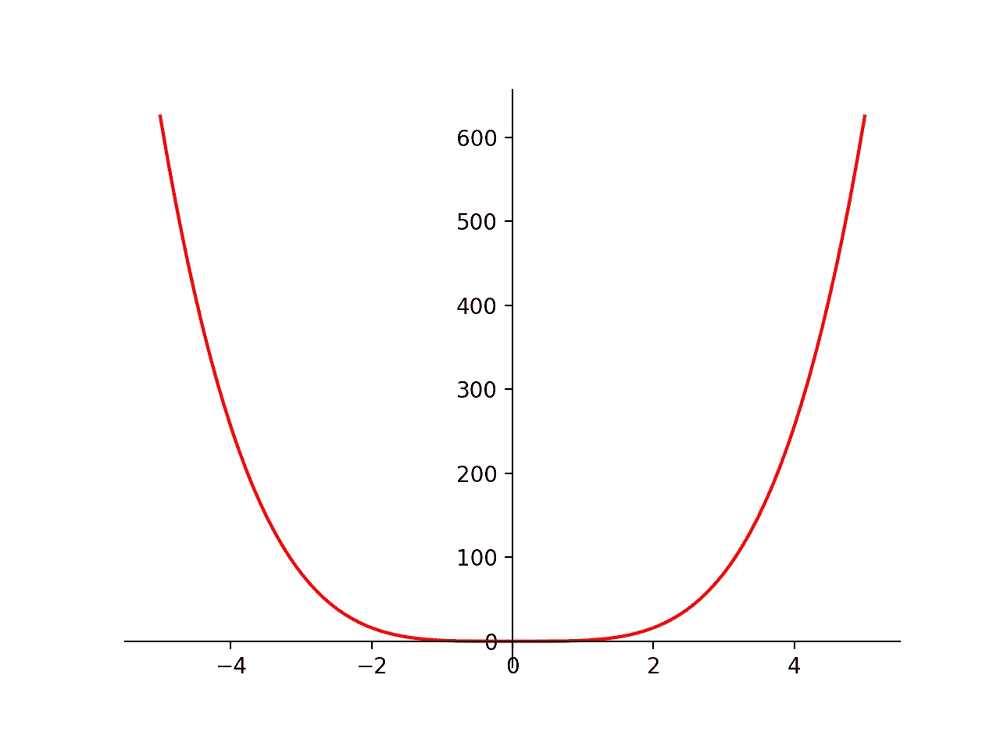

作者图片

如果一些统计学术语对你来说有点困惑或陌生，实际上，我有一篇文章，另一篇 A-Z，是关于统计学的，你可能也想看看。

[](/statistics-for-machine-learning-a-z-66a82fbf2622) [## 机器学习统计学 A-Z

### 简要说明

pub.towardsai.net](/statistics-for-machine-learning-a-z-66a82fbf2622) 

用不同的方式表达你的知识，用图表——公式和描述可以帮助你更新。

我试着用一种非常简单的方式来为阅读这篇文章的人做这件事。

另一方面，下面有太多的术语我可以在本文的第二章向你解释，比如；

*   正则化线性模型
*   里脊回归
*   套索回归
*   弹性网
*   逻辑回归
*   Softmax 回归
*   置信区间

这里还有我的另一篇文章。

在下面的文章中，我试图通过使用回归模型根据我的身体测量来预测我的体重。

## bodycal

这里我也写了一个 Python 库，名字[](https://github.com/gncll/body-calculator)****。****

*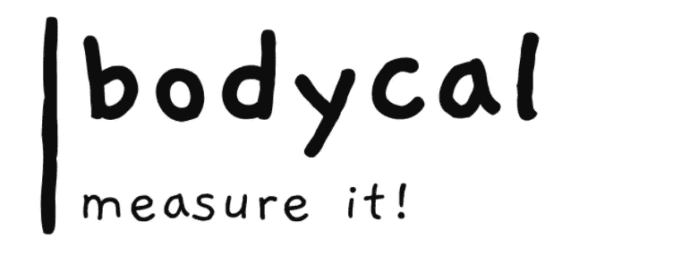*

*作者图片*

***安装***

```
*pip install bodycal*
```

*你可以找到你的*

*   *身体质量指数体重指数*
*   *基础代谢率*
*   *体脂百分比*

*通过使用那个图书馆。*

*听起来很有趣，让我们检查我的线性模型和我的图书馆。*

*[](/machine-learning-model-in-weight-prediction-b22a4cb77e2c) [## 体重预测中的回归模型

### 介绍

pub.towardsai.net](/machine-learning-model-in-weight-prediction-b22a4cb77e2c) 

# 结论

对，就是这样。

回归，可能是最常用的模型之一，就像分类一样。

分类 A-Z 简要说明文章在路上。

我会在它完成后添加链接。

感谢你所有的支持，掌声和关注。

这真的激励我去创造好的教育内容。

我喜欢分享我的知识，这也是在许多次过去后，我也可以刷新我的记忆的方式。

[https://medium . com/forward-artificial-intelligence/machine-learning-model-in-weight-prediction-b 22 a4 CB 77 e 2c](https://medium.com/towards-artificial-intelligence/machine-learning-model-in-weight-prediction-b22a4cb77e2c)

> “机器学习是人类需要创造的最后一项发明。”尼克·博斯特罗姆

为我订阅更多；

[](https://medium.com/subscribe/@geencay) [## 每当 Gencay I .出版时，就收到一封电子邮件。

### 每当 Gencay I .出版时，就收到一封电子邮件。通过注册，您将创建一个中型帐户，如果您还没有…

medium.com](https://medium.com/subscribe/@geencay)*