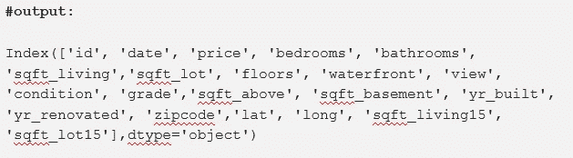
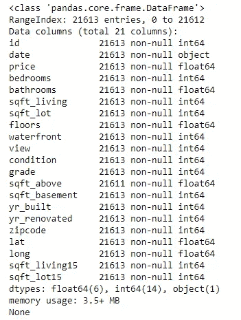
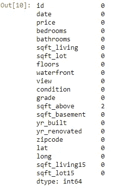
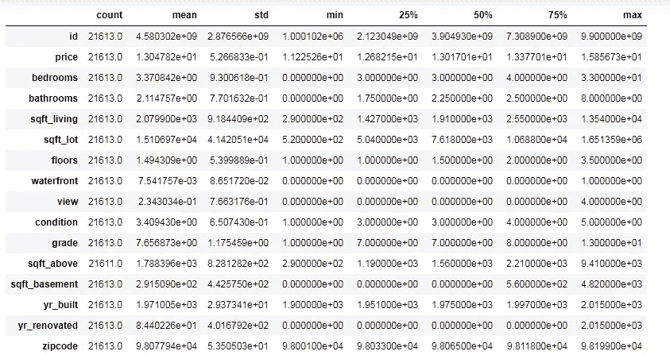
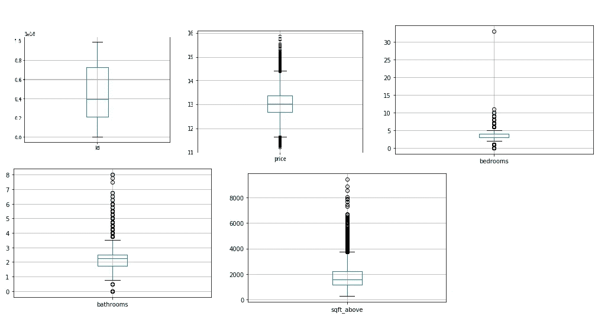
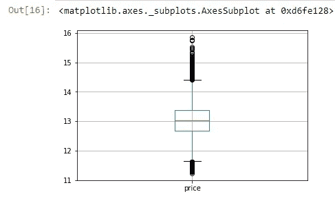
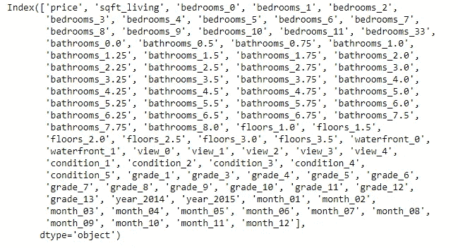
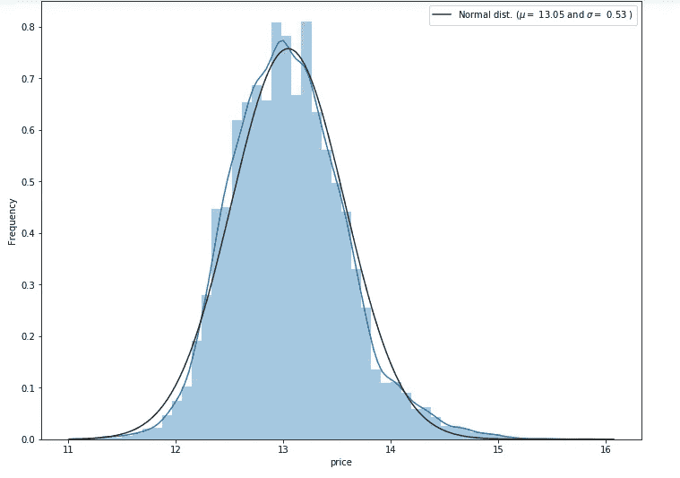

# Python 中预测房价的回归算法

> 原文：<https://pub.towardsai.net/regression-algorithm-to-predict-house-prices-in-python-7722f2d76548?source=collection_archive---------4----------------------->

## [编程](https://towardsai.net/p/category/programming)

## 统计线性回归方法和正态分布曲线


由 [Harmen Jelle van Mourik](https://unsplash.com/@jelleharmen?utm_source=medium&utm_medium=referral) 在 [Unsplash](https://unsplash.com?utm_source=medium&utm_medium=referral) 上拍摄

多元线性回归是预测连续值的一种非常好的算法。房价也是一个连续值。我们将在本文中使用的数据是从 Kaggle 下载的。挑战在于根据数据集中给出的独立特征来预测房子的价格。

我们将探讨数据集中给出的特性，如下所示:

```
id               21613 non-null int64 - **Discrete type**
date             21613 non-null object - **Continuous type**
price            21613 non-null float64 - **Continuous type**
bedrooms         21613 non-null int64 - **Discrete type**
bathrooms        21613 non-null float64 - **Discrete type**
sqft_living      21613 non-null int64 - **Continuous type**
sqft_lot         21613 non-null int64 - **Continuous type**
floors           21613 non-null float64 - **Discrete type**
waterfront       21613 non-null int64 - **Discrete type**
view             21613 non-null int64 - **Categorical type - nominal**
condition        21613 non-null int64 - **Categorical type - ordinal**
grade            21613 non-null int64 - **Categorical type - ordinal**
sqft_above       21611 non-null float64 - **Continuous type**
sqft_basement    21613 non-null int64 - **Continuous type**
yr_built         21613 non-null int64 - **Discrete type**
yr_renovated     21613 non-null int64 - **Discrete type**
zipcode          21613 non-null int64 - **Discrete type**
lat              21613 non-null float64 - **Continuous type**
long             21613 non-null float64 - **Continuous type**
sqft_living15    21613 non-null int64 - **Continuous type**
sqft_lot15       21613 non-null int64 - **Continuous type**
```

从列名来看，目标变量是 price 列，其余的是自变量。

[](https://medium.com/towards-artificial-intelligence/fully-explained-linear-regression-with-python-fe2b313f32f3) [## 用 Python 全面解释线性回归

### 如何用一个真实的例子解决回归问题。

medium.com](https://medium.com/towards-artificial-intelligence/fully-explained-linear-regression-with-python-fe2b313f32f3) 

首先，我们需要导入库。

```
import numpy as np
import pandas as pd
import matplotlib.pyplot as plt
%matplotlib inline
import warnings
warnings.filterwarnings('ignore')
```

导入熊猫的 CSV 数据。

```
house_df = pd.read_csv("housedata.csv")
house_df.head(5)
```

了解数据集的形状，即行数和列数。

```
print(house_df.shape)**#output:**
(21613, 21)
```

知道这些柱子的名字。

```
print(house_df.columns)
```



列名。作者的照片

根据类型和空值来了解数据的信息。

```
print(house_df.info())
```



数据集中变量的类型。作者的照片

检查变量列中是否有缺失值。为了进行检查，我们使用 isna()函数并对每一列的所有缺失值求和。

```
#finding missing values
house_df.isna().sum()
```



缺失值的记录。作者的照片

上面的代码显示“sqft_above”列中有两个值缺失。为了知道数据帧的统计信息，我们使用 describe()函数。该函数给出计数、平均值、四分位数等值。

```
house_df.describe().T
```



统计信息。作者的照片

借助盒图可视化了解列特征中的异常值。为此，我创建了一个 For 循环，其中使用了 int64 和 float64 类型的列。我们还可以从 describe()函数中观察到异常值。如果最大值的 75%与最小值和 25%之间存在差异，则存在异常值。

```
#outliers with boxplot
for column in house_df:
    if house_df[column].dtype in ['int64', 'float64']:
        plt.figure()
        house_df.boxplot(column = [column])
```



柱特征的箱线图。作者的照片

这些是一些盒状图，但实际上它将显示所有列特征盒状图。我们还需要知道目标列中是否有异常值。

```
house_df.boxplot(column = ['price'])
```



目标列的箱线图。作者的照片

在检查完所有这些之后，我们不需要将所有特征作为自变量，价格将作为目标变量。因此，我们将选择一些对房屋预测最重要的特征，并为我们的模型创建新数据。

```
house_feat_data = house_df[[“price”,”date”,”bedrooms”,”bathrooms”,
                             “sqft_living”,”floors”,”waterfront”, 
                             “view”,”condition”,”grade”]]
```

现在，如果我们在新形成的数据中看到，日期是一个对象类型，我们将把日期分为年和月，因为日期并不重要。年份和月份对预测有重要意义。新数据中有一些分类特征，作为特征工程的一部分，我们将使用虚拟方法来制作单独的编码列。

```
**#using slicing to extract year and month from date**
house_feat_data["year"] = house_df["date"].str[0:4]
house_feat_data["month"] = house_df["date"].str[4:6]**#to remove date column** 
house_feat_data = house_feat_data.drop(columns = ["date"])**#Encoding categorical cloumns** 
features = ["bedrooms","bathrooms","floors","waterfront","view",
           "condition","grade", "year","month"]
house_en = pd.get_dummies(house_feat_data, columns = features)
print(house_en.columns)
```



dummy 后的编码分类列。奥托尔的照片

现在，我们将导入回归模型来训练数据。将数据集分为训练集和测试集。在拆分中，测试大小是数据分离的比率,“0.2”表示测试数据为 20%，训练数据为 80%。

```
from sklearn.linear_model import LinearRegression
from sklearn.model_selection import train_test_splittrain_house, test_house = train_test_split(house_en, test_size= 0.2)
print(train_house.shape, test_house.shape)#output:
((17290, 89), (4323, 89))
```

将数据分解为自变量和因变量。

```
house_features = house_en.columns.drop("price")
target = ["price"]
```

现在，我们将使用模型来拟合训练数据，在此阶段，模型已准备就绪。该分数是模型的 R2 分数。

```
model = LinearRegression()
model.fit(train_house[house_features],train_house[target])
model.score(train_house[house_features],train_house[target])#output:
0.6191940799329386
```

这个分数告诉我们这条线与模型的吻合程度。这个值不够好，但它只是一个介绍性的概念。可以通过计算缺失值和异常值来提高该值。

我们现在将找到训练和测试预测的均方值。

```
from sklearn.metrics import mean_squared_errortrain_predict = model.predict(train_house[house_features])
mean_squared_error(train_house[target], train_predict)**0.5#output:
0.32567881525600667test_predict = model.predict(test_house[house_features])
mean_squared_error(test_house[target], test_predict)**0.5#Output:
0.32780719274631726
```

这些值是实际点和预测点之间的残差之和。均方误差和 R2 值成反比。

[](https://medium.com/towards-artificial-intelligence/python-zero-to-hero-with-examples-c7a5dedb968b) [## Python:从零到英雄(带示例)

### python 初学者手册指南

medium.com](https://medium.com/towards-artificial-intelligence/python-zero-to-hero-with-examples-c7a5dedb968b) 

我们还可以看到目标变量的偏斜度，以检查它是右偏还是左偏。因此，我们可以用均值和标准差将偏态分布转化为正态分布。

```
import seaborn as sns
from scipy import statsplt.subplots(figsize=(12,9))
sns.distplot(house_df['price'], fit=stats.norm)# fit the mean and standard deviation(mu, sigma) = stats.norm.fit(house_df['price'])# plot with the distributionplt.legend(['Normal dist. ($\mu=$ {:.2f} and $\sigma=$ {:.2f} )'.format(mu, sigma)], loc='best')
plt.ylabel('Frequency')#Probablity plotfig = plt.figure()
stats.probplot(house_df['price'], plot=plt)
plt.show()
```


目标列的右偏分布。作者的照片

从上面的分布中，可以观察到目标列是右偏的，我们可以从中得出的另一个结论是异常值在右侧。为了使目标变量呈正态分布，我们使用了对数函数，以便在将目标列中的值标准化后，平均值和标准偏差成为标准正态分布。

```
#This target variabale is right skewed. Now, we need to transform this variable and make it normal distribution.#using log function to normalize
house_df['price'] = np.log1p(house_df['price'])#Check again for more normal distributionplt.subplots(figsize=(12,9))
sns.distplot(house_df['price'], fit=stats.norm)# fit the mean and standard deviation(mu, sigma) = stats.norm.fit(house_df['price'])# plot with the distributionplt.legend(['Normal dist.($\mu=$ {:.2f} and $\sigma=$ {:.2f})'
                           .format(mu, sigma)], loc='best')
plt.ylabel('Frequency')#Probablity plotfig = plt.figure()
stats.probplot(house_df['price'], plot=plt)
plt.show()
```



目标变量的标准正态分布。作者的照片

结论:

本文给出了算法的工作行为。这种模型预测是通过线性回归模型完成的。尽管如此，还是需要做一些清理来使模型更好。

我希望你喜欢这篇文章。通过我的 [LinkedIn](https://www.linkedin.com/in/data-scientist-95040a1ab/) 和 [twitter](https://twitter.com/amitprius) 联系我。

# 推荐文章

1.  [NLP——用 Python 零到英雄](https://medium.com/towards-artificial-intelligence/nlp-zero-to-hero-with-python-2df6fcebff6e?sk=2231d868766e96b13d1e9d7db6064df1)

2. [Python 数据结构数据类型和对象](https://medium.com/towards-artificial-intelligence/python-data-structures-data-types-and-objects-244d0a86c3cf?sk=42f4b462499f3fc3a160b21e2c94dba6)

3. [MySQL:零到英雄](https://medium.com/towards-artificial-intelligence/mysql-zero-to-hero-with-syntax-of-all-topics-92e700762c7b?source=friends_link&sk=35a3f8dc1cf1ebd1c4d5008a5d12d6a3)

4.[Python 时间序列基础](https://medium.com/towards-artificial-intelligence/basic-of-time-series-with-python-a2f7cb451a76?source=friends_link&sk=09d77be2d6b8779973e41ab54ebcf6c5)

5. [NumPy:用 Python 零到英雄](https://medium.com/towards-artificial-intelligence/numpy-zero-to-hero-with-python-d135f57d6082?source=friends_link&sk=45c0921423cdcca2f5772f5a5c1568f1)