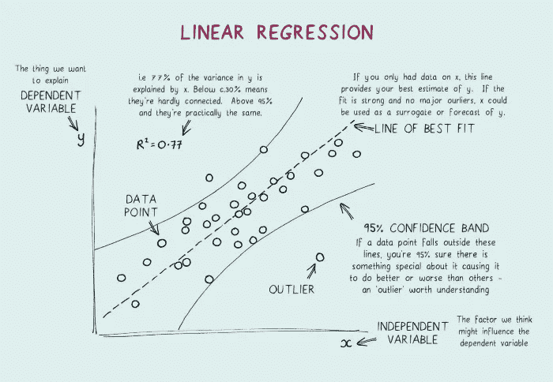
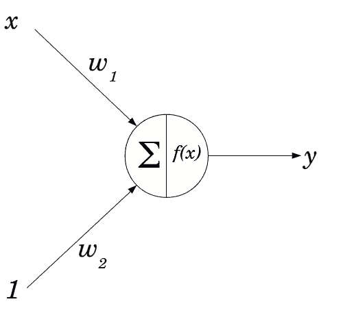

# 回归分析极其困难:不编码如何掌握它

> 原文：<https://pub.towardsai.net/regression-analysis-is-exceedingly-difficult-how-to-master-it-without-coding-542ae1d6edaf?source=collection_archive---------1----------------------->

## 通过回归分析，对关键概念、3 个经过实战检验的模型和 3 个挑战有一个很强的基础理解

来自 Unsplash 的 Jukan Tateisi

回归分析是一种可以用来[10]预测用例未来结果的技术。在机器学习中，回归分析在大型数据集上训练模型时特别有用。

# 回归分析可以预测一个或多个变量对因变量的影响，通常使用一组样本中的数据。

为了实现可测量的输出，我们使用历史数据进行预测。

回归分析是一项复杂的技术，有许多方法可以执行。在这里，我将用一个简单的例子来回顾回归分析的基础。随后，我将解释如何使用机器学习来提高回归的准确性。

由[丹怀特 1000](https://www.shutterstock.com/g/Dan+White+1000) 从 Shutterstock

# **回归分析中的关键概念**

首先，回归假设预测值和结果之间的关系是线性的。这意味着预测变量的每一个单位变化，结果变量都会有相应的变化。

第二，回归是变量相关的。为了解释这一点，让我们解决回归中的三个关键概念:误差、方差和斜率。

***误差*** *是实际输出与预测输出之差。*

***方差*** *衡量回归模型所做预测的变化。*

**斜率是误差变化率作为预测变量的值的函数。**

*在机器学习回归中，斜率尤其重要，因为它决定了模型从一组数据概化到另一组数据的程度，从而测量在改变预测器变量值时预测误差与线性线的接近程度。如果斜率很高，则模型倾向于将一个类别中的数据很好地推广到另一个类别中的数据。相反，如果斜率较低，模型很难从一类数据推广到另一类数据。*

**

*Jaromír Kavan 在 [Unsplash](https://unsplash.com/?utm_source=medium&utm_medium=referral) 上拍摄的照片*

# ***一个好的回归模型在最小化斜率的同时，误差和方差都会很低。***

*较低的误差意味着预测中的不确定性减少，而最小化的方差意味着相对于随机猜测，预测中的变化较小。斜率也可以通过平滑或部分拟合来调整[3]，这有助于减少其对整体精度的影响。*

*当建立机器学习回归模型时，考虑两种类型的偏差很重要:实验性的和系统性的。当不同的人群因为他们测量或观察输入的方式而做出不同的预测时，就会产生实验偏差。系统偏差[5]来自机器学习模型基础的错误假设。例如，假设您的机器学习算法假设所有输入数据点都是正态分布。但是，您正在训练的数据可能不符合这一假设，从而导致不准确的预测。*

*最后，应该谨慎使用回归，因为它会受到异常值(远离其余数据的数据点)的影响。*

*现在让我们把注意力转向回归分析的基础。为了使用回归预测结果，我们首先需要开发一个模型来表示预测因子和结果变量之间的关系。例如，我将使用线性回归作为我们的模型表示。*

*由于 x(预测变量)的变化，线性回归模型预测 y(结果变量)的变化。下图简单展示了线性回归模型的工作原理:*

**

*参考文献[2]*

*要使用线性回归模型来预测结果，我们首先需要计算表示 x 和 y 之间关系的方程的斜率和截距。斜率测量 x 的每个单位变化对应于 y 的单位变化的程度，截距测量 x 的每个变化对应于 y 的多少变化。*

*现在让我们看看如何使用机器学习来提高我们预测的准确性。回归的准确性通常取决于预测与实际结果数据的匹配程度。但是，这种方法有局限性，因为它没有考虑模型与数据的拟合程度。为了提高我们预测的准确性，我们可以使用机器学习来找到更好的模型，更好地表示预测器和结果变量之间的关系。*

*可以用来提高回归预测准确性的一种机器学习是人工神经网络(ann)[1]。人工神经网络是受大脑工作方式启发的预测模型。它们由多层节点或神经元组成，通过网络层连接。第一层节点称为输入层，用于将数据输入到人工神经网络中。第二层称为隐藏层[11]，用于计算输出层的预测。最后，第三层称为输出层[12]，用于为一个或多个输入变量生成预测输出。*

**

*来自 Unsplash 的马丁·桑切斯*

*有许多不同的人工神经网络模型，每一个都有其优点和缺点。卷积神经网络(CNN)[6]是一种在使用回归预测结果方面特别有效的人工神经网络。CNN 类似于 ann，因为它们由多层节点组成。然而，CNN 不是只有一个隐藏层，而是有几个隐藏层，它们一起工作形成一个预测模型。前两层类似于人工神经网络中的层，但接下来的两层不同。*

*第一个区别是它们包括一个从输入数据中提取要素的要素提取器图层。第二个区别是它们包括一个 Hopfield 矩阵激活层，允许第二个隐藏层中的神经元从第一个隐藏层中的先前激活中学习。*

*与人工神经网络相比，细胞神经网络的主要优势在于它们可以更好地处理复杂的输入。当使用回归预测结果时，CNN 也比传统的 ANN 模型更准确。然而，在回归分析中使用 CNN 有一些限制。*

*首先，CNN 需要大量的训练数据才能得到好的结果。其次，CNN 很难在大型数据集上训练。幸运的是，使用机器学习方法，如强化学习，可以提高 CNN 预测的准确性。*

*深度学习网络是另一种类型的机器学习，可以提高回归预测的准确性[7]。dnn 类似于 CNN，因为它们由多层节点组成。然而，与 CNN 不同，深度学习网络有一个额外的更深的层，称为深度神经网络(DNN) [8]。*

**

*来自 Unsplash 的安妮·斯普拉特*

# ***就学习数据中复杂模式和趋势的能力而言，DNNs 比传统 ann 和传统回归有许多优势。***

*此外，在大型数据集上，DNNs 可以比传统的 ANN 模型训练得更准确。*

# ***典型用于回归分析的 3 个模型***

*我将讨论**三种最常见的**回归分析模型(在众多模型中):线性回归、非线性回归和贝叶斯回归。*

*线性回归是最简单的回归分析模型，通常用于预测简单的结果(例如，Zillow house 预测)。线性回归使用直线来预测输入和输出变量之间的关系，假设两者之间存在线性关系。*

*当输入和输出变量之间没有直接的线性关系时，经常使用非线性回归。非线性回归使用更复杂的数学函数来预测输入和输出变量之间的关系。这个函数可以是多项式的，也可以是指数的，视情况而定。关于逻辑回归，我将撰写一个单独的帖子进行更深入的探讨(一个原因是它可以被视为线性模型，但它也可以产生非线性决策边界)。*

*贝叶斯回归[9]是基于贝叶斯统计的回归分析模型家族的新成员。贝叶斯回归使用贝叶斯定理来计算各种结果的后验概率；这种方法允许比传统的线性或非线性回归模型更精确的预测。*

**

*来自 Unsplash 的 ray rui*

# ***3 挑战***

*机器学习回归分析模型的第一个挑战是它们可能很难解释。就其本质而言，回归模型旨在根据当前数据预测未来结果。但是，这一过程通常很难可视化或理解，并且很难确定模型是否按预期执行，如果没有，是什么导致了差异。*

*第二个挑战是它们经常不准确；这很大，因为回归模型是基于过去的数据。因此，它们容易出现与数据不准确相关的错误。此外，对于较大的数据集，回归模型可能很慢且计算要求很高，导致从机器学习应用程序中产生准确结果的延迟。*

*此外，回归模型通常受限于它们能够正确预测的数据类型，主要是因为它们被设计为对离散数据点进行操作。因此，他们可能无法准确预测变量之间某些复杂的相互作用。在某些情况下，后者可能导致不准确的预测，从而对依赖回归分析模型的应用程序的性能产生负面影响。*

*回归分析是一种利用历史数据预测未来结果的有用技术。为了提高结果，可以通过使用机器学习方法(如人工神经网络和深度学习网络)来改进回归估计，以找到更好地表示预测变量和结果变量之间关系的更好模型。*

*如果您有任何编辑/修改建议或关于进一步扩展此主题的建议，请考虑与我分享您的想法。*

# ***另外，请考虑订阅我的每周简讯:***

* [## 周日报告#1

### 设计思维与 AI 的共生关系设计思维能向 AI 揭示什么，AI 又能如何拥抱…

pventures.substack.com](https://pventures.substack.com/) 

***引用。***

*1。c、R. S. (2019 年 12 月 5 日)。用线性回归理解人工神经网络。分析印度杂志。*

**2。线性回归例子。(未注明)。露露的博客。2022 年 7 月 18 日检索，来自*[*https://lucidar . me/en/neural-networks/linear-regression-example/*](https://lucidar.me/en/neural-networks/linear-regression-example/)*

**3。回归和平滑。(未注明)。检索 2022 年 7 月 18 日，来自*[*http://www.statsref.com/HTML/regression.html*](http://www.statsref.com/HTML/regression.html)*

**4。绿色 d . p .&# 38；2011 年 3 月 7 日。使用回归分析实验数据:偏倚何时成为实际问题？未知。*[*https://www . research gate . net/publication/228296006 _ Analyzing _ Experimental _ Data _ Using _ Regression _ When _ is _ Bias _ a _ Practical _ Concern*](https://www.researchgate.net/publication/228296006_Analyzing_Experimental_Data_Using_Regression_When_is_Bias_a_Practical_Concern)*

**5。马丁，R. F. (2000)。方法比较研究中估计系统偏差及其置信区间的一般戴明回归。临床化学，46(1)。**

*6。对卷积神经网络的理解。(未注明)。IEEE Xplore。检索 2022 年 7 月 18 日，转自[*https://ieeexplore.ieee.org/document/8308186*](https://ieeexplore.ieee.org/document/8308186)*

**7。&# 38；布拉什，K. (2021 年 3 月 29 日)。深度学习。TechTarget。*[*https://www . techtarget . com/search enterprise ai/definition/deep-learning-deep-neural-network*](https://www.techtarget.com/searchenterpriseai/definition/deep-learning-deep-neural-network)*

**8。什么是深度神经网络？(未注明)。2022 年 7 月 18 日检索，来自*[*https://www . oticon . com/blog/what-is-a-deep-neural-network-dnn*](https://www.oticon.com/blog/what-is-a-deep-neural-network-dnn)*

**9。克莱德，硕士(未注明)。第 6 章贝叶斯回归介绍。2022 年 7 月 18 日检索，来自*[*https://stats withr . github . io/book/introduction-to-Bayesian-regression . html*](https://statswithr.github.io/book/introduction-to-bayesian-regression.html)*

*10。扎克。(2019 年 6 月 15 日)。如何解读回归系数？静态学。[*https://www . statology . org/how-to-interpret-regression-coefficients/*](https://www.statology.org/how-to-interpret-regression-coefficients/)*

*11。人工神经网络的本质。[*https://medium . com/@ ivanliljeqvist/the-essence-of-artificial-neural-networks-5de 300 c 995d 6*](https://medium.com/@ivanliljeqvist/the-essence-of-artificial-neural-networks-5de300c995d6)*

**12。深度学习——GitHub 页面。*[*https://srdas.github.io/DLBook/PatternRecognition.html*](https://srdas.github.io/DLBook/PatternRecognition.html)*

**13。什么是深度学习？| RapidMiner。*[【https://rapidminer.com/glossary/deep-learning/】T21](https://rapidminer.com/glossary/deep-learning/)**