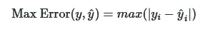
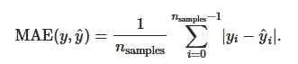
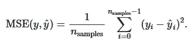
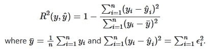
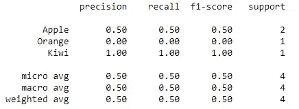
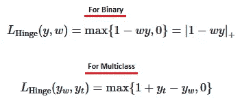

# Python 机器学习中的回归和分类度量

> 原文：<https://pub.towardsai.net/regression-and-classification-metrics-in-machine-learning-with-python-6d9fcd8b73aa?source=collection_archive---------0----------------------->

## [机器学习](https://towardsai.net/p/category/machine-learning)

## 使用度量 API 进行回归和分类的模型评估


Sheri Hooley 在 [Unsplash](https://unsplash.com?utm_source=medium&utm_medium=referral) 上拍摄的照片

在本文中，我们将讨论机器学习中回归和分类的各种度量。我们总是想到建模一个好的机器学习算法所涉及的步骤。第一步是评估模型良好性的度量。当我们拟合我们的模型并做出预测时，我们总是试图知道误差和准确性。本文将尝试提供和解释回归和分类中的各种误差度量方法。

[](https://medium.com/towards-artificial-intelligence/fully-explained-svm-classification-with-python-eda124997bcd) [## 用 Python 全面解释了 SVM 分类

### 如何用一个真实的例子解决分类问题。

medium.com](https://medium.com/towards-artificial-intelligence/fully-explained-svm-classification-with-python-eda124997bcd) 

评估模型预测质量的标准如下所示:

*   ***度量函数:*** 我们将在本文中研究。
*   ***评估者评分法:*** 这种方法有一个评分法来评估要解决的问题。
*   ***评分参数:*** 评分参数告诉评估者用`grid_search.GridSearchCV`和`cross_validation.cross_val_score`选择评估模型的度量

## ***基本定义***

*   ***估计量:*** 是在真实数据点上预测更精确建模点的函数或方程。

## ***招数知道***

在评估方法中有两点需要注意，如下所示:

*   首先，有些方法以`score`一词结尾，意思是价值来源于这个确定的基本事实。在这种情况下，如果数字较高，那就更好。
*   第二，如果单词以`error`或`loss`结尾。在这种情况下，数量越少越好。

## ***指标回归***

下面给出了评估回归性能的指标:

1.  ***已解释的方差得分:*** 此度量评估数据点的变化或离差。

*   该指标的公式如下所示:


python 中的示例

```
#import the variance score from the sklearn 
from sklearn.metrics import explained_variance_scoretrue_values = [5, 2.5, 3, 6]
predicted_values = [4.5, 2.9, 3, 7]explained_variance_score(true_values, predicted_values)#output:
0.8525190839694656
```

2. ***最大误差:*** 此指标将计算真实值和预测值之间的最大值。

*   最大误差的公式如下所示:



python 中的示例

```
#import the max error from the sklearn
from sklearn.metrics import max_errortrue_values = [5, 2.5, 3, 6]
predicted_values = [4.5, 2.9, 3, 8]max_error(true_values, predicted_values)#output:
2
```

3. ***平均绝对误差:*** 此指标计算真实值和预测值之间的差异的平均误差。该度量对应于 l1 范数损失。

*   此指标的公式如下所示:



python 中的示例

```
##import the MAE from the sklearn
from sklearn.metrics import mean_absolute_errortrue_values = [5, 2.5, 3, 6]
predicted_values = [4.5, 2.9, 3, 7]mean_absolute_error(true_values, predicted_values)#output:
0.475
```

3. ***均方误差:*** 此指标计算二次误差或损失。

*   公式如下所示:



python 中的示例

```
#import the MSE from the sklearn
from sklearn.metrics import mean_squared_errortrue_values = [5, 2.5, 3, 6]
predicted_values = [4.5, 2.9, 3, 7]mean_squared_error(true_values, predicted_values)#output:
0.3525
```

4. ***R 平方得分:*** 此指标计算平均值或估计值的数据分布，就像拟合的回归线一样。一般称为“*决定系数*”。

*   该指标的公式如下所示:



python 中的示例

```
#import the r-squared from the sklearn
from sklearn.metrics import r2_scoretrue_values = [5, 2.5, 3, 6]
predicted_values = [4.5, 2.9, 3, 7]r2_score(true_values, predicted_values)#output:
0.8277862595419847
```

## ***指标分类***

评估分类绩效的指标如下:

1.  ***准确度分数:*** 此度量计算真值等于预测值的准确度，然后返回分数的一部分，否则如果 normalize 参数为 **FALSE** ，则返回真预测值的总数。

*   公式如下所示:


python 中的示例

```
#import the accuracy score from the sklearn
from sklearn.metrics import accuracy_scoretrue_values = [5, 2, 3, 6]
predicted_values = [4, 3, 3, 6]accuracy_score(true_values, predicted_values)
```

2.分类报告:此指标计算包含分类问题的精确度、召回率和 F1 值的报告。

Python 中的示例

```
#import the classification report from the sklearn
from sklearn.metrics import classification_reporttrue_values = [3, 4, 3, 6]
predicted_values = [4, 3, 3, 6]
target_names = ['Apple', 'Orange', 'Kiwi']print(classification_report(true_values, predicted_values, target_names=target_names))
```



分类报告指标。作者的照片

3. ***铰链损失:*** 该损失计算数据点和模型预测点之间的平均距离。它也用于最大边际的 SVM 算法中。

*   公式如下所示:



python 中的示例

```
#importing the libraries
from sklearn import svm
from sklearn.metrics import hinge_loss
from sklearn.svm import LinearSVC#data set in x and y values
x_values = [[3], [2]]
y_values = [-1, 1]#using linear SVC model
svm_linear = svm.LinearSVC(random_state=0)#fitting the model
svm_linear.fit(x_values, y_values)
LinearSVC(random_state=0)#making decision prediction
pred_decision = svm_linear.decision_function([[-2], [3], [0.5]])
hinge_loss([-1, 1, 1], pred_decision)#output:
1.333372678152829
```

## 结论:

这些是来自回归和分类的一些度量，用于评估模型性能。在分类中有各种基于回归、二元类和多类度量标准。

我希望你喜欢这篇文章。通过我的 [LinkedIn](https://www.linkedin.com/in/data-scientist-95040a1ab/) 和 [twitter](https://twitter.com/amitprius) 联系我。

# 推荐文章

1.  [NLP —用 Python 从零到英雄](https://medium.com/towards-artificial-intelligence/nlp-zero-to-hero-with-python-2df6fcebff6e?sk=2231d868766e96b13d1e9d7db6064df1)

2. [Python 数据结构数据类型和对象](https://medium.com/towards-artificial-intelligence/python-data-structures-data-types-and-objects-244d0a86c3cf?sk=42f4b462499f3fc3a160b21e2c94dba6)

3. [MySQL:零到英雄](https://medium.com/towards-artificial-intelligence/mysql-zero-to-hero-with-syntax-of-all-topics-92e700762c7b?source=friends_link&sk=35a3f8dc1cf1ebd1c4d5008a5d12d6a3)

4.[Python 时间序列基础](https://medium.com/towards-artificial-intelligence/basic-of-time-series-with-python-a2f7cb451a76?source=friends_link&sk=09d77be2d6b8779973e41ab54ebcf6c5)

5. [NumPy:用 Python 零到英雄](https://medium.com/towards-artificial-intelligence/numpy-zero-to-hero-with-python-d135f57d6082?source=friends_link&sk=45c0921423cdcca2f5772f5a5c1568f1)

6.[用 python 实现熊猫系列和数据帧的基础](https://medium.com/towards-artificial-intelligence/fundamentals-of-series-and-data-frame-in-pandas-with-python-6e0b8a168a0d?source=friends_link&sk=955350bf43c7d1680be6e37b15b6628b)