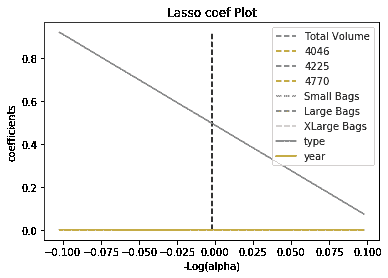

# 使用 Kydavra LassoSelector 进行回归特征选择

> 原文：<https://pub.towardsai.net/regression-feature-selection-using-the-kydavra-lassoselector-81a95cdae570?source=collection_archive---------4----------------------->

## [机器学习](https://towardsai.net/p/category/machine-learning)


这幅图片是由公众协会“Sigmoid”创作的

我们都知道奥卡姆剃刀:

从一组解决方案中选择一个最简单的。

该原理应用于机器学习中线性模型的正则化。L1 正则化(也称为 LASSO)倾向于将线性模型的权重收缩到 0，而 L2 正则化(也称为 Ridge)倾向于通过最小化模型的向量权重的范数来尽可能地保持整体复杂性。Kydavra 的选择器之一使用套索来选择最佳特征。所以我们来看看怎么应用。

## 使用 Kydavra LassoSelector。

如果你还没有安装 Kydavra，只需在命令行中输入以下命令。

```
pip install kydavra
```

接下来，我们需要导入模型，创建选择器，并将其应用于我们的数据:

```
from kydavra import LassoSelectorselector = LassoSelector()selected_cols = selector.select(df, ‘target’)
```

select 函数将 panda 的数据框和目标列的名称作为参数。此外，它还有一个默认参数“cv”(默认设置为 5)，表示交叉验证中使用的折叠次数。LassoSelector()接受下面的参数:

*   alpha_start (float，默认值= 0)alpha 的起始值。
*   alpha_finish (float，默认值= 2)alpha 的最终值。这两个参数定义了算法的搜索空间。
*   n_alphas (int，default = 300)搜索过程中将测试的 alpha 数。
*   extend_step (int，default=20)如果算法将推断出α的最佳值是α_ start 或α_ finish，它将使用 extend_step 扩展搜索范围，以这种方式确保它不会卡住，并将最终找到最佳值。
*   公式 10^-power 中使用的 power (int，default = 2)将最大可接受值定义为 0。

所以算法在找到α的最优值后，将会看到哪个权重高于 10^-power.

## **让我们看一个例子:**

为了展示它的性能，我选择了[鳄梨价格](https://www.kaggle.com/neuromusic/avocado-prices)数据集。

经过一点清理和培训，它的下一个功能:

```
'Total Volume', '4046', '4225', '4770', 'Small Bags', 'Large Bags', 'XLarge Bags', 'type', 'year'
```

线性回归的平均绝对误差等于**0.249683103736682。**

当 LassoSelector 应用于此数据集时，它会选择以下要素:

```
'type', 'year'
```

仅使用这些特征，我们得到了一个 MAE = 0。49660 . 68686868661

一个相当好的结果(记住，我们只使用了 2 个特性)。

> ***注意:*** 有时建议在缩放数据上应用套索。在这种情况下，应用于数据，选择器没有丢弃任何特征。我们邀请您尝试缩放值和非缩放值。

## **奖金。**

该模块还具有绘图功能。应用选择功能后，您可以看到为什么选择器选择了一些功能，而没有选择其他功能。要绘制，只需键入:

```
selector.plot_process()
```



这是 Kydavra LassoSelector 在鳄梨价格数据集上创建的图

虚线是因为权重太接近 0 而被丢弃的要素。中间垂直的虚线是算法找到的 alpha 的最佳值。

plot_process()函数有以下参数:

*   **eps** ( *浮动*，*默认= 5e-3* )路径的长度。
*   **标题** ( *字符串*，*默认= 'Lasso coef Plot'* ) —绘图的标题。
*   **保存** ( *布尔*，*默认=假*)如果设置为真，将尝试保存绘图。
*   **file _ path**(*string*， *default = None* )如果保存参数设置为 true，将使用该路径保存绘图。

## **结论**

LassoSelector 是一个选择器，它使用 LASSO 算法来选择最有用的特征。有时缩放功能会很有用，我们强烈建议您两者都尝试一下。


来源 tenor.com

如果您尝试过 kydavra，我们邀请您通过填写此[表格](https://vpapaluta.typeform.com/to/g1EXxlSf)来分享您的印象。

西格蒙德用❤做的。

有用的链接:

*   [https://en . Wikipedia . org/wiki/Lasso _(统计数据)](https://en.wikipedia.org/wiki/Lasso_(statistics))
*   [https://towards data science . com/feature-selection-using-regular ization-a 3678 b 71 e 499](https://towardsdatascience.com/feature-selection-using-regularisation-a3678b71e499)