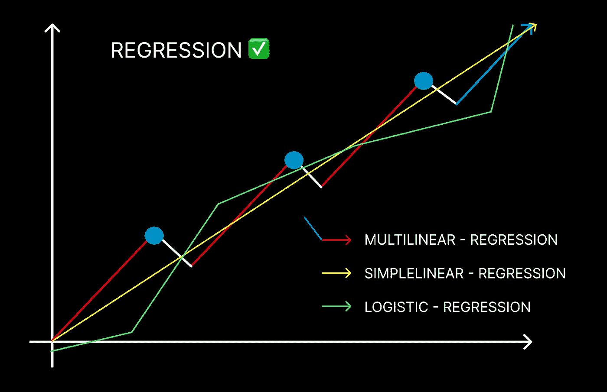
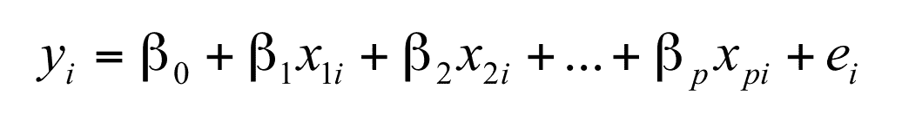

# 回归——如何回归，为什么回归，何时回归？

> 原文：<https://pub.towardsai.net/regression-how-why-and-when-1e0e8dd67c58?source=collection_archive---------4----------------------->

## 监督机器学习—第二部分

## 回归:



图片来源:作者

正如我们之前看到的，机器学习的监督部分分为两个类别，从这两个类别中，我们已经进入了 [***分类***](https://medium.com/towards-artificial-intelligence/world-of-classification-in-machine-learning-a3c1f008b1fc) 以及分类过程中采用的许多算法的领域。回归是同一枚硬币的另一面，我们利用回归技术来揭示或建立独立因素、特征和因变量以及结果之间的关系。

回归程序允许您安全地决定哪些元素是最重要的，哪些可能被忽略，以及某些因素如何相互影响。

最终的目标是把很多事情理顺，这样你就可以对你想要建立的东西充满信心，或者找到解决问题的方法。

**简单线性回归用公式表示:**

**y = β0 + β1 x.**


来源:[https://giphy.com/](https://giphy.com/)

## 现实生活中的回归例子:

1.  在鲁莽驾驶和一年内频繁发生的事故之间画点。
2.  预测公司特定产品的销售。
3.  医学研究人员经常使用线性回归来检验药物剂量和患者血压之间的关系。
4.  股票预测是通过检查股票价格和趋势的历史数据来发现模式。还有更多。

## 那么确切地说，回归和分类有什么不同呢？

当我们讨论分类困难时，我们指的是重要的分类值，这意味着输出是离散的。

然而，在回归的情况下，情况正好相反；在这里，重要的值是数字，输出是连续的而不是离散的。

这两种方法之间的另一个重要区别是，正如我们在上一篇博客(即 [***分类的世界***](https://medium.com/towards-artificial-intelligence/world-of-classification-in-machine-learning-a3c1f008b1fc) )中看到的，我们使用分类技术来确定决策边界，并将整个大型数据集分成两个不同的类。

然而，如前所述，在回归分析中，我们并不将数据集分成两组，而是确定能够正确预测结果的最佳拟合线。


来源:[https://giphy.com/](https://giphy.com/)

最后，这两种技术之间的另一个重要区别是，分类算法通常处理与自然语言处理或计算机视觉、深度学习(如人脸检测、语音识别、图片分割、DNA 序列分类等)相关的问题。

当我们谈到回归算法时，它通常解决与销售、增长、市场评估、消费者需求等元素相关的问题，以及许多其他问题，如房价预测、未来股票价格预测、加密货币价格预测等。

我们谈了很多理论，让我们进入实践领域，以便更好地理解事情:


来源:https://giphy.com/

## 为了解决问题，回归是如何实现的？

## 简单线性回归:

**问题陈述:**

给定的数据具有汽车的各种属性，因此现在我们将使用线性回归方法，结合收集的特征来估计汽车的价格。

在我们处理实际实现时，需要记住一些术语。

1.  **价格**——汽车的成本
2.  **可靠性** —确定车辆可靠性的中间测量。
3.  **里程** —车辆的燃油里程。
4.  **类型** —分类变量定义汽车所属的类别。
5.  **重量** —汽车的重量
6.  **排量** —代表汽车的发动机排量
7.  **HP** —车辆的马力，测量其功率的单位。

## 数据读取:

**数据读取的重要性:**

为了确保干净且有组织的数据可用于进一步训练模型，并避免在处理大型数据集时的任何误解，有必要预处理并开始数据的清理，即将原始数据转换为干净的数据。
读取数据对于开发模型和继续前进至关重要。

```
getwd()

## Load the data
cars_data  <- read.csv(file = "cars.csv")
```

## 数据理解:

在这个阶段，我们将检查发生的观察和属性的数量。对自变量和因变量进行分类。

注:在线性回归中，因变量是连续变量。

这里，我们将用一个自变量来预测因变量。

**举例:**我们将价格视为因变量，汽车的排量视为自变量。

```
dim(cars_data)

str(cars_data)

head(cars_data)

tail(cars_data)

summary(cars_data)
```

## 数据类型转换:

属性值可以隐式或显式转换。用户不知道隐式转换。SQL Server 立即将数据从一种数据类型转换为另一种数据类型。例如，当比较小整型和整型时，在执行比较之前，小整型被隐式地转换成整型。

```
#Convert "Reliability" to factor variable
cars_data[, "Reliability"] <- as.factor(as.character(cars_data[, "Reliability"]))

cars_data[, "Country"] <- as.factor(as.character(cars_data[, "Country"]))
cars_data[, "Type"] <- as.factor(as.character(cars_data[, "Type"]))

str(cars_data)
```

## 处理值:

这样我们就不会有任何空白空间在我们的模型中制造混乱。

```
## Look for Missing Values
sum(is.na(cars_data))

colSums(is.na(cars_data))

#Install the DMwR2 package incase you haven't.
install.packages("DMwR2", dependencies=TRUE)

## Imputing missing values
library(DMwR2)
cars_data=centralImputation(cars_data)

sum(is.na(cars_data))

sum(is.na(cars_data))
```

## 数据探索性分析:

探索性数据分析是对数据进行初步调查的关键过程，目的是提高检测率，识别异常情况，测试假设，并使用统计结果和可视化验证假设。

```
#Plot the Dependent and  Independent variables
# _*Scatter Plot*_ helps to view the relationship between two continuous variables

options(repr.plot.width = 10, repr.plot.height = 10)
par(mfrow = c(2,2)) # Splits the plotting pane 2*2

plot(cars_data$Weight, cars_data$Price, xlab = "Weight",
    ylab = "Price", main = "Weight vs Price")

plot(cars_data$Mileage, cars_data$Price, xlab = "Mileage",
    ylab = "Price", main = "Mileage vs Price")

plot(cars_data$Disp., cars_data$Price, xlab = "Displacement",
    ylab = "Price", main = "Displacement vs Price")

plot(cars_data$HP, cars_data$Price, xlab = "Horse Power",
    ylab = "Price", main = "Horse Power vs Price") 
```

## 将数据分为训练集和验证集:

将数据集划分为一个验证集的主要目标是避免我们的模型过度拟合，当算法在对测试数据集中的项目进行分类时非常有效，但难以对以前没有遇到的数据概括实践和知识预测时，就会发生这种情况。

```
1:100

sample(1:100,size=10)

cars_data[c(1,10),]

## Split row numbers into 2 sets
set.seed(1)
train_rows = sample(1:nrow(cars_data), size=0.7*nrow(cars_data))
validation_rows = setdiff(1:nrow(cars_data),train_rows)

train_rows

validation_rows

## Subset into Train and Validation sets
train_data <- cars_data[train_rows,]
validation_data <- cars_data[validation_rows,]

## View the dimensions of the data
dim(cars_data)
dim(train_data)
dim(validation_data)
```

## 现在让我们建立一个模型:

```
names(train_data)

# lm function is used to fit linear models
LinReg = lm(Price ~ Disp., data = train_data)

## Summary of the linear model
summary(LinReg)
```

## GITHUB GIST ❤️

**如果你想运行代码并解释结果:**

来源:Github gist 作者

## 2.多元线性回归:

正如我们在简单线性回归中看到的，简单线性回归中的计算是计算因变量“Y”和自变量“X”之间的距离。

当我们谈论多元线性回归时，概念几乎是相同的，或者我们可以说它是简单线性回归的扩展，其中我们不是找到因变量和自变量之间的关系，而是找到因变量“Y”和解释变量“p”之间的关系

多元线性回归由以下公式表示:



来源:[https://hummedia . Manchester . AC . uk/institutes/cmist/archive-publications/working-papers/2008/2008-19-multiple-linear-regression . pdf](https://hummedia.manchester.ac.uk/institutes/cmist/archive-publications/working-papers/2008/2008-19-multiple-linear-regression.pdf)

## 符号:

**β0** =常数项

**β1 和βP** =解释变量

## 有趣的花絮:

我们在多元线性回归中使用术语“线性”,因为我们总是相信当我们使用回归时,“Y”与解释变量“P”的线性组合直接相关。

## 我们使用多元线性回归的真实例子:

1.  试图根据各种社会人口统计变量来预测一个人的收入。
2.  试图基于 16 范围内的一组考试结果的值来预测“A”级学生的总评估成功。
3.  试图根据社会、经济和生活方式因素(就业、饮酒、吸烟、年龄等)计算收缩压或舒张压。).

## 让我们来看看一些案例研究的实际实现，让事情变得更清楚:

来源:Github gist 作者

## 3.逻辑回归:

逻辑回归是一种统计分析方法，它使用原始数据集预先存在的数据来估计二元结果，如是或否。逻辑回归模型通过检查一个或多个现有自变量之间的关系来预测因变量。


来源；[https://Twitter . com/NickSinghTech/status/1580660958112157696](https://twitter.com/NickSinghTech/status/1580660958112157696)

我们之前在 [*分类博客*](https://medium.com/towards-artificial-intelligence/world-of-classification-in-machine-learning-a3c1f008b1fc) 里看到了很多关于 logistic 回归的内容；如果你想进行快速复习，请转到分类算法类型的第一项技术，以了解更多信息。

**就逻辑回归类型而言，逻辑回归有三个主要的子类型:**

## 1.二元逻辑回归:

当我们考虑二元逻辑回归时，首先想到的也是唯一想到的是 0 和 1(二进制数)，而这正是它。响应有两种可能的结果:0 或 1。

这是三种方法中最常见的一种。

## 2.多项逻辑回归；

当使用多项式逻辑回归技术时，感兴趣的变量可以有三个以上的结果，并且顺序是不固定的，并且如先前所建立的，结果不必是二进制整数。

**示例**:如果网飞希望对 11 月份十大最受欢迎的趋势节目进行分类，逻辑回归将帮助网飞确定每个节目在某个地区或国家的观看时间。那么网飞可以通过对观看时间最多的前十个系列做广告来开始营销。

## 3.有序逻辑回归:

最后一种技术是有序逻辑回归，其中模型包含一个具有三种或更多种可能性的因变量，但与不指定顺序的多项逻辑回归不同，有序逻辑回归中的值具有明确的顺序。

**举例**:大学根据 A 到 d 的分数来分配成绩。

## 通过理解案例研究在实践中实施:

来源:Github gist 作者

**学习回归有乐趣吗？因为我们为你们写歌很开心！**


资料来源:https://giphy.com/

**关注我们，享受学习数据科学博客和文章的乐趣:💙**

**领英**:[https://www.linkedin.com/company/dsmcs/](https://www.linkedin.com/company/dsmcs/)

**insta gram**:【https://www.instagram.com/datasciencemeetscybersecurity/? hl=en

GITHUB:[https://github.com/Vidhi1290](https://github.com/Vidhi1290)

**推特**:[https://twitter.com/VidhiWaghela](https://twitter.com/VidhiWaghela)

**中等**:[https://medium.com/@datasciencemeetscybersecurity-](https://medium.com/@datasciencemeetscybersecurity-)

**网站**:[https://www.datasciencemeetscybersecurity.com/](https://datasciencemeetscybersecurity.blogspot.com/)

—团队数据科学与网络安全❤️相遇💙