# 线性回归的数学回归直线

> 原文：<https://pub.towardsai.net/regression-line-with-mathematics-for-the-linear-regression-a80cc25bcfe2?source=collection_archive---------0----------------------->

## [统计数据](https://towardsai.net/p/category/statistics)

# 介绍

回归是一种预测，其中目标是连续的，其应用是多种多样的。这是最简单的参数模型。每个数据集都是成对给出的，由输入特征向量和标签值组成。主要目标是假设参数，以从训练数据集中预测训练后测试数据的目标值。

下表有两个变量 X 和 Y。这里，Y 被称为目标变量或自变量，X 被称为解释变量。

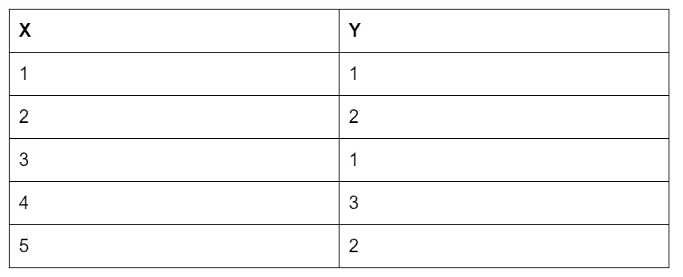

x 和 Y 变量

根据孩子的年龄和体重来预测他的身高就是回归问题的一个例子。

设 X 是实数值:

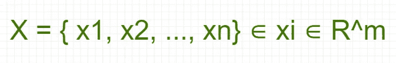

X 的值

Y 的真实值是:

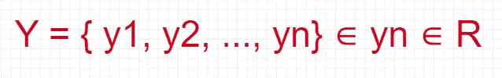

Y 的值

所以，回归过程基于给定的规则:

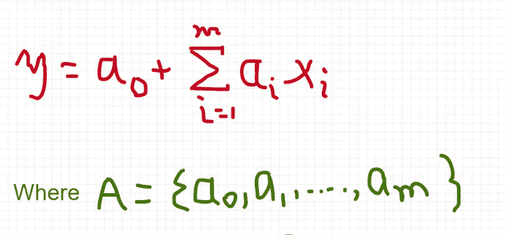

# 回归方法

以下是回归的一般方法:

1.  收集数据
2.  准备数据:回归时应该有数值。如果有标称值，应该映射到二进制值。
3.  分析:有利于 2D 情节的可视化。
4.  训练:找出回归权重。
5.  测试:测量预测值和数据的 R2 或相关性。它衡量模型的准确性。

# 回归线

线性回归包括寻找通过点的最佳拟合直线。最佳拟合线称为**回归线**。

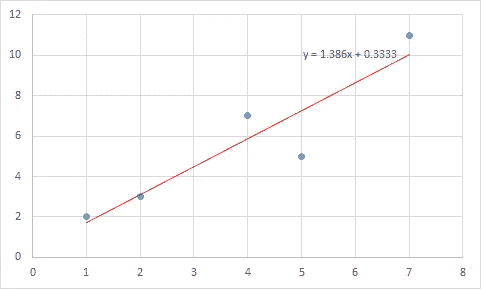

回归线

回归线方程:

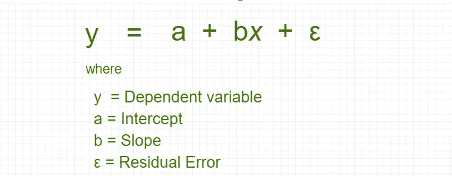

回归线方程

## 截距 a 的等式:

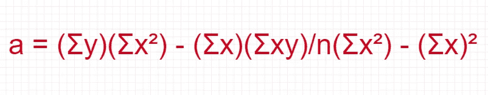

截距 a 的方程式

## 斜率 b 的等式:


## 回归线的性质

回归线具有以下属性:

1.  回归总是通过点 x 和 y 的平均值运行和上升。
2.  这条线使观察值和预测值之间的平方差最小。
3.  在回归线中，x 是输入值，y 是输出值。

## 回归线中的剩余误差

残差是因变量的观测值和预测值之间的差值。

残差=观察值-预测值


残留误差

# 求导求回归线方程

让我们考虑以下变量 x 和 y 及其值:


变量 X 和 Y 及其值

因此，为了计算 a 和 b 的值，让我们找到 *XY，X 和 Y 的值*

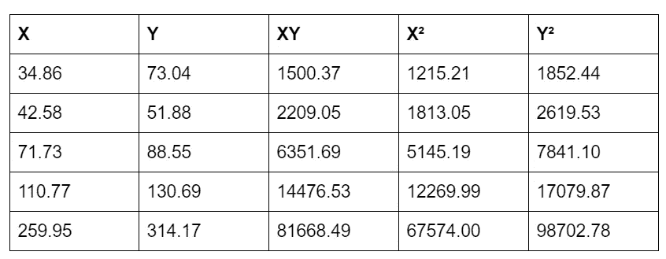

准备好寻找截距和斜率的值

这里，

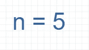

项目数量

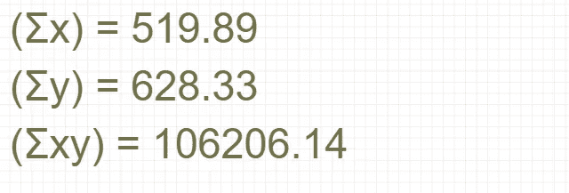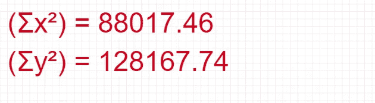

现在，找出截距 *a* 的值:

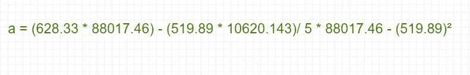

截距值


求斜率 *b* 的值:

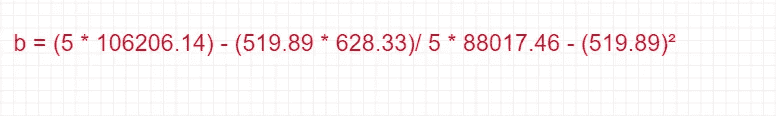

斜率值


因此，**回归线**方程:


回归线方程

# 线性回归

让我们举一个例子，试着预测一个朋友的汽车的马力，因此它的等式将是:

*马力= 0.0018 *年薪—0.99 *小时收听 _ 广播*

这个方程被称为*回归方程。*0.0018 和 0.99 的值称为回归权重。并且，寻找这些回归权重的过程叫做回归。

一旦找到回归权重，就很容易预测给定输入集的新值。

对于回归，线性回归的预测公式如下:

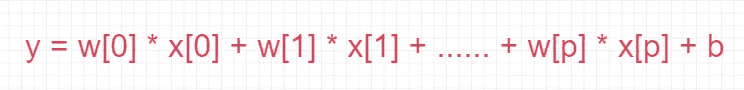

线性回归方程

```
import mglearnmglearn.plots.plot_linear_regression_wave()
```

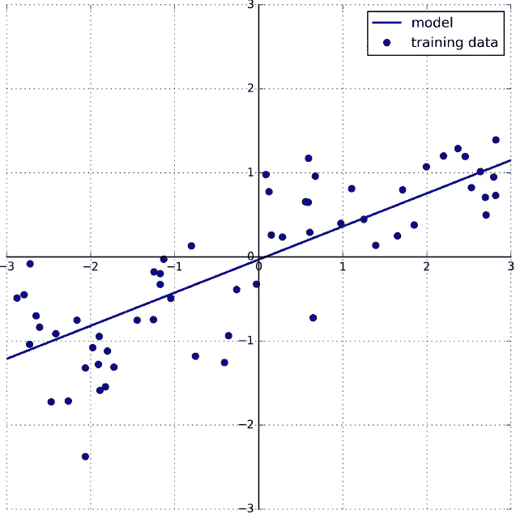

波浪数据集上的线性回归

回归有许多不同的线性模型。这些模型之间的区别在于如何从训练数据中学习模型参数 w 和 b，以及如何控制模型复杂性。

**线性回归的优点:**

1.  它易于解释并且计算量小

**线性回归的缺点:**

1.  它对非线性数据的建模很差

# 结论

找到通过这些点的最佳拟合直线是线性回归的重要部分，这条线被称为**回归线**。线性回归包括寻找通过点的最佳拟合直线。最小二乘法用于在回归中寻找最佳拟合直线。

## 参考

线性回归简介:[http://onlinestatbook.com/2/regression/introC.html](http://onlinestatbook.com/2/regression/introC.html)