# 仅用 5 分钟解释 5 个回归指标

> 原文：<https://pub.towardsai.net/regression-metrics-6690815bb51f?source=collection_archive---------0----------------------->

> **有哪些不同的回归指标？R2 分数会变成 0 吗？R2 分数什么时候会变成负数？MAE 和 MSE 有什么区别？调整后的 R2 分数是多少？**

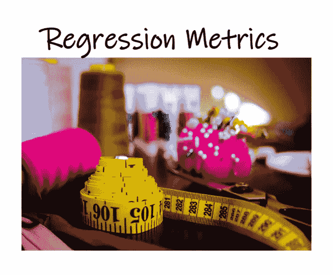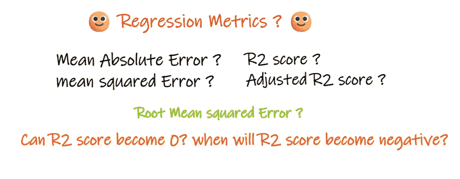

作者图片

如果你想知道以上问题的答案，那么你来对地方了。

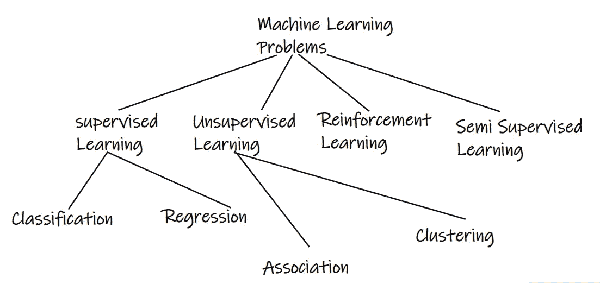

作者图片

**回归**问题是一种有监督的机器学习方法，其中输出变量是真实或连续的值，如“工资”或“体重”。另一方面，**分类**问题是一种输出是分类的问题，比如预测输出是“狗”还是“猫”。

在本文中，我们将讨论回归度量。每个指标都有自己的优点和缺点…..关于分类标准，你可以阅读[分类标准](https://medium.com/mlearning-ai/confusion-matrix-179b9c758b55)博客。

考虑一个回归问题，输入是**年经验**，输出是**工资**。下图显示了为预测工资而绘制的线性回归线。

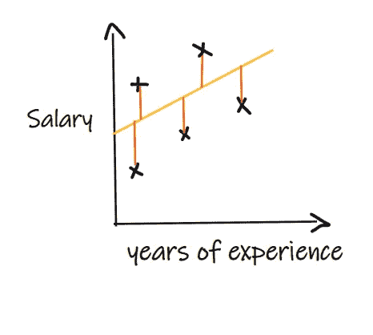

作者图片

工资的实际值和预测值表明该模型正在犯一些错误，因此在适当的度量的帮助下，我们需要确定我们的模型有多好。让我们讨论各种常用的回归度量。

 [## 一个完整的基于端到端机器学习的推荐项目

### 基于协同过滤和流行度过滤的机器学习推荐方案

pub.towardsai.net](/step-by-step-approach-to-building-a-recommendation-system-a65be5a54045) 

# 平均绝对误差(MAE):

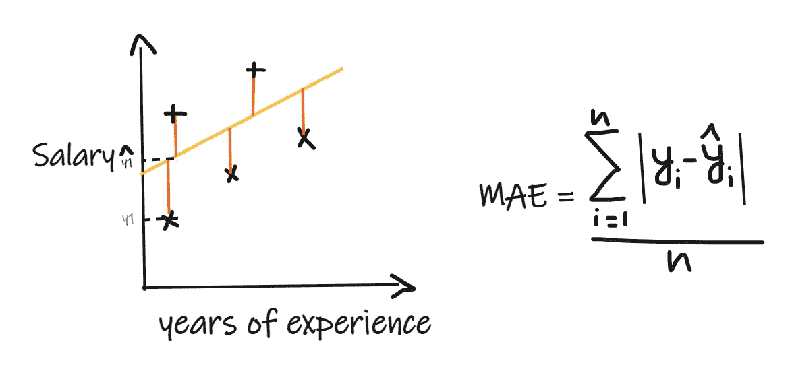

作者图片

平均绝对误差(MAE)是最简单的回归指标。这里，我们将实际值和预测值之间的差值相加，然后除以观察值的数量。对于被认为是好模型的回归模型，MAE 应该尽可能小。

**MAE 的优势:**

*   简单易懂。结果将与输出具有相同的单位。例如:如果输出列的单位是 LPA，那么如果平均误差是 1.2，那么我们可以解释为结果是+1.2 磅/平方英寸或-1.2 磅/平方英寸
*   MAE 对于异常值是相对健壮的(当与一些其他回归度量相比时，MAE 受异常值的影响较小)。

**MAE 的缺点:**

*   MAE 使用模函数，但模函数在所有点上不可微，所以在很多情况下不能作为损失函数。

# 均方差(MSE):

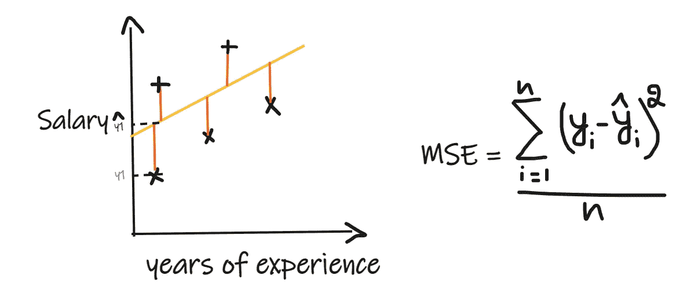

作者图片

在均方误差(MSE)中，我们取每个实际值和预测值之间的差，然后求差的平方并将它们相加，最后除以观察值的数量。对于被认为是好模型的回归模型，MSE 应该尽可能小。

**MSE 的优势:**

*   平方函数在所有点上都是可微的，因此它可以用作损失函数。

**MSE 的劣势:**

*   由于 MSE 使用平方函数，结果的单位将是输出的平方。所以，很难解释这个结果。MSE 将拥有单位 LPA 广场。
*   由于它使用平方函数，如果数据中有异常值，差异将被平方，因此，MSE 对异常值并不稳健。

 [## 用 Python 编写复杂模式的简单方法，仅需 4 分钟。

### 用 python 编写复杂模式程序的简单方法

medium.com](https://medium.com/@gowthamsr37/pattern-programming-in-python-23d5af04211e) 

# 均方根误差(RMSE):

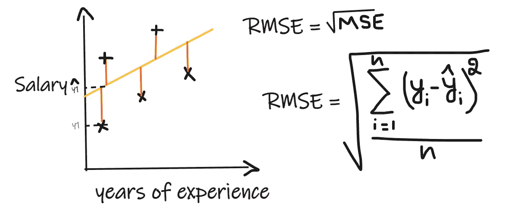

作者图片

在均方根误差(RMSE)中，我们取每个实际值和预测值之间的差值，然后将差值平方并相加，最后除以观测值的数量。然后取结果的平方根。所以，RMSE 只不过是 MSE 的平方根。对于被认为是好模型的回归模型，RMSE 应该尽可能小。

**RMSE 的优缺点:**

*   它解决了 MSE 的问题，单位将与输出的单位相同，因为它取平方根，但它仍然对异常值不那么稳健。

上述指标取决于我们正在解决的问题的背景，这意味着如果 MAE 在工资和厘米方面为 1.2，就会有很大的差异。我们不能在不了解实际问题的情况下，仅仅通过观察平均寿命、均方误差和 RMSE 值来判断模型的好坏。

# **R2 评分:**

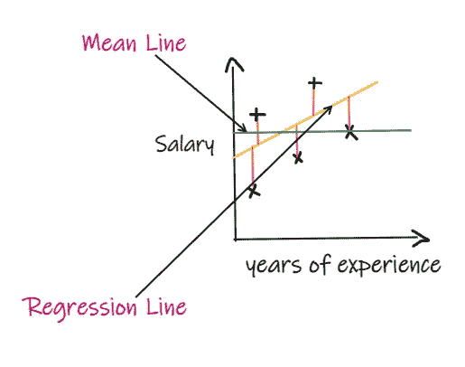

作者图片

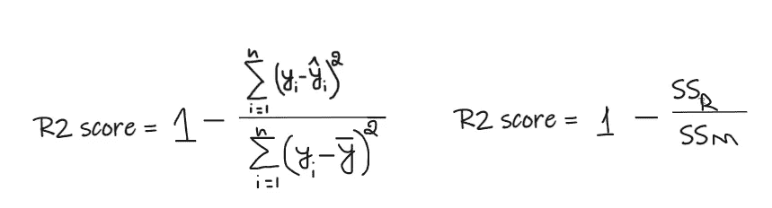

作者图片

考虑到我们没有任何输入数据，如果有人想知道他在这家公司能拿到多少工资，那么我们能做的最好的事情就是给他们所有员工工资的平均值。

R2 分数给出了一个在 0 到 1 之间的值，它可以被解释为任何上下文。它可以被称为拟合优度。

**SSR** 是回归线的误差平方和， **SSM** 是平均线的误差平方和。这里我们比较的是回归线和均值线。

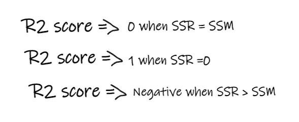

作者图片

**关于 R2 分数的一些要点:**

*   如果 **R2 得分为 0** ，这意味着我们的模型和均值线一样好，所以需要改进我们的模型。
*   如果 **R2 分数是 1** ，那么等式的右边部分变成 0，这只有当我们的模型适合每个数据点并且不产生任何误差时才会发生，而这在实践中是很难实现的。
*   如果 **R2 得分为负**，这意味着等式的右边大于 1，这在 SSR > SSM 时可能发生。意味着我们的模型比平均线更差。

**R2 也可以解释为下面给出的**。

如果我们的模型的 R2 分数是 0.8，这意味着我们可以说我们的模型能够解释 80%的输出方差。也就是说，工资变化的 80%可以用投入(多年的经验)来解释，但剩下的 20%是未知的。

如果我们的模型有两年的经验和测试分数，那么我们的模型能够用这两个输入特征解释 80%的工资变化。

**R2 评分的劣势:**

*   随着输入特征数量的增加，R2 得分往往会相应增加，或者保持不变，但永远不会减少，即使输入特征对我们的模型并不重要(例如，在我们的示例中添加温度特征，即使温度对我们的输出没有增加任何重要性)。

# 调整后的 R2 分数:

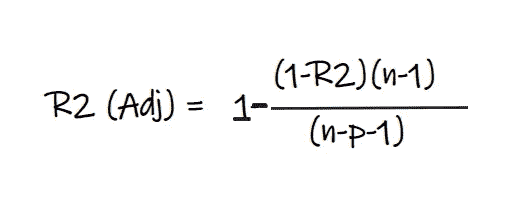

作者图片

在上面的公式中， **R2** 是 R2 得分， **n** 是观测值(行)的数量， **p** 是独立特征的数量。调整后的 R2 分数解决了 R2 分数的问题。

**考虑以下两种情况:**

1.  当我们在模型中加入一些不太重要的特征时，比如加入温度来预测工资…..

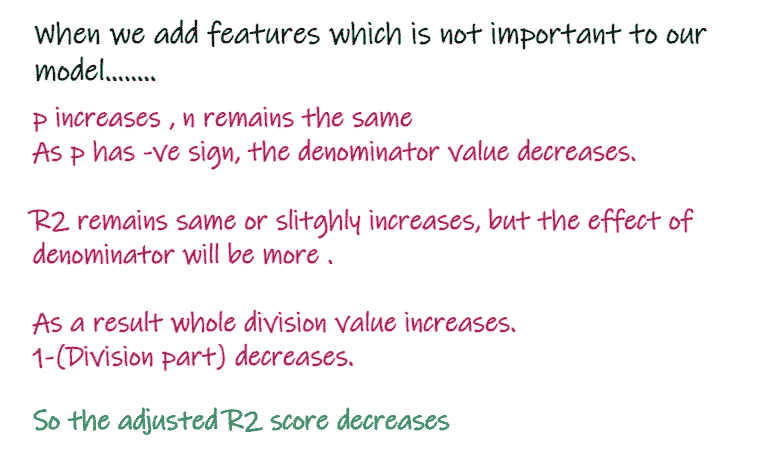

2.当我们添加对我们的模型重要的特征时，比如添加测试分数来预测工资…

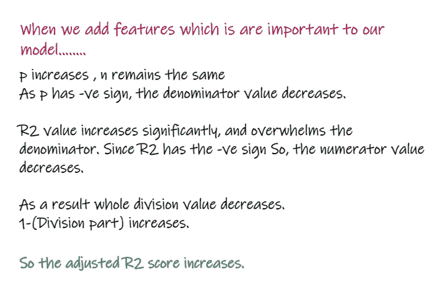

因此，您已经了解了回归问题中使用的各种度量标准及其优缺点。感谢您的阅读……

 [## 任何可能出错的事情都会出错。

### 我们在日常生活中遇到的一些墨菲定律列表

medium.com](https://medium.com/@gowthamsr37/anything-that-can-go-wrong-will-go-wrong-2eb8b119c50f) 

你可以在下面的博客中阅读分类标准。

 [## 混淆矩阵

### 什么是混淆矩阵精确度、回忆、准确度、F1 分数、FPR、FNR、TPR、TNR？

medium.com](https://medium.com/mlearning-ai/confusion-matrix-179b9c758b55) 

如果你对标准化和规范化感到困惑，那么你可以阅读下面的博客。

 [## 其特点是使用缩放技术——标准化与规范化。

### 特征缩放是强制性的吗？什么时候使用标准化？何时使用规范化？会发生什么……

medium.com](https://medium.com/@gowthamsr37/which-feature-scaling-technique-to-use-standardization-vs-normalization-9dcf8eafdf8c) 

你可以在 [LinkedIn](https://www.linkedin.com/in/gowtham-s-r-78120a127/) 上和我联系。