# Python 中的正则表达式:基础知识

> 原文：<https://pub.towardsai.net/regular-expression-regex-in-python-the-basics-b8f2cd041bdb?source=collection_archive---------0----------------------->

## Python 系列中的正则表达式

## 掌握 Python 中正则表达式的基础知识

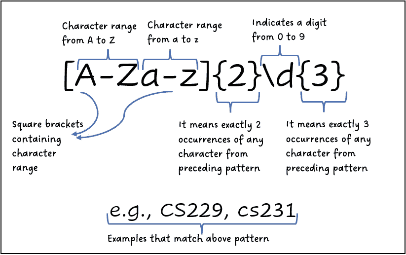

作者图片

假设您有大量文本数据，并且希望提取有意义的信息。例如，您可能想要提取标签、@提及、URL 等。从任何推文中。做这件事最好的方法是什么？你做对了——是使用正则表达式或 regex。正则表达式是一个字符序列，它形成一个匹配文本的模式。我们可以为标签定义一个模式，它可以用来匹配给定 tweets 中的任何标签。

**尽管不同编程语言的 regex 实现大多相似**，**但可能会有微小的差异**。在这个故事中，您将学习在 Python 中使用 regex。这个故事涵盖了正则表达式的基础知识。如果您对分组、反向引用等高级正则表达式概念感兴趣。，敬请查看[这个故事](/regular-expressions-regex-in-python-advanced-concepts-69b25d0d023e)。

# Python 中的正则表达式

Python 有一个名为“re”的专用包，用于处理 regex。[点击此处](https://docs.python.org/3/library/re.html)阅读其文档。有`.search()`、`.split()`、`.findall()`、`.sub()`等不同的功能。我将展示`findall()`函数的用法，使用 regex 模式从文本中找到所有需要的信息。

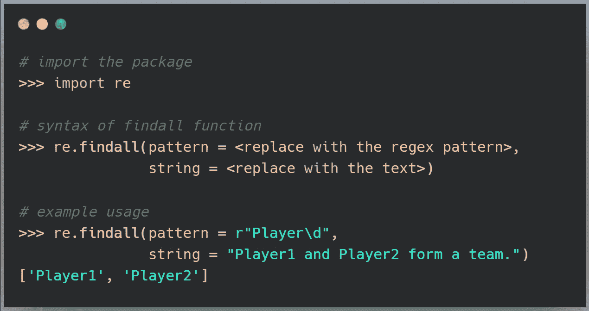

演示 re.findall()函数(图片由作者提供)

您可能想知道 regex 模式前面的小字符“r”是什么意思，以及我们如何生成不同的模式。让我们开始吧！

# Python 中的原始字符串

在深入研究正则表达式之前，理解什么是原始字符串是至关重要的。Python 有换行符(`\n`)、制表符(`\t`)等特殊字符。成串。如果我们需要`\n`成为字符串的一部分而不是被特殊对待呢？在这种情况下，我们应该使用原始字符串。下面的示例说明了普通字符串和原始字符串之间的区别。**建议对正则表达式模式使用原始字符串，以避免 Python 解释器意外处理字符串**。

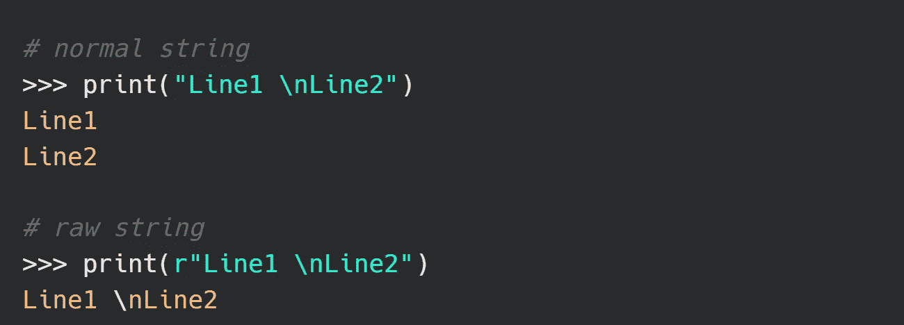

普通字符串与原始字符串(图片由作者提供)

# 典型正则表达式元字符摘要

元字符是在 regex 模式中具有特殊含义的字符。例如，元字符`\d`代表一个从 0 到 9 的数字。下表总结了 regex 中使用的基本元字符。

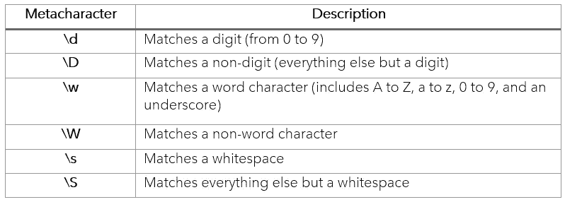

正则表达式模式中使用的重要元字符(图片由作者提供)

## 1.文字匹配

在没有元字符的情况下，您可以获得精确匹配。

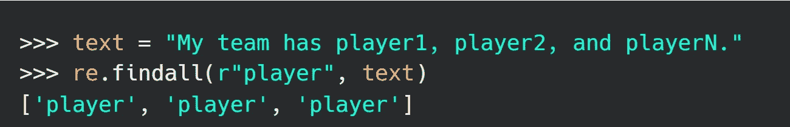

说明文字字符串匹配(图片由作者提供)

## 2.使用\d 匹配一个数字

`\d`代表从 0 到 9 的任意数字。

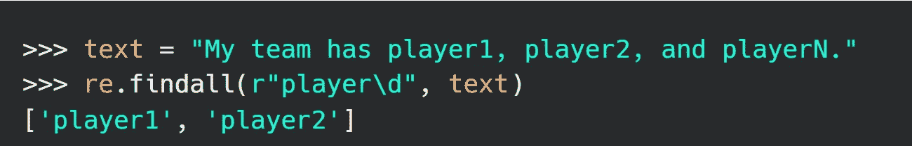

说明\d 的用法(图片由作者提供)

## 3.使用\D 匹配非数字

`\D`匹配任何单个非数字字符。

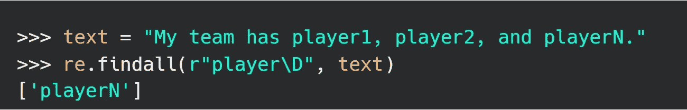

说明\D 的用法(图片由作者提供)

## 4.使用\w 匹配单词字符

`\w`匹配任何单个单词字符。它可以包含从 A 到 Z、A 到 Z、数字 0 到 9 以及下划线(`_`)中的任何内容。

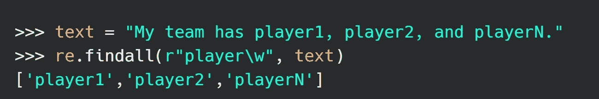

说明\w 的用法(图片由作者提供)

## 5.使用\W 匹配非单词字符

非单词字符包括除了上面提到的单词字符之外的任何字符。

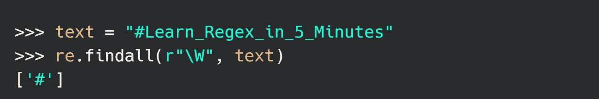

说明\W 的用法(图片由作者提供)

## 6.将空格与\s 匹配

`\s`允许匹配单个空白字符。

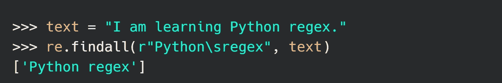

说明\s 的用法(作者图片)

## 7.将非空格与\S 匹配

`\S`可用于匹配单个非空白字符。

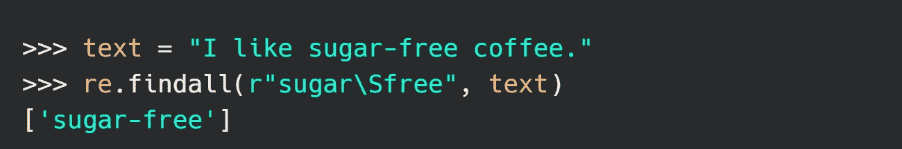

说明\S 的用法(作者图片)

# 正则表达式中的量词

我们先从文本中提取一个电话号码。

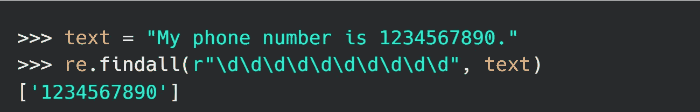

提取电话号码(图片作者)

由于`\d`匹配的是个位数，所以我们必须写十次才能提取出一个
十位数。但是等等——它看起来并不漂亮。解决方法是——在模式中使用量词。

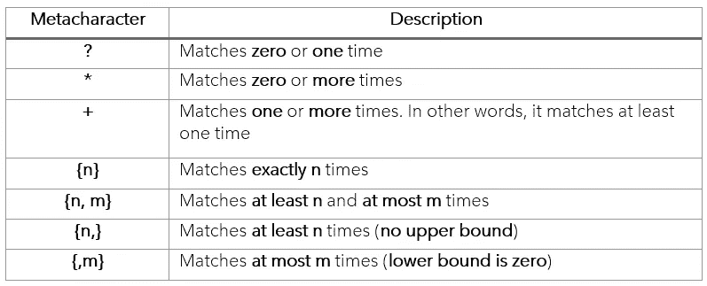

正则表达式量词总结(图片由作者提供)

## 1.使用+匹配一次或多次

`+`匹配其前一个字符的一个或多个**出现的**。因此`\d+`意味着匹配一个或多个数字的出现。

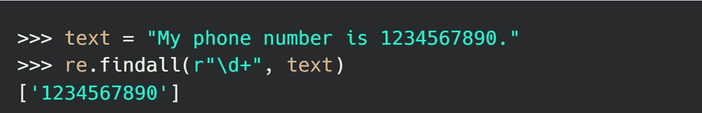

举例说明+(加)量词的用法(图片由作者提供)

类似地，您可以使用`*`匹配**零个**或**更多的**出现在其前面的字符。所以`\w*`意味着匹配一个单词字符的零次或多次出现。

## 2.使用{n}精确匹配 n 个匹配项

`{n}`精确匹配模式中它前面的 n 个字符。因此

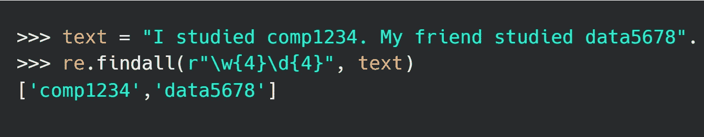

说明{n}量词的用法(图片由作者提供)

**其他变化:**

*   **{n，m} —** 匹配其前面的字符至少 n 次，最多 m 次，例如`\d{2, 4}`将匹配一个数字至少两次，最多 4 次。
*   **{n，} —** 匹配其前面的字符至少 n 次，并且没有上限，例如`\w{4,}`将匹配一个单词字符至少四次，并且没有上限。
*   **{，m} —** 从零到 m 次匹配其前面的字符，例如`\D{,4}`最多匹配任何非数字字符四次，也可以是零次。

## 3.匹配零或一次性使用？

`?`与其前面的字符零次或一次匹配。例如，`cats?`将匹配猫以及猫。

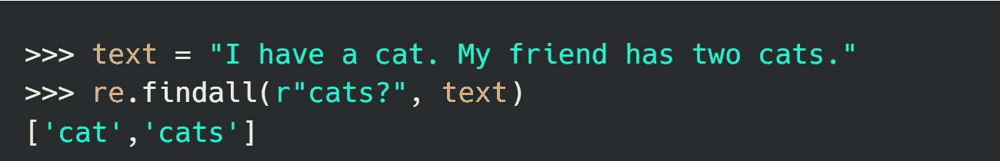

说明...的用法。(问号)量词(作者图片)

**注意——所有这些量词都应用于其前面的字符，而不是整个单词，例如在** `**mango+**` **模式中，** `**+**` **仅应用于最后一个字符** `**o**` **，而不是单词** `**mango**` **。**

但是如果要匹配`\`、`*`、`+`、`?`等特殊字符呢？由于这些是特殊字符，您不能直接匹配它们，如下所示:

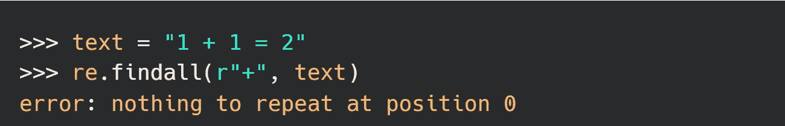

特殊字符不能直接匹配(图片由作者提供)

解决方案是在要匹配的特殊字符前使用转义字符`\`，例如，在正则表达式中使用`\+`来匹配`+`。同样，您可以在模式中使用`\\`来匹配文本中的`\`。

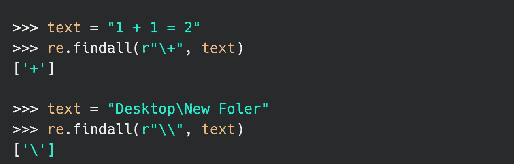

需要转义符(\)来匹配特殊字符，如+、\、*、？等。(图片由作者提供)

谢谢你读到这里。我现在有奖金给你。

# **奖金**

有一个非常酷的网站[https://regex101.com/](https://regex101.com/)，在那里你可以测试你的正则表达式模式。它还支持不同的编程语言。去看看这个页面，享受一下 regex 的乐趣。

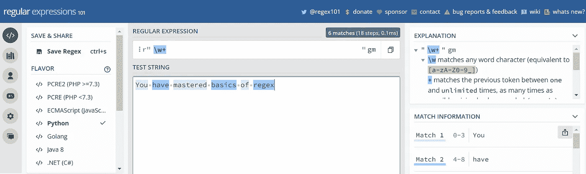

regex101.com

感谢你阅读我的第一个关于媒介的故事。我会感谢你的反馈，请在评论中发表你的问题。如果你想知道更多类似的故事，请在 [Medium](https://medium.com/@hrishikesh.pe) 上关注我，并随时[请我喝杯咖啡](https://www.buymeacoffee.com/hrishikeshds)😊。

# 下一步

如果您对 regex 的基础很有信心，那么是时候学习高级概念了。请查看我下面这篇关于高级正则表达式的文章。

 [## Python 中的正则表达式(RegEx ):高级概念

### 通过学习分组、反向引用、环视断言等等，扩展您的正则表达式技能。

pub.towardsai.net](/regular-expressions-regex-in-python-advanced-concepts-69b25d0d023e)