# Python 中的正则表达式(RegEx ):高级概念

> 原文：<https://pub.towardsai.net/regular-expressions-regex-in-python-advanced-concepts-69b25d0d023e?source=collection_archive---------0----------------------->

## Python 系列中的正则表达式

## 向您的正则表达式技能集添加高级技能

作者图片

# 动机

许多网站要求密码至少有八个字符和特殊要求。但是你有没有想过网站是如何根据这些要求来验证你的密码的？答案是正则表达式或者 RegEx 。对于任何程序员和数据科学家来说，学习正则表达式是处理文本(字符串)的一项重要技能。**你也可以用它来清洗自然语言处理中的文本数据！**

在这个故事中，我将在基本正则表达式的基础上介绍一些高级正则表达式技巧，我在下面的故事中介绍了这些技巧。我强烈建议在深入研究高级正则表达式之前先温习一下基础知识。

 [## Python 中的正则表达式:基础知识

### 正则表达式允许你从文本中提取重要信息。看看这个中等的故事，学习正则表达式的基础…

pub.towardsai.net](/regular-expression-regex-in-python-the-basics-b8f2cd041bdb) 

# 正则表达式元字符摘要

在上述介绍基本正则表达式的故事中，我介绍了单词、数字和空格字符的元字符。下表介绍了其他重要的元字符。

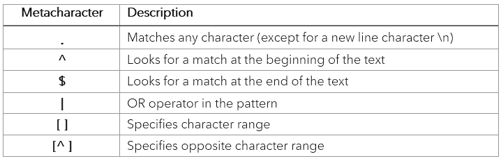

# 1.匹配任意字符。(句号)

regex 模式中的句点`.`可用于匹配除换行符`\n`之外的任何字符。如下图所示，`.`和量词`+`一起用于匹配`https://`之后的任何事物。

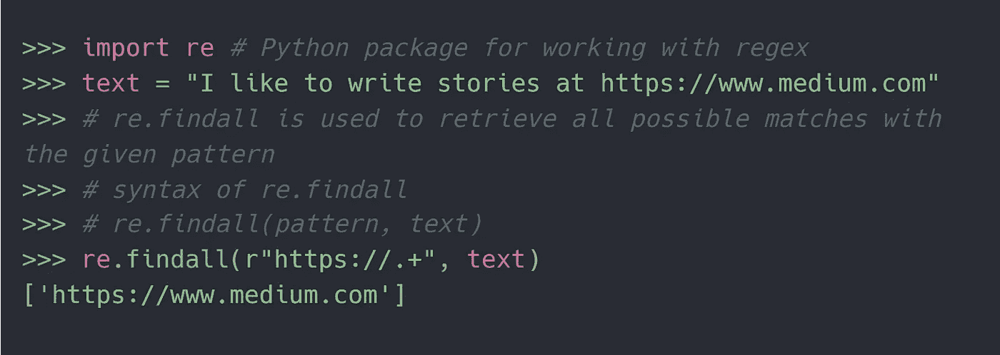

说明的用法。匹配任何字符(图片由作者提供)

# 2.使用^(脱字符号)和$(美元)指定搜索位置

在下图中，我们提取了蜘蛛侠电影的续集。但是，它给出了整个文本的结果。如果我们希望模式只在文本的开头或结尾匹配呢？

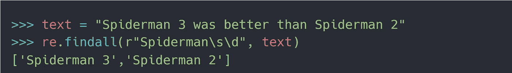

说明文本中的位置独立搜索(图片由作者提供)

在模式前指定`^`将在文本的开头查找潜在的匹配，如下图所示。

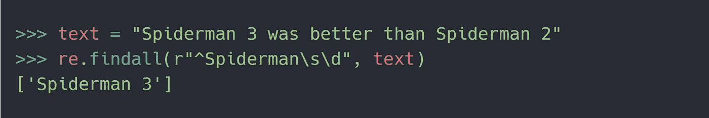

使用^在正文的开头举例说明搜索(图片由作者提供)

类似地，在模式末尾指定`$`将在文本末尾查找潜在的匹配，如下所示。

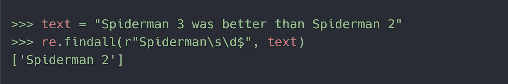

使用$(图片由作者提供)在文本末尾说明搜索

# 3.OR 运算符|(管道)

让我们考虑我们有两种模式——A 和 B；我们想匹配其中一种模式。这可以通过使用`A|B`来完成。换句话说，`A|B`表示匹配 A 或 b 中的任何内容。这也可以扩展到两个以上的模式，例如`A|B|C|D|E`

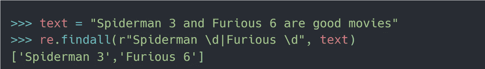

说明|作为 OR 运算符的用法(图片由作者提供)

# 4.使用指定字符范围

提取一个单词字符，我们可以用`\w`。但是如果我们只想匹配大写字母呢？我们可以在`[]`中指定这样的字符范围。例如，`[A-Z]`表示匹配任何单个大写字母。通过使用类似`[A-Z]+`的加号进行量化，可以匹配多个大写字母。

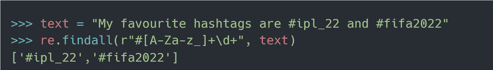

说明使用`[ ]`来指定字符范围(图片由作者提供)

**字符范围的几个例子
1。【A-Z】:**匹配任意单个大写字母
**2。****【A-Za-z】:**匹配任意单个大写或小写字母
**3 .[0–9]:**匹配 0 到 9
4 之间的任意一个数字。[!@#]: 匹配任意单个字符！、@或#

点击阅读更多关于角色范围[的内容。](https://docstore.mik.ua/orelly/unix3/upt/ch32_08.htm)

***注:*** *中的* `*[]*` *，元字符如* `*.*+?*` *等。没有特别的含义。他们将被严格对待。虽然特殊字符* `*^*` *在* `*[]*` *里面有不同的意思。*

# 5.在[ ]中使用^(插入符号)指定相反的字符范围

我们看到使用`[A-Z]`，任何大写字符都可以匹配。但是如果我们想要匹配除了大写字母以外的任何东西呢？这里，我们可以在字符范围内使用`^`来指定范围的反义词，例如`[^A-Z]`将匹配除大写字母之外的任何内容。

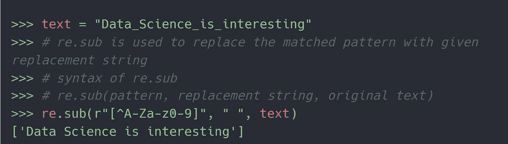

说明在[ ]中使用^来指定相反的字符范围(图片由作者提供)

# **动机**为分组

让我们使用正则表达式模式从给定的文本中提取一个网站。如下图所示，这很简单。

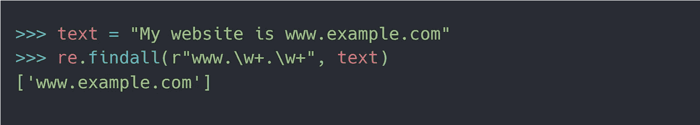

说明不使用分组的搜索(作者图片)

但有时，我们可能希望从匹配的模式中提取出单独的部分，例如，单独的网站组件，如网站名称、网站域名等。为了实现这一点，我们可以在 regex 模式中指定组。

# 1.使用()(括号)分组

可以使用`()`指定组。在下面的例子中，我们使用分组提取网站的片段。听起来很有用，不是吗？

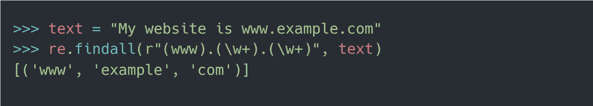

说明如何使用( )来指定组(图片由作者提供)

# 2.使用(？:)

但是，有时我们希望匹配特定的组，但不想将它们包含在结果中。在下面的例子中，我们想要匹配一个组`(www)`，但是不希望它出现在输出中。通过在分组模式前添加`?:`，例如`(?:www)`，我们可以使其成为非捕获组。

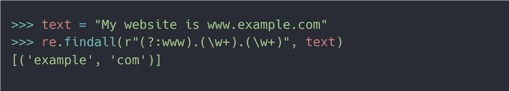

说明...的用法。:指定非捕获组(按作者分类的图像)

# 3.反向引用组

您使用正则表达式匹配了一个组。现在，您希望以相同的模式再次重用匹配的部分。我们如何做到这一点？反向引用允许重用来自**捕获**组的匹配部分。如下图所示，`\1`可以指一组比赛，`\2`可以指二组比赛。

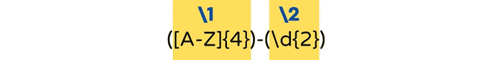

\1 和\2 分别指代组 1 和组 2(图片由作者提供)

让我们看看反向引用的实际应用。在下面的例子中，我们将通过使用`\2`重用第二组的结果。

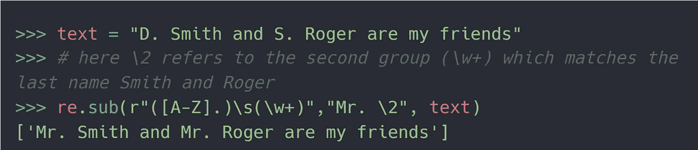

说明了反向引用的应用，用 Mr .替换名字，并通过\2 重用第二个组中的第二个名字。(图片由作者提供)

# 4.环视断言

regex 激动人心的部分开始了！让我们考虑你只想要匹配一个模式，如果它是成功的或者是在一个特定的模式之前。换句话说，我们希望只有当一个模式的左半部分或右半部分与一个特定的子模式匹配时，才匹配这个模式。理论太多！该举例了。

## 4.1 使用(？=)

假设您有五个测试，其结果如图所示。您只想检索那些通过的测试。换句话说，我们需要在`Test\d`之前检查文本`Passed`是否成功，然后只匹配文本`Test\d`。

这被称为积极的前瞻，因为我们想得到匹配，只有当它是由一个给定的子模式。通过在子模式前添加`?=`，可以将其转换为正向前瞻断言。

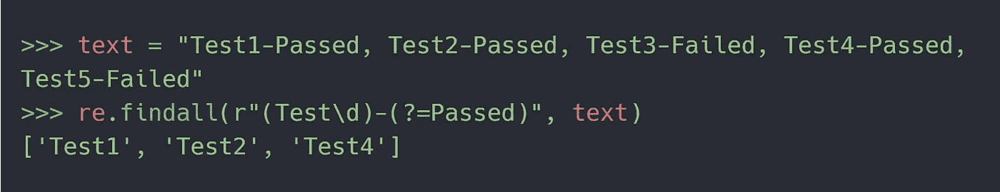

说明...的用法。=指定正向前瞻(作者图像)

**积极前瞻可用于检查任何预期密码是否满足最少字符、特殊字符等条件。**

## 4.2 使用(？！)

现在我们想要检索那些后面没有文本`Passed`的测试。这是一个消极前瞻的例子，因为我们不希望一个特定的子模式(这里是`Passed`)后面跟随着某个东西(这里是`Test\d`)。

负前视的构造包括子模式前的`?!`。

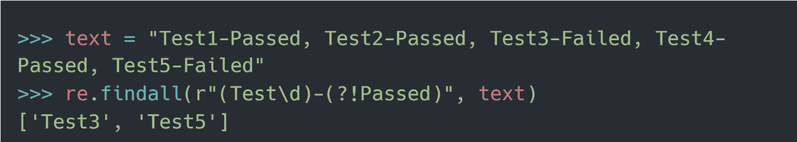

说明...的用法。！要指定负前瞻(按作者排列的图像)

## 4.3 使用(？<=)

This is the flip side of positive lookahead. Here we want to match something only if it is preceded by a specific sub-pattern. In the following example, we only want to retrieve a number if it starts with the pound ( 【 ).

The positive lookahead construct includes 【 before the sub-pattern.

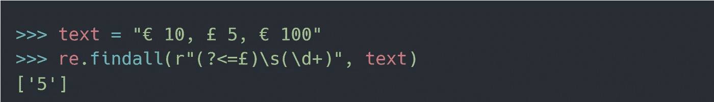

Illustrating usage of ?<= to specify positive lookbehind (image by author)

## 4.4 Negative lookbehind using (?

This is the complete opposite of negative lookahead. Here we want to match something only if it is NOT preceded by a specific sub-pattern. In the following example, we want to retrieve a number only if it DOES NOT start with the pound ( 【 ).

The negative lookahead construct includes 【 before the sub-pattern.

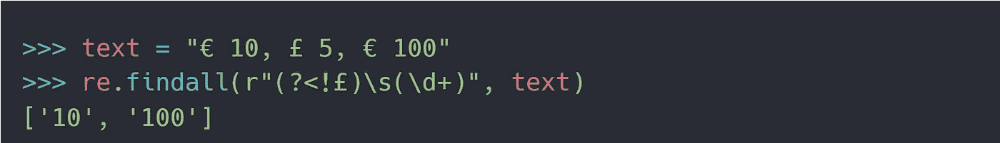

Illustrating usage of ?

# Closing remarks

Thanks for reading the story! I hope it has strengthened your regex muscles. Let me close with an exercise question.

**问题:**如何使用正则表达式验证满足以下条件的密码？ **条件 1 —** 它必须至少有 8 个字符 **条件 2—** 它必须至少有一个大写字母和一个小写字母 **条件 3—** 它必须至少有一个数字
符合上述条件的密码示例是 q1w2eR3T。

欢迎在评论中分享你的答案。如果你想知道更多这样的故事，请关注我。