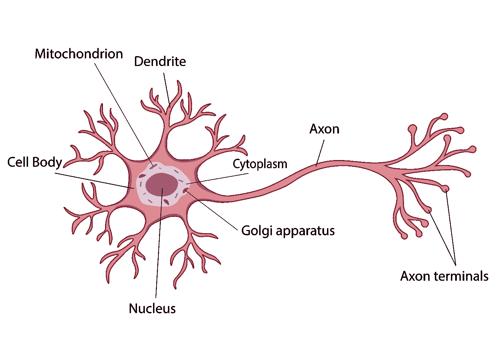
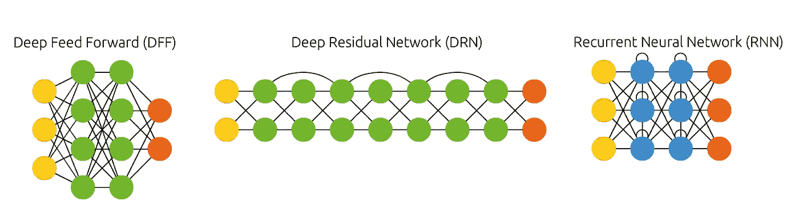
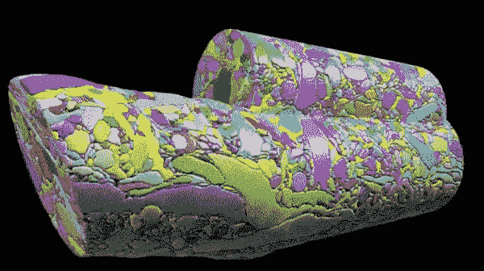
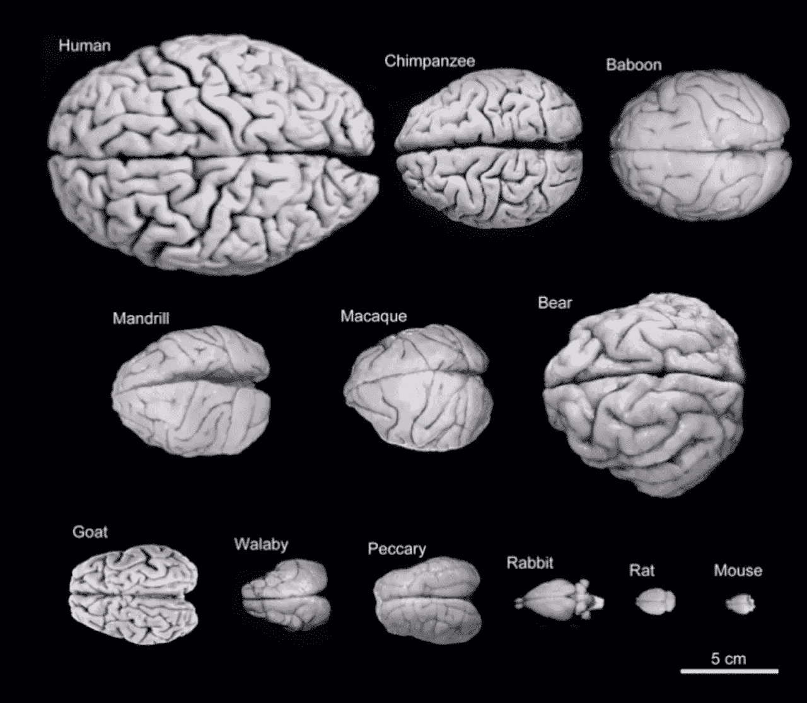
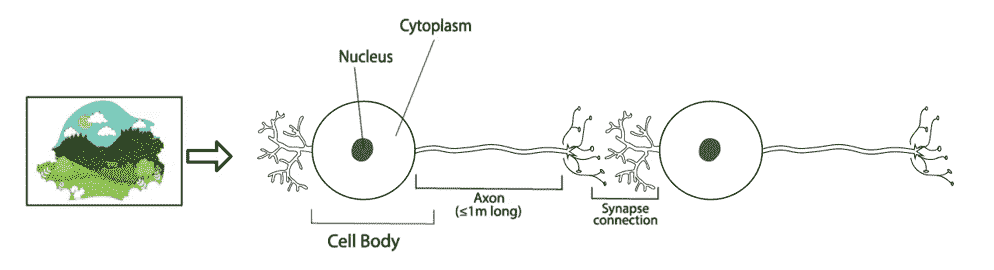
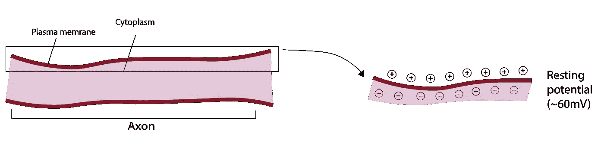
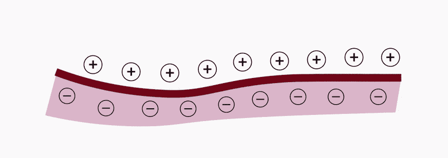
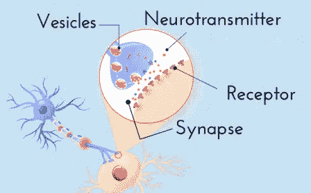

# 强化学习、大脑和心理学:神经科学基础 1

> 原文：<https://pub.towardsai.net/reinforcement-learning-brain-and-psychology-neuroscience-basics-1-80c8386ddd2e?source=collection_archive---------1----------------------->

## [机器学习](https://towardsai.net/p/category/machine-learning)，[神经科学](https://towardsai.net/p/category/neuroscience)

## 神经科学导论，神经元如何工作，我们的大脑如何处理信号以及我们比人工智能更好

来源:作者图片

现在每个人都可以建立一个神经网络。这几乎和写购物清单一样简单，尤其是有了好的教程和例子。你可能知道这种感觉，当你有了想法，所以你不会读到最后。这很像我们建立人工神经网络，却不知道我们自己的神经系统到底是如何工作的。

有些人可能会说，我们知道大脑是如何工作的，我们知道大脑的每个部分负责什么功能。是的，但实际上不是。

让我们从基础开始。

# 神经系统科学

> “对人类来说，没有比研究自己的大脑更重要的科学研究了。我们对宇宙的整个看法取决于此。”—弗朗西斯·克里克，神经科学家。

**神经科学**(或**神经生物学**)是生物学的一个分支，是对神经系统的一项研究，通过多年的发展，它结合了应用解剖学、化学、心理学、数学建模等，试图了解神经元和神经回路的过程、功能和结构。

神经系统本质上是关于与动物身体之间的交流。作为地球上最发达的物种，我们体内有极其复杂的结构。

# 神经元

关键要素是一个**神经元**。就机器学习而言，它是对输入信号求和的逻辑决定性元素或节点，如果结果高于阈值，则输出信号被激发。

看看这个单个神经元的解剖学图示。

神经元，作者图片

与任何细胞一样，*神经元*有一个**细胞核，**储存大部分遗传物质，一个**线粒体**，它基本上是一个细胞的能量站，**高尔基体，**起着将肽和蛋白质(包括神经递质)包装成囊泡的作用，我们稍后会谈到，不要担心，这一切都漂浮在**细胞质**中。

与其他细胞不同，*神经元*有两种副产品。**树突**接收输入信号，就像天线一样，它们从 100-200 微米到 1-2 毫米都很短，但数量很多。轴突是我们体内的线路，它将信号从一个细胞传递到另一个细胞，它可以长达一米。

有趣的是，即使细胞“听”的比“说”的多，但由这些细胞组成的人却不是这样。

当然，每个神经元都从许多其他神经元接收信号，并且与人工神经网络不同，我们没有那些相当严格的神经元层。在深度学习中，有三种主要类型的神经元连接，因此有三种类型的神经网络架构。

**前馈** **神经网络**就是信号从输入层开始流经每一层，直到输出层，就是这样。
**残差** **神经网络**就像*前馈*网络一样工作，但它也有所谓的**残差连接**，这就像一个捷径，它跳过一个或多个层，从而允许梯度“更好地流动”，因此有可能创建非常深的架构。
**递归神经网络**有一个**递归连接**，你可能很容易猜到。与*前馈*连接不同，*递归连接*是循环的，这在神经元中创建了一种记忆。

建筑，作者图片

大海里有很多鱼，我不是说这三种是特殊的，但它们是非常基本的，它们涵盖了大量最先进的人工神经网络架构。最重要的是，他们可以向你展示我们自己的建筑是多么的不同。

嗯，在人脑中很难找到这样的东西，但它有相似的结构。所以不用多说，一小片老鼠的大脑。

作者 GIF

它大约有 0.02 毫米长，但却有如此多的神经元和连接。想象一下我们的大脑实际上有多复杂。正如我所说的，我们没有真正的层次，所有的连接看起来有点随机，这是不正确的，我们很快就会谈到这一点。

但首先，看对比。

作者图片

# 轴突

**轴突**是连接两个神经元的长电线，允许信号的快速传输。你看，细胞之间的连接非常缓慢，这就是为什么轴突可以长达 1 米，以便信号可以更快地通过我们的神经系统。

系统中有两种类型的信号。**细胞内**信号是流经细胞(或*轴突*的信号，与从一个细胞跳到另一个细胞的**细胞间**信号相比，它相对较快。

信号流，作者图片

但是这个信号是什么呢？信号就是**离子**在细胞中移动，它们的移动产生了一种叫做**动作电位**的东西。

# 动作电位

我们身体中的所有细胞都有一个**膜电位，**基本上是细胞内外电荷的差异。细胞外的电荷因为钠离子浓度高而带正电，细胞内的电荷因为钠离子浓度低和钾离子浓度高而带负电。

每个神经元都有-70mV 到-60mV 之间的电势，这是细胞内外的相对电势差，这就是为什么它是负的。

现在，当我们知道了电荷，我们可以继续学习信号是什么。**动作电位**是一种以膜电位短期变化的形式沿活细胞细胞膜移动的兴奋波。

一张图胜过千言万语。

轴突的静息电位，图片由作者提供

这就是**静息电位**的样子，它是没有信号传递的状态。而现在，当你知道了之后，我们来看看*动作电位*在起作用。

动作电位，作者图像

当电荷像这样交换位置时，这被称为**去极化**，它是由流经你的神经系统的信号引起的。*去极化*发生在膜的很小一部分，大约 1 微米，当它发生时，*膜电位*发生变化。它必须通过**阈值电位** (~-55mV)才能产生*动作电位*。关于 *AP* 的事情是，它要么完成，要么根本没有，它需要大约 1-2 毫秒来设置。

你可能刚刚想起 1958 年弗兰克·罗森布拉特**发明的**感知机**发明的在架构上也有门槛。首先，输入信号必须通过感觉元件(基本上是一个输入层)的阈值才能进一步传输。其次，如果关联元素上所有输入信号的代数和达到另一个阈值，则这些元素的输出值将为 1，否则为 0。**

最后但并非最不重要的是，*动作电位*是单向的，因为当电荷在*去极化*后切换回*静止电位*时，那部分膜在大约 1 秒内变得对*去极化*不敏感，这就像是冷却。

# **突触**

之前我们看到了**突触连接**，我们称之为一个神经元向另一个神经元传递信号的地方。而**突触**只是其中一个发生的地方。

每个神经元可以与多达 10⁵神经元形成突触(连接),成人大脑至少包含 10 个⁰神经元。因此，当人工智能研究人员、神经科学家和科学家，总的来说，告诉你我们是最复杂的计算机时，你可以把它带到银行去。然而，与计算机不同，细胞之间的大多数连接是化学的而不是 T2 的电的。

**电突触**在我们的身体中很少使用，它们速度很快，因为它们通过**间隙连接**(基本上两个细胞之间没有空间，并且*离子*直接从一个细胞到另一个细胞，这就像以太网连接)并且不受调节(总是打开)，而我们的神经系统受到精致的调节和微调，可以对来自我们身体内外的最小刺激做出反应。

另一方面，**化学突触**很慢，因为与*电突触*不同，它们通过一个叫做**突触间隙**的小空间来传输*离子*(继续类推，就像 WIFI 连接)，并且高度可调。高等动物的大多数突触是化学的。

突触间隙，作者图片

然而，我们的内部通讯系统同时使用了*电子*和*化学*信号。当这些小囊泡中的神经递质到达轴突的末端时，它们被释放到突触间隙中，然后被另一端的受体捕获。当神经递质与树突或细胞体上的受体结合时，它们会改变细胞中的离子运动，最终导致*动作电位*。所以从某种意义上来说，我们有一个将*电信号*转换为*化学信号*转换为*电信号*的转换装置。

除此之外，突触就像罗森布拉特的感知器一样，有一个**求和概念**，它是受体神经元上所有突触输入的相加。其中突触输入是由离子运动控制的膜电位的变化。
**空间求和**，*求和概念*的第一种，与接收信号的位置有关。实际上它几乎可以在任何地方被接收，树突尖端，树突体，靠近细胞体，在细胞体中。因此，所有这些信号必须相加。回想一下我们的神经元之间有多少连接，并意识到我们的神经网络有多复杂。
**时间求和**是一段时间内的求和，大约一毫秒。
因此，相加是关于膜电位改变了多少，以及总的来说，你是否使受体神经元的膜电位达到了*动作电位*阈值。如果它达到了阈值，那么并且只有在那时神经元才会激活。因此，总和是在树突和细胞体上计算的，但总和的答案是在**轴突丘**处读取的，这是轴突离开细胞体的地方。

关于*突触*我们要了解的最后一件事是，有**兴奋性**和**抑制性** *突触*。简单来说，*兴奋性突触*试图最大化信号，并使*静止电位*更接近*动作电位*阈值，而*抑制性突触*试图平息一切，相反使*静止电位*更远离阈值。一个神经元可以有两种类型的*突触*，根据哪种占优势，接受者将被告知激活或不激活。

# 结论

我们还有很多要谈的，而且我们只是触及了表面。神经科学是一个巨大的领域，所以我们很难在这里讨论基础知识。希望现在你开始了解你的大脑有多复杂，以及机器学习算法在哪些方面与它相似。

在下一篇文章中，我们将讨论神经递质、轴突的寻路特征、记忆等等，敬请关注。

*在* [*上与我连线*](https://twitter.com/poddiachyi)*[*LinkedIn*](https://www.linkedin.com/in/poddiachyi/)*[*脸书*](https://www.facebook.com/poddiachyi) *，并关注*[*GitHub*](https://github.com/Poddiachyi)*！***