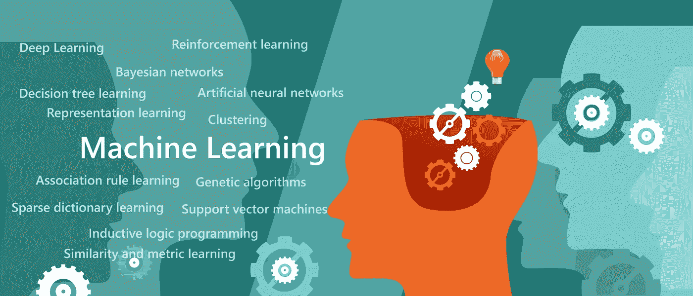

# 医疗保健中的强化学习:为什么它很重要以及它如何能有所帮助

> 原文：<https://pub.towardsai.net/reinforcement-learning-in-health-care-why-its-important-and-how-it-can-help-8f45dd896a00?source=collection_archive---------1----------------------->

## [人工智能](https://towardsai.net/p/category/artificial-intelligence)、[观点](https://towardsai.net/p/category/opinion)、[技术](https://towardsai.net/p/category/technology)

在 2010 年的一次 TED 演讲中，游戏设计师兼作家 Jane McGonigal [认为视频游戏有助于让世界变得更好。虽然她可能没有具体提到健康和保健，但医疗保健强化学习(RL)的最新发展迅速将 McGonigal 的部分愿景变成了现实。](https://www.ted.com/talks/jane_mcgonigal_gaming_can_make_a_better_world?language=en)

在许多方面，RL 与其他类型的机器学习(ML)没有太大区别，包括深度学习或经典的 ML 技术。根据脸书副总裁兼首席人工智能科学家 Yann LeCun 的说法，RL 只是 ML 的一个更窄的子集，是人工智能(AI)的“蛋糕上的樱桃”。主要的[区别](https://deepsense.ai/what-is-reinforcement-learning-the-complete-guide/)在于，RL 代理通过与他们的环境互动来学习，并根据他们的行为获得奖励或惩罚，而不仅仅是检查数据。

这是一种游戏化的机器学习方法，一种控制 RL 的两个主要[角色](https://spinningup.openai.com/en/latest/spinningup/rl_intro.html)的方法:代理和它的环境。代理与这个环境交互，这个环境可以通过代理的动作或者自己改变。每个 RL 代理的目标都是改善其环境的状态，从而通过一系列的决策和行动使其回报最大化。这一切都是通过试错来完成的，没有程序员的提示或外部干预(除了最初设置算法的奖励政策)——类似于某人玩游戏。

RL 算法优化长期回报，随着时间的推移，当代理接收到关于其环境状态的反馈时，学习最佳响应序列。给定足够的计算资源，RL 代理可以利用数百甚至数千个并行的"[游戏](https://deepsense.ai/what-is-reinforcement-learning-the-complete-guide/)"来比人类可能的更快地收集经验。

## 为什么强化学习适用于医疗保健？

出于上述原因，RL[非常适合](https://arxiv.org/pdf/1908.08796.pdf)具有固有时间延迟的系统，包括自动驾驶汽车、机器人、视频游戏、金融和商业管理，以及——是的——医疗保健。“RL 同时处理采样、评估和延迟反馈的顺序决策问题，”研究人员于等人表示，这使其独特的渐进决策形式成为医疗保健应用的绝佳候选。RL 也[足够灵活](https://neptune.ai/blog/reinforcement-learning-applications)来考虑治疗的延迟效应，并且不需要太多的上下文数据来做出相对明智的决定。

“RL 能够仅利用以前的经验找到最佳策略，而不需要任何关于生物系统数学模型的先验知识，”研究人员说。“这使得 RL 比医疗保健领域中许多现有的基于控制的方法更具吸引力，因为由于治疗和人体之间的非线性、变化和延迟的相互作用，通常很难甚至不可能为复杂的人体系统和对管理的治疗的反应建立准确的模型。”

## 医疗保健中的强化学习:应用

虽然几个医疗保健领域已经开始在某种程度上试验 RL，但这种方法在为患有长期疾病或病症的患者实施动态治疗方案( [DTRs](https://www.ncbi.nlm.nih.gov/pmc/articles/PMC4231831/#:~:text=A%20dynamic%20treatment%20regime%20consists,evolving%20treatment%20and%20covariate%20history.&text=They%20provide%20one%20way%20to%20operationalize%20a%20clinical%20decision%20support%20system.) )方面取得了最显著的成功。它还在自动化医疗诊断、卫生资源调度和资源分配、药物发现和开发以及卫生管理方面实现了一定水平的功能。

**动态治疗方案**

RL 最常见的真实医疗保健应用是为患有长期疾病的患者创建和持续配置 DTR。DTRs [是管理医疗决策的规则序列](https://www.nature.com/articles/s41598-018-37142-0),包括治疗类型、药物剂量和预约时间，根据患者的病史和长期状况为其量身定制。临床观察和患者评估提供输入数据，算法输出治疗选项以提供患者最期望的环境状态。RL 用于在这些正在进行的治疗方案中[自动化](https://neptune.ai/blog/reinforcement-learning-applications)决策。它已经帮助设计了包括癌症和艾滋病毒在内的慢性病的 DTR，并且还可以[利用在重症监护室(ICU)收集的丰富数据来改善重症护理](https://arxiv.org/pdf/1908.08796.pdf)。

**自动化医疗诊断**

医疗诊断本质上是将患者信息(如病史和当前症状)映射到正确的疾病概况的一种练习。虽然这听起来可能相对简单，但从临床角度来看，这可能是一项非常复杂的任务，对忙碌的临床医生来说是一个巨大的负担(在时间和认知能力方面)。

我们已经在[之前的博客文章](https://gaugarinoliver.medium.com/how-ai-systems-can-improve-healthcare-diagnosis-and-treatment-21935d716678?source=your_stories_page-------------------------------------)中概述了错误诊断的代价:在过去 25 年中，被误诊的患者已经获得了近 400 亿美元的赔偿，这与约 10%的美国患者死亡有关。这就是为什么改进诊断的 ML 算法对医疗保健行业及其患者如此重要。但是 RL 技术具有特殊的前景，因为大多数 ML 诊断解决方案需要大量用于训练目的的注释数据。相比之下，RL 代理需要更少量的标记数据。

**医疗资源调度和分配**

医疗保健系统或多或少与任何其他服务业务相同，病人是客户，医疗保健资源是服务提供者。由于 RL 的[与业务流程管理(BPM)的](https://www.sciencedirect.com/science/article/abs/pii/S0169023X1000114X)相适应，它可以根据季节趋势、当前人员配备和住院水平以及其他数据点，通过分析和设计最佳资源分配和人力资源调度来帮助医院和诊所管理日常运营。

**药物发现、设计和开发**

传统药物发现[有许多缺陷](https://gaugarinoliver.medium.com/how-quantum-machine-learning-will-boost-pharmaceutical-drug-discovery-9befd0198ba3)，其中最具破坏性的是其人为驱动的试错过程过于耗时且成本过高。即使使用计算机模型和模拟(M & S)等现代技术来分析分子和原子的行为，情况也是如此。尽管投入了大量的时间和金钱，但是成功率仍然相对较低，只有不到 10%的化合物进入 I 期试验。由于这些原因，RL 方法越来越多地[应用于](https://advances.sciencemag.org/content/4/7/eaap7885)重新药物设计，以自动化和改进药物设计假设和化合物选择。

一些药物开发人员正在试验先进的机器学习技术与量子计算的结合(正如在[这篇](https://www.capestart.com/resources/blog/how-quantum-machine-learning-will-boost-pharmaceutical-drug-discovery/) CapeStart 博客文章中所解释的)，量子计算的计算能力可以帮助研究人员比较比目前使用经典计算机可能实现的更大规模的分子。

**健康管理**

RL 还被用于为持续健康管理设计[适应性和个性化干预](https://arxiv.org/pdf/1908.08796.pdf)，包括针对肥胖或糖尿病患者的锻炼和体重管理制度。人工智能已经被证明是鼓励患者参与和坚持健康管理计划的一个有价值的工具。

## 强化学习和医疗保健的挑战

尽管取得了初步成功，但在大规模临床实施之前，医疗保健领域的 RL 仍然面临着几个重大但可克服的挑战。首先，将 RL 代理从训练或模拟环境转移到真实环境可能很困难，因为代理能够理解的唯一反馈是奖励和惩罚，更新或调整算法可能会有问题。

也有 RL 代理学习如何“游戏”他们的系统的例子——包括这个 [OpenAI 视频](https://www.youtube.com/watch?v=tlOIHko8ySg&feature=emb_logo),代理知道如何在没有完成比赛的情况下收集奖励。

但是还有其他挑战，包括:

**数据稀缺**

尽管 RL 代理在工作中学习得最好(可以这么说)，深度学习研究员 Isaac Godfried [指出](https://towardsdatascience.com/a-review-of-recent-reinforcment-learning-applications-to-healthcare-1f8357600407)在大多数情况下，使用真实的病人来训练 RL 算法并不是最道德的方法。这意味着他们必须在模拟环境中训练特定治疗的历史观察数据，由于各种原因，包括 HIPPA 合规性和个人健康信息(PHI)考虑，这些数据通常很难获得。

**部分可观察性**

虽然 RL 代理通常可以说明模拟环境的完整状态，但人体比最详细的模拟或历史数据集更复杂和快速移动。血压、体温和其他读数形式的这种[部分可观察性](https://towardsdatascience.com/a-review-of-recent-reinforcment-learning-applications-to-healthcare-1f8357600407)意味着临床环境中的 RL 代理人通常不完全了解其环境的状态。

**奖励制定和配置**

尽管医疗保健的 RL 代理人在设计时考虑的是长期的成功，但当设计一个平衡长期利益和短期(但有时是欺骗性的)改善的奖励政策时，说起来容易做起来难。“例如，在败血症的情况下，血压的周期性改善可能不会导致结果的改善，”[Godfried 写道。“相比之下，在最后只给出一个奖励(生存或死亡)意味着一个非常长的序列，没有给代理人任何中间反馈。”](https://towardsdatascience.com/a-review-of-recent-reinforcment-learning-applications-to-healthcare-1f8357600407)

尽管在医疗保健中使用强化学习接近完美之前仍有许多挑战，但最近在几个方面取得了进展，特别是在更有效和精确地开发慢性病和其他疾病的 DTR 方面。随着奖励政策变得更加完善，越来越多的数据可用于构建 RL 代理的环境，毫无疑问，我们将看到进一步的改进，最终为患者带来更好的健康结果，为医疗服务提供者带来更高效的运营。