# 强化学习:蒙特卡罗学习

> 原文：<https://pub.towardsai.net/reinforcement-learning-monte-carlo-learning-dc9b49aa16bd?source=collection_archive---------0----------------------->

## 无模型学习。

> 在前三篇博客中，我们讨论了如何将 RL 问题公式化为 MDP，并使用动态编程(值迭代和策略迭代)来解决它们。到目前为止，我们所看到的一切都与我们完全了解的环境有关，如转移概率、奖励函数等。一个自然的问题是，**在我们没有这些函数和概率的环境中会怎么样？**这就是被称为无模型学习的另一类强化学习的用武之地。在这篇博客中，我们将学习一种叫做**蒙特卡罗方法**的无模型算法。*那么，在我们开始之前，让我们先来看看我们将要* 谈的*这个故事里有什么:*

*   *基本* ***直觉*** *蒙特卡罗*
*   *计算* ***意为*** *即* ***增量意为***
*   我们如何在无模型环境中评估策略？( ***政策评估*** *)*
*   ****探索****……**
*   ****政策上*** *改进上* ***控制上*** *)**
*   **什么是****GLIE****蒙特卡罗？**
*   **重要采样**
*   ****关-政策*** *政策改进(* ***控制*** *)**

*这将是一个漫长的旅程，所以给自己弄杯咖啡，坐好！☕🐱‍🏍*

## *蒙特卡罗的基本直觉*

*蒙特卡罗(MC)方法涉及从**经验**中学习。那是什么意思？它意味着通过一系列的状态、行动和奖励来学习。假设，我们的代理处于状态 s1，采取行动 a1，获得奖励 r1，然后转移到状态 s2。这整个过程是一种体验。*

*现在，我们知道贝尔曼方程将一个状态的价值描述为直接回报加上下一个状态的价值。至于我们的例子，我们不知道模型动力学(转移概率)，所以我们不能计算这个。但是，如果我们看着我们对环境动力学一无所知的环境，问问我们自己，我们对环境还知道(或能知道)什么是**回报**。如果我们取这些奖励的平均值，并重复这个过程无限次，那么我们可以估计出接近实际值的状态值。 ***引人注目！*** 蒙特卡洛就是从这些序列中获得的平均奖励中学习。**所以，说起来…***

> *蒙特卡洛包括通过**从环境中取样**奖励和**对获得的奖励进行平均**来学习。每一集，我们的经纪人都会采取行动并获得奖励。当每一集(经历)结束时，我们取平均值。*

*这就产生了一个问题，*我们是不是在一集里每次去那个州的时候都平均了一下奖励？好的是和否* ***解释*** *:在一集里，如果我们只对第一次访问状态* ***s*** *后获得的奖励进行平均，那么它就叫做* ***首次访问蒙特卡洛，*** *如果在一集里，我们对每次状态* ***s* 获得的奖励进行平均在这个博客中，我们将主要讨论初诊 MC。***

**

*参考文献 1*

*这就描述了 MC 的症结所在。但是它留下了许多没有回答的问题，比如我们如何确保所有的州都被访问过？或者说如何高效的计算均值？在剩下的博客中，我们将继续这个想法。让我们学习一个这样的想法，即 ***增量的意思是*** 。*

## *增量方法*

*如前所述，为了计算州的价值函数，我们对访问该州后获得的奖励进行平均。它是这样描述的:*

*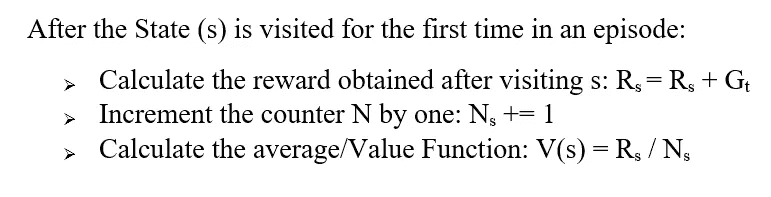*

*价值函数计算*

*你可能会问，如果我们只在一集里第一次访问状态 **s** 时计算奖励，那么计数器 N 将总是 1。不，因为这个计数器在每一集都帮助我们去过的州。*

*展望未来，我们可能希望计算奖励并逐步平均，而不是一次性将所有奖励相加并进行分配。 ***为什么？因为保存所有奖励的总和然后除以该状态被访问的总次数在计算上是昂贵的，并且随着遇到更多的奖励，这种需求将会增长。每次遇到新的状态/奖励时，我们都必须分配更多的内存。*** 因此，这里我们将求导定义为增量方式。*

> *增量均值:也称为移动平均线，它以增量方式保持均值，即**一旦遇到新的回报就计算均值**。为了计算平均值，我们不需要等到遇到每一个奖励，然后用它除以该州被访问的总次数。我们在网上计算。*

*让我们一步一步地推导出增量方法:*

*▹n 个时间步长的总平均值计算如下:*

*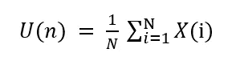*

*总均值/平均值*

*▹，假设，U(n)是我们要计算的新平均值。然后，这个 U(N)可以被分解为之前的平均值直到 **N-1** 和在 **N** 时间步长获得的值的和。可以写成:*

*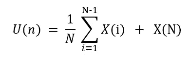*

*新平均值=总平均值(N-1)+N 时间步长的值*

*▹现在来看求和项，它可以被定义为( **N-1** )乘以直到 N-1 所获得的平均值，即 U(N-1)。将它代入上式:*

*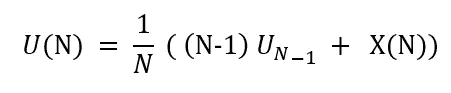*

*取代*

*▹Rearranging 这些术语:*

**

*打开支架*

*▹Taking N 常见并进一步求解:*

*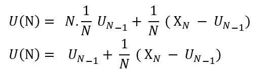*

*增量平均值的最终等式*

****这个等式告诉我们什么？****

*它告诉我们，新的平均值( **U(N)** )可以被定义为平均值( **U(N-1)** )的**先前估计**与当前**获得的**回报( **X(N)** )和按某个步长加权的平均值( **U(N-1)** )的**先前估计**之间的差之和当前获得的回报( **X(N)** )和之前估计的平均值(U(N-1))之间的差异被称为 ***误差项*** ，这意味着我们只是在这个误差项的方向上估计我们的新平均值。需要注意的是，我们并没有精确地计算新的平均值，而只是将新的平均值推向真实平均值的方向。*

*这概括了增量方法。😤现在，让我们更深入地了解我们如何评估/预测 MC 中的策略。*

## *无模型环境中的策略评估(适用于 MC)*

*策略评估如我们上面讨论的那样完成。下面就来细说一下。回想一下，价值函数是通过平均每集获得的奖励来计算的。因此，下一个问题将是我们如何从这个**价值函数**中**构建/提取**一个策略。让我们快速地看一下政策是如何从状态-值函数和状态-动作值(Q-函数)构建的。*

*数学上，策略可以从状态值函数中提取:*

*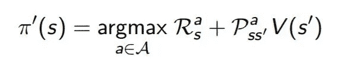*

*来自国家价值函数的政策*

*我们可以看到，为了从状态值函数中提取策略，我们最大化了状态值。但是这个等式有两个问题。首先，在无模型环境中，我们不知道转移概率( **Pss'** )，其次，我们也不知道 **s'** 。*

*现在，让我们看看状态-动作函数。该策略被提取为:*

*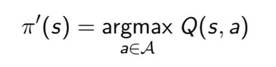*

*国家行为功能的政策*

*如我们所见，我们只需要最大化 Q 值来提取策略，即我们最大化动作并选择给出最佳 Q 值(状态-动作值)的动作。因此，对于 MC，我们使用 ***状态-动作值*** 进行策略评估和改进步骤。*

****我们如何计算状态-动作值？*** 嗯，我们计算动作值的方法与计算状态值的方法相同，唯一不同的是，现在我们为每个状态-动作对(s，a)计算动作值**，而不仅仅是状态 s。因此，只有当状态 **s** 被访问并且动作 **a** 被从中取出时，才称状态-动作对(s，a)被访问。如前一节所述，我们对动作值进行平均，这就给出了该状态的状态-动作值。如果我们仅在每集第一次访问(s，a)对之后求平均，那么它被称为**首次访问 MC** ，如果我们在每集对它的每次访问之后求平均超过(s，a ),那么它被称为**每次访问 MC** 。***

*因此，对国家行动值进行平均给了我们政策评估和改进的机制。但是它也有一个缺点就是**探索的问题**。让我们也处理一下。*

## *探索的问题*

*对于策略评估步骤，我们运行一系列事件，对于每个事件，我们计算遇到的每个(s，a)对的状态-动作值，然后取平均值，这就定义了(s，a)对的值。然后，当我们的政策改进步骤 w.r.t .转向国家行动价值观时，我们表现得贪婪。 ***一切看起来都不错但是等着吧！*** 如果我们把贪婪作为我们的政策改进步骤，那么将会有许多我们可能永远不会去拜访的国家行动对。如果我们不访问它们，那么我们就没有东西可以平均，它们的状态值将会是 0。这意味着我们可能永远不会知道那对国家行动组合有多好。这是我们将在本届会议上努力解决的问题。 ***什么样的政策适合 MC？****

*嗯，我们想要一个通常为**随机** π(a|s) > 0 的策略，这意味着它有非零概率为所有状态选择任何行动，然后在接近最优时逐渐变为确定性策略。最初，随机的并且所有动作的π(a|s) >为 0 将确保所有动作在确保探索的状态中有相等的机会被选择，然后逐渐转移到确定性策略，因为**最优**策略将总是确定性策略，其在一个状态中采取所有动作中可能的最佳动作。这个策略确保我们继续访问不同的状态-动作对。*

*这可以使用两种方法来完成，即政策内方法和政策外方法。这两者都将在下面的章节中讨论。*

# *蒙特卡洛控制*

*MC 控制类似于我们看到的使用动态规划解决马尔可夫决策过程(这里)。我们遵循**广义策略迭代** (GPI)的相同思想，其中我们不直接尝试估计最优策略，而是保持对动作值函数和策略的估计。然后，我们不断推动行动价值函数，使其更好地逼近政策，反之亦然(见之前的博客)。这个想法可以表述为:*

*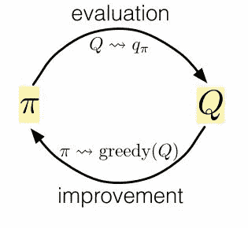*

*面向大规模定制的控制思想*

*在 MC 中，我们从某个策略 **π** 开始，用它来计算动作值。一旦计算了动作值(策略评估),则相对于这些动作值(控制)贪婪地行动，以构造新的策略π*，其优于或等于初始策略π。在这两个步骤之间摇摆最终会产生一个最优策略。*

## *政策控制*

*在基于策略的方法中，我们改进了用于计算 Q 函数的相同策略。直观地，假设我们使用策略π评估状态 s 的状态动作值(Q 函数),那么在策略控制中，我们将改进这个相同的策略π。在基于策略的方法中使用的策略是ε贪婪策略。那么， ***什么是ε-贪婪策略？****

*如前一节所述，MC 的理想策略是π(a|s) > 0，这种策略称为**ε-软策略**。on-policy 中使用的策略称为ϵ**-贪婪策略**。这种类型的策略具有以概率 **1- ϵ + ϵ/A(s)** 选择**贪婪**动作的概率，以及以概率 **ϵ/A(s)** 采取**随机动作**的概率，其中 A(s)是可以从该状态采取的动作总数。它可以表示为:*

*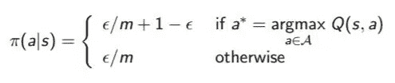*

*ε-贪婪政策。*

*对于 **ϵ-greedy 政策**，每个行动都有 **π(a|s) > ϵ/A(s)** 的被选中概率。ϵ-greedy 策略在大多数时候选择贪婪的行为，但也有极小的概率选择完全随机的行为。这就解决了我们探索的问题。*

*现在，我们可以通过表现贪婪来改进策略，即通过采取对一个状态具有最大 q 值的动作。这给定为(我们之前看到过):*

**

*政策改进步骤*

*按照 GPI 的思想，评估和改进步骤一直进行到达到最优，如下所示。*

*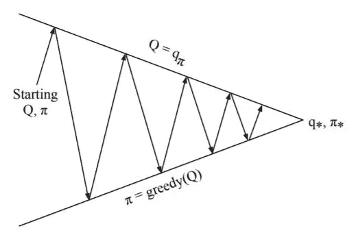*

*评估和改进的循环。*

*但是回想一下，GPI 不一定要求对一个完整的过程进行策略评估，相反，我们可以对一个事件评估一个策略，然后对它表现出贪婪的行为。它只需要将行动值和策略稍微推向最佳行动值和最佳策略，如下所示:*

*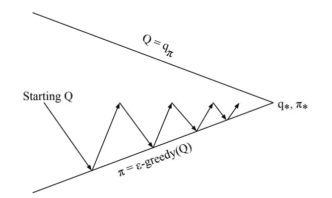*

*政策评估与改进的 GPI 理念。*

*结合我们刚刚看到的所有机制，我们可以提出一个名为**无限探索极限中的贪婪(GLIE)的策略算法。***

## ***贪婪于极限与无限探索(GLIE)***

*到目前为止，一切都是为了这个算法。如前所述，MC 政策的理想制定是:*

1.  *我们不断探索，这意味着每个状态-动作对都被访问了无数次。*
2.  *最终，后面的步骤转向更贪婪的策略，即确定性策略。*

*通过在ϵ-greedy 政策中为ϵ设定正确的价值观来确保这一点。那么，对ϵ来说，什么是正确的价值观呢？*

> *初始策略通常是一些随机初始化的值，以确保我们探索更多，如果我们保持ϵ~1 的**值，就可以确保这一点。在后面的时间步骤中，我们需要一个更加确定的策略，这可以通过设置 **ϵ~0** 来确保。***

*【glie mc 如何设置ϵ值？*

*在 GLIE MC 中，ϵ值逐渐**衰减**，这意味着ε的值随着每个时间步长变得越来越小。通常，做法是用ε值= 1.0，然后慢慢地**衰减**ε值一些**小的量**。ϵ的值为 0 将意味着一个贪婪的政策被遵循。因此，在 GLIE 蒙特卡罗方法中，ϵ值随着时间的推移逐渐降低，以利于开采而不是勘探。*

*接下来，我们研究**重要抽样**，它是不符合政策的 MC 的**症结**。*

## *重要抽样*

*在非策略中，我们有两个策略，即**行为策略**和**目标策略**。行为策略用于探索环境。它通常遵循探索性政策。目标策略是我们想要通过学习基于行为策略的的价值函数**来改进为最优策略的策略。因此，目标是**通过计算从来自**行为策略分布****【b(a/s)】**的样本中导出的值函数来学习**目标策略分布****【π(a/s)】**。重要的采样**在这方面对**有所帮助。详细解释:*****

*假设我们要估计**随机变量 x** 的期望值其中 X 是从行为策略分布 **b [x ~b]** w.r.t 采样到目标策略分布π即 Eπ[X]。我们知道:*

*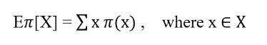*

*X 的期望值= X 的值乘以 X 的概率*

*除以并乘以行为分布 b(x):*

*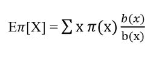*

*等式 2*

*重新安排条款:*

*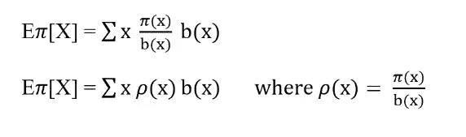*

*等式 3。*

*在等式 3 中，**x ~目标**策略分布与**x ~行为**策略分布的比值称为**重要抽样比**，用 **p** 表示。现在，π的期望值来自 b。我们可以通过两种方式使用重要抽样来计算目标策略的状态值函数，即 ***普通重要抽样*** 和 ***加权重要抽样*** 。*

*普通的重要采样跟踪状态被访问的时间步长，用 **T(s)** 表示。Vπ是缩放从**行为策略**获得的回报，然后除以 **T(s)** 的结果。*

*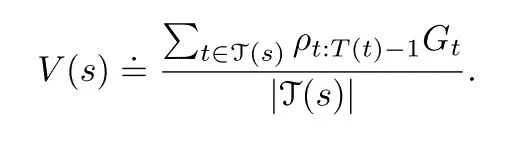*

*情商。8.普通重要抽样*

*另一方面，加权重要抽样被定义为**加权平均值**，如下所示:*

*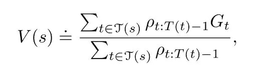*

*情商。9.加权重要抽样*

*普通重要抽样**无偏**，而加权重要抽样**有偏**。**这是什么意思？**好吧，假设我们只对从一个状态返回的**单个**采样，那么在**加权**重要采样中**分子**和**分母**中的比率项将会抵消。因此，估计值 Vπ将是行为策略 b 的回报，没有任何缩放。这意味着它的期望是**不是 Vπ** 而是 **Vb** 。另一方面，普通重要抽样的方差**是无界的**，而加权重要抽样则不是这种情况。这总结了重要的抽样。*

## *非政策蒙特卡罗*

*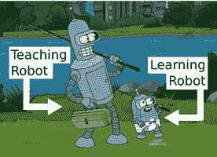*

*参考文献 3*

*如前所述，我们希望从行为策略中评估目标策略。像在 MC 中一样，我们通过平均回报来估计状态的值。我们将在这里做同样的事情。我们通过估计回报来计算价值函数，如下所示:*

*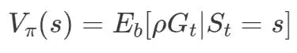*

*Eq 4。不符合政策的价值函数*

*其中 p 是重要抽样比，定义为π **下某**轨迹**的**概率**除以 b 下某**轨迹**的概率。回想一下，策略π下的轨迹定义为在状态 **s** 采取行动 **a** 的概率乘以如果 **a** 和**访问**s’**的概率它被定义为:*****

*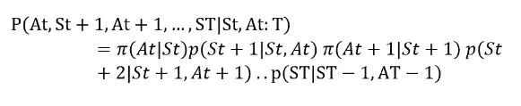*

*轨迹概率*

*我们可以根据重要抽样定义相同的轨迹概率如下:*

*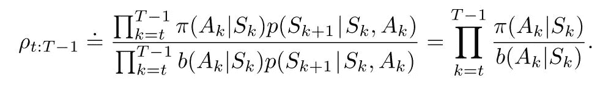*

*Eq 6。轨迹的重要采样率*

*来自 eq。6 很明显，一个重要的采样比被定义为目标策略π下轨迹的概率除以行为策略 b 下轨迹的概率。我们还可以推断出**转移**概率项**取消**，留下依赖于两个**策略**的比率。*

****这个比例用在哪里？****

*因为我们试图估算 Vπ。我们使用这个比率来转换从行为策略 b 获得的回报，以便估计**目标**策略π的 Vπ。如下所示:*

*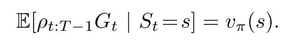*

*Eq 7。重要抽样比的使用。*

*我们现在准备定义非策略控制。*

## *非策略蒙特卡罗控制*

*回想一下，我们的目的是从行为策略获得的回报中改进目标策略。这两项政策完全**无关**。虽然目标策略可以是确定性的，即它可以根据 q 函数贪婪地行动，但是我们希望我们的**行为**策略是探索性的。为了确保这一点，我们需要确保从关于每个状态-动作对的行为策略中获得足够的**返回**。行为策略通常是软的，这意味着每个状态-动作对都有一个被选中的非零概率**确保每个状态-动作被访问无限次。***

*此外，回想一下，使用增量方法，我们可以按照最佳目标策略的方向更新/调整我们的价值函数，如下所示:*

*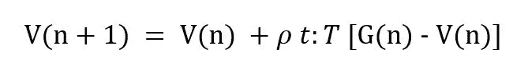*

*不符合策略的 MC 更新规则*

*情商。图 10 显示了第一个 **n 个**返回的更新规则，该规则通过重要的采样比率进行加权。这个比率一般是**加权**的重要抽样比率。*

***那它！走到这一步真了不起！**🤖🐱‍👤*

*此外，我被之前 RL 博客上的回复弄得不知所措。谢谢你，我希望这个博客能以同样的方式帮助你。下一次，我们将研究**时差学习**。*

*希望这个故事能增加你对蒙特卡洛的了解。我很乐意在 Instagram 上与你联系。*

## *其他 RL 博客:*

*   *[强化学习:马尔可夫决策过程(第一部分)](https://towardsdatascience.com/introduction-to-reinforcement-learning-markov-decision-process-44c533ebf8da)*
*   *[强化学习:贝尔曼方程与最优性(下)](https://towardsdatascience.com/reinforcement-learning-markov-decision-process-part-2-96837c936ec3)*
*   *[强化学习:使用动态规划解决马尔可夫决策过程](https://towardsdatascience.com/reinforcement-learning-solving-mdps-using-dynamic-programming-part-3-b53d32341540)*
*   *强化学习:蒙特卡罗学习(这一个)*

**参考文献:**

*[1] [奖励 M-E-M-E](https://web.archive.org/web/20200929125734/http://himanshusahni.github.io/2018/02/23/reinforcement-learning-never-worked.html)*

*理查德·萨顿和安迪·巴尔托。强化学习:导论。*

*[机器人 M-E-M-E](https://siegel.work/blog/RLModelFree/)*

*[4] [大卫·西尔弗 RL 讲座](https://www.youtube.com/watch?v=0g4j2k_Ggc4&list=PLqYmG7hTraZDM-OYHWgPebj2MfCFzFObQ&index=5)*