# 强化强化学习背后的科学

> 原文：<https://pub.towardsai.net/reinforcing-the-science-behind-reinforcement-learning-d2643ca39b51?source=collection_archive---------2----------------------->

## [机器学习](https://towardsai.net/p/category/machine-learning)，强化学习

## 强化学习，Q 学习，贝尔曼方程。

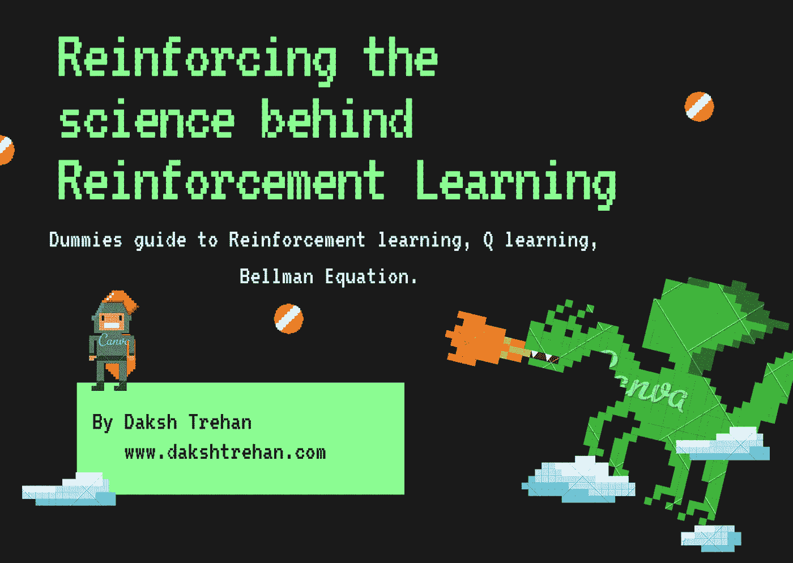

你在禁闭中感到无聊，你决定玩电脑游戏来打发时间。

你推出了象棋，选择和电脑对战，你输了！

但这是怎么发生的呢？你怎么能输给一台 50 年前就存在的机器呢？

由[皮奥特·马科夫斯基](https://unsplash.com/@maqov?utm_source=medium&utm_medium=referral)在 [Unsplash](https://unsplash.com?utm_source=medium&utm_medium=referral) 上拍摄的照片

这就是**强化学习的神奇之处。**

**强化学习**位于**机器学习的保护伞下。他们的目标是在复杂的动态环境中开发智能行为。如今，由于人工智能的范围正在极大地扩展，我们可以很容易地找到它们在我们周围的重要性。从*自动驾驶、推荐搜索引擎、电脑游戏到机器人技能，*人工智能正在发挥至关重要的作用。**

# 巴甫洛夫条件反射

当我们想到人工智能时，我们有一种思考未来的感觉，但我们的想法把我们带回了 19 世纪晚期，*伊凡·巴甫洛夫*，一位俄罗斯生理学家正在研究狗的唾液分泌效应。他很想知道当狗看到食物时会分泌多少唾液，但是，在进行实验时，他注意到狗甚至在看到任何食物之前就会分泌唾液。在实验得出结论后，巴甫洛夫会在给它们喂食前摇铃，不出所料，它们又开始流口水了。他们行为背后的原因可能是他们的学习能力，因为他们知道铃响后，他们会被喂食。另一件要思考的事情是，狗分泌唾液不是因为铃声响了，而是因为过去的经验告诉它食物会跟着铃声走。

照片由 [engin akyurt](https://unsplash.com/@enginakyurt?utm_source=medium&utm_medium=referral) 在 [Unsplash](https://unsplash.com?utm_source=medium&utm_medium=referral) 拍摄

# 什么是强化学习？

强化学习是机器学习技术的一部分，它使人工智能代理能够与环境交互，从而从自己的动作和经验序列中学习。

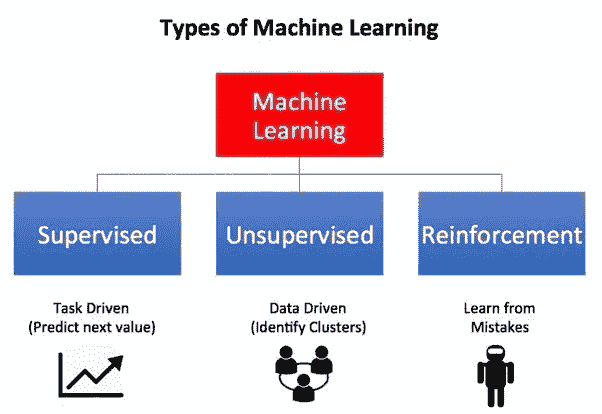

[来源](https://blog.exxactcorp.com/wp-content/uploads/2020/03/1.png)

为了便于说明，假设你被困在一个孤岛上。你可以期待自己先崩溃，但是，别无选择，你将开始为生存而战。你会找一个地方打猎，你会找一个地方睡觉，你会检查吃什么和避免什么。如果你呆在一个安全的地方，你会注意到这是你必须采取的正确行动，同时，如果你吃了一些导致腹泻的动物，你会避免在未来吃这些动物。随着时间的推移，你的行为会变得更好，通过学习，你会很容易适应新的环境。强化学习遵循相同的方法，其中我们期望代理人体验新环境，通过发现错误和奖励来跟踪其行为和后果，并学习变得更好或以最大化奖励为目标。

阿列克斯·达尔伯格在 [Unsplash](https://unsplash.com?utm_source=medium&utm_medium=referral) 上拍摄的照片

## 但是，它与监督学习相比如何呢？

可以使用监督学习方法来代替强化学习技术。但是，为此，我们需要一个真正大的数据集来构成每一个行动及其后果。它的下一个不利结果将是有限的学习，假设如果跟踪最佳球员的行动，但他仍然不完美，并跟随他的行动，机器可能会变得像他一样伟大，但不能超过他的分数。

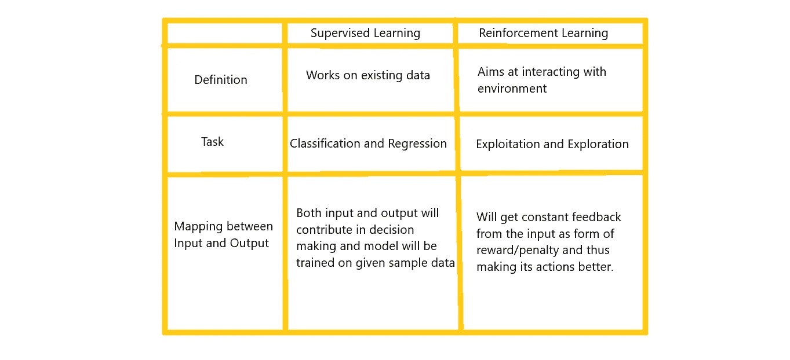

## 它是如何反对无监督学习的？

在无监督学习中，输入和输出之间没有直接联系，而是旨在识别模式，相反，强化学习是从过去输入提供的输出中学习。

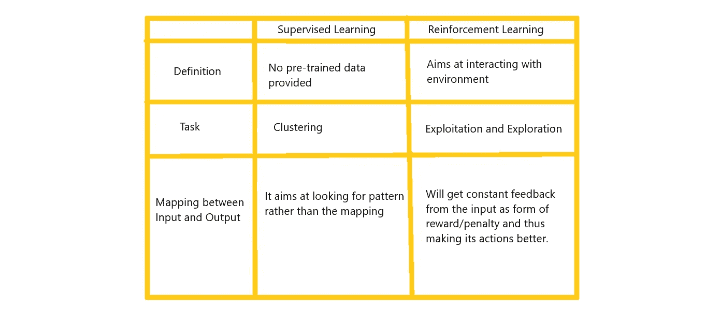

## 那么，是深度学习吗？

深度学习无可争议地属于机器学习的范畴，能够计算需要类似人类智能的复杂问题。

维恩图显示了所有机器学习技术之间的关系，根据[通用逼近定理](https://en.wikipedia.org/wiki/Universal_approximation_theorem#:~:text=In%20the%20mathematical%20theory%20of,given%20function%20space%20of%20interest.&text=Most%20universal%20approximation%20theorems%20can%20be%20parsed%20into%20two%20classes.) (UAT)，我们可以使用神经网络解决任何问题，但这些不一定是每个问题的最佳解决方案，因为它们需要处理大量数据，并且通常难以解释。

分析该图，它表明我们不需要对每个强化学习问题都使用深度学习，这澄清了一个神话，即**它不仅仅依赖于深度学习**。

# 强化学习是如何工作的？

在强化学习中，我们的目标是主体和环境的相互作用。

*   一个 **Agent** 可以看作是“解”，是我们期望做出决策来解决决策问题的计算机程序。
*   一个**环境**可以被认为是“问题”,这是代理所做的决定被执行的地方。

例如，在国际象棋比赛的情况下，我们可以认为代理人是一个球员和环境构成董事会和竞争者。

这两个部分在某种程度上是相互依赖的，即主体试图根据环境的影响来调整其行为，而环境对主体的行为作出反应。

环境受到一组变量的约束，这些变量通常与决策问题有关。所有可能值的集合可以被视为**状态空间**。**状态**是状态空间的一部分，即变量取值。

在每个状态下，环境有权向代理提供一组动作，它应该从中选择一个。代理试图使用这些动作来影响环境，并且环境可以作为对代理动作的响应而改变状态。**转移函数**就是追踪这些关联的东西。

环境根据个体的行为奖励或惩罚个体。**奖励**是在代理人的最后一次行动有助于实现有利目标时提供的积极反馈。**惩罚**是如果主体的最后一个动作导致偏离目标，环境提供的负反馈。代理人的目标是最大化整体回报，并不断使其行动更好，以达到预期的最终结果。

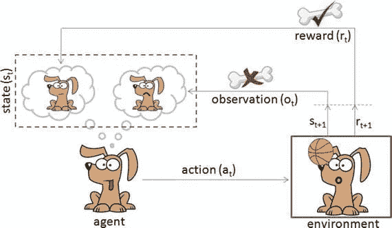

强化学习需要的另一件事是大量的训练时间，因为直到一集(游戏)结束，奖励才会透露给代理人。例如，如果我们的计算机正在与我们下棋，并且它赢了，那么它将会得到奖励(因为我们期望的结果是*赢*),但是它仍然需要弄清楚它是因为哪些动作而得到奖励的，这只有在给它大量训练时间和数据的情况下才能实现。

# 强化学习是如何学习的？(Q-学习)

> 目标:最大化总报酬

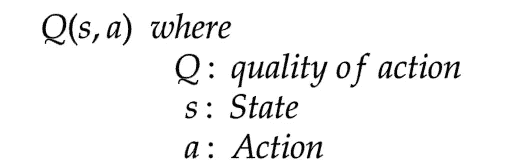

我们期望，回报能尽早到来，以使我们的训练更快，从而快速达到预期的结果。

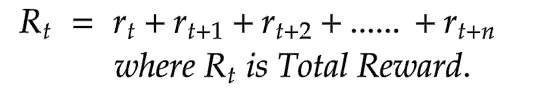

理想情况

但是，在实际情况中，我们会遇到延迟奖励，为了惩罚延迟奖励，我们将引入折扣因子()。

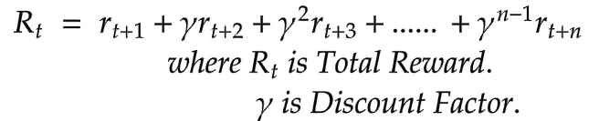

真实案例

在真实情况下，当我们向右移动时，不确定性会增加。

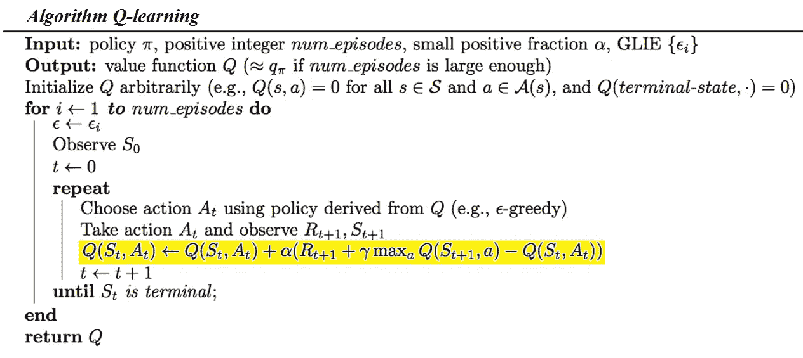

q 学习

## 贝尔曼方程

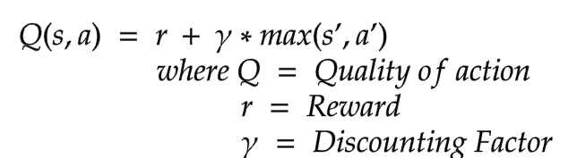

我们的目标是最大化回报，或者我们可以说最小化错误(损失)。

为了最小化损失，我们可以使用均方误差损失来实现梯度下降。

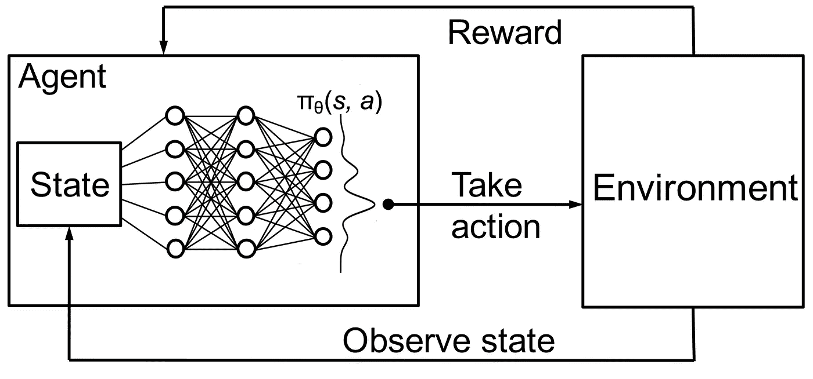

# 勘探 v/s 开发权衡

强化学习的其他有趣组成部分是**探索**和**利用**。为了快速获得回报，代理必须遵循过去的经验。但是为了检测这样的动作，它必须首先尝试动作。

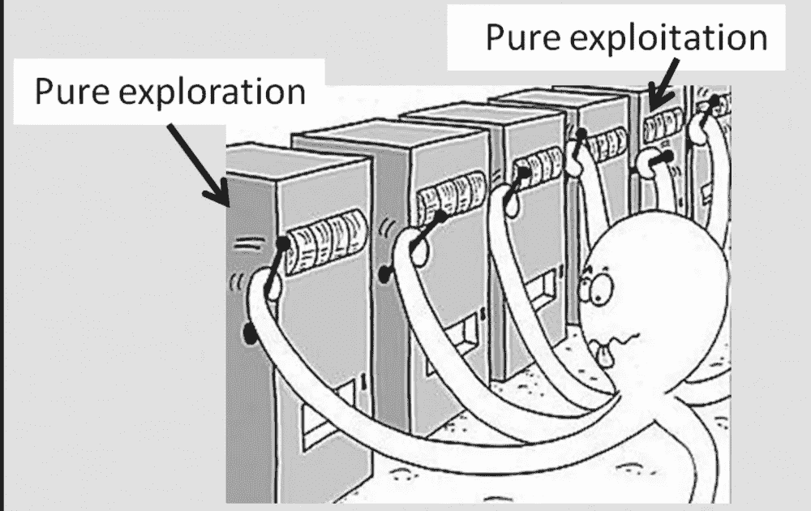

勘探与开采，[来源](https://prakhartechviz.blogspot.com/2019/02/exploration-exploitation-dilemma-rl.html)

简而言之，为了获得快速的回报，一个代理人必须利用 T7，但是它也应该探索使它的行为更好，因此这可能有助于它获得更好的回报。

让我们回到岛上，你有三个钓鱼地点，每个地点是三种鱼的家园，地点 1 是有毒的黑色鱼的栖息地，地点 2 是美味且营养丰富的橙色鱼的家园，地点 3 是营养和味道最好的灰色鱼。我们的目标是不吃黑鱼，试着吃灰色的。

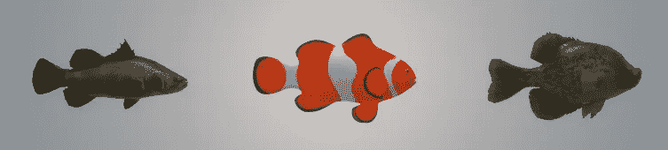

Spot1 vs Spot2 vs Spot3

让我们假设，在第一天，你选择了地点 1 钓鱼，结果吃了一条黑鱼，拉肚子了。在第二天，你到达了第二点，最后吃了一顿美味的晚餐。现在，你的本能将试图利用你选择的道路，即通往第二点的道路，因为根据你过去的经验，第二点似乎是一个更好的政策。因此，你的思维会停留在一个为了适度奖励而牺牲的政策上。

> **探索**:帮助你尝试各种动作；一开始很好。
> 
> **开发**:从过去的好经验中取样；需要内存空间；结尾很好

# 结论

希望这篇文章能帮助你以最好的方式理解强化学习，并帮助你实践它。

一如既往，非常感谢您的阅读，如果您觉得这篇文章有用，请分享！

请随意连接:

> 领英~[https://www.linkedin.com/in/dakshtrehan/](https://www.linkedin.com/in/dakshtrehan/)
> 
> insta gram ~[https://www.instagram.com/_daksh_trehan_/](https://www.instagram.com/_daksh_trehan_/)
> 
> github ~[https://github.com/dakshtrehan](https://github.com/dakshtrehan)

关注更多机器学习/深度学习博客。

> 中等~[https://medium.com/@dakshtrehan](https://medium.com/@dakshtrehan)

# 想了解更多？

[利用深度学习检测新冠肺炎](https://towardsdatascience.com/detecting-covid-19-using-deep-learning-262956b6f981)

[无法逃脱的人工智能算法:抖音](https://towardsdatascience.com/the-inescapable-ai-algorithm-tiktok-ad4c6fd981b8)

[使用机器学习的卡通化内幕指南](https://medium.com/towards-artificial-intelligence/an-insiders-guide-to-cartoonization-using-machine-learning-ce3648adfe8)

[为什么你要为乔治·弗洛伊德的谋杀和德里的骚乱负责？](https://medium.com/@dakshtrehan/why-are-you-responsible-for-george-floyds-murder-delhi-communal-riots-4c1edb7acbc5)

[解码生成性对抗网络背后的科学](https://medium.com/towards-artificial-intelligence/decoding-science-behind-generative-adversarial-networks-4d188a67d863)

[理解 LSTM 和 GRU 的](https://medium.com/towards-artificial-intelligence/understanding-lstms-and-gru-s-b69749acaa35)

[虚拟递归神经网络](https://medium.com/towards-artificial-intelligence/recurrent-neural-networks-for-dummies-8d2c4c725fbe)

[虚拟卷积神经网络](https://medium.com/towards-artificial-intelligence/convolutional-neural-networks-for-dummies-afd7166cd9e)

[深入钻研深度学习](https://medium.com/towards-artificial-intelligence/diving-deep-into-deep-learning-f34497c18f11)

[为什么选择随机森林而不是决策树](https://medium.com/towards-artificial-intelligence/why-choose-random-forest-and-not-decision-trees-a28278daa5d)

[聚类:是什么？什么时候用？](https://medium.com/@dakshtrehan/clustering-what-it-is-when-to-use-it-a612bbe95881)

从 k 个最近邻居开始你的 ML 之旅

[朴素贝叶斯解释了](https://medium.com/swlh/things-you-never-knew-about-naive-bayes-eb84b6ee039a)

[激活功能说明](https://medium.com/analytics-vidhya/activation-functions-explained-8690ea7bdec9)

[参数优化说明](https://towardsdatascience.com/parameters-optimization-explained-876561853de0)

[梯度下降解释](https://towardsdatascience.com/gradient-descent-explained-9b953fc0d2c)

[逻辑回归解释](https://towardsdatascience.com/logistic-regression-explained-ef1d816ea85a)

[线性回归解释](https://medium.com/towards-artificial-intelligence/linear-regression-explained-f5cc85ae2c5c)

[确定最适合您的 ML 模型](https://medium.com/datadriveninvestor/determining-perfect-fit-for-your-ml-model-339459eef670)

> 干杯