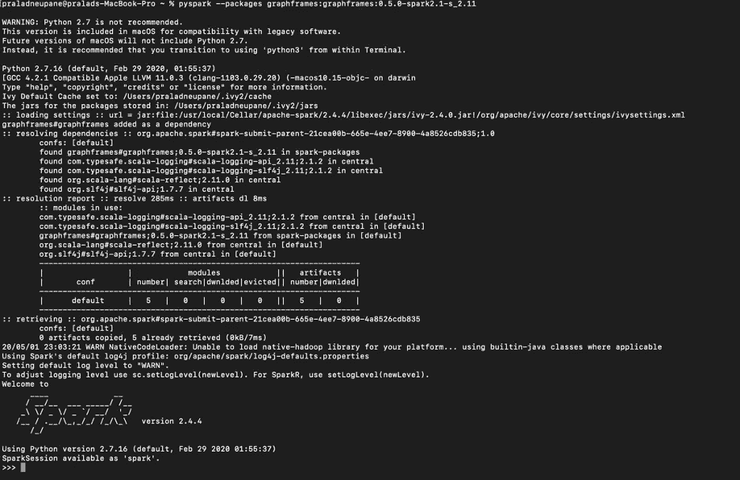
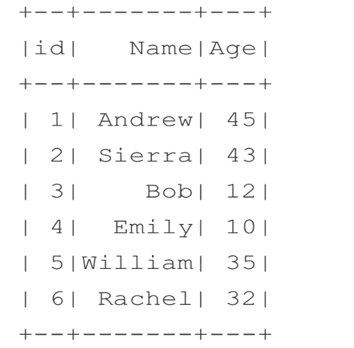
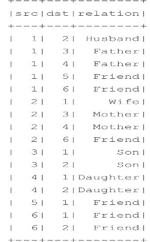
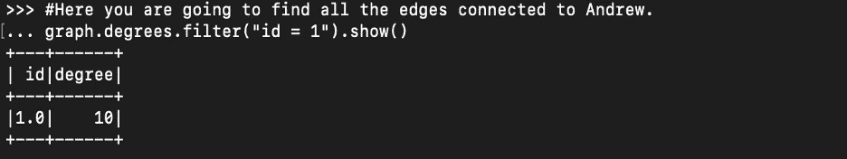
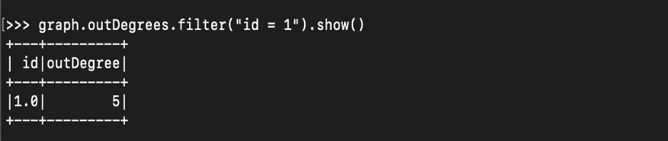
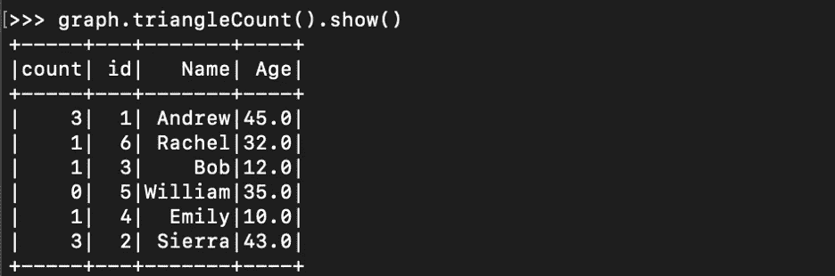
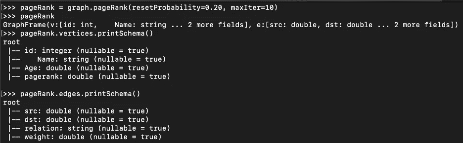
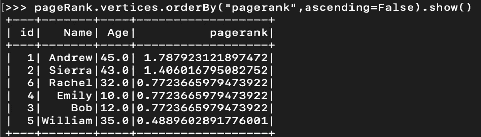
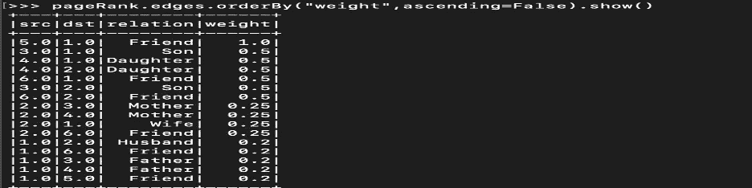

# 在 Apache Spark 中实现 GraphX/Graph-frames

> 原文：<https://pub.towardsai.net/relationship-analysis-inspark-using-graphx-57ffcce8773f?source=collection_archive---------0----------------------->

## [编程](https://towardsai.net/p/category/programming)

## 使用类似 LinkedIn 的家庭成员和朋友关系进行分析


来源:Needpix.com

我们正在使用 GraphX 探索家庭成员之间以及与朋友之间的关系。有六个家庭成员，有父亲、母亲、儿子、女儿和两个朋友。我们试图回答哪个家庭成员有最多的联系，哪个家庭成员有最少的联系。此外，我们可以看到数据集中记录之间的关系级别。GraphX 解决了这些问题，并被脸书和 LinkedIn 等公司广泛使用。

## GraphX 简介

GraphX 是 Apache Spark 用于图形和图形并行计算的 API。GraphX 在单个系统中统一了 ETL(提取、转换和加载)过程、探索性分析和迭代图计算。在脸书的朋友，LinkedIn 的连接，互联网路由器，天体物理学中星系和恒星之间的关系以及谷歌地图中可以看到图形的用法。
在 Spark 中，你可以获得很多关于图形的细节，比如边的列表和数量、节点、每个节点的邻居、每个节点的入度和出度分数。PySpark 中可以使用的基本图形函数如下:*顶点*边*度数*外度数*度数

# 家庭成员关系分析

这就是我们在 PySpark 中启动 GraphX 的方式

```
pyspark --packages graphframes:graphframes:0.5.0-spark2.1-s_2.11
```

这是你启动 GraphX 后的样子



这就是导入 graphframe 的方法

```
from graphframes import *
```

## 数据集

我们有两个名为 person 和 relationship 的表。一个人有身份证、姓名和年龄。关系表包含源、目的地、关系。这里源和目的地是用户 id，关系列显示它们之间的关系。



我们将探讨家庭成员和朋友之间的关系。我们也可以对人与人之间的关系进行分类。这有广泛的应用，如寻找人与人之间的联系，社会媒体分析等。

示例代码

## 理解图中的度

**度**

图形中每个顶点的度数作为具有两列的数据帧返回:

-“id”:顶点的 ID

- 'degree '(整数)顶点的度数

注意:结果中不返回边数为 0 的顶点。

**度数**

图形中每个顶点的入度以具有两列的 DataFame 形式返回:

-“id”:顶点的 ID

-“in degree”(int)存储顶点的入度

注意:结果中不返回内边为 0 的顶点。返回带有新顶点列“inDegree”的数据帧

**向外倾斜**

图形中每个顶点的出度作为具有两列的数据帧返回:

-“id”:顶点的 ID

-“出度”(整数)存储顶点的出度

注意:结果中不返回具有 0 外边缘的顶点。返回带有新顶点列“outDegree”的数据帧

## 例子

找出所有与安德鲁有关的边



找到所有和安德鲁的联系

使用出站索引确定从 Andrew 发出的链路数量



三角形计数问题

此计数列标识顶点参与的三角形关系的数量。



输出显示 Andrew 和 Sierra 具有最大的三角形计数，因为它们涉及应用 PageRank 算法的三种关系。它最初是由谷歌的创始人发起的，旨在识别互联网上最重要的页面。PageRank 算法衡量图中每个顶点的重要性。假设一个场景，一个 Twitter 用户有 10 个重要的关注者，每个关注者又有多个关注者。也就是说，PageRank 算法将每个重要的关注者视为 Twitter 用户的合法认可，从而给予用户更高的排名。

```
>>> pageRank = graph.pageRank(resetProbability=0.20, maxIter=10)
```

这里，我们使用 PageRank 方法调用 pageRank 算法。它需要两个属性

1.  reset probability:这个值是一个随机值重置概率(alpha)。
2.  maxIter:这是你希望 pageRank 运行的次数。

您可以从原始 person 的模式中看到，已经添加了一个名为 PageRank 的新列，并且在原始关系模式中添加了新的列权重。这两栏都对 PageRank 分数有贡献



什么是 PageRank 评分？



我们来看权重:权重是计算页面排名的决定因素



从表中可以看出，威廉和安德鲁的关系权重最大，因为它是独一无二的。除了安德鲁，没有人是威廉的朋友。通过应用广度优先算法，让我们找到连接到人们的最短路径。我们打算申请 BFS。
你可能经常会注意到 LinkedIn 会告诉你离任何新用户有多远。例如，您会注意到您想要连接的用户是第二个连接或第三个连接。这告诉你，你离你正在看的那个顶点有两个顶点。这是确定一个顶点到另一个顶点有多远的一种方法。

另一个例子是寻找两个城市或两个机场之间的最短路径。广度优先搜索是最短路径查找算法之一，它帮助我们确定两个顶点之间的最短路径。

找出 Bob 和 William 之间的联系，因为只有 Andrew 与 William 直接相关。为了让鲍勃能和威廉联系上。

## 最短的路径是什么？怎么找？

GraphFrames 提供了一个名为 bfs(广度优先搜索)的 API，它最少需要两个参数。这些是 fromExpr:表达式，用来标识 from 顶点。toExpr:标识顶点的表达式。

```
graph.bfs(fromExpr=””Name=’Bob’””,toExpr=””Name=’William’””).show()
```

这显示了威廉和鲍勃之间的最短路径。如果我们试图找到真正的距离，它会更实际。可以用城市名代替人名，找最短路径。

## 下一个故事

我准备公布机器学习算法在 Spark 中的实现，通过实现以下算法来预测明年的房价。请就此发表反馈。

```
1\. Decision Tree Regression
2\. Random Forest Regression
3\. Gradient Boosted Tree Regression
```