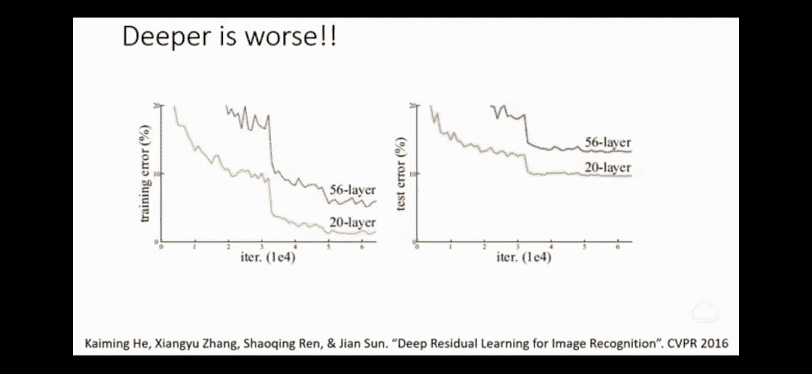
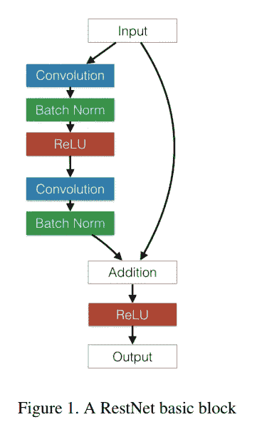
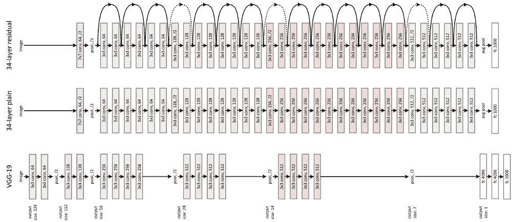
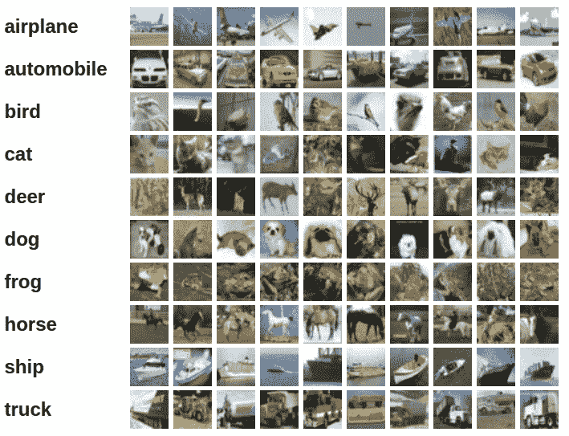
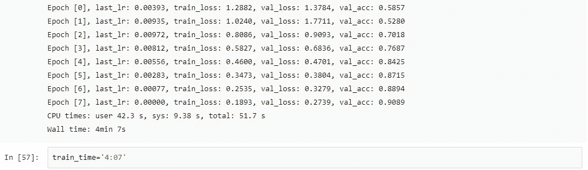
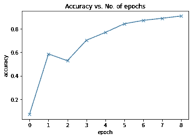
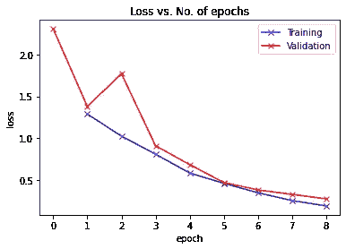
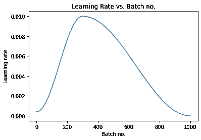

# ResNet 架构:用 PyTorch 进行深度学习

> 原文：<https://pub.towardsai.net/resnet-architecture-deep-learning-with-pytorch-19ecb7ca359e?source=collection_archive---------0----------------------->

## [深度学习](https://towardsai.net/p/category/machine-learning/deep-learning)

从 2015 年赢得 ImageNet 大规模视觉识别挑战赛(ILSVRC)到现在，ResNet 架构在数据科学领域表现卓越。除了 ILSVRC，ResNet 还赢得了检测和定位挑战以及 MSCOCO 检测和分割挑战。相当的壮举！

那么，与之前的卷积网络相比，ResNet 有什么独特之处呢？

# 雷斯内特:背后的工作

因为输入=输出，所以实际上层次越多，网络越好。实际上不是。但是在现实世界中，由于消失梯度和维数灾难问题，这是不可能的。事实上，训练误差在特定时期后增加。



ResNet 的工作非常简单，它将原始输入添加回通过一个或多个卷积层传递输入而获得的输出特征映射。



## 让我们理解左边的图片。发生的是 Relu(输入+输出)，其中输入是第一个数据或前一个块的数据，输出是 Relu(W2(W1+b) + I)，其中 W1 和 W2 是两层的权重，b 是前一层的偏差。

## 现在我们知道了 ResNet 架构背后的基础，所以让我们创建一个。

```
class **SimpleResidualBlock**(nn.Module):
    def **__init__**(self):
        super().__init__()
        self.conv1 = nn.Conv2d(in_channels=3, out_channels=3, kernel_size=3, stride=1, padding=1)
        self.relu1 = nn.ReLU()
        self.conv2 = nn.Conv2d(in_channels=3, out_channels=3, kernel_size=3, stride=1, padding=1)
        self.relu2 = nn.ReLU()

    def **forward**(self, x):
        out = self.conv1(x)
        out = self.relu1(out)
        out = self.conv2(out)
        return self.relu2(out) + x *# ReLU can be applied before or after adding the input*
```

请注意，如果输出的维数与残差不匹配，则我们不能执行 Relu 加法，因此，我们不仅要对输入应用池化，而且残差也将通过步长为 1×1 的 conv 变换，该变换会将滤波器投影为与输出相同，并且步长为 2 将是维数的一半，就像最大池一样。



VGG-19，34 层平原与 34 层残余网的区别

在上图中，我们看到了 ResNet34 架构。第一层具有 7x7 卷积和步长 2，以通过因子 2 对输入进行下采样。然后是 3 个单位块，之后是 2 个单位块的下采样。在最后一个平均池图层中，它创建了 1000 个要素地图，并对每个要素地图进行平均。结果是一个 1000 维的向量，然后直接馈入 Softmax 层，使其完全卷积。总共有 6 种不同类型的 ResNet 架构，即 ResNet9、ResNet18、ResNet34、ResNet50、Resnet101 和 ResNet150，它们的层数不同。解释完一切之后，我现在应该给出完整的答案。


# PyTorch 中使用 ResNet 和正则化技术对 CIFAR10 图像进行分类

以下是数据集中的一些图像:



# 系统设置

```
*# Uncomment and run the commands below if imports fail*
*# !conda install numpy pandas pytorch torchvision cpuonly -c pytorch -y*
*# !pip install matplotlib --upgrade --quiet* import os
import torch
import torchvision
import tarfile
import torch.nn as nn
import numpy as np
import torch.nn.functional as F
from torchvision.datasets.utils import download_url
from torchvision.datasets import ImageFolder
from torch.utils.data import DataLoader
import torchvision.transforms as tt
from torch.utils.data import random_split
from torchvision.utils import make_grid
import matplotlib.pyplot as plt
%matplotlib inlineproject_name='05b-cifar10-resnet'
```

# 准备数据

让我们从下载数据集并创建 PyTorch 数据集来加载数据开始，就像我们在上一教程中所做的那样。

```
*# Dowload the dataset*
dataset_url = "http://files.fast.ai/data/cifar10.tgz"
download_url(dataset_url, '.')

*# Extract from archive*
with tarfile.open('./cifar10.tgz', 'r:gz') as tar:
    tar.extractall(path='./data')

*# Look into the data directory*
data_dir = './data/cifar10'
print(os.listdir(data_dir))
classes = os.listdir(data_dir + "/train")
print(classes)*# Data transforms (normalization & data augmentation)*
stats = ((0.4914, 0.4822, 0.4465), (0.2023, 0.1994, 0.2010))
train_tfms = tt.Compose([tt.RandomCrop(32, padding=4, padding_mode='reflect'), 
                         tt.RandomHorizontalFlip(), 
                         tt.ToTensor(), 
                         tt.Normalize(*stats,inplace=True)])
valid_tfms = tt.Compose([tt.ToTensor(), tt.Normalize(*stats)])
*# PyTorch datasets*
train_ds = ImageFolder(data_dir+'/train', train_tfms)
valid_ds = ImageFolder(data_dir+'/test', valid_tfms)
batch_size = 400
*# PyTorch data loaders*
train_dl = DataLoader(train_ds, batch_size, shuffle=True, num_workers=3, pin_memory=True)
valid_dl = DataLoader(valid_ds, batch_size*2, num_workers=3, pin_memory=True)
def **show_batch**(dl):
    for images, labels in dl:
        fig, ax = plt.subplots(figsize=(12, 12))
        ax.set_xticks([]); ax.set_yticks([])
        ax.imshow(make_grid(images[:64], nrow=8).permute(1, 2, 0))
        break
show_batch(train_dl)
```


因为标准化，颜色看起来不合适。

# 使用 GPU

```
def **get_default_device**():
    """Pick GPU if available, else CPU"""
    if torch.cuda.is_available():
        return torch.device('cuda')
    else:
        return torch.device('cpu')

def **to_device**(data, device):
    """Move tensor(s) to chosen device"""
    if isinstance(data, (list,tuple)):
        return [to_device(x, device) for x in data]
    return data.to(device, non_blocking=True)

class **DeviceDataLoader**():
    """Wrap a dataloader to move data to a device"""
    def **__init__**(self, dl, device):
        self.dl = dl
        self.device = device

    def **__iter__**(self):
        """Yield a batch of data after moving it to device"""
        for b in self.dl: 
            yield to_device(b, self.device)

    def **__len__**(self):
        """Number of batches"""
        return len(self.dl)
train_dl = DeviceDataLoader(train_dl, device)
valid_dl = DeviceDataLoader(valid_dl, device)def **accuracy**(outputs, labels):
    _, preds = torch.max(outputs, dim=1)
    return torch.tensor(torch.sum(preds == labels).item() / len(preds))

class **ImageClassificationBase**(nn.Module):
    def **training_step**(self, batch):
        images, labels = batch 
        out = self(images)                  *# Generate predictions*
        loss = F.cross_entropy(out, labels) *# Calculate loss*
        return loss

    def **validation_step**(self, batch):
        images, labels = batch 
        out = self(images)                    *# Generate predictions*
        loss = F.cross_entropy(out, labels)   *# Calculate loss*
        acc = accuracy(out, labels)           *# Calculate accuracy*
        return {'val_loss': loss.detach(), 'val_acc': acc}

    def **validation_epoch_end**(self, outputs):
        batch_losses = [x['val_loss'] for x in outputs]
        epoch_loss = torch.stack(batch_losses).mean()   *# Combine losses*
        batch_accs = [x['val_acc'] for x in outputs]
        epoch_acc = torch.stack(batch_accs).mean()      *# Combine accuracies*
        return {'val_loss': epoch_loss.item(), 'val_acc': epoch_acc.item()}

    def **epoch_end**(self, epoch, result):
        print("Epoch [{}], last_lr: {:.5f}, train_loss: {:.4f}, val_loss: {:.4f}, val_acc: {:.4f}".format(
            epoch, result['lrs'][-1], result['train_loss'], result['val_loss'], result['val_acc']))def **conv_block**(in_channels, out_channels, pool=False):
    layers = [nn.Conv2d(in_channels, out_channels, kernel_size=3, padding=1), 
              nn.BatchNorm2d(out_channels), 
              nn.ReLU(inplace=True)]
    if pool: layers.append(nn.MaxPool2d(2))
    return nn.Sequential(*layers)

class **ResNet9**(ImageClassificationBase):
    def **__init__**(self, in_channels, num_classes):
        super().__init__()

        self.conv1 = conv_block(in_channels, 64)
        self.conv2 = conv_block(64, 128, pool=True)
        self.res1 = nn.Sequential(conv_block(128, 128), conv_block(128, 128))

        self.conv3 = conv_block(128, 256, pool=True)
        self.conv4 = conv_block(256, 512, pool=True)
        self.res2 = nn.Sequential(conv_block(512, 512), conv_block(512, 512))

        self.classifier = nn.Sequential(nn.MaxPool2d(4), 
                                        nn.Flatten(), 
                                        nn.Linear(512, num_classes))

    def **forward**(self, xb):
        out = self.conv1(xb)
        out = self.conv2(out)
        out = self.res1(out) + out
        out = self.conv3(out)
        out = self.conv4(out)
        out = self.res2(out) + out
        out = self.classifier(out)
        return out
model = to_device(ResNet9(3, 10), device)
model
```

# 训练模型

```
**@torch.no_grad()**
def **evaluate**(model, val_loader):
    model.eval()
    outputs = [model.validation_step(batch) for batch in val_loader]
    return model.validation_epoch_end(outputs)

def **get_lr**(optimizer):
    for param_group in optimizer.param_groups:
        return param_group['lr']

def **fit_one_cycle**(epochs, max_lr, model, train_loader, val_loader, 
                  weight_decay=0, grad_clip=None, opt_func=torch.optim.SGD):
    torch.cuda.empty_cache()
    history = []

    *# Set up cutom optimizer with weight decay*
    optimizer = opt_func(model.parameters(), max_lr, weight_decay=weight_decay)
    *# Set up one-cycle learning rate scheduler*
    sched = torch.optim.lr_scheduler.OneCycleLR(optimizer, max_lr, epochs=epochs, 
                                                steps_per_epoch=len(train_loader))

    for epoch in range(epochs):
        *# Training Phase* 
        model.train()
        train_losses = []
        lrs = []
        for batch in train_loader:
            loss = model.training_step(batch)
            train_losses.append(loss)
            loss.backward()

            *# Gradient clipping*
            if grad_clip: 
                nn.utils.clip_grad_value_(model.parameters(), grad_clip)

            optimizer.step()
            optimizer.zero_grad()

            *# Record & update learning rate*
            lrs.append(get_lr(optimizer))
            sched.step()

        *# Validation phase*
        result = evaluate(model, val_loader)
        result['train_loss'] = torch.stack(train_losses).mean().item()
        result['lrs'] = lrs
        model.epoch_end(epoch, result)
        history.append(result)
    return historyhistory = [evaluate(model, valid_dl)]
history
epochs = 8
max_lr = 0.01
grad_clip = 0.1
weight_decay = 1e-4
opt_func = torch.optim.Adam
%%time
history += fit_one_cycle(epochs, max_lr, model, train_dl, valid_dl, 
                             grad_clip=grad_clip, 
                             weight_decay=weight_decay, 
                             opt_func=opt_func)
```



```
def **plot_accuracies**(history):
    accuracies = [x['val_acc'] for x in history]
    plt.plot(accuracies, '-x')
    plt.xlabel('epoch')
    plt.ylabel('accuracy')
    plt.title('Accuracy vs. No. of epochs');
plot_accuracies(history)def **plot_losses**(history):
    train_losses = [x.get('train_loss') for x in history]
    val_losses = [x['val_loss'] for x in history]
    plt.plot(train_losses, '-bx')
    plt.plot(val_losses, '-rx')
    plt.xlabel('epoch')
    plt.ylabel('loss')
    plt.legend(['Training', 'Validation'])
    plt.title('Loss vs. No. of epochs');
plot_losses(history)def **plot_lrs**(history):
    lrs = np.concatenate([x.get('lrs', []) for x in history])
    plt.plot(lrs)
    plt.xlabel('Batch no.')
    plt.ylabel('Learning rate')
    plt.title('Learning Rate vs. Batch no.');
plot_lrs(history)
```



祝贺你走到这一步。我知道有很多东西需要学习，但是相信我，这个话题值得一读。

现在，为了进一步阅读，这里有一些你应该检查的令人敬畏的链接。

希望你喜欢这个，以后的帖子会在深度学习的 GANs 上。

祝你过得愉快！

你可以通过@satyamkumar073 在 twitter 和 GitHub 上找到我。