# 综述:DBPN 和 D-DBPN——超分辨率的深度反投影网络(超分辨率)

> 原文：<https://pub.towardsai.net/review-dbpn-d-dbpn-deep-back-projection-networks-for-super-resolution-super-resolution-c119ec738ee?source=collection_archive---------0----------------------->

## 迭代上下投影单元，优于 [SRCNN](https://medium.com/coinmonks/review-srcnn-super-resolution-3cb3a4f67a7c?source=post_page---------------------------) 、 [FSRCNN](https://towardsdatascience.com/review-fsrcnn-super-resolution-80ca2ee14da4?source=post_page---------------------------) 、 [VDSR](https://towardsdatascience.com/review-vdsr-super-resolution-f8050d49362f?source=post_page---------------------------) 、 [DRCN](https://medium.com/datadriveninvestor/review-drcn-deeply-recursive-convolutional-network-super-resolution-f0a380f79b20?source=post_page---------------------------) 、 [DRRN](https://towardsdatascience.com/review-drrn-deep-recursive-residual-network-super-resolution-dca4a35ce994?source=post_page---------------------------) 、 [LapSRN](https://towardsdatascience.com/review-lapsrn-ms-lapsrn-laplacian-pyramid-super-resolution-network-super-resolution-c5fe2b65f5e8?source=post_page---------------------------) 和 [EDSR](https://medium.com/@sh.tsang/review-edsr-mdsr-enhanced-deep-residual-networks-for-single-image-super-resolution-super-4364f3b7f86f)

在这个故事中，回顾了由丰田技术研究所和丰田技术研究所在芝加哥开发的**深度反投影网络(DBPN)和密集 DBPN (D-DBPN)** 。在 DBPN:

*   它利用**迭代上采样层和下采样层**，为每个阶段的投影误差提供误差反馈机制。**构造相互连接的上采样和下采样级**，每个级代表不同类型的图像退化和高分辨率分量。
*   通过扩展这一思想，允许**跨上采样和下采样阶段的特征串联(密集 DBPN)** 进一步改善结果。

这是一篇在 **2018 CVPR** 的论文，有大约 **300 次引用**。( [Sik-Ho Tsang](https://medium.com/u/aff72a0c1243?source=post_page-----c119ec738ee--------------------------------) @中)

# 概述

1.  **深度网络服务请求比较**
2.  **DBPN:放映单位**
3.  **D-DBPN:密集投影单元**
4.  **总体 D-DBPN 网络架构&一些细节**
5.  **消融研究**
6.  **最先进的(SOTA)对比**

# **1。深度网络服务请求比较**

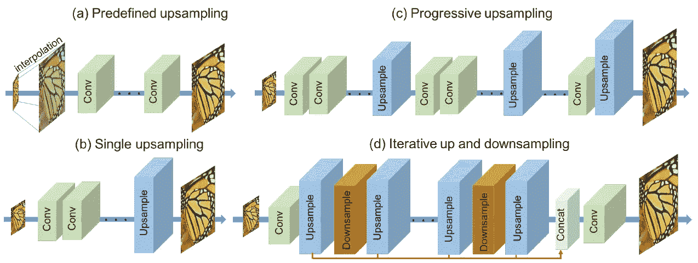

**深网 SR 对比**

*   **(a)预定义的上采样**:通常使用插值作为上采样算子来产生中分辨率(MR)图像。这个模式最早是由 [SRCNN](https://medium.com/coinmonks/review-srcnn-super-resolution-3cb3a4f67a7c?source=post_page---------------------------) 提出的。
*   **(b)单次上采样**:提供简单而有效的方法来提高空间分辨率。这个方法是由 [FSRCNN](https://towardsdatascience.com/review-fsrcnn-super-resolution-80ca2ee14da4?source=post_page---------------------------) 和 [ESPCN](https://medium.com/datadriveninvestor/review-espcn-real-time-sr-super-resolution-8dceca249350?source=post_page---------------------------) 提出的。
*   **(c)渐进上采样**:最近在 [LapSRN](https://towardsdatascience.com/review-lapsrn-ms-lapsrn-laplacian-pyramid-super-resolution-network-super-resolution-c5fe2b65f5e8?source=post_page---------------------------) 中提出。它在一个前馈网络中逐步重建不同尺度的多幅超分辨率图像。
*   **(d)迭代上采样和下采样**:本文提出。DBPN 负责**提高不同深度的超分辨率特征的采样率**和**将计算重建误差的任务分配到各个阶段**。
*   这种模式使网络能够通过学习各种上采样和下采样操作符来保持 HR 成分，同时生成更深层次的特征。

# 2. **DBPN:放映单位**

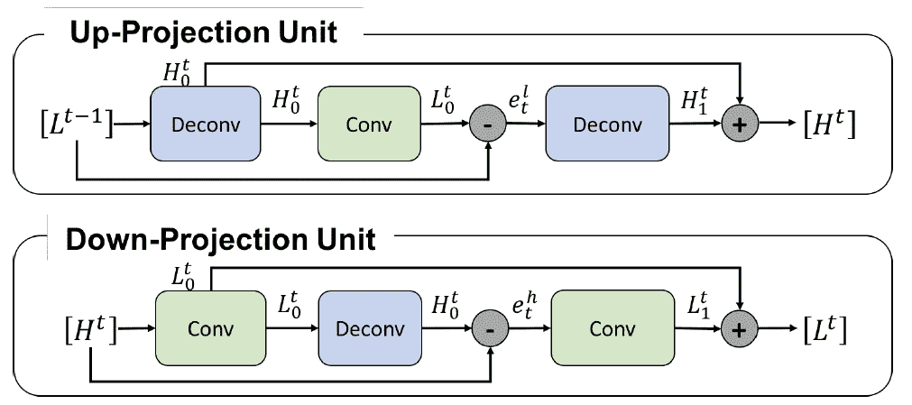

**提议的 DBPN 上下投影装置**

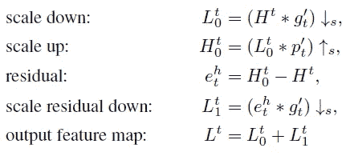

## 2.1.向上投影单元

*   该投影单元将之前计算的 **LR 特征映射 *Lt* -1 作为输入**，**将其映射到一个(中间)HR 映射 *Ht* 0** 。
*   然后，它试图**将其映射回 LR 映射 *Lt* 0("反向投影")**。
*   **观察到的 LR 映射 *Lt* -1 和重构的 *Lt* 0 之间的残差 *elt* 再次映射到 HR，产生新的中间(残差)映射 *Ht* 1。**
*   **该单元的最终输出，即 HR 图 *Ht* ，通过将两个中间 HR 图相加得到。**
*   上图的上半部分说明了这一步。

## 2.1.向下投影单元

*   向下投影单元的定义非常类似，但现在它的工作是**将其输入的 HR 映射 *Ht* 映射到 LR 映射*Lt*，如上图的下半部分所示。**

## 2.3.安排

*   这些投影单元在**的一系列阶段**中，在 H 和 l 之间交替
*   这些投影单元可以被理解为**一种自校正过程，其将投影误差馈送到采样层**并且**通过反馈投影误差**来迭代地改变解决方案。
*   投影单元使用**8×8 和 12×12 等大尺寸滤镜。**通常，避免使用大型过滤器，因为它会降低收敛速度，并可能产生次优结果。
*   在本文中，**我们的投影单元的迭代利用使得网络能够抑制这种限制**，并且即使在浅网络中也能够在大比例因子上执行更好的性能。

# 3.D- **DBPN:密集投影单元**

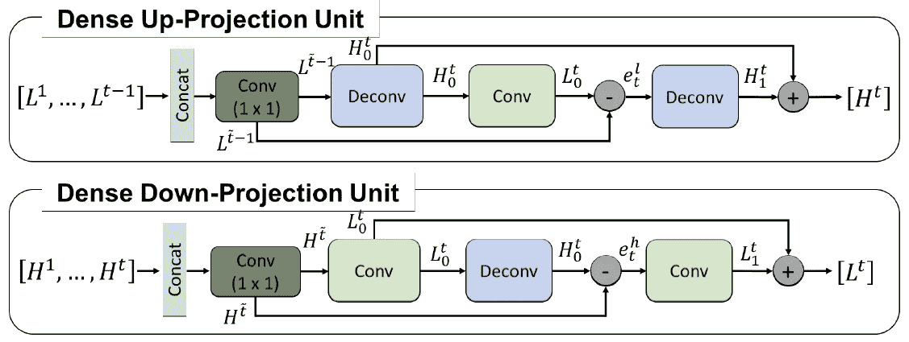

**D-DBPN 中建议的上下投影单元**

*   受 [DenseNet](https://towardsdatascience.com/review-densenet-image-classification-b6631a8ef803?source=post_page---------------------------) 的启发，**稠密连接被引入**称为的投影单元，产生稠密 DBPN (D-DBPN)。
*   但是要避免遗漏和批量规范，因为它们不适合 SR。
*   每个单元的输入是所有先前单元的输出的串联。
*   **1×1 卷积层在进入投影单元前作为特征池和降维。**

# **4。总体 D-DBPN 网络架构&一些细节**

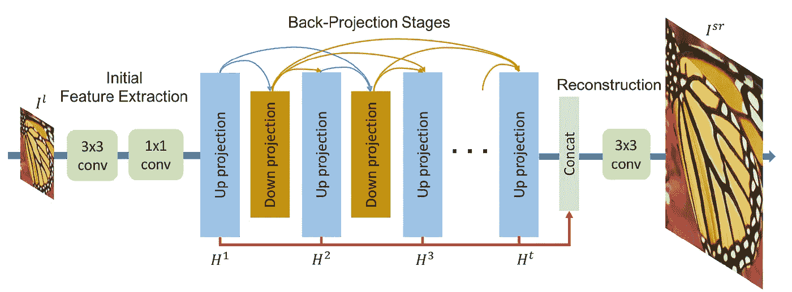

**总体迪 DBPN 网络架构**

## 4.1.DBPN 建筑

*   提出的 D-DBPN 可以分为**三个部分:初始特征提取、投影和重建。**
*   设 conv( *f* ， *n* )为卷积层，其中 *f* 为滤波器大小， *n* 为滤波器个数。
*   **初始特征提取:使用 conv(3， *n* 0)从输入中 I** 初始 LR 特征映射 *L* 0。然后在进入投影步骤之前，使用 conv(1， *nR* )将尺寸从 *n0* 减小到 *nR* 。
*   **反投影阶段:**交替向上投影和向下投影。每个单元都可以访问所有先前单元的输出。
*   **重建**:最后将目标 HR 图像重建为*Isr*=*fRec*(*H*1、 *H* 2、…、 *Ht* )，其中 *fRec* 使用 conv(3，3)作为重建，【 *H* 1、 *H* 2、…、 *Ht* 指

## 4.2.一些细节

*   对于具有 ***T* 级**的网络，我们有**初始提取级(2 层)**，然后是 ***T* 上投影单元**和***-1 下投影单元****、**各有 3 层**，接着是**重建(多一层)**。*
*   *对于**密网**，除了前三个单元外，每个投影单元都增加了 **conv(1， *nR* )。***
*   *对于**的 2 倍放大，使用了 6×6 的卷积层**，具有两个 stridings 和两个 paddings。*
*   *然后， **4 倍放大用一个 8×8 的卷积层**四跨两填充。*
*   *最后， **8 倍放大使用一个 12×12 的卷积层**，具有八个步长和两个填充。*
*   ***使用了 PReLU** 。*
*   *所有的网络都使用来自 DIV2K、Flickr 和 ImageNet 数据集的图像进行训练，而不进行增强。*
*   *为了产生 LR 图像，使用双三次函数在特定的缩放因子上缩小 HR 图像。使用大小为 32×32 的批量大小 20，用于 LR 图像。*

# *5.**消融研究***

## *5.1.深度分析*

*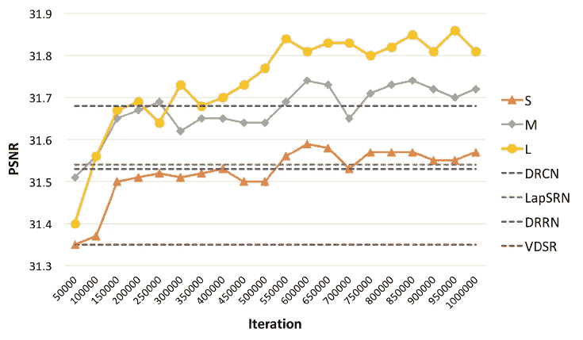*

***dbpn 对 4 倍放大结果的深度分析***

*   *多重网络由原来的 DBPN 构造为 **S ( *T* = 2)、M ( *T* = 4)、L ( *T* = 6)** 。在特征提取中，我们使用 conv(3，128)然后是 conv(1，32)。然后，我们使用 conv(1，1)进行重建。输入和输出图像仅为亮度。*
*   ***S 网络给出了比**[**VDSR**](https://towardsdatascience.com/review-vdsr-super-resolution-f8050d49362f?source=post_page---------------------------)**[**DRCN**](https://medium.com/datadriveninvestor/review-drcn-deeply-recursive-convolutional-network-super-resolution-f0a380f79b20?source=post_page---------------------------)**[**LapSRN**](https://towardsdatascience.com/review-lapsrn-ms-lapsrn-laplacian-pyramid-super-resolution-network-super-resolution-c5fe2b65f5e8?source=post_page---------------------------)**更高的 PSNR。**S 网络仅使用**12 个卷积层，滤波器数量**比 [VDSR](https://towardsdatascience.com/review-vdsr-super-resolution-f8050d49362f?source=post_page---------------------------) 、 [DRCN](https://medium.com/datadriveninvestor/review-drcn-deeply-recursive-convolutional-network-super-resolution-f0a380f79b20?source=post_page---------------------------) 和 [LapSRN](https://towardsdatascience.com/review-lapsrn-ms-lapsrn-laplacian-pyramid-super-resolution-network-super-resolution-c5fe2b65f5e8?source=post_page---------------------------) 少。*****
*   *******M 网胜过所有**[**VDSR**](https://towardsdatascience.com/review-vdsr-super-resolution-f8050d49362f?source=post_page---------------------------)**[**DRCN**](https://medium.com/datadriveninvestor/review-drcn-deeply-recursive-convolutional-network-super-resolution-f0a380f79b20?source=post_page---------------------------)**[**LapSRN**](https://towardsdatascience.com/review-lapsrn-ms-lapsrn-laplacian-pyramid-super-resolution-network-super-resolution-c5fe2b65f5e8?source=post_page---------------------------)**，以及**[**DRRN**](https://towardsdatascience.com/review-drrn-deep-recursive-residual-network-super-resolution-dca4a35ce994?source=post_page---------------------------)**。***********
*   *****总之，M 网络使用与 [**LapSRN**](https://towardsdatascience.com/review-lapsrn-ms-lapsrn-laplacian-pyramid-super-resolution-network-super-resolution-c5fe2b65f5e8?source=post_page---------------------------) **深度相同的 **24 个卷积层。**与 [DRRN](https://towardsdatascience.com/review-drrn-deep-recursive-residual-network-super-resolution-dca4a35ce994?source=post_page---------------------------) (多达 52 个卷积层)相比，M 网络不可否认地显示了我们投影单元的有效性。*******
*   ***最后，**L 网络优于所有方法【31.86 dB，分别比 [VDSR](https://towardsdatascience.com/review-vdsr-super-resolution-f8050d49362f?source=post_page---------------------------) 、 [DRCN](https://medium.com/datadriveninvestor/review-drcn-deeply-recursive-convolutional-network-super-resolution-f0a380f79b20?source=post_page---------------------------) 、 [LapSRN](https://towardsdatascience.com/review-lapsrn-ms-lapsrn-laplacian-pyramid-super-resolution-network-super-resolution-c5fe2b65f5e8?source=post_page---------------------------) 和 [DRRN](https://towardsdatascience.com/review-drrn-deep-recursive-residual-network-super-resolution-dca4a35ce994?source=post_page---------------------------) 好 0.51 dB、0.33 dB、0.32 dB、0.18 dB。*****

***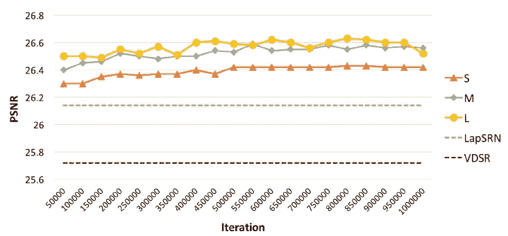***

*****DBPNs 对 8 倍放大结果的深度分析*****

*   ***对于 8 倍放大的结果，每个建议的网络没有明显的性能增益**,尤其是 L 和 M 网络**,其差异仅为 0:04 dB。***

## ***5.2.参数数量***

***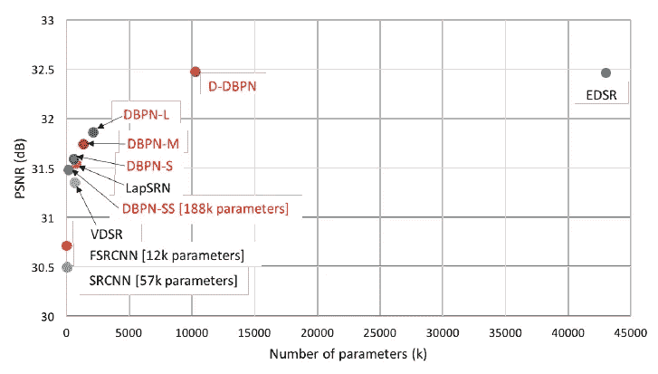***

*****性能与参数数量。使用 4 倍放大的 Set5 数据集对结果进行评估*****

***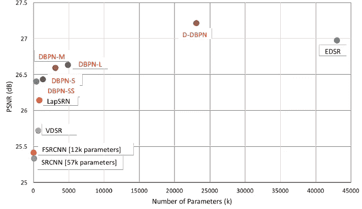***

*****性能与参数数量。使用 8 倍放大的 Set5 数据集对结果进行评估*****

*   ***构建 SS 网络，它是 S 网络的较轻版本，( *T* = 2)，仅使用 conv(3，64)接着 conv(1，18)用于初始特征提取。***
*   ***结果在 4 倍和 8 倍放大上均优于 [SRCNN](https://medium.com/coinmonks/review-srcnn-super-resolution-3cb3a4f67a7c?source=post_page---------------------------) 、 [FSRCNN](https://towardsdatascience.com/review-fsrcnn-super-resolution-80ca2ee14da4?source=post_page---------------------------) 和 [VDSR](https://towardsdatascience.com/review-vdsr-super-resolution-f8050d49362f?source=post_page---------------------------) 。***
*   *****SS 网络比** [**VDSR**](https://towardsdatascience.com/review-vdsr-super-resolution-f8050d49362f?source=post_page---------------------------) **性能更好，在 4 倍和 8 倍放大**上参数分别少 72%和 37%。***
*   *****S 网络在 4 倍放大上比**[**LapSRN**](https://towardsdatascience.com/review-lapsrn-ms-lapsrn-laplacian-pyramid-super-resolution-network-super-resolution-c5fe2b65f5e8?source=post_page---------------------------)**少约 27%的参数和更高的 PSNR。*****
*   ***与放大 4 倍的****相比， **D-DBPN 的参数减少了约 76%，PSNR 也大致相同。*********
*   ***在 8 倍放大的情况下，与 [EDSR](https://medium.com/@sh.tsang/review-edsr-mdsr-enhanced-deep-residual-networks-for-single-image-super-resolution-super-4364f3b7f86f) 相比，D-DBPN 的参数少了约 47%，PSNR 更好。***

## ***5.3.深度串联***

***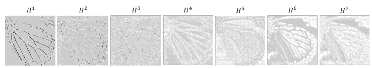***

*****来自 D-DBPN 中上投影单元的激活图样本，其中 t = 7*****

*   *****深度拼接还与 *T*** (反投影阶段)的数量密切相关，它显示了从投影单元生成的更详细的特征，也将提高结果的质量。***
*   ***上图显示**每一阶段都成功生成不同的特征来重建 SR 图像**。***

## ***5.4.密集连接***

***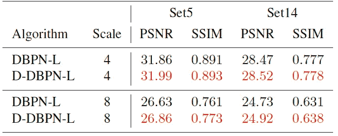***

*****DBPN-L 和 D-DBPN-L 在 4 倍和 8 倍放大下的比较。*****

*   ***在 4 倍放大时，密集网络 D-DBPN-L 在 Set5 和 Set14 上的增益分别比 DBPN-L 高 0.13 dB 和 0.05 dB。***
*   ***在 8×上，差距更大。在 Set5 和 Set14 上，D-DBPN-L 分别比 DBPN-L 高 0.23 dB 和 0.19 dB。***

# *****6。最先进的(SOTA)对比*****

***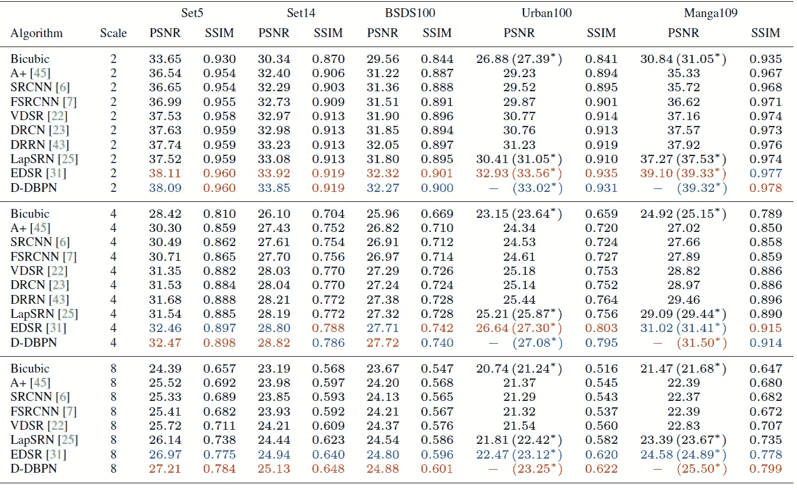***

*****比例因子为 2 倍、4 倍和 8 倍的平均 PSNR/SSIM*****

*   ***评估了 5 个数据集:Set5、Set14、BSDS100、Urban100 和 Manga109。***
*   *****最终的网络，D-DBPN** ，使用 **conv(3，256)然后 conv(1，64)用于初始特征提取**和**T7= 7 用于反投影阶段**。在**重建中，conv(3。3)** 使用。RGB 颜色通道用于输入和输出图像。训练不到四天。***
*   ***如上图所示， **D-DBPN 优于现有的方法，包括**[**Sr CNN**](https://medium.com/coinmonks/review-srcnn-super-resolution-3cb3a4f67a7c?source=post_page---------------------------)**[**fsr CNN**](https://towardsdatascience.com/review-fsrcnn-super-resolution-80ca2ee14da4?source=post_page---------------------------)**[**VDSR**](https://towardsdatascience.com/review-vdsr-super-resolution-f8050d49362f?source=post_page---------------------------)**[**LapSRN**](https://towardsdatascience.com/review-lapsrn-ms-lapsrn-laplacian-pyramid-super-resolution-network-super-resolution-c5fe2b65f5e8?source=post_page---------------------------)**，在除** [外的所有量表中大幅领先](https://medium.com/@sh.tsang/review-edsr-mdsr-enhanced-deep-residual-networks-for-single-image-super-resolution-super-4364f3b7f86f)*********
*   *****对于 2 倍和 4 倍放大，用 [EDSR](https://medium.com/@sh.tsang/review-edsr-mdsr-enhanced-deep-residual-networks-for-single-image-super-resolution-super-4364f3b7f86f) 获得可比的 PSNR。然而， [EDSR](https://medium.com/@sh.tsang/review-edsr-mdsr-enhanced-deep-residual-networks-for-single-image-super-resolution-super-4364f3b7f86f) 的结果倾向于产生比地面真实更强的边缘，并导致误导信息。*****
*   *****在 2 倍放大的 Urban100 中， [EDSR](https://medium.com/@sh.tsang/review-edsr-mdsr-enhanced-deep-residual-networks-for-single-image-super-resolution-super-4364f3b7f86f) 比 D-DBPN 高 0.54 dB。*****
*   *****但是 D-DBPN 在 **8 倍放大**中显示了它的有效性。D-DBPN 大大超过了所有现有的方法。*****
*   *****有趣的结果显示在 Manga109 数据集上，其中 D-DBPN 获得 25.50 dB，比 [EDSR](https://medium.com/@sh.tsang/review-edsr-mdsr-enhanced-deep-residual-networks-for-single-image-super-resolution-super-4364f3b7f86f) 好 0.61 dB。*****
*   *****而在 Urban100 数据集上，D-DBPN 达到了 23.25 dB，仅比 [EDSR](https://medium.com/@sh.tsang/review-edsr-mdsr-enhanced-deep-residual-networks-for-single-image-super-resolution-super-4364f3b7f86f) 好 0.13 dB。*****

**********

*******我们的模型与其他作品在 4 倍超分辨率上的定性比较*******

*   *****上图中睫毛的**[**EDSR**](https://medium.com/@sh.tsang/review-edsr-mdsr-enhanced-deep-residual-networks-for-single-image-super-resolution-super-4364f3b7f86f)**结果显示其被解释为**条纹图案**。另一方面， **D-DBPN 的结果生成了更柔和的模式**，主观上更接近地面真实。*********
*   ***在**蝴蝶**图像上， [**EDSR**](https://medium.com/@sh.tsang/review-edsr-mdsr-enhanced-deep-residual-networks-for-single-image-super-resolution-super-4364f3b7f86f) **分离出白色图案**表明 [**EDSR**](https://medium.com/@sh.tsang/review-edsr-mdsr-enhanced-deep-residual-networks-for-single-image-super-resolution-super-4364f3b7f86f) **倾向于构造圆形、条纹等规则图案**，而 **D-DBPN 构造的图案与地面真实**相同。***

***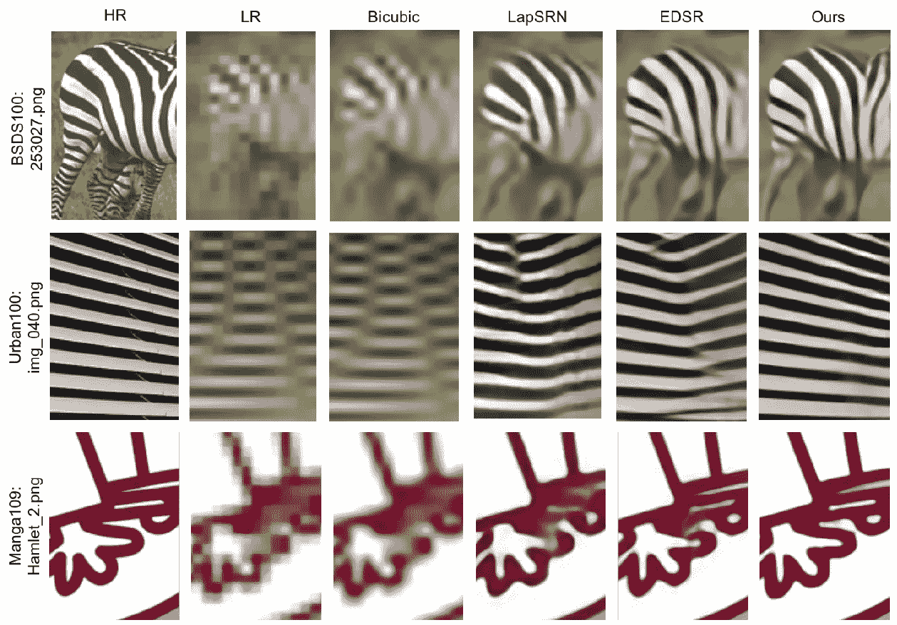***

*****我们的模型与其他作品在 8 倍超分辨率上的定性比较*****

*   ***从质量上来说，D-DBPN 能够比其他网络更好地保留人力资源部分。***
*   ***它表明 **D-DBPN 不仅可以从 LR 输入中提取特征，还可以创建上下文信息，以在大比例因子**的情况下生成 HR 分量，例如 8 **×** 放大。***

> ***在冠状病毒肆虐的日子里，给我一个挑战，这个月再写 30 个故事..？好吃吗？这是这个月的第六个故事了。感谢访问我的故事..***

## ***参考***

***【2018 CVPR】【DBPN & D-DBPN】
[用于超分辨率的深度反投影网络](https://arxiv.org/abs/1803.02735)***

## ***超分辨率***

***)(我)(们)(都)(不)(想)(要)(让)(这)(些)(人)(都)(有)(这)(些)(的)(情)(况)(,)(我)(们)(都)(不)(想)(会)(有)(什)(么)(情)(况)(,)(我)(们)(都)(不)(想)(会)(有)(什)(么)(情)(况)(,)(我)(们)(还)(没)(有)(什)(么)(情)(况)(,)(我)(们)(还)(有)(什)(么)(情)(况)(,)(我)(们)(还)(没)(有)(什)(么)(好)(的)(情)(感)(。 )(我)(们)(都)(不)(知)(道)(,)(我)(们)(还)(不)(知)(道)(,)(我)(们)(还)(有)(些)(不)(知)(道)(的)(情)(况)(,)(我)(们)(还)(不)(知)(道)(,)(我)(们)(还)(是)(不)(知)(道)(,)(我)(们)(还)(是)(不)(知)(道)(,)(我)(们)(还)(不)(知)(道)(。***

## ***[我之前的其他评论](https://medium.com/@sh.tsang/overview-my-reviewed-paper-lists-tutorials-946ce59fbf9e)***

***由[向艾](https://towardsai.net/)发布***