# 复习:DCNv2 —可变形 ConvNets v2(对象检测和实例分割)

> 原文：<https://pub.towardsai.net/review-dcnv2-deformable-convnets-v2-object-detection-instance-segmentation-3d8a18bee2f5?source=collection_archive---------0----------------------->

## 增强的 [DCN / DCNv1](https://towardsdatascience.com/review-dcn-deformable-convolutional-networks-2nd-runner-up-in-2017-coco-detection-object-14e488efce44?source=post_page---------------------------) ，更易变形，效果更好

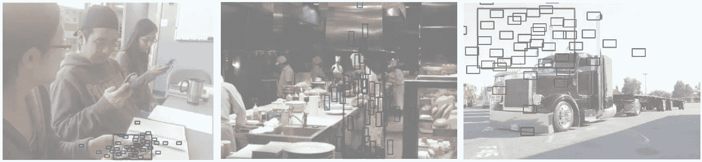

**可变形 RoI 合并**

在这篇文章中，评述了由中国科学技术大学和微软亚洲研究院(MSRA)合作的**可变形 ConvNets v2 (DCNv2)** 。在本文中， **DCNv2 增强了 2017 年 ICCV 发表的** [**DCNv1**](https://towardsdatascience.com/review-dcn-deformable-convolutional-networks-2nd-runner-up-in-2017-coco-detection-object-14e488efce44?source=post_page---------------------------) ，通过**引入多一个调制模块来调制来自不同空间位置/面元**的输入特征幅度。并发表在 **2019 CVPR** 上，引用次数超过 100 次。( [Sik-Ho Tsang](https://medium.com/u/aff72a0c1243?source=post_page-----3d8a18bee2f5--------------------------------) @中)

# 概述

1.  **简评** [**DCNv1**](https://towardsdatascience.com/review-dcn-deformable-convolutional-networks-2nd-runner-up-in-2017-coco-detection-object-14e488efce44?source=post_page---------------------------)
2.  **DCN v2 中的调制可变形模块**
3.  [**R-CNN**](https://medium.com/coinmonks/review-r-cnn-object-detection-b476aba290d1?source=post_page---------------------------) **特征模仿**
4.  **一些分析**
5.  **实验结果**

# **1。简要回顾** [DCNv1](https://towardsdatascience.com/review-dcn-deformable-convolutional-networks-2nd-runner-up-in-2017-coco-detection-object-14e488efce44?source=post_page---------------------------)

## 1.1.可变形卷积

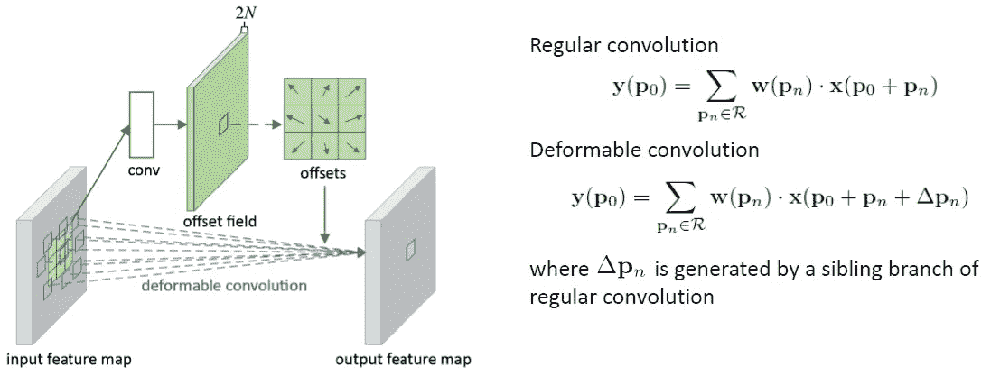

**[**DCN v1**](https://towardsdatascience.com/review-dcn-deformable-convolutional-networks-2nd-runner-up-in-2017-coco-detection-object-14e488efce44?source=post_page---------------------------)中的可变形卷积**

*   **规则卷积是在规则网格 *R* 上操作的。**
*   **可变形卷积运算在 *R* 上进行，但是每个点都增加了一个可学习的偏移量∈*pn*。**
*   **卷积用于生成 2 个 *N 个*对应于 *N 个* 2D 偏移**∈*pn*(*x*-方向和*y*-每个偏移的方向)**的特征图。**

**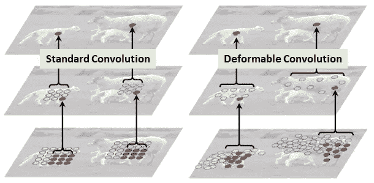**

*   **如上所示，可变形卷积将根据输入图像或特征图为卷积选取不同位置的值。**

## **1.2.可变形 RoI 池**

**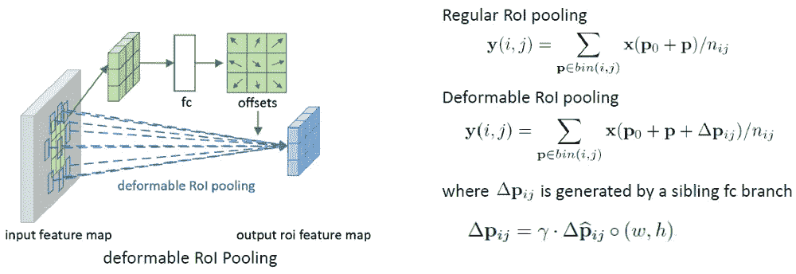**

****可变形 RoI 汇集在** [**DCNv1**](https://towardsdatascience.com/review-dcn-deformable-convolutional-networks-2nd-runner-up-in-2017-coco-detection-object-14e488efce44?source=post_page---------------------------)**

*   **常规 RoI 池将任意大小的输入矩形区域转换为固定大小的特征。**
*   **在可变形 RoI 合并中，**首先，在顶部路径**，我们仍然需要**常规 RoI 合并**来生成合并后的特征图。**
*   **然后，**全连接(fc)层生成归一化偏移****∈*p*̂*ij***和**，然后转换为偏移∈*pij***(右下方的等式)，其中γ=0.1。**
*   **偏移归一化对于使偏移学习不随 RoI 尺寸变化是必要的。**
*   **最后，**在底部路径，**我们执行**可变形 RoI 合并。输出要素地图基于具有增大偏移的区域进行合并。****

# ****2。**在 **DCNv2** 中调制的可变形模块**

## **2.1.DCNv2 中的调制可变形卷积**

*   **在 DCNv2 中，每个样本不仅经历一个学习偏移( [DCNv1](https://towardsdatascience.com/review-dcn-deformable-convolutional-networks-2nd-runner-up-in-2017-coco-detection-object-14e488efce44?source=post_page---------------------------) )，还被**一个学习特征幅度**调制。网络模块因此被给予改变空间分布和**其样本的相对影响**的能力。**

**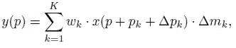**

*   ****δMK 是第 k 个位置**的调制标量。( *K* 是卷积网格内的位置数。)**
*   **调制标量δMK 位于[0，1] 范围内**。****
*   **δPK 和δMK 都是通过应用于相同输入特征映射 x 的单独卷积层获得的。**
*   **该卷积层具有与当前卷积层相同的空间分辨率和膨胀。**
*   **输出为 3K 通道，其中**前 2K 个通道对应于学习到的偏移δPK**，而**剩余的 K 个通道被进一步馈送到 sigmoid 层以获得调制标量δMK**。**

## **2.2.DCNv2 中的调制可变形 RoI 池**

**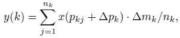**

*   **类似地，在 RoI 合并中，增加δMK 以在学习的偏移位置调制输入特征值的幅度。**

# **3. [R-CNN](https://medium.com/coinmonks/review-r-cnn-object-detection-b476aba290d1?source=post_page---------------------------) **功能模仿****

**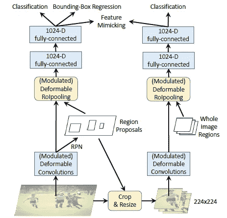**

****网络训练用**[**R-CNN**](https://medium.com/coinmonks/review-r-cnn-object-detection-b476aba290d1?source=post_page---------------------------)**功能模仿****

*   **在可变形的[更快的 R-CNN](https://towardsdatascience.com/review-faster-r-cnn-object-detection-f5685cb30202?source=post_page---------------------------) 的每 RoI 特征上结合了特征模拟损失，以迫使它们类似于从裁剪图像中提取的 [R-CNN](https://medium.com/coinmonks/review-r-cnn-object-detection-b476aba290d1?source=post_page---------------------------) 特征。**
*   **这个辅助训练的目的是为了让**驱动可变形的** [**更快的 R-CNN**](https://towardsdatascience.com/review-faster-r-cnn-object-detection-f5685cb30202?source=post_page---------------------------) **去学习更“专注”的特征表现像** [**R-CNN**](https://medium.com/coinmonks/review-r-cnn-object-detection-b476aba290d1?source=post_page---------------------------) 。**
*   ****特征模仿损失定义在**[**R-CNN**](https://medium.com/coinmonks/review-r-cnn-object-detection-b476aba290d1?source=post_page---------------------------)**的特征和** [**更快 R-CNN**](https://towardsdatascience.com/review-faster-r-cnn-object-detection-f5685cb30202?source=post_page---------------------------) 的特征之间的余弦相似度上:**

**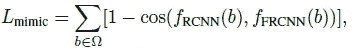**

*   ****网络训练是由特征模仿损失和** [**R-CNN**](https://medium.com/coinmonks/review-r-cnn-object-detection-b476aba290d1?source=post_page---------------------------) **分类损失，连同原损失项在** [**中更快的 R-CNN**](https://towardsdatascience.com/review-faster-r-cnn-object-detection-f5685cb30202?source=post_page---------------------------) **。**新引入的两个损失项的损失权重是原[fast R-CNN](https://towardsdatascience.com/review-faster-r-cnn-object-detection-f5685cb30202?source=post_page---------------------------)损失项的 0.1 倍。**
*   ****在推论中，只有更快的**[**R-CNN**](https://towardsdatascience.com/review-faster-r-cnn-object-detection-f5685cb30202?source=post_page---------------------------)**网络被应用在测试图像上，而没有辅助的**[**R-CNN**](https://medium.com/coinmonks/review-r-cnn-object-detection-b476aba290d1?source=post_page---------------------------)**分支。因此， [R-CNN](https://medium.com/coinmonks/review-r-cnn-object-detection-b476aba290d1?source=post_page---------------------------) 特征模仿在推理中没有引入额外的计算。****

# **4.**一些分析****

**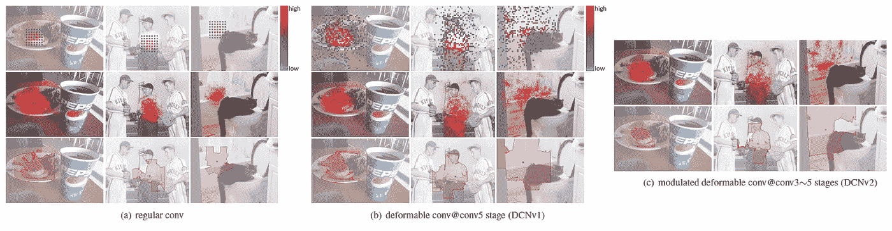**

****第一行:有效采样位置，第二行:有效感受野，第三行:误差限制显著区域**(( c)中省略了有效采样位置，因为它们与(b)中的相似)**

*   ****有效采样位置**:卷积后的采样位置。**
*   ****有效感受野:**并非网络节点感受野内的所有像素都对其响应做出同等贡献。这些贡献的差异由有效感受野表示，其值被计算为节点响应相对于每个图像像素的强度扰动的梯度。**
*   ****误差限制的显著区域**:如果我们移除不影响它的图像区域，网络节点的响应将不会改变，正如最近对图像显著性的研究所示。基于这一特性，我们可以将节点的支持区域确定为在小误差范围内给出与完整图像相同响应的最小图像区域。**
*   ****与** [**DCNv1**](https://towardsdatascience.com/review-dcn-deformable-convolutional-networks-2nd-runner-up-in-2017-coco-detection-object-14e488efce44?source=post_page---------------------------) **相比，DCNv2 中丰富的可变形建模的空间支持展现出对图像内容更好的适应性。****

# **5.**实验结果****

## **5.1.调制可变形 Conv 和调制可变形感兴趣区域池**

**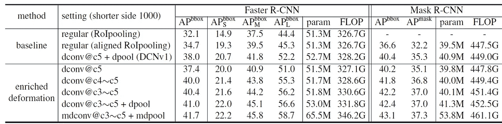**

****COCO 2017 验证集上的对象检测和实例分割(1000 像素的短边作为输入图像)****

*   **[更快的 R-CNN](https://towardsdatascience.com/review-faster-r-cnn-object-detection-f5685cb30202?source=post_page---------------------------) 和[屏蔽 R-CNN](https://medium.com/analytics-vidhya/review-mask-r-cnn-instance-segmentation-human-pose-estimation-61080a93bf4) 和 [ResNet-50](https://towardsdatascience.com/review-resnet-winner-of-ilsvrc-2015-image-classification-localization-detection-e39402bfa5d8?source=post_page---------------------------) 用作基线，如上图所示。**
*   **仅用**普通的 conv** 、[、**更快的 R-CNN** 、](https://towardsdatascience.com/review-faster-r-cnn-object-detection-f5685cb30202?source=post_page---------------------------)、 **: 32.1% AP** 进行物体探测任务。以及 [**屏蔽 R-CNN**](https://medium.com/analytics-vidhya/review-mask-r-cnn-instance-segmentation-human-pose-estimation-61080a93bf4)**:32.2% AP**用于实例分割任务。**
*   **在 conv5 中应用了 [DCNv1](https://towardsdatascience.com/review-dcn-deformable-convolutional-networks-2nd-runner-up-in-2017-coco-detection-object-14e488efce44?source=post_page---------------------------) 中的**可变形 conv** ，在[中使用了**对齐 RoI 池**掩膜 R-CNN](https://medium.com/analytics-vidhya/review-mask-r-cnn-instance-segmentation-human-pose-estimation-61080a93bf4) 、 [**更快 R-CNN**](https://towardsdatascience.com/review-faster-r-cnn-object-detection-f5685cb30202?source=post_page---------------------------)**:38.0% AP**、[**掩膜 R-CNN**](https://medium.com/analytics-vidhya/review-mask-r-cnn-instance-segmentation-human-pose-estimation-61080a93bf4)**:35.3% AP**。**
*   **将 DCNv2 中的**调制可变形 conv** 应用于 conv3 至 conv5，将**调制可变形 RoI 合并**、 [**更快 R-CNN**](https://towardsdatascience.com/review-faster-r-cnn-object-detection-f5685cb30202?source=post_page---------------------------)**:41.7% AP**、[**屏蔽 R-CNN**](https://medium.com/analytics-vidhya/review-mask-r-cnn-instance-segmentation-human-pose-estimation-61080a93bf4)**:37.3% AP**。**

## **5.2. [**R-CNN**](https://medium.com/coinmonks/review-r-cnn-object-detection-b476aba290d1?source=post_page---------------------------) 特征模仿**

**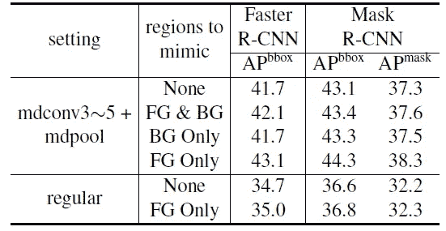**

****特征模仿变体****

*   **仅考虑前景物体的特征进行特征模仿损失，获得最高的 AP。**

## **5.3.主干变体**

**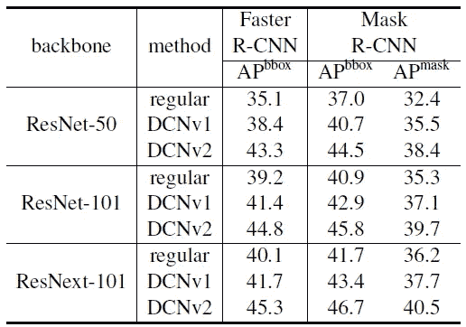**

****主干变异****

*   **有了 [ResNeXt](https://towardsdatascience.com/review-resnext-1st-runner-up-of-ilsvrc-2016-image-classification-15d7f17b42ac?source=post_page---------------------------) 这样更深更好的主干，就获得了更高的 AP。**

## **5.4.ImageNet 图像分类任务**

**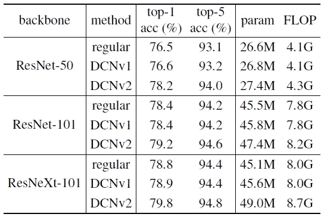**

****验证集的前 1 名和前 5 名分类准确率****

*   **作者还尝试了 ImageNet 图像分类任务。**
*   **DCNv2 在常规和 [DCNv1](https://towardsdatascience.com/review-dcn-deformable-convolutional-networks-2nd-runner-up-in-2017-coco-detection-object-14e488efce44?source=post_page---------------------------) 基线的基础上实现了显著的改进，而额外的计算开销很小。**

# **参考**

**【2019 CVPR】【dcnv 2】
[可变形 ConvNets v2:可变形性更强，效果更好](https://arxiv.org/abs/1811.11168)**

# **目标检测**

**[ [过食](https://medium.com/coinmonks/review-of-overfeat-winner-of-ilsvrc-2013-localization-task-object-detection-a6f8b9044754?source=post_page---------------------------) ] [ [R-CNN](https://medium.com/coinmonks/review-r-cnn-object-detection-b476aba290d1?source=post_page---------------------------) ] [ [快 R-CNN](https://medium.com/coinmonks/review-fast-r-cnn-object-detection-a82e172e87ba?source=post_page---------------------------) ] [ [快 R-CNN](https://towardsdatascience.com/review-faster-r-cnn-object-detection-f5685cb30202?source=post_page---------------------------)][[MR-CNN&S-CNN](https://towardsdatascience.com/review-mr-cnn-s-cnn-multi-region-semantic-aware-cnns-object-detection-3bd4e5648fde?source=post_page---------------------------)][[DeepID-Net](https://towardsdatascience.com/review-deepid-net-def-pooling-layer-object-detection-f72486f1a0f6?source=post_page---------------------------)][[CRAFT](https://towardsdatascience.com/review-craft-cascade-region-proposal-network-and-fast-r-cnn-object-detection-2ce987361858?source=post_page---------------------------)][[R-FCN](https://towardsdatascience.com/review-r-fcn-positive-sensitive-score-maps-object-detection-91cd2389345c?source=post_page---------------------------)][[ION](https://towardsdatascience.com/review-ion-inside-outside-net-2nd-runner-up-in-2015-coco-detection-object-detection-da19993f4766?source=post_page---------------------------)][[multipath ne [TDM](https://medium.com/datadriveninvestor/review-tdm-top-down-modulation-object-detection-3f0efe9e0151?source=post_page---------------------------)][[SSD](https://towardsdatascience.com/review-ssd-single-shot-detector-object-detection-851a94607d11?source=post_page---------------------------)][[DSSD](https://towardsdatascience.com/review-dssd-deconvolutional-single-shot-detector-object-detection-d4821a2bbeb5?source=post_page---------------------------)][[yolo v1](https://towardsdatascience.com/yolov1-you-only-look-once-object-detection-e1f3ffec8a89?source=post_page---------------------------)][[yolo v2/yolo 9000](https://towardsdatascience.com/review-yolov2-yolo9000-you-only-look-once-object-detection-7883d2b02a65?source=post_page---------------------------)][[yolo v3](https://towardsdatascience.com/review-yolov3-you-only-look-once-object-detection-eab75d7a1ba6?source=post_page---------------------------)][[FPN](https://towardsdatascience.com/review-fpn-feature-pyramid-network-object-detection-262fc7482610?source=post_page---------------------------)][[retina net](https://towardsdatascience.com/review-retinanet-focal-loss-object-detection-38fba6afabe4?source=post_page---------------------------)][[DCN/DCN v1](https://towardsdatascience.com/review-dcn-deformable-convolutional-networks-2nd-runner-up-in-2017-coco-detection-object-14e488efce44?source=post_page---------------------------)[[DCN v2](https://medium.com/towards-artificial-intelligence/review-dcnv2-deformable-convnets-v2-object-detection-instance-segmentation-3d8a18bee2f5)**

# **实例分割**

**[[SDS](https://medium.com/datadriveninvestor/review-sds-simultaneous-detection-and-segmentation-instance-segmentation-80b2a8ce842b?source=post_page---------------------------)][[Hypercolumn](https://towardsdatascience.com/review-hypercolumn-instance-segmentation-367180495979?source=post_page---------------------------)][[deep Mask](https://towardsdatascience.com/review-deepmask-instance-segmentation-30327a072339?source=post_page---------------------------)][[sharp Mask](https://towardsdatascience.com/review-sharpmask-instance-segmentation-6509f7401a61?source=post_page---------------------------)][[multipath net](https://towardsdatascience.com/review-multipath-mpn-1st-runner-up-in-2015-coco-detection-segmentation-object-detection-ea9741e7c413?source=post_page---------------------------)][[MNC](https://towardsdatascience.com/review-mnc-multi-task-network-cascade-winner-in-2015-coco-segmentation-instance-segmentation-42a9334e6a34?source=post_page---------------------------)][[instance fcn](https://towardsdatascience.com/review-instancefcn-instance-sensitive-score-maps-instance-segmentation-dbfe67d4ee92?source=post_page---------------------------)][[FCIS](https://towardsdatascience.com/review-fcis-winner-in-2016-coco-segmentation-instance-segmentation-ee2d61f465e2?source=post_page---------------------------)][[Mask R-CNN](https://medium.com/analytics-vidhya/review-mask-r-cnn-instance-segmentation-human-pose-estimation-61080a93bf4)][[DCN v2](https://medium.com/towards-artificial-intelligence/review-dcnv2-deformable-convnets-v2-object-detection-instance-segmentation-3d8a18bee2f5)]**

# **[我之前的其他评论](https://medium.com/@sh.tsang/overview-my-reviewed-paper-lists-tutorials-946ce59fbf9e)**