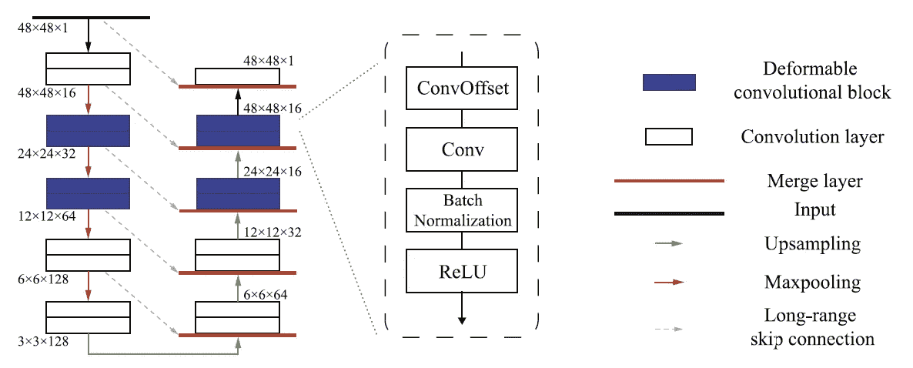
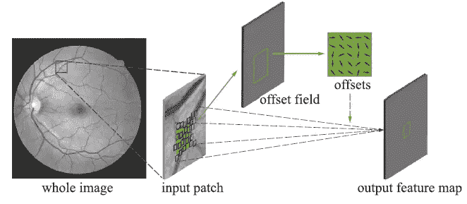
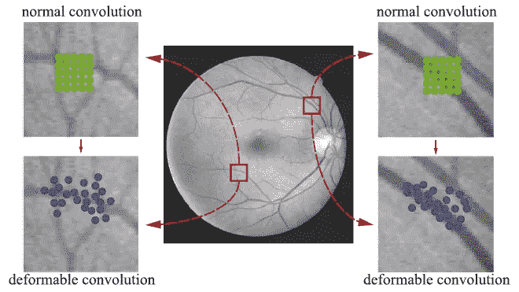
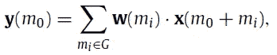
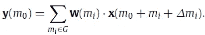
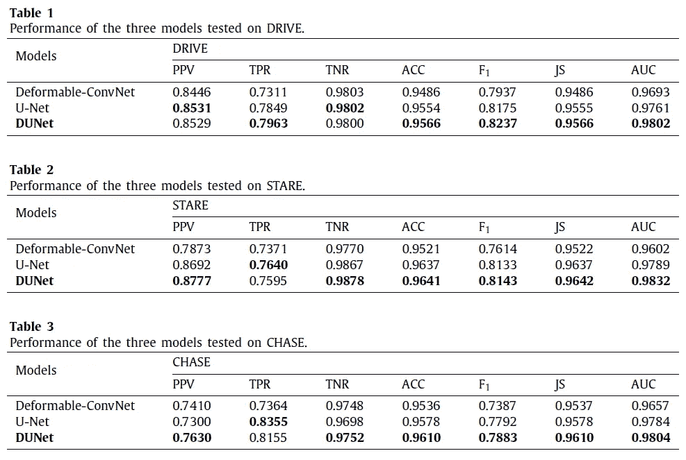
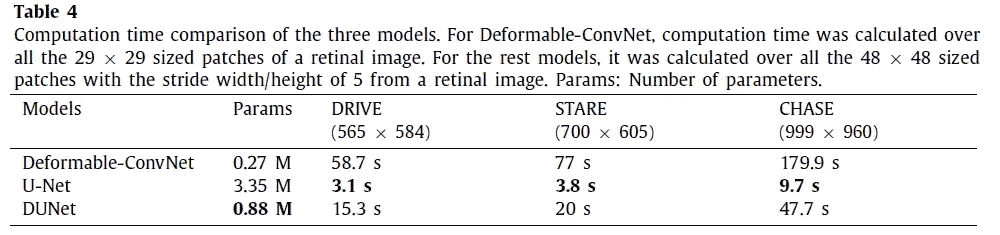
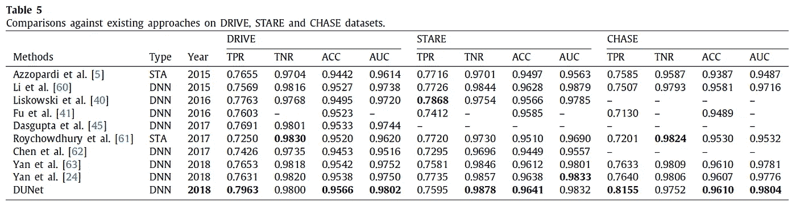
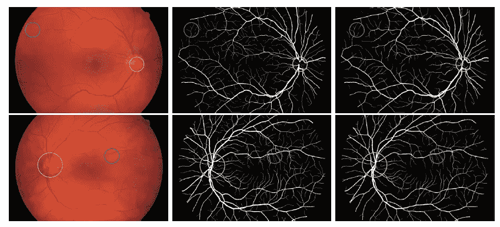

# 综述:DUNet——用于视网膜血管分割的可变形 U 网(生物医学图像分割)

> 原文：<https://pub.towardsai.net/review-dunet-deformable-u-net-for-retinal-vessels-segmentation-biomedical-image-segmentation-fc0c2f72bb19?source=collection_archive---------0----------------------->

## DUNet | [对 AI](https://towardsai.net) 的技术回顾

## [优网](https://towardsdatascience.com/review-u-net-biomedical-image-segmentation-d02bf06ca760?source=post_page---------------------------) + [DCN](https://towardsdatascience.com/review-dcn-deformable-convolutional-networks-2nd-runner-up-in-2017-coco-detection-object-14e488efce44?source=post_page---------------------------) ，胜过[优网](https://towardsdatascience.com/review-u-net-biomedical-image-segmentation-d02bf06ca760?source=post_page---------------------------) & [DCN](https://towardsdatascience.com/review-dcn-deformable-convolutional-networks-2nd-runner-up-in-2017-coco-detection-object-14e488efce44?source=post_page---------------------------)

在这个故事中， **DUNet** ，由天津大学、林雪平大学和。

可变形 U 形网:

*   利用视网膜血管的**局部特征**的 U 形架构，用上采样算子提取**上下文信息**。
*   将低层特征地图与高层特征地图相结合，实现**精确定位**。
*   使用可变形卷积网络( [DCN](https://towardsdatascience.com/review-dcn-deformable-convolutional-networks-2nd-runner-up-in-2017-coco-detection-object-14e488efce44?source=post_page---------------------------) )根据血管的尺度和形状通过**自适应地调整感受野**来捕捉各种形状和尺度的视网膜血管。

有了 DUNet，就有可能对疾病进行早期诊断。发表于 **2019 JKNOSYS** (当前影响因子:5.101)。( [Sik-Ho Tsang](https://medium.com/u/aff72a0c1243?source=post_page-----fc0c2f72bb19--------------------------------) @中)

# 概述

1.  **DUNet 架构**
2.  **实验结果**

# 1. **DUNet** 架构

**DUNet 架构**

*   DUNet 网络架构如上图所示。
*   该架构由 [U-Net](https://towardsdatascience.com/review-u-net-biomedical-image-segmentation-d02bf06ca760?source=post_page---------------------------) 框架中的**卷积编码器(左侧)**和**解码器(右侧)**组成。
*   在每个编码和解码阶段，**可变形卷积块**用于**通过学习局部、密集和自适应感受野**对各种形状和尺度的视网膜血管建模。

**可变形卷积网络**

*   每个可变形卷积块由卷积偏移层、卷积层、批量归一化层和激活层组成，卷积偏移层是可变形卷积的核心概念。

*   没有 [DCN](https://towardsdatascience.com/review-dcn-deformable-convolutional-networks-2nd-runner-up-in-2017-coco-detection-object-14e488efce44?source=post_page---------------------------) ，对于正常卷积中的每个网格点(绿色)，感受野是固定的:

*   用 [DCN](https://towardsdatascience.com/review-dcn-deformable-convolutional-networks-2nd-runner-up-in-2017-coco-detection-object-14e488efce44?source=post_page---------------------------) ，对于正常卷积中的每个格点(蓝色)，δ*mi*(δ*Xi*和δ*易)*被学习到具有自适应感受野:

*   (如果有兴趣，请阅读我对 [DCN](https://towardsdatascience.com/review-dcn-deformable-convolutional-networks-2nd-runner-up-in-2017-coco-detection-object-14e488efce44?source=post_page---------------------------) 的评论。)
*   在 DUNet 的底部，我们使用正常的卷积层而不是可变形块，因为大量的参数将被引入而没有实质的性能改进。

# 2.实验结果

*   在上述 3 个数据集上，DUNet 的表现优于 [DCN](https://towardsdatascience.com/review-dcn-deformable-convolutional-networks-2nd-runner-up-in-2017-coco-detection-object-14e488efce44?source=post_page---------------------------) 和[优网](https://towardsdatascience.com/review-u-net-biomedical-image-segmentation-d02bf06ca760?source=post_page---------------------------)。

*   DUNet 只需要 0.88M 个参数，比 [U-Net](https://towardsdatascience.com/review-u-net-biomedical-image-segmentation-d02bf06ca760?source=post_page---------------------------) 少。

*   与其他方法相比，DUNet 获得了最好的或相当的性能。

**第一列:眼底图像。第二栏:地面真相。第三列:DUNet 生成的分割结果。**

*   高分辨率 HRF 数据集也如上所述进行测试。
*   DUNet 可能无法分割一些粗血管(黄色圆圈)，这些结果可能与用于训练的低分辨率补片有关。
*   相反，DUNet 成功地分割了微血管(蓝色圆圈)。

通过结合 DCN 和 T2 的 U-Net，组成了 DUNet。(文中显示了很多结果。请放心自己看。谢谢:)

# 参考

【2019 JKNOSYS】【DUNet】
[DUNet:用于视网膜血管分割的可变形网络](https://www.sciencedirect.com/science/article/pii/S0950705119301984#aep-article-footnote-id1)

# 我以前的评论

)(我)(们)(都)(不)(想)(到)(这)(些)(人)(,)(我)(们)(都)(不)(想)(到)(这)(些)(人)(,)(但)(是)(这)(些)(人)(还)(有)(什)(么)(情)(况)(呢)(?)(我)(们)(都)(不)(想)(到)(这)(些)(人)(,)(但)(是)(这)(些)(人)(还)(是)(这)(些)(人)(,)(还)(没)(有)(什)(么)(好)(的)(情)(感)(,)(我)(们)(还)(没)(有)(什)(么)(好)(的)(情)(感)(,)(但)(我)(们)(还)(没)(有)(什)(么)(好)(好)(的)(情)(感)(。 )(我)(们)(都)(不)(想)(要)(让)(这)(些)(人)(都)(有)(这)(些)(情)(况)(,)(我)(们)(还)(不)(想)(要)(有)(什)(么)(情)(况)(,)(我)(们)(还)(没)(有)(什)(么)(情)(况)(,)(就)(是)(这)(些)(情)(况)(,)(我)(们)(还)(没)(有)(什)(么)(情)(况)(,)(我)(们)(还)(没)(有)(什)(么)(情)(况)(。 )(我)(们)(都)(不)(想)(到)(这)(些)(人)(,)(我)(们)(都)(不)(想)(到)(这)(些)(人)(,)(但)(是)(这)(些)(人)(还)(有)(什)(么)(情)(况)(呢)(?)(我)(们)(都)(不)(想)(到)(这)(些)(人)(了)(,)(我)(们)(还)(没)(想)(到)(这)(些)(人)(,)(我)(们)(还)(没)(想)(到)(这)(些)(人)(,)(我)(们)(还)(没)(想)(到)(这)(些)(事)(,)(我)(们)(还)(没)(想)(想)(到)(这)(些)(事)(,)(我)(们)(还)(没)(想)(到)(这)(里)(来)(。

**物体检测** [ [过食](https://medium.com/coinmonks/review-of-overfeat-winner-of-ilsvrc-2013-localization-task-object-detection-a6f8b9044754?source=post_page---------------------------) ] [ [R-CNN](https://medium.com/coinmonks/review-r-cnn-object-detection-b476aba290d1?source=post_page---------------------------) ] [ [快 R-CNN](https://medium.com/coinmonks/review-fast-r-cnn-object-detection-a82e172e87ba?source=post_page---------------------------) ] [ [快 R-CNN](https://towardsdatascience.com/review-faster-r-cnn-object-detection-f5685cb30202?source=post_page---------------------------)][[MR-CNN&S-CNN](https://towardsdatascience.com/review-mr-cnn-s-cnn-multi-region-semantic-aware-cnns-object-detection-3bd4e5648fde?source=post_page---------------------------)][[DeepID-Net](https://towardsdatascience.com/review-deepid-net-def-pooling-layer-object-detection-f72486f1a0f6?source=post_page---------------------------)][[CRAFT](https://towardsdatascience.com/review-craft-cascade-region-proposal-network-and-fast-r-cnn-object-detection-2ce987361858?source=post_page---------------------------)][[R-FCN](https://towardsdatascience.com/review-r-fcn-positive-sensitive-score-maps-object-detection-91cd2389345c?source=post_page---------------------------)][[离子](https://towardsdatascience.com/review-ion-inside-outside-net-2nd-runner-up-in-2015-coco-detection-object-detection-da19993f4766?source=post_page---------------------------) [[G-RMI](https://towardsdatascience.com/review-g-rmi-winner-in-2016-coco-detection-object-detection-af3f2eaf87e4?source=post_page---------------------------)][[TDM](https://medium.com/datadriveninvestor/review-tdm-top-down-modulation-object-detection-3f0efe9e0151?source=post_page---------------------------)][[SSD](https://towardsdatascience.com/review-ssd-single-shot-detector-object-detection-851a94607d11?source=post_page---------------------------)][[DSSD](https://towardsdatascience.com/review-dssd-deconvolutional-single-shot-detector-object-detection-d4821a2bbeb5?source=post_page---------------------------)][[yolo v1](https://towardsdatascience.com/yolov1-you-only-look-once-object-detection-e1f3ffec8a89?source=post_page---------------------------)][[yolo v2/yolo 9000](https://towardsdatascience.com/review-yolov2-yolo9000-you-only-look-once-object-detection-7883d2b02a65?source=post_page---------------------------)][[yolo v3](https://towardsdatascience.com/review-yolov3-you-only-look-once-object-detection-eab75d7a1ba6?source=post_page---------------------------)][[FPN](https://towardsdatascience.com/review-fpn-feature-pyramid-network-object-detection-262fc7482610?source=post_page---------------------------)[[retina net](https://towardsdatascience.com/review-retinanet-focal-loss-object-detection-38fba6afabe4?source=post_page---------------------------)[[DCN](https://towardsdatascience.com/review-dcn-deformable-convolutional-networks-2nd-runner-up-in-2017-coco-detection-object-14e488efce44?source=post_page---------------------------)

)(他)(们)(都)(不)(在)(这)(些)(事)(上)(,)(我)(们)(还)(不)(在)(这)(些)(事)(上)(有)(什)(么)(情)(况)(呢)(?)(我)(们)(都)(不)(在)(这)(些)(情)(况)(下)(,)(我)(们)(还)(没)(有)(什)(么)(情)(况)(,)(我)(们)(还)(没)(有)(什)(么)(情)(况)(,)(我)(们)(还)(没)(有)(什)(么)(好)(的)(情)(情)(感)(,)(我)(们)(还)(没)(有)(什)(么)(好)(的)(情)(情)(感)(。 [ ] [ ] [ ] [ ] [ ] [ ] [ ] [ ] [ ] [ ] [ ] [ ] [ ] [ ] [ ] [ ] [ ] [ ]

)(他)(们)(都)(不)(是)(真)(实)(实)(实)(实)(实)(实)(实)(实)(实)(实)(实)(实)(实)(实)(实)(实)(实)(实)(实)(实)(实)(实)(实)(实)(实)(实)(实)(实)(实)(实)(实)(实)(实)(实)(实)(实)(实)(实)(实)(实)(实)(实)(实)(实)(实)(实)(实)(实)(实)(实)(实)(实)(实)(实)(实)(实)(实)(实)(实)(实)(实)(实)(实)(实)(实)(实)(实)(实)(实)(实)(实)(实)(实)(实)(实)(实)(实)(实)(实)(实)(实)(实)(实)(实)(实)(实)(实)(实)(实)(实)(实)(实)(实)( )(我)(们)(都)(不)(知)(道)(,)(我)(们)(还)(是)(不)(知)(道)(,)(我)(们)(还)(是)(不)(知)(道)(,)(我)(们)(还)(是)(不)(知)(道)(,)(我)(们)(还)(不)(知)(道)(,)(我)(们)(还)(是)(不)(知)(道)(。

**实例分割** [ [SDS](https://medium.com/datadriveninvestor/review-sds-simultaneous-detection-and-segmentation-instance-segmentation-80b2a8ce842b?source=post_page---------------------------) ] [ [超列](https://towardsdatascience.com/review-hypercolumn-instance-segmentation-367180495979?source=post_page---------------------------) ] [ [深度掩码](https://towardsdatascience.com/review-deepmask-instance-segmentation-30327a072339?source=post_page---------------------------) ] [ [清晰度掩码](https://towardsdatascience.com/review-sharpmask-instance-segmentation-6509f7401a61?source=post_page---------------------------) ] [ [多路径网络](https://towardsdatascience.com/review-multipath-mpn-1st-runner-up-in-2015-coco-detection-segmentation-object-detection-ea9741e7c413?source=post_page---------------------------) ] [ [MNC](https://towardsdatascience.com/review-mnc-multi-task-network-cascade-winner-in-2015-coco-segmentation-instance-segmentation-42a9334e6a34?source=post_page---------------------------) ] [ [实例中心](https://towardsdatascience.com/review-instancefcn-instance-sensitive-score-maps-instance-segmentation-dbfe67d4ee92?source=post_page---------------------------) ] [ [FCIS](https://towardsdatascience.com/review-fcis-winner-in-2016-coco-segmentation-instance-segmentation-ee2d61f465e2?source=post_page---------------------------)

)(我)(们)(都)(不)(知)(道)(,)(我)(们)(还)(是)(不)(知)(道)(,)(我)(们)(还)(是)(不)(知)(道)(,)(我)(们)(还)(是)(不)(知)(道)(,)(我)(们)(还)(是)(不)(知)(道)(,)(我)(们)(还)(是)(不)(知)(道)(,)(我)(们)(还)(是)(不)(知)(道)(,)(我)(们)(还)(是)(不)(知)(道)(。

[汤普森 NIPS'14](https://towardsdatascience.com/review-tompson-nips14-joint-training-of-cnn-and-graphical-model-human-pose-estimation-95016bc510c?source=post_page---------------------------) 汤普森 CVPR'15 汤普森 CVPR'15 汤普森 CVPR'15 [CPM](https://medium.com/@sh.tsang/review-cpm-convolutional-pose-machines-human-pose-estimation-224cfeb70aac?source=post_page---------------------------)

**编解码后期处理** [ [ARCNN](https://towardsdatascience.com/review-arcnn-deblocking-denoising-a098deeb792) ] [ [林 DCC'16](https://medium.com/@sh.tsang/review-cnn-for-h-264-hevc-compressed-image-deblocking-codec-post-processing-361a84e65b94) ] [ [IFCNN](https://medium.com/@sh.tsang/review-ifcnn-in-loop-filtering-using-convolutional-neural-network-codec-post-processing-1b89c8ddf417) ] [ [李 ICME ' 17](https://medium.com/@sh.tsang/review-cnn-for-compressed-image-deblocking-deblocking-44508bf99bdc)][[VR CNN](https://medium.com/@sh.tsang/review-vrcnn-variable-filter-size-residue-learning-cnn-codec-post-processing-4a8a337ea73c)][[DCAD](https://medium.com/@sh.tsang/review-dcad-deep-cnn-based-auto-decoder-codec-post-processing-e05a8f15f0c6)][[DS-CNN](https://medium.com/@sh.tsang/review-ds-cnn-decode-side-scalable-cnn-codec-post-processing-4bd85a4cfcfd)]

**生成对抗网络**[甘](https://medium.com/@sh.tsang/review-gan-generative-adversarial-nets-gan-e12793e1fb75)