# 点评:G-RMI——2016 年 COCO 关键点检测挑战赛亚军(人体姿态估计)

> 原文：<https://pub.towardsai.net/review-g-rmi-1st-runner-up-in-coco-keypoint-detection-challenge-2016-human-pose-estimation-6c8d250f62a0?source=collection_archive---------0----------------------->

## 两阶段自顶向下的方法:首先，人检测。然后，关键点检测。

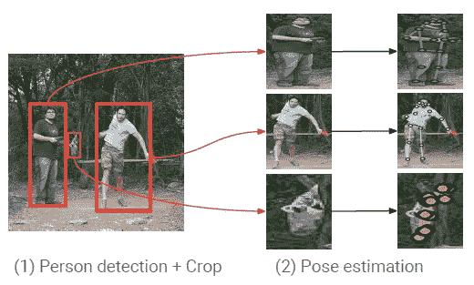

**两阶段方法**

在这个故事中，回顾了 **Google Inc.** 的 **G-RMI** 用于人物关键点检测或人体姿态估计。G-RMI、 **Google Research 和 Machine Intelligence** 应该是团队名称而不是方法名称。

为了检测多人并估计姿态，提出了一种两阶段方法。

*   首先，使用[更快的 R-CNN](https://towardsdatascience.com/review-faster-r-cnn-object-detection-f5685cb30202?source=post_page---------------------------) 检测多人。
*   然后用全卷积 [ResNet](https://towardsdatascience.com/review-resnet-winner-of-ilsvrc-2015-image-classification-localization-detection-e39402bfa5d8?source=post_page---------------------------) 检测每个人的关键点。

这是 **2017 年 CVPR** 论文，引用超过 **200 次**。( [Sik-Ho Tsang](https://medium.com/u/aff72a0c1243?source=post_page-----6c8d250f62a0--------------------------------) @中)

# 概述

1.  **人箱检测**
2.  **人物姿势估计**
3.  **消融研究**
4.  **与 SOTA 方法的比较**

# 1.人物箱检测

*   [**更快 R-CNN**](https://towardsdatascience.com/review-faster-r-cnn-object-detection-f5685cb30202?source=post_page---------------------------) 被使用。
*   [**ResNet-101**](https://towardsdatascience.com/review-resnet-winner-of-ilsvrc-2015-image-classification-localization-detection-e39402bfa5d8?source=post_page---------------------------) 用作主干。
*   阿特鲁卷积(请参考[deeplab v1&deeplab v2](https://towardsdatascience.com/review-deeplabv1-deeplabv2-atrous-convolution-semantic-segmentation-b51c5fbde92d?source=post_page---------------------------))用于具有 8 的步幅，而不是默认的 32。
*   由 ImageNet 预先训练。
*   然后，**仅使用 COCO 数据集中的人类别来训练网络，**并且忽略剩余 79 个 COCO 类别的框注释。
*   不使用多尺度评估或模型集合。

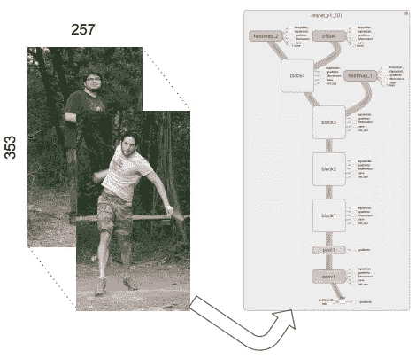

*   在人检测之后，检测到的框将被输入到 CNN 用于人姿态估计，这将在下面提到。

# 2.人姿态估计

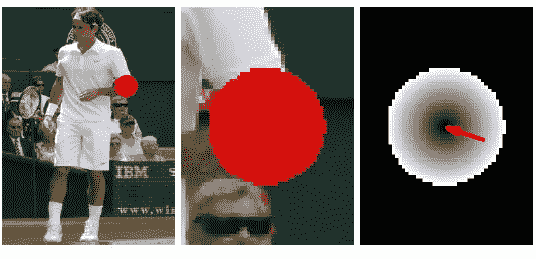

网络目标输出(3 个通道)。**左&中**:左肘关键点的热图目标。**右侧**:偏移场 L2 量级(以灰度显示)和二维偏移矢量(红色)

*   使用组合的分类和回归方法。
*   网络**首先分类它是否在 K 个关键点的每一个附近**(我们称之为“热图”)。
*   **然后预测一个二维局部偏移向量，以获得相应关键点位置的更精确估计**。

## 2.1.图像裁剪

*   首先，让所有的盒子都有相同的固定纵横比。
*   然后，在评估期间使用等于 1.25 的重新标度因子，在训练期间使用介于 1.0 和 1.5 之间的随机重新标度因子(用于数据扩充)。
*   接下来，从结果框中裁剪图像，并调整为固定的高度 353 和宽度 257 像素。(长宽比为 1.37)

## 2.2.热图和偏移预测

*   全卷积 [ResNet-101](https://towardsdatascience.com/review-resnet-winner-of-ilsvrc-2015-image-classification-localization-detection-e39402bfa5d8?source=post_page---------------------------) 用于为**总共 3 个 *K* 输出通道**产生热图(每个关键点一个通道)和偏移(每个关键点两个通道，用于 x 和 y 方向)，其中 *K* = 17 是关键点的数量。
*   使用 ImageNet 预训练的 [ResNet-101](https://towardsdatascience.com/review-resnet-winner-of-ilsvrc-2015-image-classification-localization-detection-e39402bfa5d8?source=post_page---------------------------) 模型，用 1×1 卷积替换其最后一层，得到 3 个 *K* 输出。
*   阿特鲁卷积(请参考[deeplabv 1&deeplabv 2](https://towardsdatascience.com/review-deeplabv1-deeplabv2-atrous-convolution-semantic-segmentation-b51c5fbde92d?source=post_page---------------------------))用于 8 步。
*   双线性上采样用于将网络输出放大回 353×257 的作物尺寸。

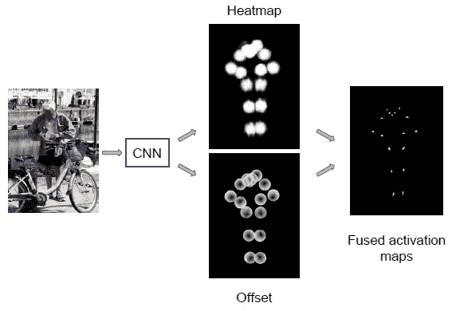

**CNN 的两个输出头**

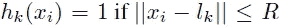

*   **第一个头**:一个 sigmoid 函数，产生**每个位置 *xi* 和每个关键点 *k* 的热图概率 *hk* ( *xi* )** 。
*   *hk* ( *xi* )是点 *xi* 在从第 *k* 个关键点的位置 *lk* 开始半径为 *R* 的圆盘内的概率。如果在 *R* 之外， *hk* ( *xi* )=0。
*   相应的损失函数 *Lh* 分别是每个位置和关键点的逻辑损失之和。
*   此外，在 [ResNet](https://towardsdatascience.com/review-resnet-winner-of-ilsvrc-2015-image-classification-localization-detection-e39402bfa5d8?source=post_page---------------------------) 的中间层 50 增加了一个额外的热图预测层作为辅助损失项来加速训练过程。
*   **第二个头**:这是一个补偿回归头，补偿预测和地面真实补偿之间的差异。

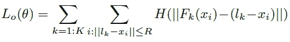

*   休伯鲁棒损失 *H* ( *u* )被使用，其中 *Fk* ( *xi* )是预测的 2-D 偏移向量。
*   最后，最终的损失函数是:

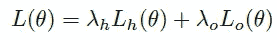

*   其中 *λh* 和 *λo* 分别为 4 和 1。

## 2.3.基于 OKS 的非最大抑制

*   标准方法使用盒的交集(IoU)来测量重叠，并移除冗余盒。
*   现在， **G-RMI 使用两个候选姿态检测的对象关键点相似性(OKS)来测量重叠**。
*   **相对较高的 IOU-NMS 阈值(0.6)** 被用在人物框检测器的输出端，以**过滤高度重叠的框**。
*   这更适合于确定两个候选检测是对应于假阳性(同一个人的双重检测)还是真阳性(两个人彼此非常接近)。

# 3.消融研究

## 3.1.盒子检测模块

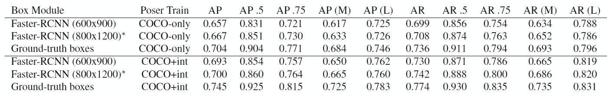

**可可关键点迷你瓦尔**

*   **COCO-only** :仅使用 COCO 进行训练。
*   **COCO+Int** :带有附加 Flickr 图片的 COCO，用于训练。
*   测试了一种快速 600x900 变体，它使用小边 600 像素和大边 900 像素的输入图像
*   还测试了使用小边 800 像素和大边 1200 像素的输入图像的精确 800x1200 变体。
*   **使用准确** [**快速 R-CNN**](https://towardsdatascience.com/review-faster-r-cnn-object-detection-f5685cb30202?source=post_page---------------------------) **(800x1200)盒式探测器**。

## 3.2.姿态估计模块

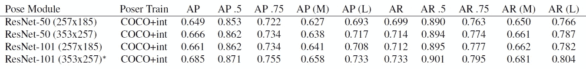

**COCO 关键点测试开发**

*   较小(257x185)可获得更快的推断速度，较大(353x257)可获得更高的准确性。
*   **使用精确的**[**ResNet-101**](https://towardsdatascience.com/review-resnet-winner-of-ilsvrc-2015-image-classification-localization-detection-e39402bfa5d8?source=post_page---------------------------)**(353 x257)姿态估计器**，盘半径 R = 25 像素。

## 3.3.基于 OKS 的非最大抑制

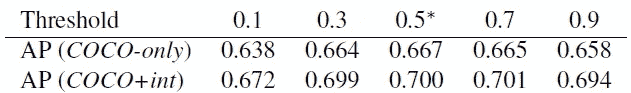

*   在后来的所有实验中，人箱检测器输出端的 IOU-NMS 阈值保持固定在 0.6。
*   对于总部位于 OKS 的 NMS 来说，0.5 的数值也不错。

# 4.与 SOTA 方法的比较

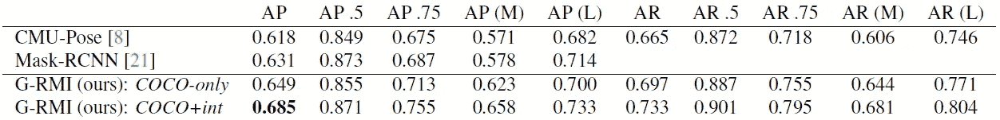

**COCO 关键点测试开发**

*   G-RMI(仅限可可)胜过 CMU-Pose 和面具 R-CNN。
*   G-RMI (COCO-Int)获得了更高的 AP 值 0.685。

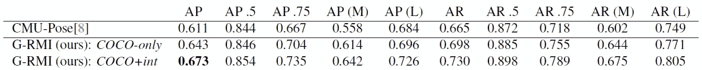

**COCO 关键点测试-标准**

*   再次，G-RMI(可可唯一)优于 CMU 姿势。
*   而 G-RMI (COCO-Int)获得了 0.673 的甚至更高的 AP。

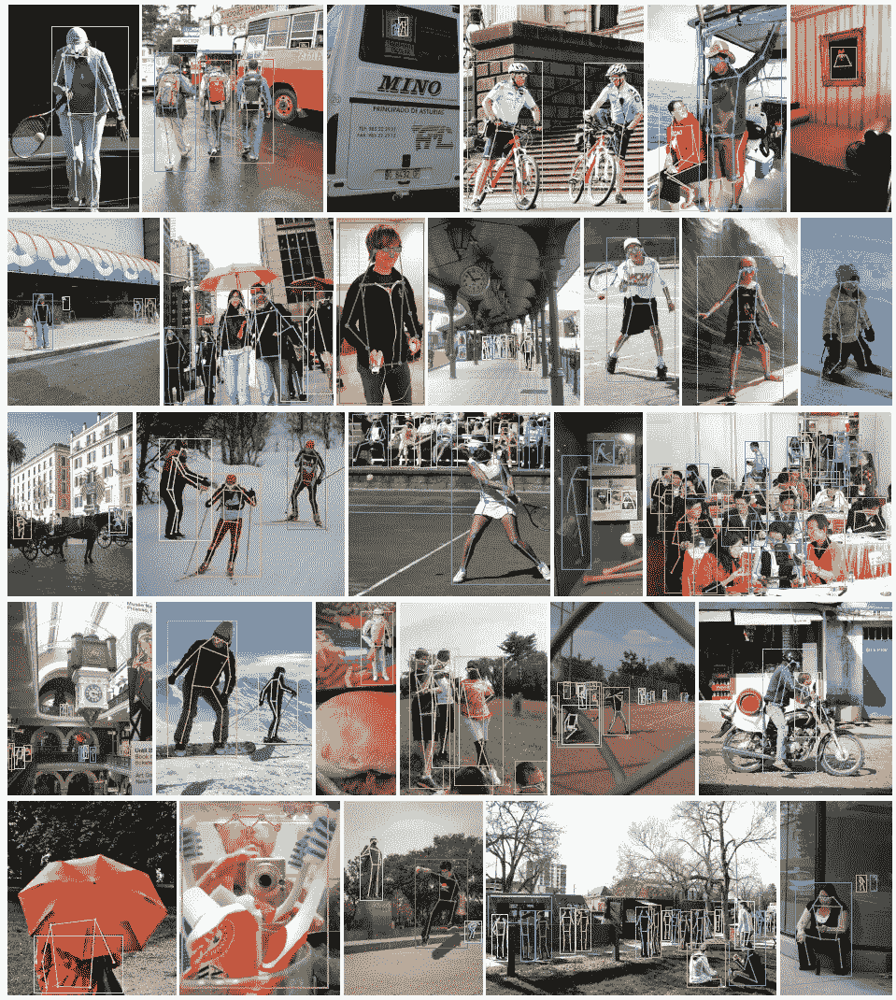

**定性结果**

*   非常杂乱的场景(第三排，最右边和最后一排，右边)
*   闭塞(最后一排，左)和幻觉闭塞的关节。
*   一些假阳性检测实际上是正确的，因为它们代表人(第一排，中间)或玩具(第四排，中间)的照片。
*   我希望将来我能回顾 CMU-Pose/OpenPose 和面具 R-CNN。

## 参考

【2017 CVPR】【G-RMI】
[走向野外精确多人姿态估计](https://arxiv.org/abs/1701.01779)

# 我以前对人体姿态估计的评论

**人体姿态估计**[deep Pose](https://towardsdatascience.com/review-deeppose-cascade-of-cnn-human-pose-estimation-cf3170103e36?source=post_page---------------------------)】[汤普逊 NIPS ' 14](https://towardsdatascience.com/review-tompson-nips14-joint-training-of-cnn-and-graphical-model-human-pose-estimation-95016bc510c?source=post_page---------------------------)】[汤普逊 CVPR ' 15](https://towardsdatascience.com/review-tompson-cvpr15-spatial-dropout-human-pose-estimation-c7d6a5cecd8c?source=post_page---------------------------)[CPM](https://medium.com/@sh.tsang/review-cpm-convolutional-pose-machines-human-pose-estimation-224cfeb70aac?source=post_page---------------------------)[FCGN](https://medium.com/@sh.tsang/review-fcgn-fully-convolutional-google-net-human-pose-estimation-52022a359cb3)[IEF](https://medium.com/towards-artificial-intelligence/review-ief-iterative-error-feedback-human-pose-estimation-a56add160fa5)][deep cut&DeeperCut](https://medium.com/@sh.tsang/review-deepcut-deepercut-multi-person-pose-estimation-human-pose-estimation-da5b469cbbc3)[纽维尔 ECCV'16 &纽维尔 POCV ' 16](https://towardsdatascience.com/review-newell-eccv16-and-newell-pocv-16-stacked-hourglass-networks-human-pose-estimation-a9eeb76d40a5)

## [我之前的其他评论](https://medium.com/@sh.tsang/overview-my-reviewed-paper-lists-tutorials-946ce59fbf9e)