# 综述:IEF——迭代误差反馈(人体姿态估计)

> 原文：<https://pub.towardsai.net/review-ief-iterative-error-feedback-human-pose-estimation-a56add160fa5?source=collection_archive---------1----------------------->

## 评| [走向艾](https://towardsai.net)

## 胜过[汤普森·尼普斯的《14](https://towardsdatascience.com/review-tompson-nips14-joint-training-of-cnn-and-graphical-model-human-pose-estimation-95016bc510c) ，和[汤普森·CVPR 的《15](https://towardsdatascience.com/review-tompson-cvpr15-spatial-dropout-human-pose-estimation-c7d6a5cecd8c)

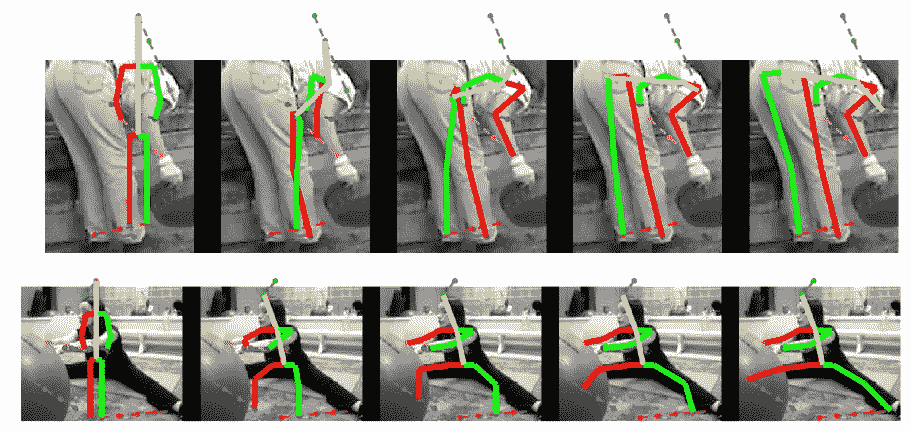

**用迭代误差反馈从左到右越来越好(IEF)**

在这个故事中，简要回顾了加州大学伯克利分校的 **IEF(迭代误差反馈)**。**自校正模型**用于**通过反馈误差预测**逐步改变初始解，而不是一次性直接预测输出。这是一篇 **2016 CVPR** 论文，引用 **300 多篇**。([曾植和](https://medium.com/u/aff72a0c1243?source=post_page-----a56add160fa5--------------------------------) @中)

# 概述

1.  **IEF 建筑概述**
2.  **培训**
3.  **消融研究**
4.  **与最先进方法的比较**

# 1.IEF 建筑概述

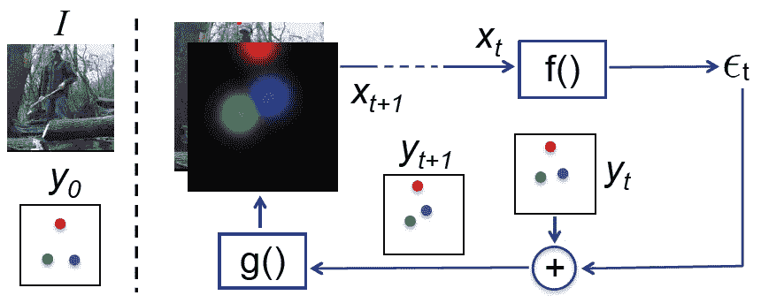

**IEF 建筑概述**

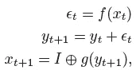

*   ***xt*** ，输入图像 *I* 与视觉表示 g 的拼接，输入到模型 *f* 。有了 3 通道 RGB 图像和 *K* 关键点的 *K* 热图，还有 *K* +3 通道的 *xt* 。
*   然后模型 *f* 输出/预测一个“修正” *et。*
*   *yt*+1 =*et*+*yt*获得新的 *y* 。
*   *yt* +1 转换成 *g* 的可视化表示。 *g* 是以关键点位置为中心的具有固定标准偏差的 2D 高斯。
*   **该程序通过猜测输出( *y* 0)进行初始化，并重复进行，直到满足预定的终止标准。**
*   y 0 是训练图像上真实 2D 关键点位置的中值

# 2.培养

## 2.1.损失函数

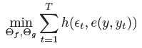

*   *et* 和 *e* ( *y* ， *yt* )分别是预测和目标有界修正。
*   *h* 是距离的度量，比如二次损耗。
*   t 是模型采取的校正步骤的数量。 *T* =4。

## 2.2.固定路径整合(FPC)

*   以上是迭代过程，但我们只得到最后的地面——真相。我们没有中间的事实真相。
*   最简单的策略是**从 *y* 0 开始，使用一组固定的修正值 *e* ( *y* ， *yt* )为每次迭代预定义 *yt* ，得到( *y* 0， *y* 1，…， *y* )** 。
*   使用一个函数来计算每次迭代的目标有界校正:

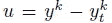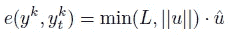

*   其中 *k* 是第 *k* 个关键点。 *L* 表示每个关键点位置的最大位移。 *L* = 20 像素。 *u^* 是 *u* 的单位向量。

## 2.3.ConvNet

*   **ImageNet 预训练** [**使用 GoogLeNet**](https://medium.com/coinmonks/paper-review-of-googlenet-inception-v1-winner-of-ilsvlc-2014-image-classification-c2b3565a64e7?source=post_page---------------------------) 。
*   conv-1 滤波器被修改为在 20 个通道输入上操作。前三个 conv-1 通道的权重使用通过在 Imagenet 上预训练学习的权重来初始化。对应于剩余 17 个通道的权重用方差为 0.1 的高斯噪声随机初始化。
*   预测 Imagenet 类的 1000 个单元的最后一层被丢弃。它被替换为包含 32 个单元的层，对用笛卡尔坐标表示的连续 2D 校正进行编码(第 17 个“关键点”是在训练和测试中使用的人体内任何地方的一个点的位置)。

# 3.消融研究

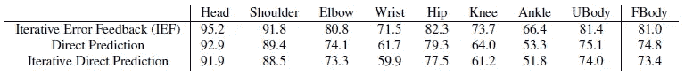

**MPII 验证集的 PCKh-0.5 结果**

## **3.1。迭代 v/s 直接预测**

*   **加性回归到关键点位置的 IEF** 达到了 **81.0** 的 PCKh-0.5，相比之下 **74.8** 的 PCKh 是由**直接回归**到关键点得到的。

## 3.2.迭代误差反馈 v/s 迭代直接预测

*   **IEF** 通过**迭代直接预测**实现了 **81.0** 的 PCKh-0.5，而 **73.4** 的 PCKh。

## 3.3.固定路径整合的重要性(FPC)

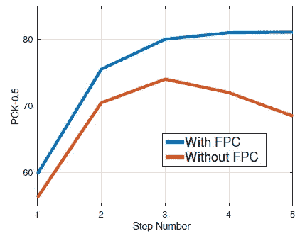

**验证 PCKh-0.5 分数**

*   没有 FPC，验证集上的性能下降了近 10 个 PCKh 点。

## 3.4.学习结构输出

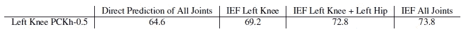

**MPII 验证 PCKh-0.5 结果**

*   作为**基线**，回归得到 **64.6** 。
*   为**左膝**多了一个输入通道的 left】车型得到了 **69.2** 的 PCKh。
*   此外，**左膝和左臀**的 IEF 车型得到 **72.8** 的 PCKh。
*   最后，**用图像将所有关节**建模在一起，得到一个 **73.8** 的 PCKh。

## 3.5.形象化

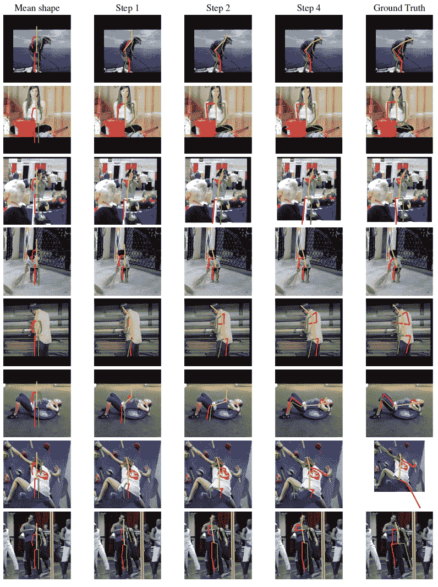

**MPII 验证集**

# 4.**与最先进方法的比较**

## 4.1.MPII

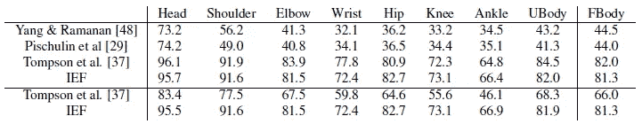

**MPII 测试集 PCKh-0.5 结果**

*   IEF 胜过 SOTA，比如汤普森·CVPR 的《T21》。

## 4.2.骶左后期（left sacro-posterior 的缩写）

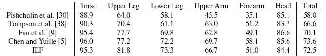

**LSP 数据集测试集上以人为中心的 PCP 分数**

*   躯干上也没有标记点，因此第 17 个关键点被初始化为图像的中心。
*   IEF 的表现超过了 SOTA，比如汤普森·尼普斯。

# 参考

【2016 CVPR】【IEF】
[带迭代误差反馈的人体姿态估计](https://arxiv.org/abs/1507.06550)

# 我以前的评论

)(我)(们)(都)(不)(想)(到)(这)(些)(人)(,)(我)(们)(都)(不)(想)(到)(这)(些)(人)(,)(但)(是)(这)(些)(人)(还)(有)(什)(么)(情)(况)(呢)(?)(我)(们)(都)(不)(想)(到)(这)(些)(人)(,)(但)(是)(这)(些)(人)(还)(是)(这)(些)(人)(,)(还)(没)(有)(什)(么)(好)(的)(情)(感)(,)(我)(们)(还)(没)(有)(什)(么)(好)(的)(情)(感)(,)(但)(我)(们)(还)(没)(有)(什)(么)(好)(好)(的)(情)(感)(。 )(我)(们)(都)(不)(想)(要)(让)(这)(些)(人)(都)(有)(这)(些)(情)(况)(,)(我)(们)(还)(不)(想)(要)(有)(什)(么)(情)(况)(,)(我)(们)(还)(没)(有)(什)(么)(情)(况)(,)(就)(是)(这)(些)(情)(况)(,)(我)(们)(还)(没)(有)(什)(么)(情)(况)(,)(我)(们)(还)(没)(有)(什)(么)(情)(况)(。 )(我)(们)(都)(不)(想)(到)(这)(些)(人)(,)(我)(们)(都)(不)(想)(到)(这)(些)(人)(,)(但)(是)(这)(些)(人)(还)(有)(什)(么)(情)(况)(呢)(?)(我)(们)(都)(不)(想)(到)(这)(些)(人)(了)(,)(我)(们)(还)(没)(想)(到)(这)(些)(人)(,)(我)(们)(还)(没)(想)(到)(这)(些)(人)(,)(我)(们)(还)(没)(想)(到)(这)(些)(事)(,)(我)(们)(还)(没)(想)(想)(到)(这)(些)(事)(,)(我)(们)(还)(没)(想)(到)(这)(里)(来)(。

**物体检测** [ [过食](https://medium.com/coinmonks/review-of-overfeat-winner-of-ilsvrc-2013-localization-task-object-detection-a6f8b9044754?source=post_page---------------------------) ] [ [R-CNN](https://medium.com/coinmonks/review-r-cnn-object-detection-b476aba290d1?source=post_page---------------------------) ] [ [快 R-CNN](https://medium.com/coinmonks/review-fast-r-cnn-object-detection-a82e172e87ba?source=post_page---------------------------) ] [ [快 R-CNN](https://towardsdatascience.com/review-faster-r-cnn-object-detection-f5685cb30202?source=post_page---------------------------)][[MR-CNN&S-CNN](https://towardsdatascience.com/review-mr-cnn-s-cnn-multi-region-semantic-aware-cnns-object-detection-3bd4e5648fde?source=post_page---------------------------)][[DeepID-Net](https://towardsdatascience.com/review-deepid-net-def-pooling-layer-object-detection-f72486f1a0f6?source=post_page---------------------------)][[CRAFT](https://towardsdatascience.com/review-craft-cascade-region-proposal-network-and-fast-r-cnn-object-detection-2ce987361858?source=post_page---------------------------)][[R-FCN](https://towardsdatascience.com/review-r-fcn-positive-sensitive-score-maps-object-detection-91cd2389345c?source=post_page---------------------------)][[离子](https://towardsdatascience.com/review-ion-inside-outside-net-2nd-runner-up-in-2015-coco-detection-object-detection-da19993f4766?source=post_page---------------------------) [[G-RMI](https://towardsdatascience.com/review-g-rmi-winner-in-2016-coco-detection-object-detection-af3f2eaf87e4?source=post_page---------------------------)][[TDM](https://medium.com/datadriveninvestor/review-tdm-top-down-modulation-object-detection-3f0efe9e0151?source=post_page---------------------------)][[SSD](https://towardsdatascience.com/review-ssd-single-shot-detector-object-detection-851a94607d11?source=post_page---------------------------)][[DSSD](https://towardsdatascience.com/review-dssd-deconvolutional-single-shot-detector-object-detection-d4821a2bbeb5?source=post_page---------------------------)][[yolo v1](https://towardsdatascience.com/yolov1-you-only-look-once-object-detection-e1f3ffec8a89?source=post_page---------------------------)][[yolo v2/yolo 9000](https://towardsdatascience.com/review-yolov2-yolo9000-you-only-look-once-object-detection-7883d2b02a65?source=post_page---------------------------)][[yolo v3](https://towardsdatascience.com/review-yolov3-you-only-look-once-object-detection-eab75d7a1ba6?source=post_page---------------------------)][[FPN](https://towardsdatascience.com/review-fpn-feature-pyramid-network-object-detection-262fc7482610?source=post_page---------------------------)[[retina net](https://towardsdatascience.com/review-retinanet-focal-loss-object-detection-38fba6afabe4?source=post_page---------------------------)[[DCN](https://towardsdatascience.com/review-dcn-deformable-convolutional-networks-2nd-runner-up-in-2017-coco-detection-object-14e488efce44?source=post_page---------------------------)

)(他)(们)(都)(不)(在)(这)(些)(事)(上)(,)(我)(们)(还)(不)(在)(这)(些)(事)(上)(有)(什)(么)(情)(况)(呢)(?)(我)(们)(都)(不)(在)(这)(些)(情)(况)(下)(,)(我)(们)(还)(没)(有)(什)(么)(情)(况)(,)(我)(们)(还)(没)(有)(什)(么)(情)(况)(,)(我)(们)(还)(没)(有)(什)(么)(好)(的)(情)(情)(感)(,)(我)(们)(还)(没)(有)(什)(么)(好)(的)(情)(情)(感)(。 [ ] [ ] [ ] [ ] [ ] [ ] [ ] [ ] [ ] [ ] [ ] [ ] [ ] [ ] [ ] [ ] [ ] [ ]

)(他)(们)(都)(不)(是)(真)(实)(实)(实)(实)(实)(实)(实)(实)(实)(实)(实)(实)(实)(实)(实)(实)(实)(实)(实)(实)(实)(实)(实)(实)(实)(实)(实)(实)(实)(实)(实)(实)(实)(实)(实)(实)(实)(实)(实)(实)(实)(实)(实)(实)(实)(实)(实)(实)(实)(实)(实)(实)(实)(实)(实)(实)(实)(实)(实)(实)(实)(实)(实)(实)(实)(实)(实)(实)(实)(实)(实)(实)(实)(实)(实)(实)(实)(实)(实)(实)(实)(实)(实)(实)(实)(实)(实)(实)(实)(实)(实)(实)(实)( )(我)(们)(都)(不)(知)(道)(,)(我)(们)(还)(不)(知)(道)(,)(我)(们)(还)(有)(些)(不)(知)(道)(的)(情)(况)(,)(我)(们)(还)(不)(知)(道)(,)(我)(们)(还)(不)(知)(道)(,)(我)(们)(还)(有)(些)(不)(知)(道)(的)(情)(况)(。

**实例分割** [ [SDS](https://medium.com/datadriveninvestor/review-sds-simultaneous-detection-and-segmentation-instance-segmentation-80b2a8ce842b?source=post_page---------------------------) ] [ [超列](https://towardsdatascience.com/review-hypercolumn-instance-segmentation-367180495979?source=post_page---------------------------) ] [ [深度掩码](https://towardsdatascience.com/review-deepmask-instance-segmentation-30327a072339?source=post_page---------------------------) ] [ [清晰度掩码](https://towardsdatascience.com/review-sharpmask-instance-segmentation-6509f7401a61?source=post_page---------------------------) ] [ [多路径网络](https://towardsdatascience.com/review-multipath-mpn-1st-runner-up-in-2015-coco-detection-segmentation-object-detection-ea9741e7c413?source=post_page---------------------------) ] [ [MNC](https://towardsdatascience.com/review-mnc-multi-task-network-cascade-winner-in-2015-coco-segmentation-instance-segmentation-42a9334e6a34?source=post_page---------------------------) ] [ [实例中心](https://towardsdatascience.com/review-instancefcn-instance-sensitive-score-maps-instance-segmentation-dbfe67d4ee92?source=post_page---------------------------) ] [ [FCIS](https://towardsdatascience.com/review-fcis-winner-in-2016-coco-segmentation-instance-segmentation-ee2d61f465e2?source=post_page---------------------------)

**超分辨率**[[SR CNN](https://medium.com/coinmonks/review-srcnn-super-resolution-3cb3a4f67a7c?source=post_page---------------------------)][[fsr CNN](https://towardsdatascience.com/review-fsrcnn-super-resolution-80ca2ee14da4?source=post_page---------------------------)][[VDSR](https://towardsdatascience.com/review-vdsr-super-resolution-f8050d49362f?source=post_page---------------------------)][[ESPCN](https://medium.com/datadriveninvestor/review-espcn-real-time-sr-super-resolution-8dceca249350?source=post_page---------------------------)][[红网](https://medium.com/datadriveninvestor/review-red-net-residual-encoder-decoder-network-denoising-super-resolution-cb6364ae161e?source=post_page---------------------------)][[DRCN](https://medium.com/datadriveninvestor/review-drcn-deeply-recursive-convolutional-network-super-resolution-f0a380f79b20?source=post_page---------------------------)][[DRRN](https://towardsdatascience.com/review-drrn-deep-recursive-residual-network-super-resolution-dca4a35ce994?source=post_page---------------------------)][[LapSRN&MS-LapSRN](https://towardsdatascience.com/review-lapsrn-ms-lapsrn-laplacian-pyramid-super-resolution-network-super-resolution-c5fe2b65f5e8?source=post_page---------------------------)][[SRDenseNet](https://towardsdatascience.com/review-srdensenet-densenet-for-sr-super-resolution-cbee599de7e8?source=post_page---------------------------)][【T20

**人体姿态估计**[深度姿态](https://towardsdatascience.com/review-deeppose-cascade-of-cnn-human-pose-estimation-cf3170103e36?source=post_page---------------------------)[汤普逊·尼普斯【14】](https://towardsdatascience.com/review-tompson-nips14-joint-training-of-cnn-and-graphical-model-human-pose-estimation-95016bc510c?source=post_page---------------------------)[汤普逊·CVPR【15】](https://towardsdatascience.com/review-tompson-cvpr15-spatial-dropout-human-pose-estimation-c7d6a5cecd8c?source=post_page---------------------------)[CPM](https://medium.com/@sh.tsang/review-cpm-convolutional-pose-machines-human-pose-estimation-224cfeb70aac?source=post_page---------------------------)[FCGN](https://medium.com/@sh.tsang/review-fcgn-fully-convolutional-google-net-human-pose-estimation-52022a359cb3)[IEF](https://medium.com/towards-artificial-intelligence/review-ief-iterative-error-feedback-human-pose-estimation-a56add160fa5)

**编解码后期处理** [ [ARCNN](https://towardsdatascience.com/review-arcnn-deblocking-denoising-a098deeb792) ] [ [林 DCC ' 16](https://medium.com/@sh.tsang/review-cnn-for-h-264-hevc-compressed-image-deblocking-codec-post-processing-361a84e65b94)][[if CNN](https://medium.com/@sh.tsang/review-ifcnn-in-loop-filtering-using-convolutional-neural-network-codec-post-processing-1b89c8ddf417)][[李 ICME ' 17](https://medium.com/@sh.tsang/review-cnn-for-compressed-image-deblocking-deblocking-44508bf99bdc)][[VR CNN](https://medium.com/@sh.tsang/review-vrcnn-variable-filter-size-residue-learning-cnn-codec-post-processing-4a8a337ea73c)][[DCAD](https://medium.com/@sh.tsang/review-dcad-deep-cnn-based-auto-decoder-codec-post-processing-e05a8f15f0c6)][[DS-CNN](https://medium.com/@sh.tsang/review-ds-cnn-decode-side-scalable-cnn-codec-post-processing-4bd85a4cfcfd)

**生成对抗网络**[甘](https://medium.com/@sh.tsang/review-gan-generative-adversarial-nets-gan-e12793e1fb75)