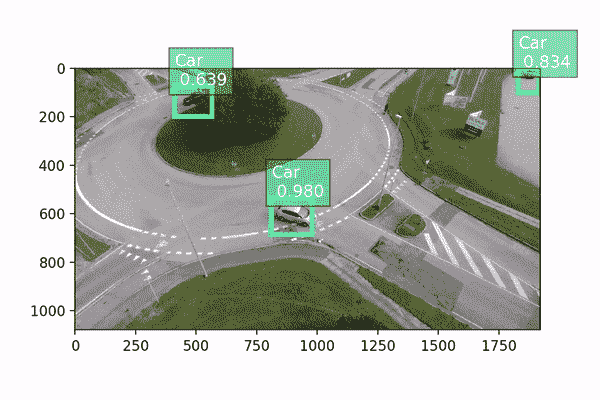
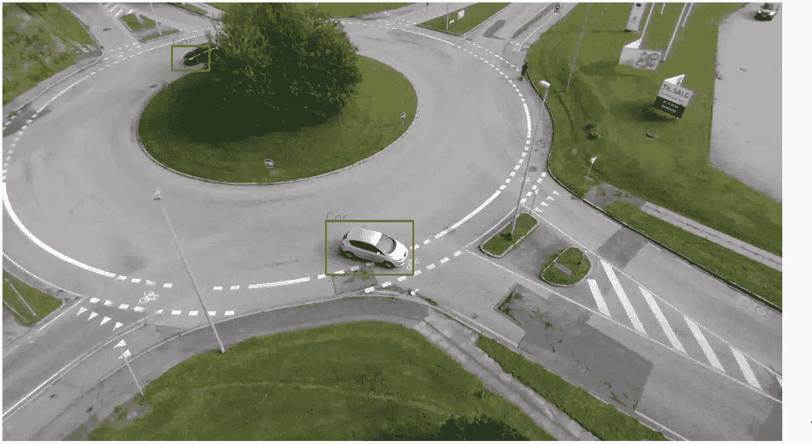
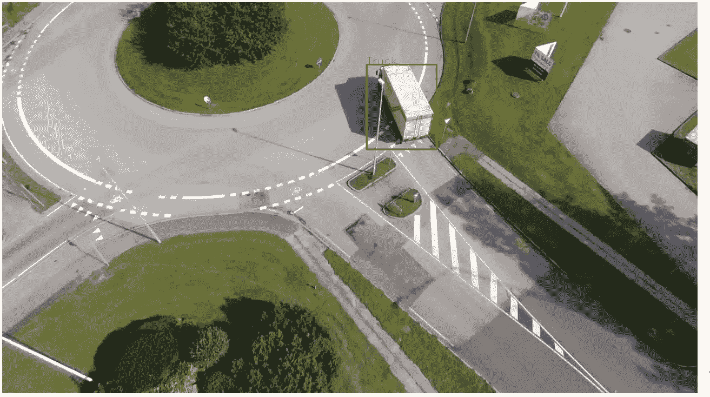
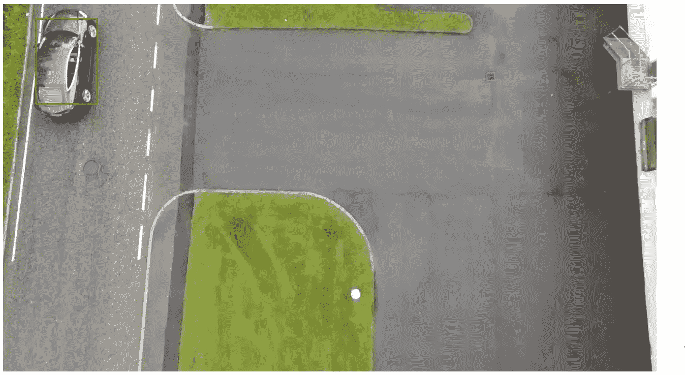
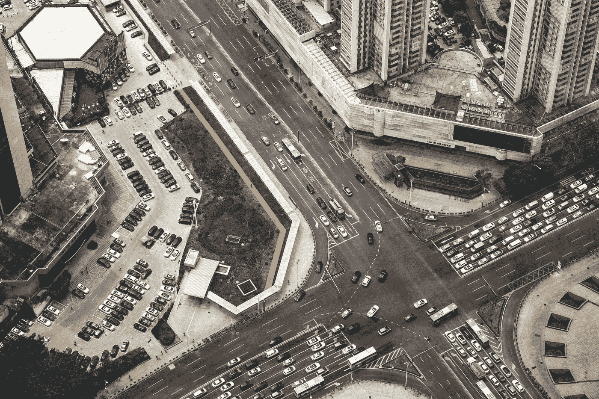

# rfb net:6 行代码的自定义对象检测培训

> 原文：<https://pub.towardsai.net/rfbnet-custom-object-detection-training-with-6-lines-of-code-94b98b5bd24e?source=collection_archive---------1----------------------->

## 使用 Monk，低代码深度学习工具和计算机视觉的统一包装器，使计算机视觉变得简单。



在[之前的一篇文章](https://towardsdatascience.com/retinanet-custom-object-detection-training-with-5-lines-of-code-37442640d142)中，我们已经使用[和尚](https://github.com/Tessellate-Imaging/Monk_Object_Detection)的 RetinaNet 构建了一个定制的物体探测器。在本文中，我们将使用 [Monk](https://github.com/Tessellate-Imaging/Monk_Object_Detection) 的 RFBNet 构建一个低空空中交通监控，构建于 [PyTorch RFBNet](https://github.com/ruinmessi/RFBNet) 之上。

> 我们开始吧！！

# 目录

1.  **数据收集**
2.  **转换为 COCO 格式**
3.  **培训模式**
4.  **检测对象检测器**

# **数据收集**

在本文中，我们使用来自[低空空中交通监视](https://bozcani.github.io/auairdataset)的数据。

下载数据压缩文件

```
$ ! wget --load-cookies /tmp/cookies.txt "https://docs.google.com/uc?export=download&confirm=$(wget --save-cookies /tmp/cookies.txt --keep-session-cookies --no-check-certificate 'https://docs.google.com/uc?export=download&id=1pJ3xfKtHiTdysX5G3dxqKTdGESOBYCxJ' -O- | sed -rn 's/.*confirm=([0-9A-Za-z_]+).*/**\1\n**/p')&id=1pJ3xfKtHiTdysX5G3dxqKTdGESOBYCxJ" -O data.zip && rm -rf /tmp/cookies.txt
```

下载注释 zip 文件

```
$ ! wget --load-cookies /tmp/cookies.txt "https://docs.google.com/uc?export=download&confirm=$(wget --save-cookies /tmp/cookies.txt --keep-session-cookies --no-check-certificate 'https://docs.google.com/uc?export=download&id=1boGF0L6olGe_Nu7rd1R8N7YmQErCb0xA' -O- | sed -rn 's/.*confirm=([0-9A-Za-z_]+).*/**\1\n**/p')&id=1boGF0L6olGe_Nu7rd1R8N7YmQErCb0xA" -O annotations.zip && rm -rf /tmp/cookies.txt
```

创建一个数据集目录，并将解压缩后的数据和注释推送到数据集目录。

```
#Create dataset
$ !mkdir dataset# Unzip data
$ ! unzip -q data.zip
$ ! unzip -q annotations.zip# mov to dataset folder
$ !mv images dataset/
$ !mv annotations.json dataset/
```

# **转换为 COCO 格式**

**数据集目录结构**

```
./dataset (root_dir)
      |
      |---------/ 
      |         |
      |         |---images 
      |         |----|
      |              |-------------------img1.jpg
      |              |-------------------img2.jpg
      |              |-------------------.........(and so on)
      |
      |
      |         |---annotations
      |         |----|
      |              |--------------------annotations.json
```

**这里我们通过 Monk 格式**转换成 COCO 格式

1.  从当前格式转换为 Monk 格式

2.从 Monk 格式转换到 COCO 格式。

**想要标注的 COCO 格式**

```
./ (root_dir)
      |
      |------dataset (coco_dir) 
      |         |
      |         |---images (set_dir)
      |         |----|
      |              |-------------------img1.jpg
      |              |-------------------img2.jpg
      |              |-------------------.........(and so on)
      |
      |
      |         |---annotations
      |         |----|
      |              |--------------------instances_images.json 
      |              |--------------------classes.txt
```

*   instances_Train.json ->正确的 COCO 格式
*   classes.txt ->按字母顺序排列的类列表

运行 classes.txt

For instances_Images.json 运行

# **培训模式**

然后运行如下所示的训练代码

搞定了。上面的 **6 行**代码是您在自定义数据集上开始训练所需的全部内容。现在让我们将代码分解成几部分:

*   在第一行中，我们从 MonkAI 导入了"**检测器"**类。
*   在第二行中，我们创建了类的一个实例。
*   在第三行，我们设置了自定义数据集的路径。我们指定了以下参数:

— **批量大小:**这是培训的批量大小。

— **图像尺寸:**选择图像尺寸

— **num_workers:** 数据加载中使用的工作线程数

*   在第 4 行中，我们指定了以下参数:

— **型号名称:**从“vgg”、“e_vgg”、“mobilenet”中选择一个基本型号

— **使用 _gpu:** 是否使用 gpu

— **ngpu:** 要使用的 gpu 数量

*   在第五行中，我们设置超参数。我们指定了以下参数:

— **lr:** 初始学习率

**—动量:**动量为新币

**—重量衰减:**SGD 的重量衰减

**—gamma:**SGD 的 Gamma 更新

*   在第 6 行中，我们指定了训练参数，我们指定了以下参数:

— **时期:**训练的时期数

**— log_iters:** 打印每次迭代的损失

**—输出权重目录:**存储权重的目录

# **检测对象检测器**

我们已经训练了自定义模型来检测低空空中交通监视。我们将使用保存的权重文件来检测图像中的对象。

一些形象的推论，你可以看到:



推论 1



推论 2


推论 3



推论 4

你可以在 Github 上找到完整的代码。如果你喜欢蒙克，给我们 GitHub 回购⭐️。

在这个实验中，我们使用 RFBNet 创建了一个自定义对象检测，只需要基本的编程技巧，甚至不需要了解架构和 PyTorch 框架。

有关自定义对象检测的更多示例，请查看

[](https://github.com/Tessellate-Imaging/Monk_Object_Detection/tree/master/example_notebooks) [## 镶嵌成像/Monk_Object_Detection

### 此时您不能执行该操作。您已使用另一个标签页或窗口登录。您已在另一个选项卡中注销，或者…

github.com](https://github.com/Tessellate-Imaging/Monk_Object_Detection/tree/master/example_notebooks) 

如果有任何问题，可以联系 [Abhishek](https://www.linkedin.com/in/abhishek-kumar-annamraju/) 和 [Akash](https://www.linkedin.com/in/akashdeepsingh01/) 。请随意联系他们。

我对计算机视觉和深度学习充满热情。我是 [Monk](https://github.com/Tessellate-Imaging/Monk_Object_Detection) Libraries 的开源贡献者。

你也可以在以下网址看到我的其他作品:

[](https://medium.com/@akulahemanth) [## 阿库拉·赫曼思·库马尔培养基

### 阅读阿库拉·赫曼思·库马尔在媒介上的作品。计算机视觉爱好者| Linkedin…

medium.com](https://medium.com/@akulahemanth) 

[罗伯特拜](https://unsplash.com/@robertbye?utm_source=unsplash&utm_medium=referral&utm_content=creditCopyText)在 [Unsplash](https://unsplash.com/s/photos/arial?utm_source=unsplash&utm_medium=referral&utm_content=creditCopyText) 上拍照