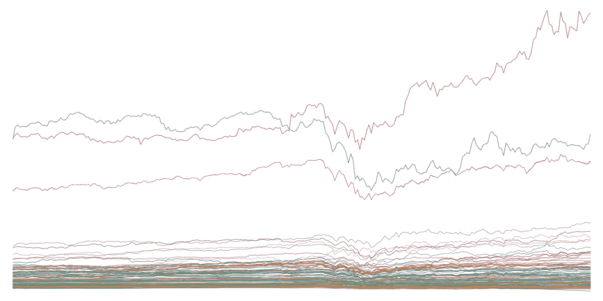
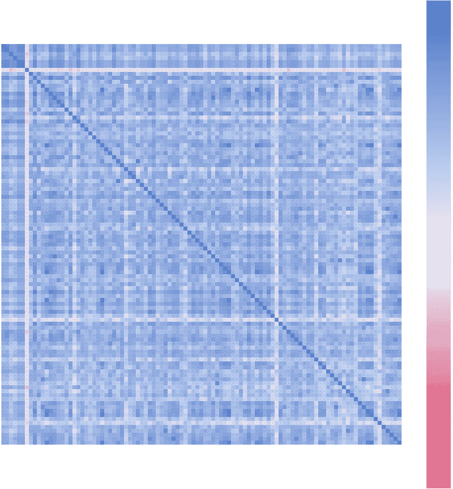

# 在你的投资组合中持有 2 只以上纳斯达克股票的风险

> 原文：<https://pub.towardsai.net/risk-of-holding-2-nasdaq-stocks-in-your-portfolio-50bbdc047eb9?source=collection_archive---------4----------------------->

## [财务，统计](https://towardsai.net/p/category/statistics)

## 问题是相关性…

多样化是获得能够应对市场风险的平衡投资组合的关键。一旦你已经从定性和定量的角度选择了表现最好的资产，你就可以确定它们的市场风险，并尝试用分散投资的方法来处理它。

年初至今纳斯达克 100 种股票(年初至今)

## 定性分析

定性分析将非常复杂的变量纳入数学模型。在非常专业的基金中，在该领域拥有至少 100 年累积经验的专家团队负责与他们所投资公司的负责人会面，以密切监控他们的投资:

*   公司管理是否正确？
*   从长远来看，公司能够承受住竞争的压力吗
*   公司是否正确分配资源？
*   …

这些只是评估一家公司是否是合适投资的过程中的一些问题。

## 定量分析

评估一只股票是否会有所表现的另一大分析是将数字输入数学模型。会计数据，包括资源和投资的管理，可以很容易地通过公司报告获得，而且，如果你使用一个足够可靠的模型，它可能会给你你正在寻找的指标。

# 纳斯达克

纳斯达克是数百只股票可以交易的主要指数之一。为了这项研究，我一直在使用 Apache API 下载纳斯达克 100 只股票，根据它们去年的表现进行排名。

在收集股票后，我一直在创建一个相关性矩阵，看看哪些股票彼此之间的相关性最小。

纳斯达克 100 强相关矩阵

相关性可以取[-1，1]之间的任何连续值。根据上图，正方形越蓝(每个正方形表示两只股票之间的相关性)，它们的相关性越强。事实上，很难找到完全白色的方块。

## 利用相关性实现多样化

分散投资的逻辑是挑选相关性不高的股票。其实有很多策略，包括挑选彼此负相关到一定程度的股票。如果你选择的股票之间的相关性太高，这意味着它们同时在移动。

例如，如果你同时选择谷歌和苹果，它们的相关性将接近 0.7，非常高。如果科技市场下跌，它们很可能会同时下跌。因此，持有相关性高的股票风险很大，因为你并没有真正分散投资。如果你的投资组合中有 50%是谷歌和苹果的股票(疯狂),那么你将高度暴露于科技板块的损失中。

## 持有 2 只或 2 只以上纳斯达克股票的问题

适用于谷歌和苹果的相同原则可以很容易地推广到纳斯达克的每只股票。如果你看看相关矩阵，你会很容易地发现，你不可能挑选出任何一只与至少几十只其他股票不相关的股票。总之，如果你在纳斯达克持有一个以上的头寸，你就无法分散你的投资组合。

## 结论

从技术上来说，如果你想在纳斯达克持有 2 只或更多的股票，你可以依靠最初构建的只有 1 只纳斯达克股票的投资组合。例如，如果这只股票占你整个投资组合的 15%，你仍然可以在这 15%中配置多只纳斯达克股票，成功降低你所投资公司的违约风险。