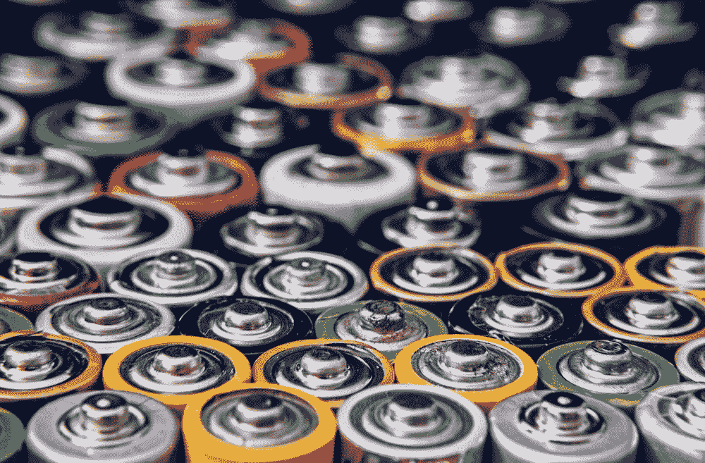
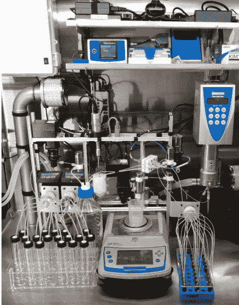
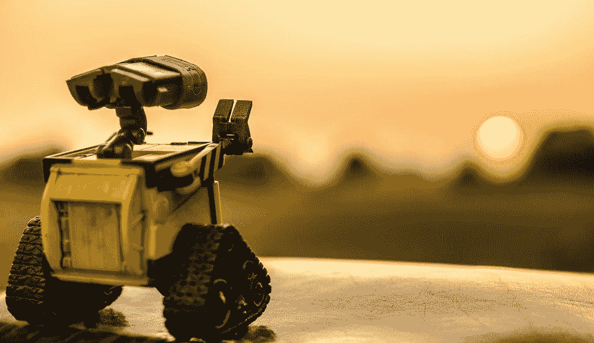

# 机器人加入机器学习，实现电力未来

> 原文：<https://pub.towardsai.net/robotics-join-machine-learning-for-an-electric-future-420067527337?source=collection_archive---------4----------------------->

机器人和人工智能如何加速能源转换和减少排放

图片来源[来自 unsplash.com 的罗布森·哈苏卡米·摩根](https://unsplash.com/@robsonhmorgan)

交通工具和飞机电气化最重要的一步是开发高能有效的电池技术。然而，电池的进步可能需要数年才能实现。在非水电池电解质溶液的情况下，电解质优化是耗时且困难的，因为在选择各种溶剂、盐及其相对比例时涉及许多设计因素。最近，[卡耐基梅隆大学的研究人员](https://www.nature.com/articles/s41467-022-32938-1)展示了如何将机器人技术和机器学习相结合来开发更好的电池。

**为什么我们需要更好的电池？**

图片来源:[罗伯特·索林](https://unsplash.com/@roberto_sorin)在 unsplash.com

今年夏天，极端事件有所增加。新闻报道显示，今年我们目睹了欧洲的极端干旱，英国的气温首次达到 40 度，巴基斯坦遭受了毁灭性的洪水。将 2022 年描述为可怕的一年未免过于简单化，因为事实上，这是过去几十年一种趋势的结果。

事实上，研究人员警告说，全球气温上升使得极端事件越来越有可能发生。气温升高增加了长期干旱、饥荒、野火、飓风和洪水的风险。此外，不仅频率增加，而且这些事件的强度也增加。

[全球变暖](https://climate.nasa.gov/global-warming-vs-climate-change/)是人类活动造成的。据研究人员解释，罪魁祸首是人类活动产生的二氧化碳。事实上，二氧化碳虽然不是最强的温室气体，但几乎所有工业活动都产生二氧化碳，其增加与全球气温上升直接相关。

交通运输业排放了 37%的二氧化碳。事实上，即使在今天，交通运输仍然是所有行业中对化石燃料依赖程度最高的。在新冠肺炎疫情期间，该部门受到各种封锁的严重影响。然而，在过去的两年里，商品再次开始流通，人们再次开始旅行。

虽然有一些装有电动机的卡车，但大多数仍在使用化石燃料。为了想象电动卡车和飞机的未来，必须开发高性能电池。几位研究人员关注了对未来电池的需求，简单来说:

*   快速充电:避免充电站的延迟和排队
*   更安全的电池:由于频繁充电、过度充电或短路导致气体积聚，电池可能会破裂或爆炸。
*   远程:大多数电动汽车的行驶里程为 200 英里，这对于物流运输来说是不够的
*   不太贵:电池通常使用 8-10 年，大约行驶 10 万英里；那么购买新车通常比更换电池更方便。

总的来说，开发新的电解质对于创造具有所需特性的新电池至关重要。然而，这并不是一个简单的挑战，因为可以测试几乎无限多的组合。事实上，传统的方法是试错法，但这是困难和费时的。

> 在电池中存在的材料中，液体电解质是优化的一个特殊挑战。溶剂或盐有许多选择，每一种都可能产生非常不同的性能；优化的电解质溶液通常包含三种或四种以上的成分。——[原创文章](https://www.nature.com/articles/s41467-022-32938-1)

**耦合机器学习和机器人技术**

图片来源:[安迪凯利](https://unsplash.com/@askkell)在 unsplash.com

最近，机器学习已被用于多种应用，以识别潜在的新材料(光伏电池、固态材料、催化系统等)。不过，这只是故事的第一部分；毕竟，一旦潜在的材料被确定，它们必须在实验室中进行测试和分析。即便如此，这仍然是一项艰难而费力的任务。

> 机械工程副教授文卡特·维斯瓦纳坦(Venkat Viswanathan)说:“大多数电池实验室设计电解质时，都有大批研究生在制造和测试各种电解质。“我们只是一个三人小组，他们制造了一个机器人来为我们做大部分工作。”— [卡内基·梅隆关于该项目的文章](https://engineering.cmu.edu/news-events/news/2020/12/18-ai-fueled-batteries.html)

正如文章的作者所写的，“闭环”方法有很大的希望:

> 最近有大量关于将自动化实验与这些机器学习方法相结合的研究— [原文](https://www.nature.com/articles/s41467-022-32938-1)

这个想法是自动执行实验和实验时间表。自动化将减少时间，也允许更好的标准化和降低成本。

卡内基梅隆大学的研究人员旨在使用两个组件来解决这个问题。第一个组件是 **Clio** ，这是一个由泵和阀门组成的自动化系统，可以将各种溶剂、盐和其他化学物质混合在一起。之后，系统会衡量该解决方案在关键电池基准测试中的表现。

机器人 Clio 的图像。图片来自文章预印本:[此处](https://arxiv.org/pdf/2111.14786.pdf)

> Clio 可用于高通量实验，表征一系列溶剂和盐的传输特性。— [原文](https://www.nature.com/articles/s41467-022-32938-1)

Clio 实验的示意图。图片来源:文章原文

接下来，他们使用了一个叫做蜻蜓的系统。一种机器学习算法，使用 Clio 的结果来提出可能产生更好结果的新的可能组合。

[**蜻蜓**](https://github.com/dragonfly/dragonfly) 是一个为黑盒优化设计的开源贝叶斯优化包。该库在 GitHub 上是开源的，以可扩展的方式实现了贝叶斯优化，并提供了一些可用于该过程的工具(高维度、并行化、多目标等)。

在这篇论文中，作者致力于寻找一种新的电解质组合，使电池充电更快。正如文章中提到的，这样的工作流程可以应用到几个其他电池组件的优化中。结果是，他们比性能最佳的基准电池提高了 13%。

> 这证明了闭环实验在充分探索和未探索的设计空间中发现最佳材料设计的潜力。— [原文章](https://www.nature.com/articles/s41467-022-32938-1) n

作者认为，这一模式可以应用于许多其他情况。事实上，在闭环中结合高通量实验和机器学习可以在许多行业中实现成本和时间的降低。

**离别的思念**

unsplash.com 的张秀坤镰刀

气候紧急情况日益紧迫，我们需要尽快找到切实可行的解决方案。

研究电池和太阳能电池板的新材料既费力又费钱。算法和自动化系统的开发至关重要。

本文的优点是展示了一个连接机器学习模型和机器人应用程序的系统。更好的电池对于减少交通运输(主要排放源)的排放至关重要。此外，这种方法可用于各种应用，这些应用可用于减少排放和帮助能源转换(新材料、提高工艺效率等)。

# 如果你觉得有趣:

你可以寻找我的其他文章，你也可以 [**订阅**](https://salvatore-raieli.medium.com/subscribe) 在我发表文章时得到通知，你也可以在**[**LinkedIn**](https://www.linkedin.com/in/salvatore-raieli/)**上连接或联系我。**感谢您的支持！**

**这是我的 GitHub 知识库的链接，我计划在这里收集代码和许多与机器学习、人工智能等相关的资源。**

** [## GitHub - SalvatoreRa/tutorial:关于机器学习、人工智能、数据科学的教程…

### 关于机器学习、人工智能、数据科学的教程，包括数学解释和可重复使用的代码(python…

github.com](https://github.com/SalvatoreRa/tutorial) 

或者随意查看我在 Medium 上的其他文章:

 [## 机器学习应对气候变化

### 人工智能如何帮助对抗全球变暖并从人类手中拯救世界

towardsdatascience.com](https://towardsdatascience.com/machine-learning-to-tackle-climate-change-7911e004c3a2)  [## 机器学习:科学的朋友还是敌人？

### 机器学习如何影响科学再现性以及如何解决它

towardsdatascience.com](https://towardsdatascience.com/machine-learning-a-friend-or-a-foe-for-science-9c0b421eabd8)  [## 人工智能如何加剧全球变暖

### 新的大型模型是能源密集型的。他们的训练需要多少二氧化碳？

towardsdatascience.com](https://towardsdatascience.com/how-ai-could-fuel-global-warming-8f6e1dda6711)  [## 说生命的语言:AlphaFold2 和公司如何改变生物学

### 人工智能正在重塑生物学研究，并开辟治疗的新领域

towardsdatascience.com](https://towardsdatascience.com/speaking-the-language-of-life-how-alphafold2-and-co-are-changing-biology-97cff7496221)**