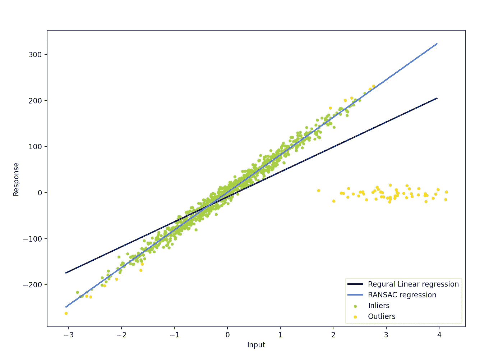
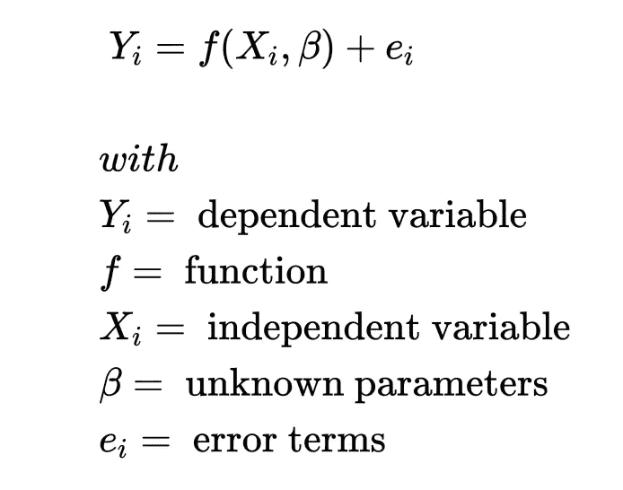
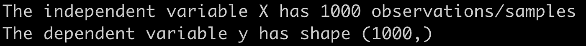
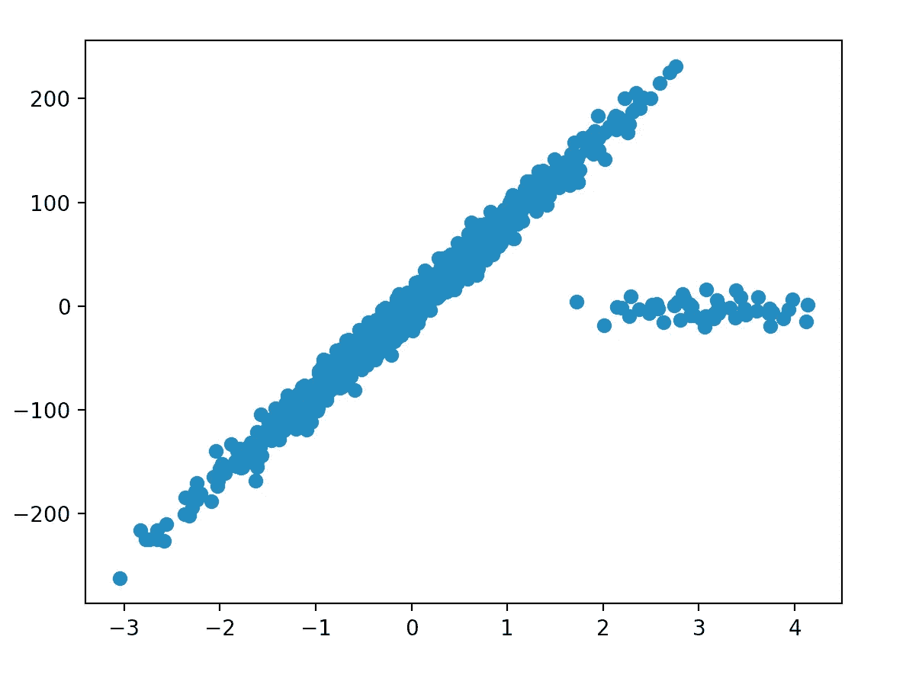
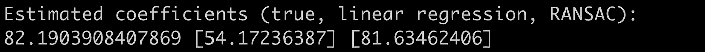
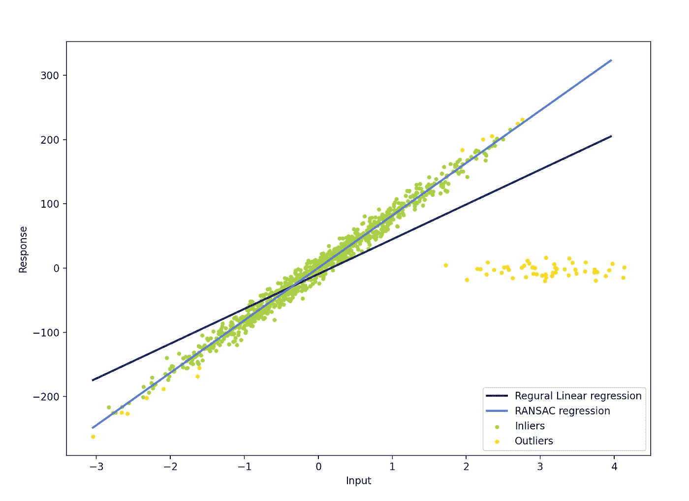

# 稳健回归:您需要知道的一切& Python 中的一个例子

> 原文：<https://pub.towardsai.net/robust-regression-all-you-need-to-know-an-example-in-python-9730b3e1d992?source=collection_archive---------1----------------------->

## [机器学习](https://towardsai.net/p/category/machine-learning)，[编程](https://towardsai.net/p/category/programming)

## 在本文中，我将使用 Python 中的一个工作示例来解释什么是健壮回归。



# 1.介绍

回归模型用于在给定一组输入变量(自变量)的情况下预测一个数值(因变量)。最著名的家庭模型是线性回归[2]。

线性回归拟合一条线(或超平面),该线最好地描述了某些输入(X)和目标数值(y)之间的线性关系。

但是，如果数据包含异常值，线可能会变得有偏差，从而导致预测性能下降。**稳健回归**指的是在异常值存在的情况下稳健的一系列算法【2】。



作者创造的形象。来源[2]。

如果你想在交互式路线图和活跃的学习社区的支持下自学数据科学，看看这个资源:[https://aigents.co/learn](https://aigents.co/learn)

# 2.有异常值的线性回归

## 2.1 什么是异常值？

线性回归模型假设每个独立变量遵循高斯分布。使用线性回归模型时，可能影响变量概率分布的一个因素是**异常值的存在。** **异常值**是远远超出预期分布的观测值(样本)。

例如，如果变量遵循正态分布，那么距离平均值 3 个(或更多)标准偏差的观察值被视为异常值。因此，含有异常值的数据集会给线性回归模型带来问题。

## 2.2 异常值是如何引起问题的？

数据集中的异常值可能会影响为变量计算的汇总统计数据(例如，平均值和标准偏差)。这导致模型表现不佳，并且受到潜在异常值的严重影响。

为了处理数据集中异常值的存在，我们可以使用一系列稳健的回归模型。这些模型被称为**稳健回归算法。**两种最著名的稳健回归算法是随机样本一致性回归(RANSAC)和 Huber 回归。

## 2.3 RANSAC 回归

随机样本一致性(RANSAC)是一种众所周知的稳健回归算法[3]。

> RANSAC 尝试将数据分为离群值和内联值，并仅在内联值上拟合模型。

在本文中，我们将只使用 RANSAC，但是几乎所有的陈述对于 Huber 稳健回归都是正确的。

# 3.工作示例

## 3.1 .人工数据集

首先，为了说明常规线性回归和 RANSAC 稳健模型之间的差异，我们将创建一些有异常值的数据。该示例基于 sklearn 文档页面[1]中的示例。

我们的人工数据集将包括:**一个** **因变量** **变量** (y)和**一个自变量** (X)以及 **1000 个**观测值，其中 **50 个**是**异常值。**

```
import numpy as np
from matplotlib import pyplot as plt
from sklearn import linear_model, datasetsn_samples = 1000
n_outliers = 50X, y, coef = datasets.make_regression(n_samples=n_samples, n_features=1, n_informative=1, noise=10, coef=True, random_state=0)# Add outlier data
np.random.seed(0)
X[:n_outliers] = 3 + 0.5 * np.random.normal(size=(n_outliers, 1))
y[:n_outliers] = -3 + 10 * np.random.normal(size=n_outliers)print("The independent variable X has {} observations/samples".format(X.shape[0]))
print("The dependent variable y has shape {}".format(y.shape))
```



代码输出。

让我们也绘制数据以可视化人工数据并查看异常值。

```
plt.scatter(X,y)
plt.show()
```



代码输出。

很明显，我们有 **1000 个**观察值，其中 **50 个**是**异常值(右边的点云)。**

## 3.2.模型拟合

现在，让我们根据数据拟合一个常规回归模型和一个稳健模型，并检查估计的回归系数。

```
# Fit line using all data
lr = linear_model.LinearRegression()
lr.fit(X, y)# Robustly fit linear model with RANSAC algorithm
ransac = linear_model.RANSACRegressor()
ransac.fit(X, y)
inlier_mask = ransac.inlier_mask_
outlier_mask = np.logical_not(inlier_mask)# Predict data of estimated models
line_X = np.arange(X.min(), X.max())[:, np.newaxis]
line_y = lr.predict(line_X)
line_y_ransac = ransac.predict(line_X)# Compare estimated coefficients
print(“Estimated coefficients (true, linear regression, RANSAC):”)
print(coef, lr.coef_, ransac.estimator_.coef_)
```



代码输出。

我们在这里观察到一些非常有趣的事情。真实系数为 82.19，而常规回归估计的真实系数为 54.17，稳健回归估计的真实系数为 81.63。我们可以验证稳健模型运行良好。

**注意**:***coef "***在我们创建数据时由函数" datasets.make_regression "返回(参见第一个代码块)。

## 3.3.可视化拟合的回归线

```
lw = 2
plt.scatter(X[inlier_mask], y[inlier_mask], color='yellowgreen', marker='.', label='Inliers')
plt.scatter(X[outlier_mask], y[outlier_mask], color='gold', marker='.', label='Outliers')
plt.plot(line_X, line_y, color='navy', linewidth=lw, label='Regural Linear regression')
plt.plot(line_X, line_y_ransac, color='royalblue', linewidth=lw, label='RANSAC regression')
plt.legend(loc='lower right')
plt.xlabel("Input")
plt.ylabel("Response")
plt.show()
```



我们再次观察到稳健模型表现良好，忽略了异常值。

# 结论

**数据集中异常值的存在会引入偏差，导致线性回归模型表现不佳。**

为了处理异常值，我们可以使用**稳健回归算法。**

**在本文中，我们看到当存在异常值时，稳健模型表现良好，而常规线性回归模型受这些异常值的影响很大，并存在偏差。**

**就这些了，乡亲们！我希望你喜欢这篇文章。**

# 参考资料:

[1][https://sci kit-learn . org/stable/modules/linear _ model . html # ran sac-regression](https://scikit-learn.org/stable/modules/linear_model.html#ransac-regression)

[https://en.wikipedia.org/wiki/Robust_regression](https://en.wikipedia.org/wiki/Robust_regression)

[3] [“随机样本一致性:应用于图像分析和自动制图的模型拟合范例”](https://www.sri.com/sites/default/files/publications/ransac-publication.pdf) Martin A. Fischler 和 Robert c . Bolles-SRI International(1981)

如果你喜欢这篇文章并觉得它有用，请关注👣我可以看到我所有的新帖子。

有问题吗？把它们作为评论贴出来，我会尽快回复。

## 我的个人资料(看看我收集的文章):

[](https://towardsdatascience.com/@seralouk) [## sera feim Lou kas——走向数据科学

### 阅读 Serafeim Loukas 在《走向数据科学》中的文章。电气和计算机工程文凭(NTUA)。主人…

towardsdatascience.com](https://towardsdatascience.com/@seralouk) 

# 和我联系。

*   **领英**:【https://www.linkedin.com/in/serafeim-loukas/】T4

## 您可能还喜欢:

[](https://towardsdatascience.com/text-classification-using-naive-bayes-theory-a-working-example-2ef4b7eb7d5a) [## 基于朴素贝叶斯的文本分类:理论与实例

### 在本文中，我解释了朴素贝叶斯的工作原理，并实现了一个多类文本分类问题…

towardsdatascience.com](https://towardsdatascience.com/text-classification-using-naive-bayes-theory-a-working-example-2ef4b7eb7d5a) [](https://towardsdatascience.com/support-vector-machines-svm-clearly-explained-a-python-tutorial-for-classification-problems-29c539f3ad8) [## 支持向量机(SVM)解释清楚:分类问题的 python 教程…

### 在这篇文章中，我解释了支持向量机的核心，为什么以及如何使用它们。此外，我还展示了如何绘制支持…

towardsdatascience.com](https://towardsdatascience.com/support-vector-machines-svm-clearly-explained-a-python-tutorial-for-classification-problems-29c539f3ad8) [](https://towardsdatascience.com/k-means-clustering-how-it-works-finding-the-optimum-number-of-clusters-in-the-data-13d18739255c) [## K-Means 聚类:工作原理&在数据中寻找最优的聚类数

### 数学公式，寻找最佳聚类数和 Python 中的工作示例。

towardsdatascience.com](https://towardsdatascience.com/k-means-clustering-how-it-works-finding-the-optimum-number-of-clusters-in-the-data-13d18739255c) [](https://towardsdatascience.com/lstm-time-series-forecasting-predicting-stock-prices-using-an-lstm-model-6223e9644a2f) [## LSTM 时间序列预测:使用 LSTM 模型预测股票价格

### 在这篇文章中，我将向你展示如何使用预测 LSTM 模型来预测股票价格

towardsdatascience.com](https://towardsdatascience.com/lstm-time-series-forecasting-predicting-stock-prices-using-an-lstm-model-6223e9644a2f) [](https://towardsdatascience.com/time-series-forecasting-predicting-stock-prices-using-an-arima-model-2e3b3080bd70) [## 时间序列预测:使用 ARIMA 模型预测股票价格

### 在这篇文章中，我将向你展示如何使用预测 ARIMA 模型来预测特斯拉的股票价格

towardsdatascience.com](https://towardsdatascience.com/time-series-forecasting-predicting-stock-prices-using-an-arima-model-2e3b3080bd70) [](https://medium.com/@seralouk/the-best-free-data-science-resources-free-books-online-courses-9c4a2df194e5) [## 最佳免费数据科学资源:免费书籍和在线课程

### 最有用的免费书籍和在线课程，适合想了解更多数据科学知识的人。

medium.com](https://medium.com/@seralouk/the-best-free-data-science-resources-free-books-online-courses-9c4a2df194e5) [](https://towardsdatascience.com/roc-curve-explained-using-a-covid-19-hypothetical-example-binary-multi-class-classification-bab188ea869c) [## 用新冠肺炎假设的例子解释 ROC 曲线:二分类和多分类…

### 在这篇文章中，我清楚地解释了什么是 ROC 曲线以及如何阅读它。我用一个新冠肺炎的例子来说明我的观点，我…

towardsdatascience.com](https://towardsdatascience.com/roc-curve-explained-using-a-covid-19-hypothetical-example-binary-multi-class-classification-bab188ea869c) [](https://towardsdatascience.com/support-vector-machines-svm-clearly-explained-a-python-tutorial-for-classification-problems-29c539f3ad8) [## 支持向量机(SVM)解释清楚:分类问题的 python 教程…

### 在这篇文章中，我解释了支持向量机的核心，为什么以及如何使用它们。此外，我还展示了如何绘制支持…

towardsdatascience.com](https://towardsdatascience.com/support-vector-machines-svm-clearly-explained-a-python-tutorial-for-classification-problems-29c539f3ad8) [](https://towardsdatascience.com/pca-clearly-explained-how-when-why-to-use-it-and-feature-importance-a-guide-in-python-7c274582c37e) [## PCA 清楚地解释了——如何、何时、为什么使用它以及特性的重要性:Python 指南

### 在这篇文章中，我解释了什么是 PCA，何时以及为什么使用它，以及如何使用 scikit-learn 在 Python 中实现它。还有…

towardsdatascience.com](https://towardsdatascience.com/pca-clearly-explained-how-when-why-to-use-it-and-feature-importance-a-guide-in-python-7c274582c37e) [](https://towardsdatascience.com/everything-you-need-to-know-about-min-max-normalization-in-python-b79592732b79) [## 关于 Python 中的最小-最大规范化，您需要知道的一切

### 在这篇文章中，我将解释什么是最小-最大缩放，什么时候使用它，以及如何使用 scikit 在 Python 中实现它

towardsdatascience.com](https://towardsdatascience.com/everything-you-need-to-know-about-min-max-normalization-in-python-b79592732b79) [](https://towardsdatascience.com/how-and-why-to-standardize-your-data-996926c2c832) [## Scikit-Learn 的标准定标器如何工作

### 在这篇文章中，我将解释为什么以及如何使用 scikit-learn 应用标准化

towardsdatascience.com](https://towardsdatascience.com/how-and-why-to-standardize-your-data-996926c2c832)