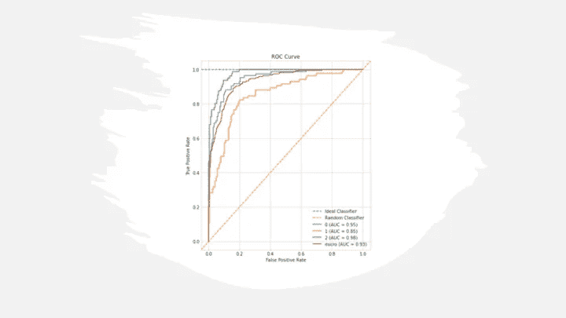
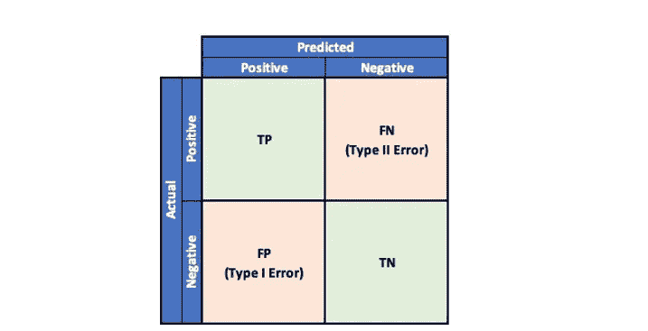
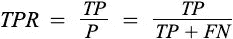
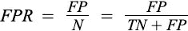
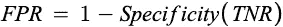
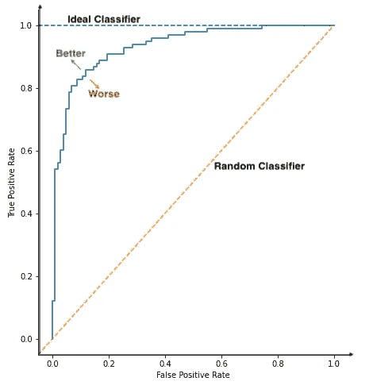
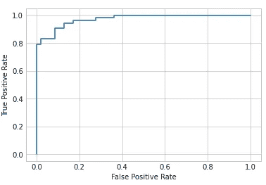
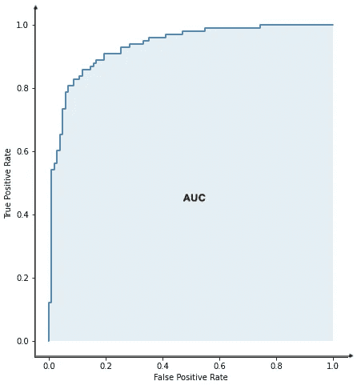
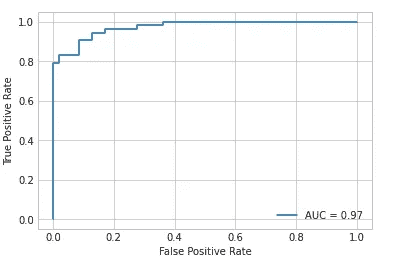
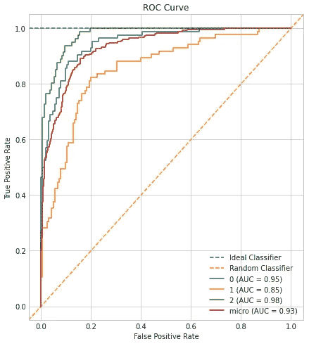

# 模型评估的 ROC 和 AUC

> 原文：<https://pub.towardsai.net/roc-and-auc-for-model-evaluation-2b4997ca6469?source=collection_archive---------0----------------------->

## 模型评估



作者图片

ROC 或受试者操作特征曲线是评估二元或多类分类模型最常用的工具。与其他指标不同，它是基于类似 [**精确召回曲线**](/precision-recall-curve-26f9e7984add) 的预测分数而不是预测类别来计算的。在我之前的 [**帖子**](/precision-recall-curve-26f9e7984add) 中，精确召回曲线的重要性被强调为如何为多类分类绘图。

为了理解 ROC 曲线，让我们通过参考混淆矩阵来快速刷新我们对二元分类问题中可能结果的记忆。



困惑矩阵|作者图片

ROC 曲线是在不同阈值下，相对于**假阳性率(FPR)** 绘制的**真阳性率(TPR)** 的图。它有助于直观地了解阈值是如何影响分类器性能的。

**真阳性率(TPR)** 是指某一特定类别的样本中，已经被模型预测为属于该类别的样本所占的比例。也被称为**召回**或**灵敏度**。



其中 TP 和 FN 分别是真阳性和假阴性。

**假阳性率(FPR):** 它是一个没有患病的人检测呈阳性的概率。它也被称为**脱落率**。



其中 FP 是假阳性的数量，TN 是真阴性的数量。



**ROC 曲线**也可以定义为**灵敏度对 1 特异性**图。



ROC 曲线|作者图片

让我们来看看二元分类的 ROC 曲线。

```
from sklearn.datasets import make_classification
from sklearn.model_selection import train_test_split
from sklearn.linear_model import LogisticRegression
from sklearn.metrics import roc_curve
from sklearn.metrics import RocCurveDisplay
X, y = make_classification(n_samples=500, n_classes=2,
                           random_state=1)
X_train, X_test, y_train, y_test = train_test_split(X, y,
                                                    test_size=.2, 
                                                    random_state=2)
lr = LogisticRegression()
lr.fit(X_train, y_train)
y_pred = lr.predict(X_test)
y_pred_prob = lr.predict_proba(X_test)
y_pred_prob = y_pred_prob[:,1]
fpr, tpr, threshold = roc_curve(y_test, y_pred_prob)
plt = RocCurveDisplay(fpr=fpr, tpr=tpr)
plt.plot()
```



ROC 曲线|作者图片

**AUC 得分**

AUC 代表“曲线下面积”，它是通过任何图下面积计算的梯形规则计算的。它将 ROC 曲线总结为二元分类和多类别模型中每个类别的单一指标。然而，为了将多类总结为单个度量，可以使用微观、宏观和加权 AUC。

AUC 越高，分类器越好。其值在 0(最差模型)和 1(理想模型)之间波动。



ROC AUC |作者图片

```
from sklearn.metrics import roc_auc_score
auc = roc_auc_score(y_test, y_pred_prob)
print(auc)**Output:** 0.9727017262143718
```

让我们看看如何使用 sklearn 库在随机分类数据集上绘制 ROC 曲线和计算 AUC 分数。

```
plt = RocCurveDisplay(fpr=fpr, tpr=tpr, roc_auc=auc)
plt.plot()
```



带 AUC 的 ROC 曲线|图片由作者提供

**为什么是 ROC 曲线？**

ROC 是根据精度分数计算的，而许多度量标准(如准确度和精度)都是根据预测类来计算的。这是在**敏感性(TPR)** 和**1-特异性(FPR)**之间的权衡，允许人们选择在 TPR 和 FPR 之间保持平衡的阈值，这适合特定的问题。

绘制 ROC 曲线对二元问题来说是小菜一碟。然而，计算多类分类令专业人员望而却步。以下是绘制多类 ROC 和 AUC 的方法。

*下面是为多类分类问题创建和绘制 ROC 和 AUC 的 python 代码。*

```
from sklearn.datasets import make_classification
from sklearn.preprocessing import label_binarize
from sklearn.model_selection import train_test_split
from sklearn.linear_model import LogisticRegression
from sklearn.multiclass import OneVsRestClassifier# Load Dataset
X, y = make_classification(n_samples=500, n_classes=3,
                           random_state=1, n_informative=3)
y = label_binarize(y, classes=[0,1,2])
X_train, X_test, y_train, y_test = train_test_split(X, y,
                                                    test_size=.5,
                                                    random_state=1)
lr = LogisticRegression()
ovr = OneVsRestClassifier(lr)
ovr.fit(X_train, y_train)
y_pred = ovr.predict(X_test)
y_pred_prob = ovr.predict_proba(X_test)
fpr, tpr, threshold, auc, labels = roc_auc_curve(y_test,
                                                 y_pred_prob, 
                                                 labels=[0,1,2])
roc_auc_curve_plot(fpr, tpr, threshold, auc, labels)
```



作者多类|图像的 ROC 曲线

**参考文献:**

[1] ROC 曲线。[https://sci kit-learn . org/stable/modules/generated/sk learn . metrics . roc _ curve . html](https://scikit-learn.org/stable/modules/generated/sklearn.metrics.roc_curve.html)

[2] AUC。[https://sci kit-learn . org/stable/modules/generated/sk learn . metrics . AUC . html](https://scikit-learn.org/stable/modules/generated/sklearn.metrics.auc.html)

[3]精确召回曲线。[https://pub . toward sai . net/precision-recall-curve-26f9e 7984 add](/precision-recall-curve-26f9e7984add)