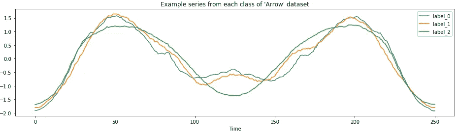

# ROCKET:快速准确的时间序列分类

> 原文：<https://pub.towardsai.net/rocket-fast-and-accurate-time-series-classification-f54923ad0ac9?source=collection_archive---------0----------------------->

## [数据科学](https://towardsai.net/p/category/data-science)，[机器学习](https://towardsai.net/p/category/machine-learning)

## 用 python 实现时间序列分类的最新算法


图片由[openclipbart-Vectors](https://pixabay.com/users/OpenClipart-Vectors-30363/)在 [pixabay](https://pixabay.com/vectors/alphabet-word-images-animation-1297651/)

> “时间序列分类的任务可以被认为是学习或检测与相关类相关的时间序列中的信号或模式。”— [Dempster 等人，2020，火箭论文的作者](https://link.springer.com/article/10.1007/s10618-020-00701-z#Sec2)

大多数具有最新(SOTA)精度的时间序列分类方法计算复杂度高，可扩展性差。这意味着它们在较小的数据集上训练很慢，并且在大型数据集上实际上不可用。

ROCKET(随机卷积核变换)可以在很短的时间内达到与竞争 SOTA 算法(包括卷积神经网络)相同的精度。这些算法在 UCR 档案馆[的基准数据集上进行评估。](https://timeseriesclassification.com/index.php)

ROCKET 首先使用随机卷积核(如 CNN 中使用的那些核)转换时间序列数据集，然后使用这些特征训练线性分类器。

火箭快多少？为了在 85 个基准数据集上连续训练和测试 ROCKET，花费了 1 小时 40 分钟。对于同样的任务，下一个最快的 SOTA 算法(cBOSS)需要 19 小时 33 分钟。关于速度的更多比较，参见[论文](https://link.springer.com/article/10.1007/s10618-020-00701-z#Sec1)。

在本文的剩余部分，我将:

*   讨论替代的时间序列分类器
*   解释火箭如何工作
*   提供一个 python 代码示例

# 有哪些替代方案？

时间序列分类的其他方法通常依赖于序列的特定表示，如形状、频率或方差。ROCKET 的卷积内核用一个可以捕获许多相同特征的单一机制取代了这种工程化的特征提取。

## 时间序列分类综述

时间序列变换是时间序列分类的一个基本思想。**许多时间序列特定算法是转换的时间序列和常规分类算法**的组合，例如 scikit-learn 中的算法。

对于时间序列分类算法的介绍性调查，请参阅我以前的文章。

[](https://towardsdatascience.com/a-brief-introduction-to-time-series-classification-algorithms-7b4284d31b97) [## 时间序列分类算法综述

### 专门为时间序列分类设计的专用算法

towardsdatascience.com](https://towardsdatascience.com/a-brief-introduction-to-time-series-classification-algorithms-7b4284d31b97) 

## 竞争 SOTA 方法

以下方法旨在提高上述[调查](https://towardsdatascience.com/a-brief-introduction-to-time-series-classification-algorithms-7b4284d31b97)中描述的算法的速度和准确性。

*   *邻近森林*是根据弹性距离度量划分的决策树的集合。
*   *TS-CHIEF* 通过使用基于字典和基于区间的分裂标准来扩展邻近森林。
*   [*InceptionTime*](https://github.com/hfawaz/InceptionTime) 是基于 Inception 架构的 5 个深度 CNN 的合集。
*   [Mr-SEQL](https://www.sktime.org/en/latest/examples/mrseql.html) 将线性分类器应用于通过时间序列的符号表示(SAX，SFA)提取的特征。
*   cBOSS，或称为 contractable BOSS，是基于 SFA 变换的基于字典的分类器。
*   [catch22](https://github.com/chlubba/catch22) 是一组 22 个预选的时间序列转换，可以传递给分类器。

## 小型火箭

MiniRocket 是 Rocket 的优化版本，最近发布了。

> 根据作者的说法，MiniRocket 应该被视为 Rocket 的默认版本。

[](https://towardsdatascience.com/minirocket-fast-er-and-accurate-time-series-classification-cdacca2dcbfa) [## 微型火箭:快速和准确的时间序列分类

### 使用 Python 实现系列分类的最快的先进算法

towardsdatascience.com](https://towardsdatascience.com/minirocket-fast-er-and-accurate-time-series-classification-cdacca2dcbfa) 

# 火箭是如何工作的？

ROCKET 首先使用卷积核转换时间序列，然后将转换后的数据传递给线性分类器。

## 卷积核

卷积核与卷积神经网络中的相同，使用随机长度、权重、偏差、[膨胀](https://www.inference.vc/dilated-convolutions-and-kronecker-factorisation/)和填充进行初始化。关于如何对随机参数进行采样，参见[论文](https://link.springer.com/article/10.1007/s10618-020-00701-z#Sec8)——它们是 ROCKET 的一部分，采样不需要调整。步幅总是一个。ROCKET 不会对生成的要素应用非线性变换，如 ReLU。

 [## 深度学习卷积算法指南

### 我们介绍了一个指南，以帮助深度学习从业者理解和操纵卷积神经网络…

arxiv.org](https://arxiv.org/abs/1603.07285) 

ROCKET 使用了大量的内核——默认是 10，000 个。使用这么多是可能的，因为计算卷积的成本非常低。这是因为内核权重不是“学习”的，并且只有一层卷积。

与典型的 CNN 不同，ROCKET 使用了多种内核。随机的长度、膨胀、填充、重量和偏差使得 ROCKET 能够捕捉广泛的信息。特别是，内核膨胀的多样性允许 ROCKET 捕捉不同频率和尺度的模式。

这些随机核组合在一起，能够捕获与时间序列分类相关的特征。单独地，单个随机卷积核可能仅微弱地从时间序列中捕获有用的特征。

## 卷积核变换

每个核与每个时间序列进行卷积以产生特征图。内核的特征映射被聚集以产生每个内核的两个特征:最大值**和正值比例**。****

*****最大值*功能类似于全局最大池。****

****正值的*比例*表示如何对内核捕获的模式的流行程度进行加权。这个值是 ROCKET 最关键的元素，有助于它的高精度。****

********

****zi 是卷积运算的输出****

## ****线性分类****

******对于较小的数据集**，作者推荐使用*岭回归分类器*，因为它可以快速交叉验证正则化参数，并且没有其他超参数。****

****当要素的数量超过训练样本的数量时，正则化就变得至关重要，小数据集经常出现这种情况。(默认情况下，ROCKET 使用 10，000 个内核，每个内核生成两个特性，结果是 20，000 个特性)****

******对于大型数据集**，由于可扩展性，作者推荐*带有随机梯度下降的逻辑回归*。****

****在“大型”数据集中，训练样本的数量远大于提取特征的数量。****

# ****如何用 Python 使用 ROCKET？****

****ROCKET 转换在`[sktime](https://www.sktime.org/en/latest/examples/rocket.html)` python 包中实现。****

****[](https://link.medium.com/TyOyddIK19) [## Sktime:用于时间序列机器学习的统一 Python 库

### 为什么？现有工具不太适合时间序列任务，并且不容易集成在一起。方法在…

link.medium.com](https://link.medium.com/TyOyddIK19) 

以下代码示例改编自 ROCKET Transform 的 sktime [演示。](https://www.sktime.org/en/latest/examples/rocket.html)

首先，加载所需的包。

```
import numpy as np
from sklearn.linear_model import RidgeClassifierCV
from sktime.datasets import load_arrow_head  # univariate dataset
from sktime.transformers.series_as_features.rocket import Rocket
```

接下来设置训练和测试数据——在这种情况下，为了方便起见，我使用单变量 [*箭头*](https://timeseriesclassification.com/description.php?Dataset=ArrowHead) 系列数据集。*Rocket 变换也可应用于多元数据。*

```
X_train, y_train = load_arrow_head(split="test", return_X_y=True)
X_test, y_test = load_arrow_head(split="train", return_X_y=True)
print(X_train.shape, X_test.shape) 
*>> (175, 1) (36, 1)*
```



使用 Rocket 变换来变换训练数据。默认情况下，ROCKET 使用 10，000 个内核。*一般来说，核越多，分类精度越高；然而，在增加的精度和计算时间之间有一个折衷。即使有大量的内核，ROCKET 依然很快。*

```
rocket = Rocket(num_kernels=10000, random_state=111) 
rocket.fit(X_train)
X_train_transform = rocket.transform(X_train)
X_train_transform.shape
>> (175, 20000)
```

从 scikit-learn 初始化并训练线性分类器。`sktime`的作者推荐对更小的数据集使用`[RidgeClassifierCV](https://scikit-learn.org/stable/modules/generated/sklearn.linear_model.RidgeClassifierCV.html)` (<20k 训练示例)。对于更大的数据集，使用随机梯度下降`[SGDClassifier(loss='log')](https://scikit-learn.org/stable/modules/generated/sklearn.linear_model.SGDClassifier.html)`训练的逻辑回归。

```
classifier = RidgeClassifierCV(alphas=np.logspace(-3, 3, 10), normalize=True)
classifier.fit(X_train_transform, y_train)
```

最后，为了给训练好的模型评分并生成预测，使用 Rocket 转换测试数据并调用训练好的模型。

```
X_test_transform = rocket.transform(X_test)
classifier.score(X_test_transform, y_test)
>> 0.9167
```

# 引用

Dempster，a .，Petitjean，F. & Webb，G.I. [ROCKET:使用随机卷积核进行异常快速和准确的时间序列分类](https://link.springer.com/article/10.1007/s10618-020-00701-z)。*数据最小已知盘* **34，**1454–1495(2020)。[https://doi.org/10.1007/s10618-020-00701-z](https://doi.org/10.1007/s10618-020-00701-z)

# 加入 Medium！

[](http://alexandra-amidon.medium.com/membership) [## 阅读亚历山德拉·阿米登(以及媒体上成千上万的其他作家)的每一个故事

### 作为一个媒体会员，你的会员费的一部分会给你阅读的作家，你可以完全接触到每一个故事…

alexandra-amidon.medium.com](http://alexandra-amidon.medium.com/membership)****