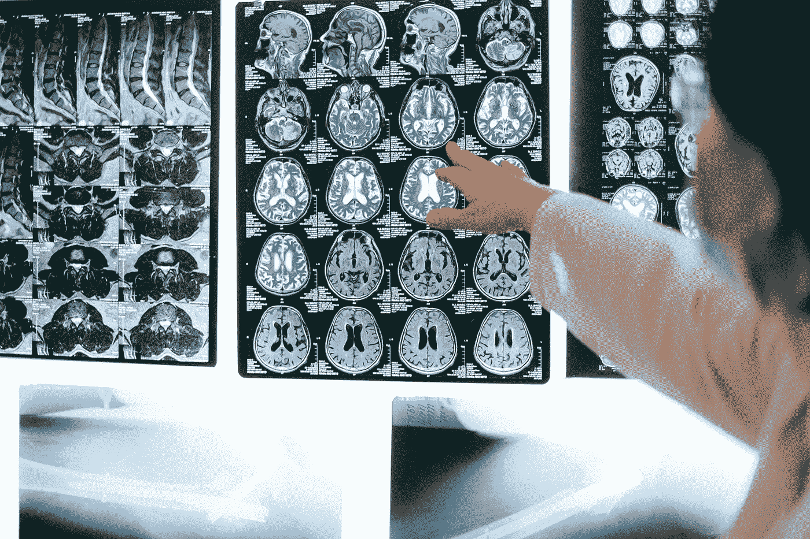
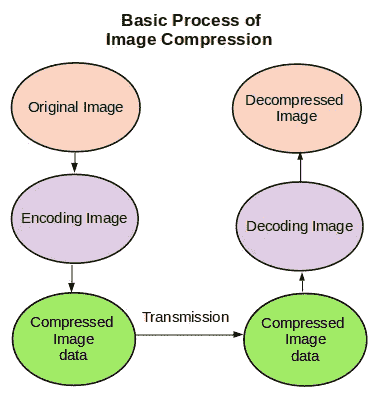
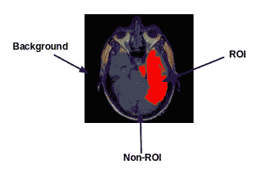
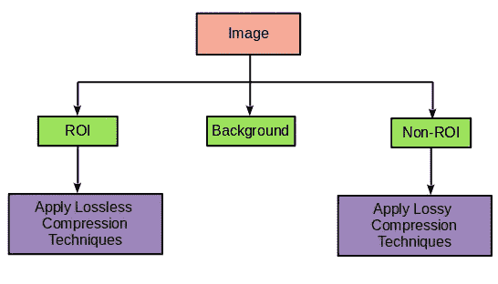
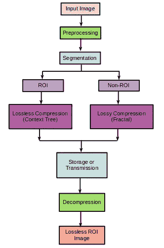

# 基于感兴趣区域的有损和无损混合图像压缩

> 原文：<https://pub.towardsai.net/roi-based-hybrid-lossy-and-lossless-image-compression-a73ce6f9d2ea?source=collection_archive---------4----------------------->

## [计算机视觉](https://towardsai.net/p/category/computer-vision)

## 您并不总是需要完整的高质量图像来获得洞察力！

照片由[安娜·施韦茨](https://www.pexels.com/@shvetsa?utm_content=attributionCopyText&utm_medium=referral&utm_source=pexels)从[派克斯](https://www.pexels.com/photo/person-holding-white-and-black-wall-decor-4226139/?utm_content=attributionCopyText&utm_medium=referral&utm_source=pexels)拍摄

本文旨在介绍有损和无损压缩的融合，以构建基于感兴趣区域的混合方法，该方法提供高压缩比，并在不影响准确性的情况下达到高效存储和传输的目的。

> 目前，我们已经进入了一个信息价值高于一切的时代。存储和维护海量数据对于未来的洞察至关重要。为此，我们需要巨大的存储容量和高带宽来传输数据。
> 
> 在许多领域，我们处理大量的图像数据集，包括医疗保健和多媒体领域。这里，图像压缩在减小图像数据的大小、寻求更少的存储空间和提供低延迟方面起着重要作用。

## 目录

*   图像压缩:有损和无损
*   图像中的投资回报率简介
*   面向图像压缩的混合方法
*   结论

**图像压缩:有损和无损**

作者图片

图像压缩是一种数据压缩，是一种减小图像大小以降低存储和传输成本的技术。图像压缩基本上有两种类型:

1.  **有损压缩**:这种技术用于并非每一位数据都很重要的领域。有损压缩会导致一些信息的丢失。当图像被解码时，它代表未压缩的图像，但是丢失了一些信息。有损压缩的例子有 **JPEG 和 WebP** 。
2.  **无损压缩:**这种技术用于数据至关重要且信息丢失不可接受的领域。当图像被解码时，它与原始图像完全匹配，而不会丢失数据。无损压缩的例子有 **Gif 和 PNG。**

**图像中感兴趣区域介绍**

图像由三部分组成，分别是:

1.  感兴趣区域
2.  非感兴趣区域(非 ROI)
3.  背景

图片来自 Kaggle 数据集:[https://www.kaggle.com/mateuszbuda/lgg-mri-segmentation](https://www.kaggle.com/mateuszbuda/lgg-mri-segmentation)并由作者编辑

为了说明 ROI，我从 Kaggle 数据集获取了一个大脑 MRI 图像，如上图所示。红色部分显示为受肿瘤影响的感兴趣区域(ROI)。只有这部分需要医生进一步评估。除此之外，所示的非 ROI 部分不太重要，可以完全忽略作为背景的黑色部分。

因此，可以导出一种技术，该技术考虑到图像的不重要部分，即非 ROI 和背景，以最大化压缩比。

**面向图像压缩的混合方法**

**方向:**为了实现高压缩比，提出了基于感兴趣区域结合有损和无损压缩的混合方法。ROI 是图像中最重要的部分，它覆盖了图像中非常微小的区域。还包括非 ROI，这使得用户能够从整个图像中分离出最关键的部分。ROI 和非 ROI 以外的部分是图像的背景和最不用的部分。因为 ROI 是最重要的，所以必须使用无损压缩来压缩，而非 ROI 可以通过有损压缩来压缩，而背景可以忽略。

作者图片

存在许多无损和有损压缩技术。输入图像将被分割成 ROI 和非 ROI 图像，最后将分别应用无损压缩和有损压缩的不同技术。

这里显示了 ROI 部分的**上下文树加权无损(CTW)** 和非 ROI 部分的**分形有损压缩**。我们可以使用任何其他有损和无损压缩技术来代替 CTW 和分形压缩。

## 有损压缩—分形压缩

> **分形压缩**是一种针对数字图像的有损压缩方法，主要基于分形。该方法最适用于纹理和自然图像，因为图像的各部分通常类似于同一图像的不同部分。分形算法将这些部分转换成称为“分形码”的数学数据，用于重新创建编码图像。

## 无损压缩—上下文树加权(CTW)

> **上下文树加权**是一种无损压缩和预测算法。为性能化提供了理论和实践上的保证。CTW 技术是一种“成组技术”，它结合了许多隐变量请求马尔可夫模型的期望，其中每个这样的模型都是利用零请求概率估计器建立的。

作者图片

-预处理(旋转、缩放、平移等。)是在输入图像上完成的。

-基于感兴趣的区域进行分割。

1.ROI 部分:应用上下文树压缩。

2.非 ROI 部分:应用分形压缩。

-在合并图像的两个部分之后进行存储或传输。

-进行减压。

结合这些有损和无损压缩技术的混合方法优于许多其他技术(霍夫曼和算术编码、IWT 和可伸缩 RBC 等)。)当比较它们的性能参数时。

一些性能参数是:

*   *均方误差(MSE)* :根据压缩和未压缩图像之间的误差值来评估图像质量的广泛使用的测量标准。具有最小 MSE 值的算法是最有效的算法。
*   *【CR】*:非压缩(输入)图像与压缩(输出)图像的像素数之比。如果压缩比更多，将有利于存储和传输。
*   *峰值信噪比(PSNR)* :是压缩和未压缩原始图像之间的峰值误差的度量。它基本上代表了图像的质量。对于更好的质量，PSNR 的值必须更高。

上述有损和无损压缩的混合方法给出了比许多现有技术更高的 CR、更高的 PSNR 和更低的 MSE。

**结论:**

> 从研究和实现的角度来看，图像压缩都很重要。这种混合方法比有损或无损技术更好，因为它大大提高了压缩率，并且不影响进一步的评估或未来的见解。我们可以进一步应用有损和无损压缩方法的不同组合来进一步提高压缩比，而不影响图像质量。

**参考文献:**

1.  [用于远程医疗的基于 ROI 的医学图像压缩
    应用](https://www.sciencedirect.com/science/article/pii/S1877050915032019)
2.  [https://en.wikipedia.org/wiki/Fractal_compression](https://en.wikipedia.org/wiki/Fractal_compression)
3.  [https://en.wikipedia.org/wiki/Context_tree_weighting](https://en.wikipedia.org/wiki/Context_tree_weighting)

感谢您的阅读！祝您愉快！！:)