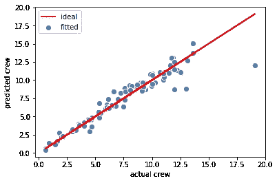

# 数据可视化在机器学习中的作用

> 原文：<https://pub.towardsai.net/role-of-data-visualization-in-machine-learning-a6dd62ad1082?source=collection_archive---------1----------------------->

## [数据可视化](https://towardsai.net/p/category/data-visualization)、[数据科学](https://towardsai.net/p/category/data-science)、[机器学习](https://towardsai.net/p/category/machine-learning)

## 数据可视化在从数据分析到模型构建、测试、评估和选择的机器学习中起着不可或缺的作用


Benjamin O. Tayo 的图片

# 一.导言

数据可视化是数据科学最重要的分支之一。它是用来分析和研究不同变量之间关系的主要工具之一。数据可视化可用于描述性分析。数据可视化也用于机器学习中进行数据预处理和分析；特征选择；模型构建；模型测试；和模型评估。

在本文中，我们说明了数据可视化在机器学习过程中的作用。为了便于说明，我们将使用游轮数据集[**cruise _ ship _ info . CSV**](https://github.com/bot13956/ML_Model_for_Predicting_Ships_Crew_Size)**。**本文的数据集和 Jupyter 笔记本可以从这里下载:[**https://github . com/bot 13956/Machine _ Learning _ Process _ Tutorial**](https://github.com/bot13956/Machine_Learning_Process_Tutorial)。

# 二。数据分析

在这里，我们使用数据可视化来研究特征之间的关系，以及预测变量和目标变量之间的相关性。图 1 中的配对图显示了数据集中特征之间的关系。我们的目标变量是船员变量。


**图一**。显示数据集中要素之间关系的 Pairplot。图片来源:Benjamin O. Tayo

从图 1 的**的视觉检查中，我们看到船员变量与 4 个预测变量强烈正相关，即:吨位、乘客、长度和客舱。**

为了进一步量化机组人员变量和 4 个预测变量(吨位、乘客、长度和客舱)之间的相关程度，可以生成协方差矩阵图，如下图**图 2** 所示。


**图二**。显示数据集中要素之间相关系数的协方差矩阵图。图片来源:Benjamin O. Tayo

从上面的协方差矩阵图中，我们看到机组人员变量与 4 个预测变量有很强的相关性(相关系数≥ 0.6):吨位、乘客、长度和客舱。

在选择了对模型构建很重要的预测变量后，可以以表格形式显示和可视化最终数据集。

```
cols_selected = ['Tonnage', 'passengers', 'length', 'cabins','crew']df[cols_selected].head()
```


**图 3** 。数据集的表格形式(前 5 行)，显示特征变量和目标变量。Benjamin O. Tayo 的图片

# **三世。模型建造**

然后可以建立一个[简单线性回归](https://medium.com/towards-artificial-intelligence/linear-regression-basics-for-absolute-beginners-68ed9ff980ae)模型，使用 4 个目标变量吨位、乘客、长度和客舱来预测船员变量。同样，我们可以使用数据可视化来比较实际和预测的机组人员值，如下图**图 4** 所示。



**图 4** 。使用多元回归分析的机组变量的理想图和拟合图。Benjamin O. Tayo 的图片

# 四。模型评估和选择

我们可以实现[三种不同的回归模型](https://medium.com/swlh/machine-learning-process-tutorial-222327f53efb) : **线性回归(LR)** ，**近邻回归(KNR)** ，**支持向量回归(SVR)**；**同样，数据可视化可用于显示最终结果，如下图**图 5** 所示。**


**图 5** 。不同回归模型的平均交叉验证显示。Benjamin O. Tayo 的图片

从图 5 中，我们观察到线性回归和支持向量回归几乎处于同一水平，并且优于 KNeighbors 回归。因此，最终选择的模型可以是线性回归或支持向量回归。

# 动词 （verb 的缩写）总结和结论

总之，我们已经讨论了数据可视化在机器学习中的作用。我们已经表明，从数据预处理到数据分析、特征选择、模型构建、模型测试和模型评估，数据可视化在机器学习过程中起着至关重要的作用。建议在建立模型时，在整个机器学习过程中使用数据可视化，因为它有助于可视化中间结果，以确保在模型建立过程中没有错误或不一致。

# 其他数据科学/机器学习资源

[数据科学最低要求:开始从事数据科学工作需要知道的 10 项基本技能](https://towardsdatascience.com/data-science-minimum-10-essential-skills-you-need-to-know-to-start-doing-data-science-e5a5a9be5991)

[数据科学课程](https://medium.com/towards-artificial-intelligence/data-science-curriculum-bf3bb6805576)

[机器学习的基本数学技能](https://medium.com/towards-artificial-intelligence/4-math-skills-for-machine-learning-12bfbc959c92)

[进入数据科学的 5 个最佳学位](https://towardsdatascience.com/5-best-degrees-for-getting-into-data-science-c3eb067883b1)

[数据科学的理论基础——我应该关心还是仅仅关注实践技能？](https://towardsdatascience.com/theoretical-foundations-of-data-science-should-i-care-or-simply-focus-on-hands-on-skills-c53fb0caba66)

[机器学习项目规划](https://towardsdatascience.com/machine-learning-project-planning-71bdb3a44349)

[如何组织你的数据科学项目](https://towardsdatascience.com/how-to-organize-your-data-science-project-dd6599cf000a)

[大型数据科学项目的生产力工具](https://medium.com/towards-artificial-intelligence/productivity-tools-for-large-scale-data-science-projects-64810dfbb971)

[数据科学作品集比简历更有价值](https://towardsdatascience.com/a-data-science-portfolio-is-more-valuable-than-a-resume-2d031d6ce518)

***如有疑问，请发邮件给我***:benjaminobi@gmail.com