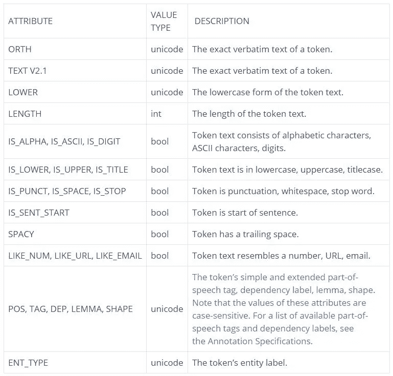
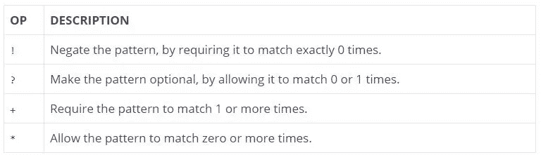

# 基于空间的自然语言处理规则匹配

> 原文：<https://pub.towardsai.net/rule-based-matching-for-nlp-using-spacy-491f148fd4fb?source=collection_archive---------5----------------------->

## [自然语言处理](https://towardsai.net/p/category/nlp)


如果你是一个 NLP 爱好者，你肯定知道[空间](https://spacy.io/)图书馆。这是一个强大的库，主要以 word2vec 函数而闻名。今天，我们将使用 spacy 的函数匹配器展示 spaCy 在基于规则的匹配中的不同用法。

你可能会问，为什么不用正则表达式呢？
答案是**令牌属性**。

**商店:名词 vs 商店:动词**
**匹配词条如 begin with begined**

仅通过这两个例子，我们就可以理解 Matcher 相对于 RegEx 的强大之处。然而，我们将向您展示如何使用它们来创建“下一级”模式。

在这个项目中，我们将使用[爱丽丝梦游仙境](https://www.gutenberg.org/files/11/11-0.txt)这本书。

首先确保你已经安装了 **spaCy** 库，下载了 **en_core_web_sm** 如下。

```
pip install -U spacypython -m spacy download en_core_web_sm
```

让我们从读取数据和导入库开始。

```
#reading the data
data = open('11-0.txt').read()

#if you get an error try the following
#data = open('11-0.txt',encoding = 'cp850').read()

import spacy

# Import the Matcher
from spacy.matcher import Matcher

nlp = spacy.load("en_core_web_sm")
doc = nlp(data)
```

我们可以使用的可用属性如下



# 例子

假设我们想要查找以单词 **Alice** 开头，后跟动词**的短语。**

```
#initialize matcher
matcher = Matcher(nlp.vocab)

# Create a pattern matching two tokens: "Alice" and a Verb
#TEXT is for the exact match and VERB for a verb
pattern = [{"TEXT": "Alice"}, {"POS": "VERB"}]

# Add the pattern to the matcher

#the first variable is a unique id for the pattern (alice).
#The second is an optional callback and the third one is our pattern.
matcher.add("alice", None, pattern)

# Use the matcher on the doc
matches = matcher(doc)
print("Matches:", [doc[start:end].text for match_id, start, end in matches])Matches: ['Alice think', 'Alice started', 'Alice began', 'Alice opened', 'Alice ventured', 'Alice felt', 'Alice took', 'Alice thought', 'Alice went', 'Alice went', 'Alice thought', 'Alice kept', 'Alice thought', 'Alice called', 'Alice replied', 'Alice began', 'Alice guessed', 'Alice said', 'Alice went', 'Alice knew', 'Alice heard', 'Alice thought', 'Alice heard', 'Alice noticed', 'Alice dodged', 'Alice looked', 'Alice looked', 'Alice replied', 'Alice replied', 'Alice felt', 'Alice turned', 'Alice thought', 'Alice replied', 'Alice folded', 'Alice said', 'Alice waited', 'Alice remained', 'Alice crouched', 'Alice noticed', 'Alice laughed', 'Alice went', 'Alice thought', 'Alice said', 'Alice said', 'Alice glanced', 'Alice caught', 'Alice looked', 'Alice added', 'Alice felt', 'Alice remarked', 'Alice waited', 'Alice coming', 'Alice looked', 'Alice said', 'Alice thought', 'Alice considered', 'Alice replied', 'Alice felt', 'Alice replied', 'Alice sighed', 'Alice asked', 'Alice ventured', 'Alice tried', 'Alice replied', 'Alice said', 'Alice said', 'Alice thought', 'Alice looked', 'Alice recognised', 'Alice joined', 'Alice gave', 'Alice thought', 'Alice found', 'Alice began', 'Alice waited', 'Alice put', 'Alice began', 'Alice thought', 'Alice appeared', 'Alice ventured', 'Alice whispered', 'Alice thought', 'Alice remarked', 'Alice said', 'Alice said', 'Alice looked', 'Alice heard', 'Alice thought', 'Alice asked', 'Alice ventured', 'Alice went', 'Alice began', 'Alice replied', 'Alice looked', 'Alice asked', 'Alice began', 'Alice said', 'Alice said', 'Alice panted', 'Alice whispered', 'Alice began', 'Alice felt', 'Alice guessed', 'Alice watched', 'Alice looked', 'Alice got']
```

找出后跟名词的形容词。

```
matcher = Matcher(nlp.vocab)

pattern = [{"POS": "ADJ"}, {"POS": "NOUN"}]

matcher.add("id1", None, pattern)
matches = matcher(doc)

# We will show you the first 20 matches
print("Matches:", set([doc[start:end].text for match_id, start, end in matches][:20]))Matches: {'grand words', 'hot day', 'legged table', 'dry leaves', 'great delight', 'low hall', 'own mind', 'many miles', 'little girl', 'good opportunity', 'right word', 'long passage', 'other parts', 'low curtain', 'large rabbit', 'pink eyes', 'several things', 'golden key', 'little door'}
```

Match **以**作为引理开始，后跟一个 **adposition**

```
matcher = Matcher(nlp.vocab)
pattern = [{"LEMMA": "begin"},{"POS": "ADP"}]
matcher.add("id1", None, pattern)
matches = matcher(doc)
print("Matches:", set([doc[start:end].text for match_id, start, end in matches]))Matches: {'began by', 'begin at', 'begins with', 'beginning with', 'beginning to', 'begin with', 'began in'}
```

# 量词

我们可以像正则表达式一样使用量词。



例如，匹配后跟零个或多个标点符号的精确单词 Alice:

```
matcher = Matcher(nlp.vocab)
pattern = [{"TEXT": "Alice"}, {"IS_PUNCT": True,"OP":"*"}]
matcher.add("id1", None, pattern)
matches = matcher(doc)
print("Matches:", set([doc[start:end].text for match_id, start, end in matches]))Matches: {'Alice', 'Alice,', 'Alice:', 'Alice (', 'Alice!', 'Alice;', 'Alice,)', 'Alice, (', 'Alice.'}
```

# 正则表达式的使用

我们可以通过使用正则表达式来创建更复杂的模式。这开启了基于规则的匹配的新水平。

示例:匹配所有以“a”开头的单词，后跟以“V”开头的词类(动词等)

```
matcher = Matcher(nlp.vocab)
pattern = [{"TEXT": {"REGEX": "^a"}},{"POS": {"REGEX": "^V"}}]
matcher.add("country", None, pattern)
matches = matcher(doc)print("Matches:", set([doc[start:end].text for match_id, start, end in matches][:20])) Matches: {'and make', 'are located', 'away went', 'and found', 'about stopping', 'and finding', 'and burning', 'and cried', 'and went', 'all round', 'all seemed', 'and round', 'and noticed', 'and saying', 'all made', 'all think', 'and looked', 'all locked', 'and wander'}
```

# 添加和删除模式

在运行匹配器之前，可以添加更多的模式。您只需要为每个模式使用唯一的 id。

```
matcher = Matcher(nlp.vocab)

pattern = [{"TEXT": "Alice"}, {"IS_PUNCT": True,"OP":"*"}]
matcher.add("id1", None, pattern)

pattern = [{"POS": "ADJ"},{"LOWER":"rabbit"}]
matcher.add("id2", None, pattern)

matches = matcher(doc)
print("Matches:", set([doc[start:end].text for match_id, start, end in matches]))Matches: {'Alice', 'Alice,', 'Alice:', 'Alice (', 'Alice;', 'Alice!', 'Alice,)', 'Alice, (', 'large rabbit', 'Alice.'}
```

要移除它，使用**移除**功能，就像**添加**一样。

```
matcher.remove('id1')matches = matcher(doc)
print("Matches:", set([doc[start:end].text for match_id, start, end in matches]))Matches: {'large rabbit'}
```

你可以在 spaCy 的文档中了解更多信息，也可以在基于规则的匹配器浏览器中进行实验。

*原载于*[*https://predictivehacks.com*](http://predictivehacks.com/rule-based-matching-for-nlp-using-spacy/)*。*