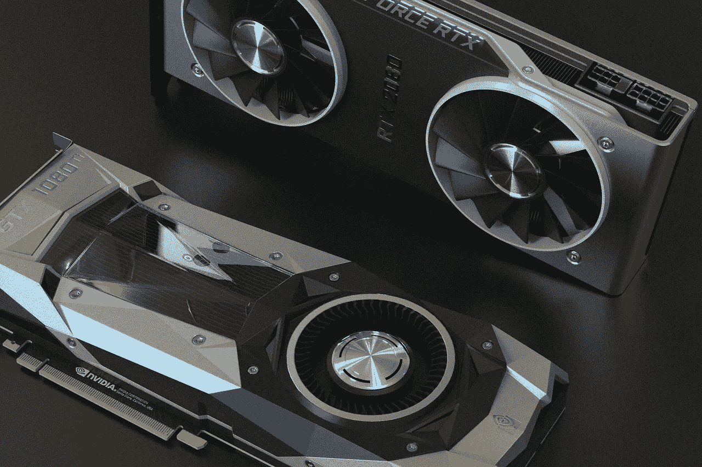
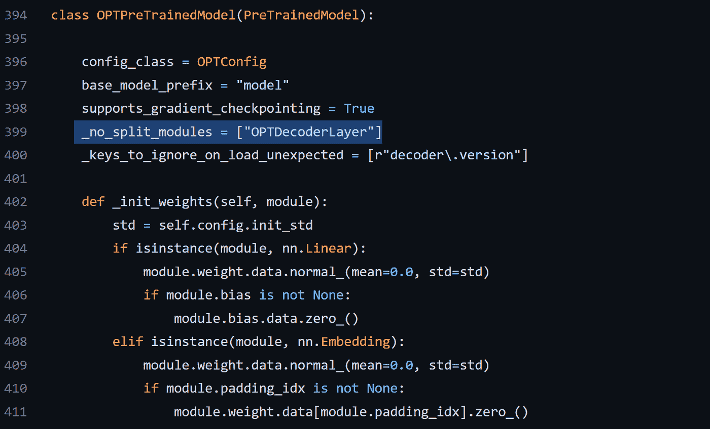
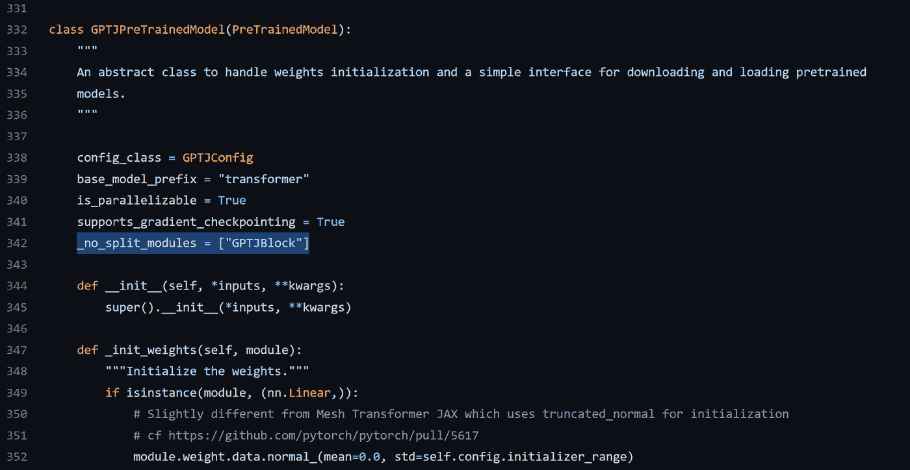

# 在您的计算机上运行非常大的语言模型

> 原文：<https://pub.towardsai.net/run-very-large-language-models-on-your-computer-390dd33838bb?source=collection_archive---------0----------------------->

## 用 PyTorch 和拥抱脸的设备 _ 地图



图片来自 [Pixabay](https://pixabay.com/photos/nvidia-graphic-card-bitcoin-gpu-5264921/)

几乎每个月都会公开发布新的大型语言模型。它们变得越来越好，越来越大。

您可能认为这些模型只能在大型集群或云中运行。

幸运的是，事实并非如此。PyTorch 的最新版本提出了几个机制，由于拥抱脸加速包，使得在标准计算机上使用大型语言模型相对容易，并且不需要太多工程。

在本文中，我将介绍一种在您自己的计算机或 Google Colab 的免费实例上使用大型语言模型的简单方法，使用拥抱面部变形器和加速包。

出于本文的目的，我将使用 META AI 发布的 OPT 模型的 [6.7B 版本。如果您的硬盘上有足够的可用空间，您可以尝试更大的版本。](https://arxiv.org/abs/2205.01068)

# 要求和环境

如果你想在你自己的电脑上重现我的实验，我推荐你用 Python 3.9 创建一个 conda ( [Anaconda](https://www.anaconda.com/) )环境。

以下命令创建一个名为“device_map”的环境并激活它。

```
conda create -n device_map python=3.9
conda activate device_map
```

然后，安装以下软件包。*请注意，它也可能适用于更高或更低版本的 CUDA。*

```
conda install pytorch pytorch-cuda=11.6 -c pytorch -c nvidia
conda install -c conda-forge transformers
conda install -c conda-forge accelerate
```

至于硬件，我可以在我的 nVidia RTX3060 12 Gb 和 16gb CPU RAM 上运行 67 亿参数模型。

# 被遗忘

正如我上面提到的，我将使用抱脸轮毂的 [OPT-6.7B。](https://huggingface.co/facebook/opt-6.7b)

假设我的目标是使用这个模型来制作一个生成语言的应用程序。

加载和使用带有变压器的模型的标准方法可以这样实现(如变压器文档所建议的[):](https://huggingface.co/docs/transformers/model_doc/opt)

```
from transformers import GPT2Tokenizer, OPTForCausalLM

#Load the model
model = OPTForCausalLM.from_pretrained("facebook/opt-6.7b")

#Load the tokenizer
tokenizer = GPT2Tokenizer.from_pretrained("facebook/opt-6.7b")

prompt = "Hey, are you consciours? Can you talk to me?"
inputs = tokenizer(prompt, return_tensors="pt")

# Generate
generate_ids = model.generate(inputs.input_ids, max_length=30)
tokenizer.batch_decode(generate_ids, skip_special_tokens=True, clean_up_tokenization_spaces=False)[0]
```

当您运行这段代码时，它将首先下载模型(除非您以前使用过它)，该模型被分成 9.96 GB 和 3.36 GB 两部分。因此，您至少应该在硬盘上留出 20 GB 来存放这个模型。

然后，它将在内存中加载模型…并崩溃。

虽然硬盘上的型号大小为 13.4 GB (9.96+3.36)，但它需要扩展并完全加载到 CPU RAM 中才能使用。由于该模型具有 6.7B 个参数，并且 1 个参数需要 4 字节的内存，因此该模型将需要 4*6700000=26.8 GB 的 CPU RAM。

PyTorch 首先在内存中创建模型，然后加载另一个副本来获取模型的权重，所以实际上，您需要两倍的内存:53.6 GB。

拥有如此多 CPU RAM 的消费级硬件配置仍然非常罕见。

我的电脑和 Google Colab 免费实例没有这么多内存，因此在进程结束前就终止了它。

# 模型分裂

为了能够运行模型，我们需要对它进行拆分:模型的一些部分将位于 GPU VRAM、CPU RAM 和硬盘上。

借助 Accelerate，我们可以非常轻松地实现这种拆分。

让我们用下面的代码来看看拆分是如何工作的:

```
from accelerate import infer_auto_device_map, init_empty_weights
from transformers import AutoConfig, AutoModelForCausalLM

config = AutoConfig.from_pretrained("facebook/opt-6.7b")

with init_empty_weights():
  model = AutoModelForCausalLM.from_config(config)

device_map = infer_auto_device_map(model)
```

这里“infer_auto_device_map”将推断模型的最佳分割，以将模型尽可能多地加载到 GPU VRAM 上，然后加载到 CPU RAM 上，最后加载到硬盘上。

例如，我得到了这样的分割:

```
{'model.decoder.embed_tokens': 0, 'model.decoder.embed_positions': 0, 
'model.decoder.final_layer_norm': 0, 
'model.decoder.layers.0': 0, 'model.decoder.layers.1': 0, 
'model.decoder.layers.2': 0, 'model.decoder.layers.3': 0, 
'model.decoder.layers.4': 0, 'model.decoder.layers.5': 0, 
'model.decoder.layers.6': 0, 'model.decoder.layers.7.self_attn': 0, 
'model.decoder.layers.7.activation_fn': 0, 
'model.decoder.layers.7.self_attn_layer_norm': 0, 
'model.decoder.layers.7.fc1': 0, 'model.decoder.layers.7.fc2': 'cpu', 
'model.decoder.layers.7.final_layer_norm': 'cpu', 
'model.decoder.layers.8': 'cpu', 'model.decoder.layers.9': 'cpu', 
'model.decoder.layers.10': 'cpu', 'model.decoder.layers.11': 'cpu', 
'model.decoder.layers.12': 'cpu', 'model.decoder.layers.13': 'cpu', 
'model.decoder.layers.14': 'cpu', 
'model.decoder.layers.15.self_attn.k_proj': 'cpu', 
'model.decoder.layers.15.self_attn.v_proj': 'disk',
'model.decoder.layers.15.self_attn.q_proj': 'disk', 
'model.decoder.layers.15.self_attn.out_proj': 'disk', 
'model.decoder.layers.15.activation_fn': 'disk', 
'model.decoder.layers.15.self_attn_layer_norm': 'disk', 
'model.decoder.layers.15.fc1': 'disk', 'model.decoder.layers.15.fc2': 'disk', 
'model.decoder.layers.15.final_layer_norm': 'disk', 
'model.decoder.layers.16': 'disk', 'model.decoder.layers.17': 'disk', 
'model.decoder.layers.18': 'disk', 'model.decoder.layers.19': 'disk', 
'model.decoder.layers.20': 'disk', 'model.decoder.layers.21': 'disk', 
'model.decoder.layers.22': 'disk', 'model.decoder.layers.23': 'disk', 
'model.decoder.layers.24': 'disk', 'model.decoder.layers.25': 'disk', 
'model.decoder.layers.26': 'disk', 'model.decoder.layers.27': 'disk', 
'model.decoder.layers.28': 'disk', 'model.decoder.layers.29': 'disk', 
'model.decoder.layers.30': 'disk', 'model.decoder.layers.31': 'disk', 
'lm_head': 'disk'}
```

您可以看到，拆分不是在层级别完成的，同一层的组件可能位于不同的设备上。例如，对于第 7 层，自我关注层规范在 GPU 上，但最终层规范在 CPU RAM 上。

这不是最佳选择，因为它可能会破坏层内部的连接。我们需要指出层不应该被分割。我们可以通过添加另一个参数来实现这一点，如下所示:

```
device_map = infer_auto_device_map(model,no_split_module_classes=["OPTDecoderLayer"])
```

“no_split_module_classes”是指应该由模型实现的“_no_split_modules”变量。例如，对于 OPT，如果您查看[源代码](https://github.com/huggingface/transformers/blob/main/src/transformers/models/opt/modeling_opt.py)，您会在那里找到它:



截图来自[的源代码 OPT 来自拥抱脸变形金刚](https://github.com/huggingface/transformers/blob/main/src/transformers/models/opt/modeling_opt.py)

模块的名称因型号而异。例如，对于 GPT-J-6B，它被称为“GPTJBlock”:



截图来自《拥抱脸变形金刚》中 [GPT-J 的源代码](https://github.com/huggingface/transformers/blob/main/src/transformers/models/gptj/modeling_gptj.py)

新映射将每个层保留在同一设备上:

```
{'model.decoder.embed_tokens': 0, 'model.decoder.embed_positions': 0, 
'model.decoder.final_layer_norm': 0, 'model.decoder.layers.0': 0, 
'model.decoder.layers.1': 0, 'model.decoder.layers.2': 0, 
'model.decoder.layers.3': 0, 'model.decoder.layers.4': 0, 
'model.decoder.layers.5': 0, 'model.decoder.layers.6': 0, 
'model.decoder.layers.7': 'cpu', 'model.decoder.layers.8': 'cpu', 
'model.decoder.layers.9': 'cpu', 'model.decoder.layers.10': 'cpu', 
'model.decoder.layers.11': 'cpu', 'model.decoder.layers.12': 'cpu', 
'model.decoder.layers.13': 'cpu', 'model.decoder.layers.14': 'disk', 
'model.decoder.layers.15': 'disk', 'model.decoder.layers.16': 'disk', 
'model.decoder.layers.17': 'disk', 'model.decoder.layers.18': 'disk', 
'model.decoder.layers.19': 'disk', 'model.decoder.layers.20': 'disk', 
'model.decoder.layers.21': 'disk', 'model.decoder.layers.22': 'disk', 
'model.decoder.layers.23': 'disk', 'model.decoder.layers.24': 'disk', 
'model.decoder.layers.25': 'disk', 'model.decoder.layers.26': 'disk', 
'model.decoder.layers.27': 'disk', 'model.decoder.layers.28': 'disk', 
'model.decoder.layers.29': 'disk', 'model.decoder.layers.30': 'disk', 
'model.decoder.layers.31': 'disk', 'lm_head': 'disk'}
```

你可以随意操纵这张地图。例如，由于 Accelerate 会在转到硬盘之前尝试最大化 CPU RAM 的使用，因此您系统的操作系统可能没有更多 CPU RAM 可供自己使用。

如果发生这种情况，您可以通过修改“device_map”的值将一个层卸载到磁盘，如下所示:

```
device_map["model.decoder.layers.13"] = "disk"
```

# 包扎

最后，为了利用这种分割，我们只需要在加载模型时提供“device_map”参数，准确地说是“offload_folder”，这是一个将层存储在硬盘上的文件夹:

```
model = OPTForCausalLM.from_pretrained("facebook/opt-6.7b", device_map="auto", offload_folder="offload")
```

我将 device_map 设置为“auto”，但是您也可以将“auto”替换为用“infer_auto_device_map”创建的自定义映射，您可以对其进行修改。

代码将会运行，但是当然，由于模型的某些部分在硬盘上，它可能会很慢。

硬盘上的可用空间是唯一的限制。如果你有更多的空间和耐心，你可以尝试更大的模型。