# 在 Java 中从 HuggingFace 运行 NLP Bert 或机器学习模型

> 原文：<https://pub.towardsai.net/running-an-nlp-task-or-machine-learning-model-from-huggingface-in-java-8a3c7c131c10?source=collection_archive---------2----------------------->

HuggingFace 使得在 Python 中运行机器学习模型变得极其容易。

但是如果你需要在 Java 中运行这些模型呢？一个简单的解决方案是建立一个 Python 服务并从 Java 发出一个 HTTP 请求。

但是有时候，你不能向服务发出 HTTP 请求。因此，如何在 Java 中直接运行模型呢？

你可以使用“深度 Java 库”([https://djl.ai/](https://djl.ai/))和“开放式神经网络交换”([https://onnx.ai/](https://onnx.ai/))来让事情发生。

在这篇文章中，我将给出一个工作示例来开始。

# 在 Python 中运行代码

首先，让我们在 Python 中运行我们希望在 Java 中运行的代码，以确保我们得到相同的值。

看看这个 gist([https://gist . github . com/Carlos-agua yo/2d 1 Fe 4c 246 a7 ad 2c 54 CD 726 c 17 c 30 a 77](https://gist.github.com/carlos-aguayo/2d1fe4c246a7ad2c54cd726c17c30a77)0)

您可以看到，我们将一个句子“Hello world”标记化，通过一个预先训练的模型运行它，并查看最后一个隐藏状态的第一个值。

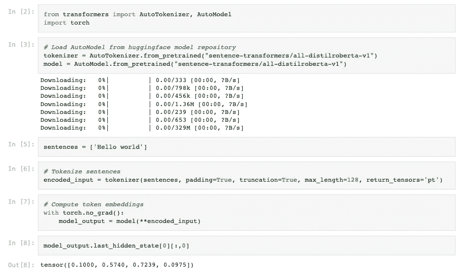

您可以看到，我们显示了“`[CLS] Hello world [SEP]`”中每个令牌嵌入的第一维度，即`[0.1000, 0.5740, 0.7239, 0.0975]`。如果我们在 Java 中得到相似的值，我们可以确信我们运行的是相同的代码。

# 序列化记号赋予器和模型

为了在 Java 中运行，我们需要序列化标记器和模型。

可以看看这里做序列化的代码([https://gist . github . com/Carlos-agua yo/2bb 28 c 893584 fc 6325216 CBE 43711 a1b](https://gist.github.com/carlos-aguayo/2bb28c893584fc6325216cbe43711a1b))。这很简单。

首先，我们下载我们需要的分词器，并使用“`save_pretrained`”方法保存它。我们需要文件`tokenizer.json,`，一旦执行了代码，您可以直接从 Colab 下载它。如果您不熟悉从 Colab 下载文件，有几种方法可以做到。看看这个 Stackoverflow 问题([https://stack overflow . com/questions/48774285/how-to-download-file-created-in-co-laboratory-workspace](https://stackoverflow.com/questions/48774285/how-to-download-file-created-in-colaboratory-workspace))

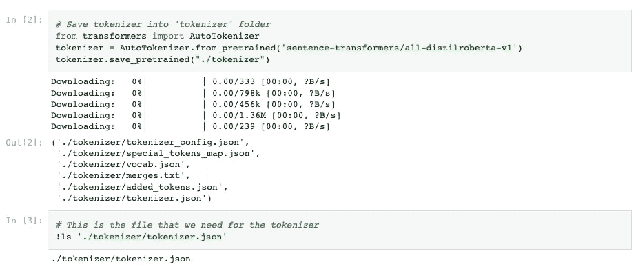

其次，我们需要使用 ONNX 格式序列化模型。这也是一项简单的任务。您调用这个命令

`!python -m transformers.onnx -- model=’sentence-transformers/all-distilroberta-v1' onnx/`

您可以看到它将 HuggingFace 模型作为一个参数，并将您想要保存的内容放在这个目录中。

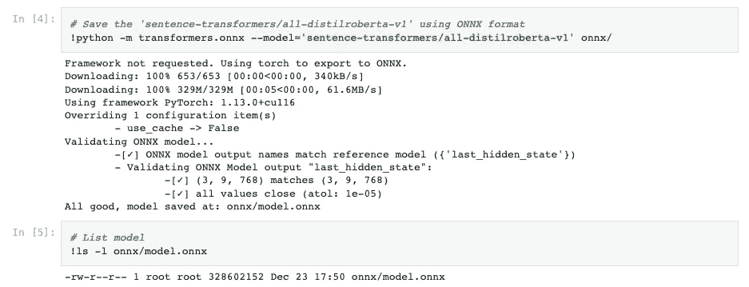

运行该命令后，将会生成一个文件'`model.onnx`'。

这些型号往往体积较大，如你所见，`model.onnx`约为 330MB。出于某种原因，Colab 很难下载大文件。更容易挂载 Google Drive，把文件复制到那里，直接从 Google Drive 下载。

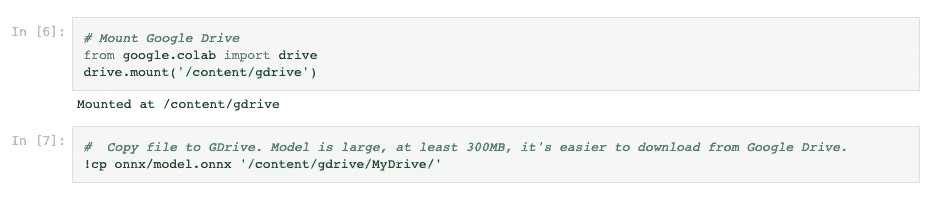

打开你的 Google Drive，你会找到`model.onnx`文件。

# 用适当的依赖项创建 Java 项目

使用 Gradle、Maven 或任何您喜欢的构建工具创建一个新的 Java 项目。或者更新现有项目的依赖项。

下面是一个简单的 pom.xml 的要点([https://gist . github . com/Carlos-agua yo/ea 8772 C4 A8 a 86601829d 69 be 0a 3752d 6](https://gist.github.com/carlos-aguayo/ea8772c4a8a86601829d69be0a3752d6))

这些是您在 Maven 格式中需要的依赖项:

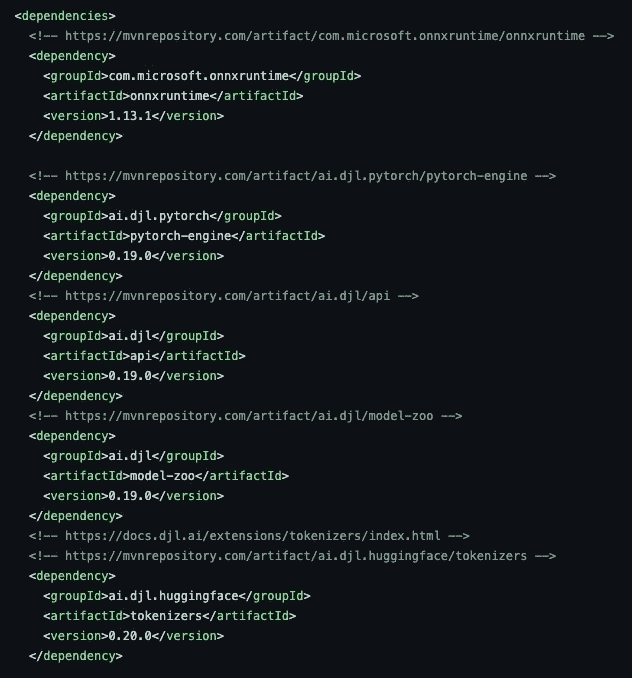

创建一个名为`artifacts`的文件夹，添加我们在上一步中生成的`tokenizer.json`和`model.onnx`文件。

# 用 Java 运行模型

我们现在终于可以用 Java 运行我们的代码了。看看这个 gist 的工作示例([https://gist . github . com/Carlos-agua yo/f 2743 e 15186 a 0965 e 1958 a 599055683 c](https://gist.github.com/carlos-aguayo/f2743e15186a0965e1958a599055683c))

首先，你可以看到我们将对与上一步相同的句子进行编码:“Hello world”。

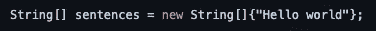

接下来，我们实例化一个标记器，并对句子进行编码。

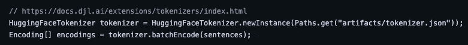

然后，我们将模型加载到内存中。

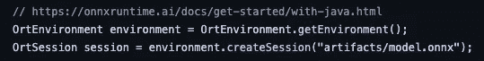

我们的模型有两个输入，`input_ids`和`attention_mask.`记号赋予器提供这些值。我们需要创建张量和地图来传递给我们的模型。

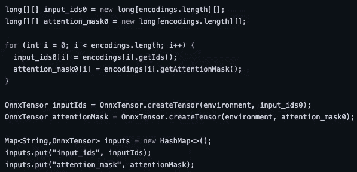

最后，我们可以将这些输入传递给我们的模型，并检查结果

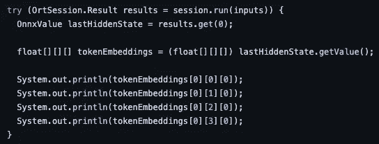

运行这段代码时，您应该会得到类似下面这样的输出

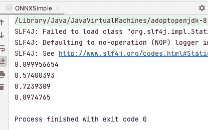

这些值与我们在 Python 中运行代码时在第一步中获得的值相同:`[0.1000, 0.5740, 0.7239, 0.0975].`

# 结论

在这篇博文中，您用 Python 运行了一个从 HuggingFace hub 下载的令牌化器和模型。然后，我们序列化了记号赋予器和模型，随后使用“深度 Java 库”([https://djl.ai/](https://djl.ai/))和“开放神经网络交换”([https://onnx.ai/](https://onnx.ai/))在 Java 中加载它们，并确认我们得到了相同的值。