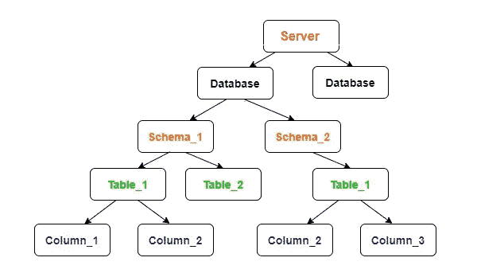
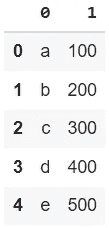
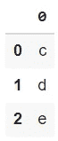

# 在 Pandas 上运行 SQL 查询

> 原文：<https://pub.towardsai.net/running-sql-queries-on-pandas-fc2985b95a4a?source=collection_archive---------2----------------------->

## [编程](https://towardsai.net/p/category/programming)

## 使用 SQL API 与 pandas DataFrame 对象交互

在本文中，我将向您详细解释如何在您的编程环境中创建一个模拟的服务器和数据库，您可以在其中执行 SQL 查询。如果您赶时间，可以立即跳到文章末尾查看代码，如果您希望深入了解数据库是如何构造的，可以继续阅读。代码只需要几行，没什么太复杂的。


阿宝，功夫熊猫，2008

## 问题

不幸的是，没有太多的解决方案可以用来试验您的 SQL 数据库。您可以在线访问一些演示界面，我发现的一些允许您尝试 SQL 的解决方案是 W3School 或 SQLite demo，使用起来很繁琐，尤其是如果您刚刚开始钻研数据库。

首先，在线关系数据库的最大问题是，有许多相似的可能性，不幸的是，它们彼此不兼容。这些是最常见的数据库管理系统(DBMS)类型:

*   Microsoft SQL，也称为 MS SQL Server 或简称 SQL Server(只是为了让它更容易混淆)
*   一种数据库系统
*   关系型数据库
*   Oracle SQL

DBMS 充当数据库的中介，允许程序员发送查询来与数据交互。每个 DBMS 都为其自己的关系数据库工作，我们通常不能在 PostgreSQL 上使用 MS SQL 解决方案。

另一个大问题是定价:如果你想把你的实验提高到另一个水平，你显然需要一个在线数据库，至少可以做一些发送和接收数据的实验。用于构建连接到数据库的数据管道的大多数软件都是基于 MS SQL 的，不幸的是，我在网上没有找到任何免费的 MS SQL 空间。您可以找到 MySQL 和 PostgreSQL 的解决方案，例如，ElephantSQL，但无法连接到 MS SQL 专用工具，如 Microsoft SQL Server Management Studio(SSMS)，这是一款用于探索 MS SQL 数据库的参考软件。

## 数据库如何工作

数据库**不是控制数据管理的最高抽象层次**。相反，您首先需要创建一个能够控制多个数据库实例的活动服务器。每个数据库能够保存多个存储数据的表。


师父，功夫熊猫，2008

因此，您不需要首先创建一个数据库，而是设置一个服务器。在本地环境中创建了服务器或服务器的模拟实例之后，最终可以创建一个包含一个或多个表的数据库。在向您展示 python 上的过程之前，让我们看一下数据库的架构。

## 将 Pandas 数据帧转换为 SQL 表

在 pandas 上使用 SQL 相当简单，因为它只需要几行代码。然而，您需要理解为什么这些代码行能够工作，为什么您不能简单地使用 SQL 语言连接到 pandas 数据框架，但是您需要额外的工作来在您的本地编程环境中模拟数据集。



关系数据库嵌套实例

关系数据库是以一种非常精确的方式组织的:有不同的结构层次用于掌握和管理存储数据的复杂性。首先，你需要一个服务器，这正是我们用 python 模拟的。

一台服务器可以托管一个或多个数据库。事实上，每当您决定购买一些 SQL 存储(可能的 DBMS 变体之一)时，您总是会被问到哪个服务器将托管您的数据库。每个应用程序或者如果足够大，应用程序的每个部分可以使用包含表的专用数据库。每个表格都相当于一个 Excel 电子表格，使它更容易理解。

首先，我们需要创建一个可以存储在临时数据库中的 DataFrame 对象。这将允许您使用 SQL API 与数据进行交互，这是一个允许您(程序员)使用这种不同的计算机语言与数据(存储在 python 对象中)进行交互的接口。

```
import pandas as pd
from sqlite3 import connectdf = pd.DataFrame([['a', 'b', 'c', 'd', 'e'], [100, 200, 300, 400, 500]]).T
df
```



测向数据集

虽然听起来可能很复杂，但是在编程环境中模拟本地服务器的操作可以通过一个名为 sqlite3 的库轻松完成。一旦你完成了这一步，你可以简单地将你的数据帧 **df** 转移到 **test_data** 表。

```
conn = connect(':memory:')
df.to_sql('test_data', conn)
```

现在，您可以使用 **read_sql** 函数与该表进行交互并执行 sql 查询:

```
pd.read_sql('SELECT [0] FROM test_data WHERE [1]>200', conn)
```



应用于测向数据集的过滤方法