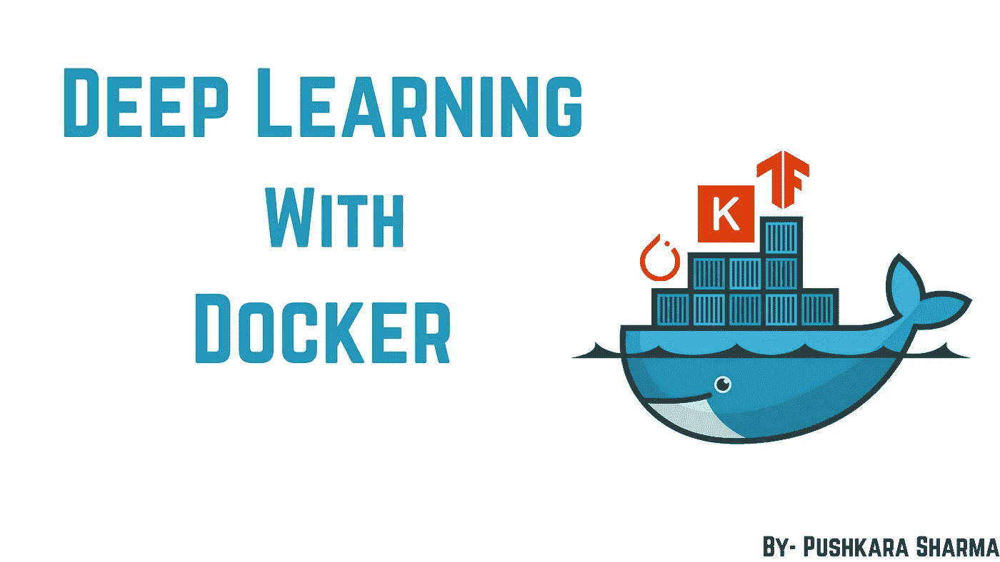
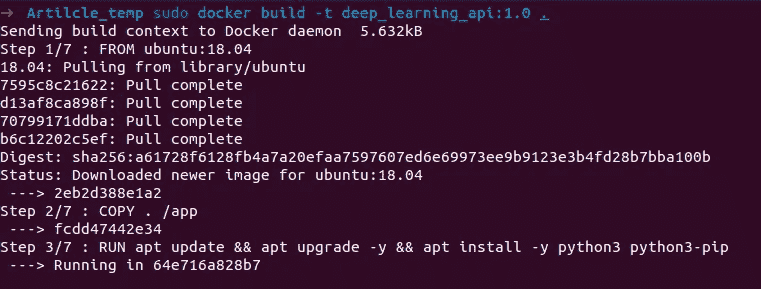
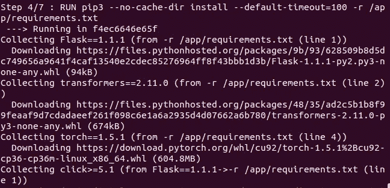
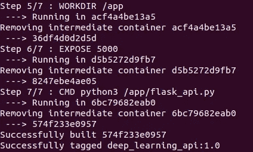
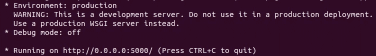
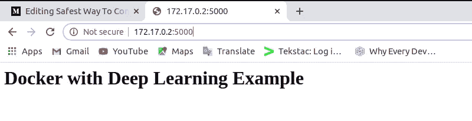
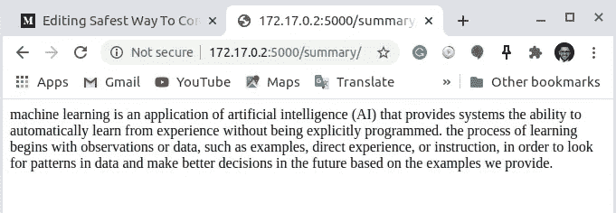

# 封装深度学习 Flask API 的最安全方式

> 原文：<https://pub.towardsai.net/safest-way-to-containerize-deep-learning-flask-api-8441eee8488f?source=collection_archive---------0----------------------->



## [深度学习](https://towardsai.net/p/category/machine-learning/deep-learning)，[编程](https://towardsai.net/p/category/programming)

## 以最安全的方式构建和推送深度学习 Flask API 的 Docker 映像。

在本文中，我们将不会讨论开发机器学习模型，而是在 **Docker** 的帮助下，将我们准备部署的 **ML API (Flask)** 容器化，这样就不会有我们的模型在生产环境中不工作或者在云上部署它或者只是将工作模型分享给朋友和同事的麻烦。

注意 :- Docker 是一种有用的工具，也是当今的潮流，所以最好开始将你的模型容器化。

首先，我假设如果你正在阅读这篇文章，你可能已经熟悉了 Docker。如果没有，不要担心，我仍然会用我自己的外行话来定义它😄。

## 那么，Docker 是什么？

**Docker** 是一个工具，它允许我们设置整个操作系统级虚拟化，以开发和共享名为 **Docker Images** 的包中的项目。然后，要么手动共享这些图像(很难)，要么简单地将这些图像推送到 DockerHub 上，并在需要时随时提取。

当这些映像在系统上运行时，它们被称为 **Docker 容器**。因此，**容器**是 Docker **图像的运行实例。**更通俗地说，图像被认为是类，容器被认为是对象。

## 先决条件

1.  我假设您已经在系统中安装了 Docker。如果不是简单的按照自己[的**官方文件**的](https://docs.docker.com/get-docker/)去做。
2.  已经开发了可以部署的深度学习或机器学习 Flask API。如果还没有，那么你可以试试我在本教程中用过的那个。
3.  稳定快速的互联网连接。这似乎是显而易见的，但是相信我，如果互联网不稳定，你会从守护进程得到很多错误响应。

## 让我们开始工作吧

下面的代码片段显示了我的深度学习 Flask API，它生成了所提供输入的抽象摘要。同样的，我用过**火炬**和**变形金刚**库。选择这个模型作为例子的唯一目的是使用著名的深度学习库，这些库在制作图像时可能会产生一些问题(Tensorflow 和 Keras 也可以很容易地安装)。使用`pip install package_name`安装所需的软件包。

现在，在为 Docker 映像编写命令之前，我们必须创建一个`requirements.txt`文件来在我们的映像中安装所有需要的包。这个文件可以用`pip freeze`生成，然后那些依赖项可以用`pip install -r requirements.txt`安装。但是在一些特殊情况下，比如`torch`，我们必须给出一个下载那个包的链接。在我们的例子中，它看起来如下:-

```
Flask==1.1.1
transformers==2.11.0
--find-links [https://download.pytorch.org/whl/torch_stable.html](https://download.pytorch.org/whl/torch_stable.html)
torch==1.5.1
```

为了制作我们项目的 docker 映像，我们首先必须选择一个基础映像，我关注的大多数文章都使用了 **alpine** 来制作，因为它是轻量级的，但在我的情况下，这似乎会导致 python 和 pip 安装的问题，这就是为什么我选择 **ubuntu** (更值得信任和舒适)。

这个文件应该被命名为 **Dockerfile.txt** ，并且应该位于项目的根目录中。从命令中的**将提取作为我们图像的**操作系统**的基础图像。下一个命令 **COPY** 会将所有数据复制到名为 app 的文件夹中。 **RUN** 用于运行我们 docker 镜像中的任何命令。在这里，我们已经更新和升级了我们的 ubuntu，并安装了`python 3`和`pip3`来安装 python 包。然后我们使用 **RUN** 命令来安装`requirements.txt`中出现的所有依赖项(注意:这里我使用了`default-timeout=100`以避免等待连接类型的错误)。然后我们使用 **WORKDIR** 来设置我们的工作目录，即`app`文件夹，并且我们使用 **EXPOSE** 来通知 **Docker** 容器在运行时监听端口 5000。最后，为了在初始化映像时自动运行我们的程序文件，即`flask_api.py`，我们使用了运行默认可执行文件的 **CMD** 。**

```
**FROM** ubuntu:18.04
**COPY** . /app
**RUN** apt update && apt upgrade -y && apt install -y python3 python3-pip  
**RUN** pip3 --no-cache-dir install --default-timeout=100 -r /app/requirements.txt
**WORKDIR** /app
**EXPOSE** 5000
**CMD** python3 /app/flask_api.py
```

现在，只需运行下面给出的命令，开始构建您的 Docker 映像。这里，`deep_learning_api`是图像的名称， **1.0** 是标签。还有，记得复制那个点(。)最后。😆

```
sudo docker build -t deep_learning_api:1.0 .
```

运行这个命令后，放松下来，看看整个过程。如果您在任何阶段遇到任何与网络相关的错误，只需简单地**重启**整个过程。我附上了一些过程的截图供你参考。



您的 Docker 映像已成功构建。但是它工作正常吗？让我们找出答案。运行以下命令来获取一个**映像 id** 。复制您最近构建的映像**的**映像 id** 。对我来说是 574f233e0957。**

```
sudo docker images
```

现在使用下面的命令来运行我们的 Docker 容器。如果它工作正常，您将得到类似下面截图所示的内容。

```
sudo docker run 574f233e0957
```



但是，如果你点击这个地址，什么也不会出现。那是因为容器的 IP 地址不一样。所以我们必须提取出来。打开另一个终端，使用这个命令获取运行容器的 ID。复制**容器 ID** 。(我的是 7c2a2d25bb9d)

```
sudo docker container ls -la
```

现在，通过运行下面的命令，你将获得很多关于你的容器的信息，但是我们感兴趣的是 **IPAddress** 。搜索相同的并使用它代替 **0.0.0.0**

```
sudo docker inspect 7c2a2d25bb9d
```


最后，您将在浏览器中看到结果。



默认路由



完成所有深度学习处理的总结路线

好了，我们已经建成了。但是怎么分享呢？

答案是 [**DockerHub**](https://hub.docker.com/) 。如果您还没有创建您的帐户，创建一个，因为这将是非常有益的工作与 Docker。创建帐户后，创建一个新的存储库。我把它命名为`deep_learning_flask_api_demo`。然后在命令行上使用`sudo docker login`登录你的 docker 账户。

然后如前所述检查您的图像 ID，并用以下命令标记您的图像。

```
sudo docker tag 574f233e0957 yourDockerHubUserName/RepoName:1.0
```

标记后，只需用下面的命令将它推上 DockerHub。

```
sudo docker push yourDockerHubUserName/RepoName
```

从现在开始，你可以简单地用`pull`命令拉出你的 docker 图像。

注意:-你的回购默认是公开的，作为一个无偿用户，你只能得到一个私人回购。

希望你已经成功构建了深度学习 Flask API 的 Docker 镜像。如果您仍然遇到任何类型的错误，请随时联系我。我将非常乐意帮助任何人。😃

源代码可以在 [**GitHub**](https://github.com/PushkaraSharma/medium_articles_code/tree/master/Containerize_Deep_Learning_Docker) 上找到。

链接我的 [**Docker 图片**](https://hub.docker.com/r/pushkarasharma11/deep_learning_flask_api_demo) 。

谢谢你宝贵的时间。😊我希望你喜欢这个教程。

此外，请查看我关于使用 Python 从头开始进行[逻辑回归的教程。](https://medium.com/towards-artificial-intelligence/logistic-regression-from-scratch-with-only-python-code-9d3ae607e739)

[](https://medium.com/towards-artificial-intelligence/logistic-regression-from-scratch-with-only-python-code-9d3ae607e739) [## 仅使用 Python 代码从零开始进行逻辑回归

### 仅使用 Python 对多要素数据集应用逻辑回归。分步实现编码示例…

medium.com](https://medium.com/towards-artificial-intelligence/logistic-regression-from-scratch-with-only-python-code-9d3ae607e739) [](https://medium.com/towards-artificial-intelligence/gradient-descent-v-s-normal-equation-for-regression-problems-e6c3cdd705f) [## 回归问题的梯度下降 v/s 正规方程

### 选择正确的算法来找到使成本函数最小的参数。

medium.com](https://medium.com/towards-artificial-intelligence/gradient-descent-v-s-normal-equation-for-regression-problems-e6c3cdd705f)