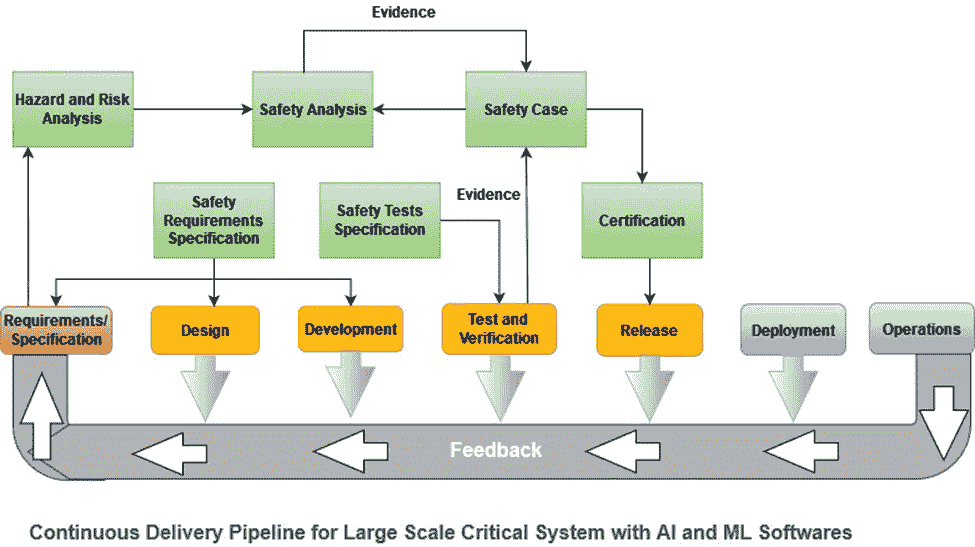
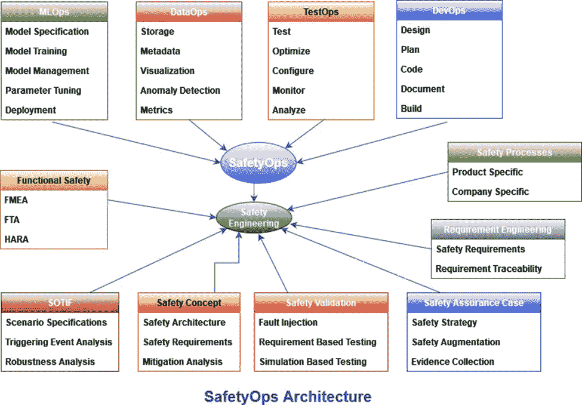
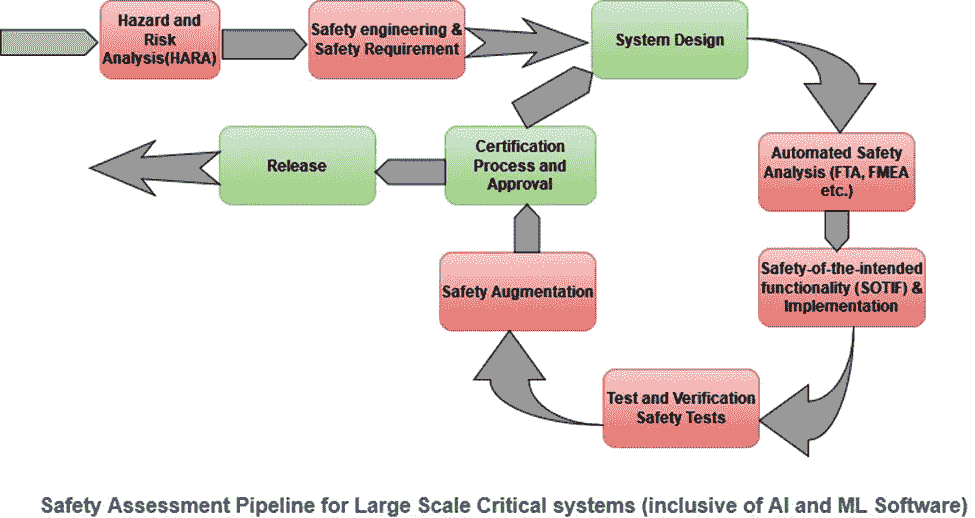

# 安全运营—超越 MLOps 的自动化框架

> 原文：<https://pub.towardsai.net/safetyops-automation-framework-beyond-mlops-5482abe14b6e?source=collection_archive---------2----------------------->

大多数数据科学家和机器学习工程师都非常熟悉 MLOps，并利用该框架进行机器学习(ML)软件生产和部署。

但是安全操作这个术语听起来熟悉吗？

让我打开这个神奇的单词。

图片来源:JanBaby 和 succo 在 Pixabay 上拍摄

安全操作不仅包括 m 操作，还包括开发操作、测试操作、数据操作和安全工程，形成一个紧密结合的小组，解决系统架构内的安全保证问题。

系统架构包含产品架构、软件和硬件架构，包括机器学习(ML)和人工智能(AI)软件。

很多时候，当使用机器学习模型和预测算法时，我们反过来在一个更大的系统上工作，这些模型只是其中的一部分。

这些大规模系统要么属于安全关键系统，要么属于任务关键系统。

在我们开始安全操作的细节之前，让我们先了解安全关键系统和任务关键系统。

## 什么是关键任务系统？

对企业或组织的生存至关重要的系统是任务关键型系统。当任务关键型系统关闭或中断时，业务交付和运营会受到严重影响。

一些常见的例子可以是在线银行系统、电网系统、紧急呼叫中心、医院病历、数据存储中心、股票交易所、交易软件等。

我们在现实生活中看到的许多系统都可以被称为任务关键型，这取决于它对业务、组织、行业和人员的重要性和影响。

## **什么是安全关键系统？**

其故障或失灵导致人员死亡/重伤、自然资源损失/严重损害或环境退化的系统。

该系统包括执行一个或多个安全功能所需的硬件、软件和人机交互。

一些常见的例子包括医疗设备、医疗保健系统、飞机飞行控制、武器、核系统、防御系统、自主车辆、航空电子系统等。

这里需要考虑的更重要的一点是，如果人类生命受到损失/危害，或者自然资源受到威胁，或者环境处于危险之中，那么任务关键型系统就变成了安全关键型系统。

回到主题。

在所有上述 AI 和 ML 软件包含的关键系统中，安全保证是最重要的，因此支持安全工程实践和过程变得势在必行。

## **在 ML 和 AI 驱动的大规模关键系统中实施安全流程的挑战**

安全保证是一个反复的过程，是一个持续的增量活动，它提供了基础产品或系统满足安全要求的信心。

然而，这些现代系统(尤其是涉及人工智能(AI)、机器学习(ML)、数据驱动技术(DDT)的系统，以及涉及真实世界与数字计算平台的复杂交互的系统)的复杂性日益增加，这给实施安全要求带来了一系列不同的挑战。

此外，安全流程的手动执行使得在整个产品生命周期/系统生命周期中保持安全保证的连续性变得更加困难。

目前，各种安全分析方法(例如，危害和风险分析(HARA)和故障树分析(FTA ))和过程在很大程度上与设计阶段隔离，仅通过利用 excel 电子表格和人工交互的手动过程进行连接。这背后的论点是，安全活动必须独立于设计和开发团队进行，以实现公正的实施和判断。这些相互矛盾的要求为开发自治系统带来了巨大的挑战，这些系统可以对这些 ML 和 AI 算法进行整体的“预期功能安全性(SOTIF)分析”,本质上需要软件开发人员和安全工程师的参与。

通常，FTA(故障树分析)和 FMEA(故障模式和影响分析)是在设计阶段手动执行的，以获得对系统的更多了解。然而，当前支持 AI 和 ML 的自治系统在试验阶段收集了大量数据，并提供了在过程的早期(在试验阶段本身)从如此庞大的数据堆中了解系统故障的机会。

安全案例设计通常取决于系统设计、外部和内部假设、系统配置、已识别的潜在危险、风险关注、相关安全措施等。但是在 AI 和 ML 支持的自治系统的情况下，这些系统大多部署在混乱和不断变化的环境中，这些属性可能比其他一些遗留系统更频繁地变化。

事实上，这需要一个连接良好的框架，用于系统设计、软件设计、数据挖掘、安全、测试和评估。

## **这些大型关键系统的需求**

大型关键系统必须满足监管要求，它们需要遵循特定的安全评估流程和安全工程生命周期。因此，在大规模关键系统中实现 ML 和 AI 包容软件的连续交付需要交付管道中连续安全评估过程的自动化。

安全是一个系统级属性，而不是软件级属性，因此不同工程学科的利益相关者、安全专家、外部评估员等都需要安全。，必须与软件开发人员一起包含在持续交付管道中。在混凝土输送管道中，基本需要的安全步骤是危险分析和风险评估(HARA)、建筑安全分析、安全增强等。目前，这些都是典型地记录在电子表格中的手动过程，并且需要在自动化这些过程以及识别危险和评估与危险相关的风险方面进行范式转变，从而有可能识别新的危险并最终调整与系统的已知危险相关的风险。

这将确保生产正确的产品，并为独立安全评估提供必要的工件和文档，从而支持法规合规性和最终认证交付。

## **作为自动化候选的手动安全流程**

来源—作者提供的图片

安全分析:包括的技术有故障树分析(FTA)和故障模式和影响分析(FMEA ),这些都是手动执行的，应该实现自动化，以实现连续的交付管道。

这些分析必须与系统或软件/硬件设计相联系，以便系统软件/硬件架构的变化可以与开发的安全分析模型同步。

安全测试:安全机制的自动化测试对于连续交付是必需的，目前是手工完成的，有可能包括减轻指定故障机制的测试。

安全论证:安全案例的自动化，包括所有工作产品、配置、详细的可追溯性和证据、评审等。，以便顺利纳入输送管道。

在这里，安全操作在将安全工程实践成功自动化到人工智能、人工智能和以数据为中心的各个领域中发挥着重要作用。

## **安全运行目标**

安全操作可以确保这些系统的功能安全(萨福)和预期功能安全(SOTIF ),这有助于降低由软件/硬件组件故障、算法缺陷和潜在技术的可能误用所导致的风险。

此外，安全操作还可以减少安全工程师、软件专家、硬件工程师和测试人员之间的差距。

SafetyOps 的最终目标是实现人工安全流程的自动化，并在安全工件和系统开发管道(数据工程、机器学习和系统集成和测试)的活动之间提供几乎 100%的可追溯性。

## **安全操作的正式定义**

SafetyOps 是一个自动化框架，包括 MLOps、DataOps、TestOps、DevOps 和安全工程，并提供高效、连续、可靠、快速和可追踪的关键系统和软件。

## **安全运营架构**

来源——图片由作者提供(改编自图 1。——【https://www.arxiv-vanity.com/papers/2008.04461/ 

## **安全运营框架细节**

来源—作者提供的图片

主要想法是建立一个框架，毫不费力地将安全工程活动与自主系统开发的重要组件(即 DevOps、TestOps、DataOps 和 MLOps)联系起来。实现安全运营环境需要改变流程、工具和文化，选择正确的工具和流程可以成为明显的赢家，提供可衡量的改进。

事实上，安全运营的核心理念是根据法规合规性和标准促进安全流程和活动的自动化(如 DevOps、TestOps、DataOps 和 MLOps)。

## **结论**

为了在 AI 和 ML 嵌入式安全相关系统中充分利用 SafetyOps 的优势，最重要的是确保系统、软件、硬件和安全工程生命周期的各种工件之间的严格可追溯性，以便轻松识别受变更影响的部件，从而根据业务优势对其进行监控和微调。这需要一个全面的代理模型(模型的模型)来捕获在系统开发生命周期中创建的所有工件及其关系/链接。