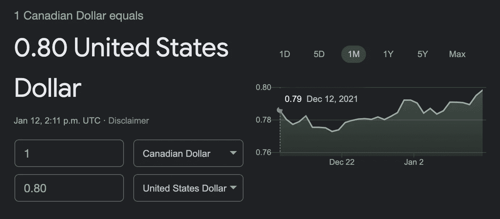
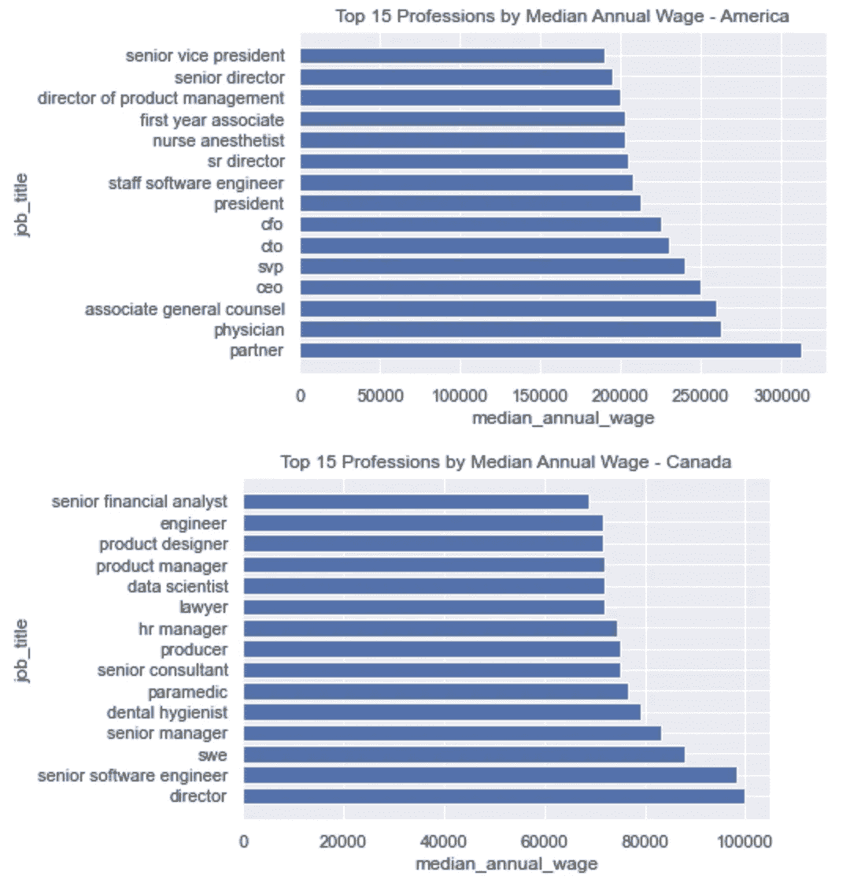
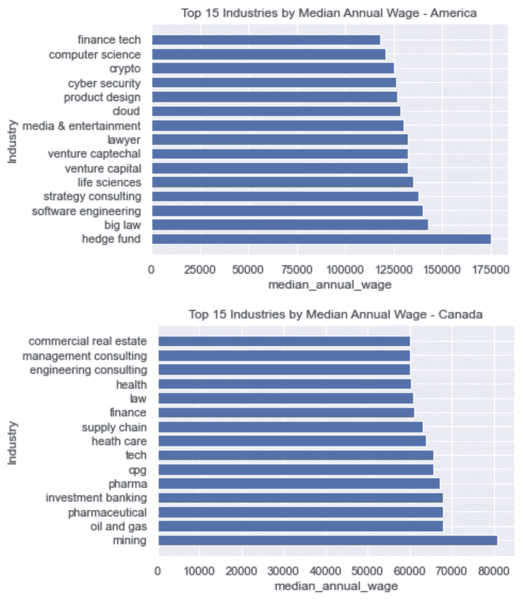
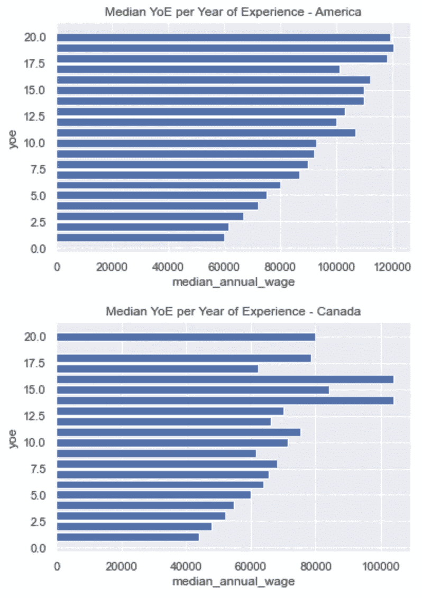
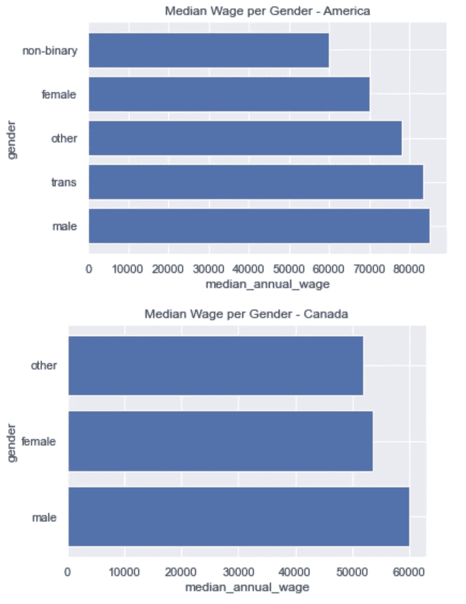
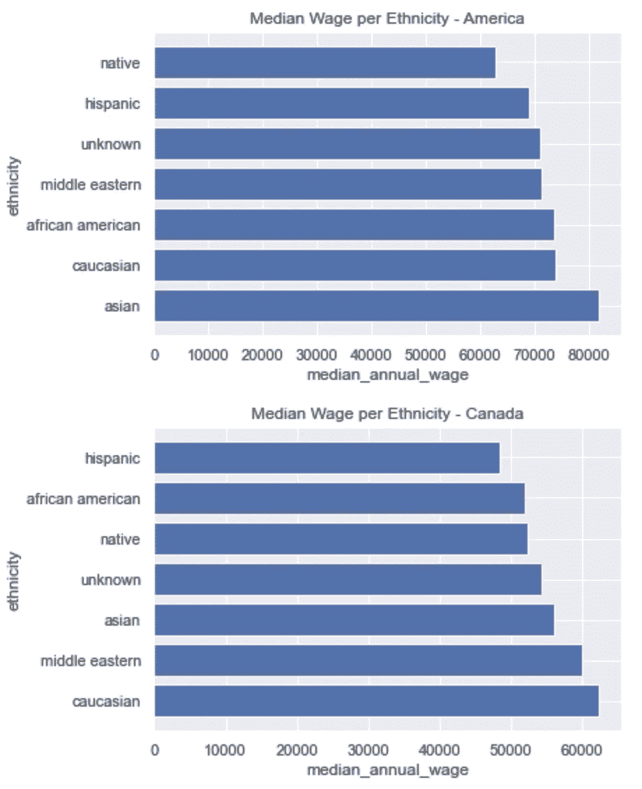
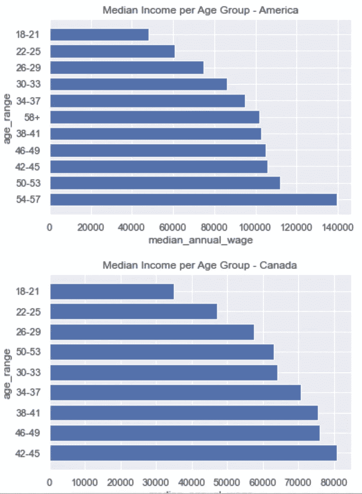
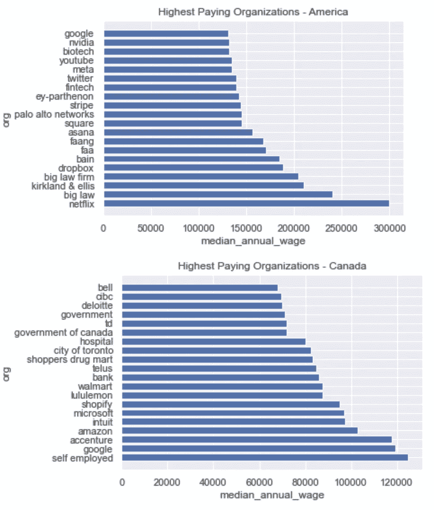
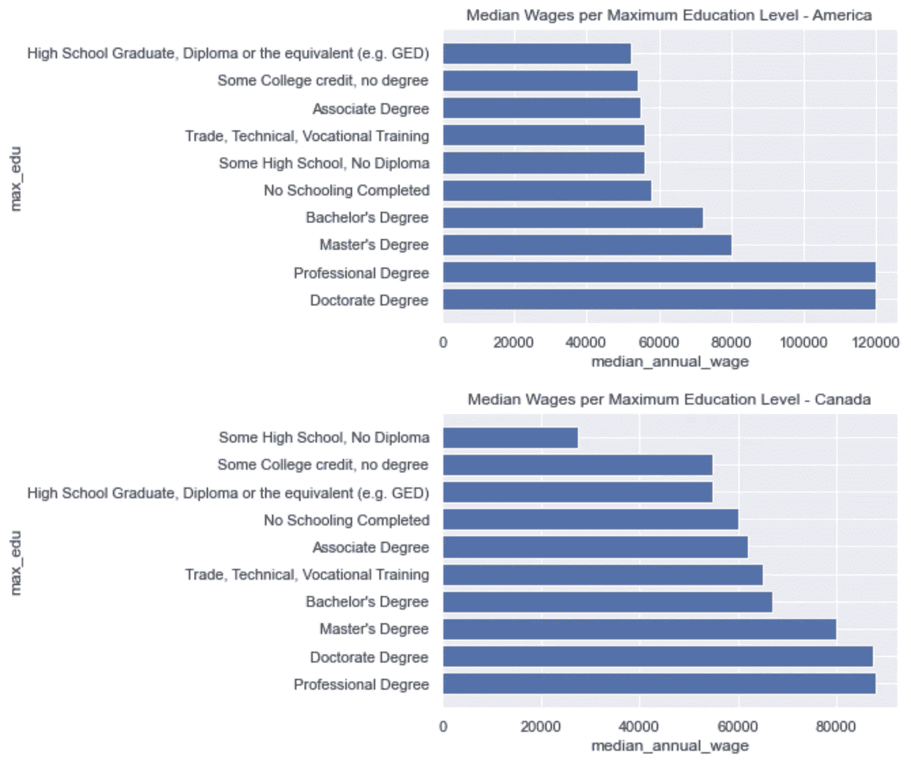

# 美国和加拿大市场的薪资分析和比较

> 原文：<https://pub.towardsai.net/salary-analysis-comparison-of-the-us-canadian-markets-b6813839ca55?source=collection_archive---------1----------------------->

## [数据分析](https://towardsai.net/p/category/data-analysis)

## 分析匿名提交的美国和加拿大经济的工资和人口统计数据


图片来自 [Unsplash](https://unsplash.com/photos/eYoAbih_riY) 由 [Sasun Bughdaryan](https://unsplash.com/@sasun1990) 拍摄

本文包括对公开提交的工资进行分析。根据提供的匿名信息，我将尝试回答各种问题。我在下面列出了其中的一些。

*   加拿大和美国哪个行业的工资中位数最高？
*   加拿大和美国哪些公司的工资中位数最高？
*   高学历对你的总体收入有多大影响？
*   加拿大和美国的性别工资差距是怎样的？

这些数据是由克里斯腾·尼诺·德·古兹曼在 LinkedIn 上发布的关于工资透明度的帖子收集而来的。你可以在这里找到帖子[，在这里](https://www.linkedin.com/feed/update/urn:li:activity:6883141659610234880/)找到相关的 CSV 文件[。她在她的 LinkedIn 社区上倡导这一点，并获得了很多关注，近 60，000 人匿名提交了他们的总薪酬明细、性别、年龄范围等。本文的重点是对检索到的数据进行分析。注意，由](https://docs.google.com/spreadsheets/d/19h0WT9Xjf9ncNmJDWpd8fzz7YnB37nemDnxKSO0EE8o/edit#gid=1664289965)[数据保护委员会](https://www.dataprotection.ie/en/dpc-guidance/anonymisation-pseudonymisation):

> 完全“匿名化”的数据不符合个人数据的必要标准，因此不受[一般数据保护条例(GDPR)中对个人数据处理的限制。](https://eur-lex.europa.eu/legal-content/EN/TXT/?uri=CELEX:02016R0679-20160504)当个人不再可识别时，数据可被视为“匿名化”。
> - [数据保护委员会](https://www.dataprotection.ie/en/dpc-guidance/anonymisation-pseudonymisation)

这篇文章将由几个不同的部分组成，如下所示:

**目录**

*   数据检索
    -需求
    -导入数据
*   数据清理
*   分析和可视化
*   分析的警告
*   结束语
*   资源

# 资料检索

**要求**

```
Python=3.8.8
pandas=1.2.4
numpy=1.20.1
seaborn=0.11.1
matplotlib=3.3.4
```

你可以在这里找到这篇文章[使用的数据。如果你在访问这个 google 文档时遇到问题，你可以在我的 GitHub 库](https://docs.google.com/spreadsheets/d/19h0WT9Xjf9ncNmJDWpd8fzz7YnB37nemDnxKSO0EE8o/edit#gid=1664289965)[这里](https://github.com/vatsal220/medium_articles/blob/main/salary_analytics/data/anon_salary.csv)找到用于这个分析的原始 CSV 文件。下面的代码片段将导入必要的模块和数据。

**导入数据**

数据集具有以下形状:`59688, 22`以下列:

```
'Timestamp', 'Age Range', 'Years of Experience', 'Industry', 'Job Title', 'Company Name', 'Highest Level of Education Received', 'Closest Major City and State (e.g. Santa Clara, CA)', 'Country', 'Annual Base Salary (if hourly, please convert to annual)', 'Annual Bonus', 'Annual Average of RSUs', 'Signing Bonus (if none, leave blank)', 'Currency (USD, CAD, etc)', 'How many vacation days are you given per year?', 'How many sick days are you given per year?', 'How many days per week are you required to work onsite/in the office?', 'Do you openly discuss salary with your colleagues?', 'How many months Maternity or Paternity does your company offer?', 'Gender (optional)', 'Unnamed: 20', 'Diverse Identity (Optional)'
```

# 数据清理

在清理组件的过程中，我们不会真的追求完美，因为有太多的数据需要手动解析，并且有太多的个别边缘情况会成为离群值。我们的目标是清理用户提交的大量结果。因此，清理部分肯定不是完美的，但是当处理大量用户提交的数据而没有任何提交选项/限制时，很难获得完美清理的数据。请注意，对于一个行业环境，您希望数据尽可能干净，简单地说，出于本文的目的，我们将尽可能地干净。在这一节中，我们将从重命名这些列开始，删除其中任何不必要的和奇怪的措辞。

本文中每一列的清理组件都将遵循相同的格式。通常，当通过 Pandas 读取 CSV 时，它会将整数值转换为字符串(通常如果列中有字符串，例如`20+`)。对于应该是数字的列，如`annual_wage`、`yoe`、`bonus`等。我们将尝试将字符串转换回整数。对于其他可能有更多不明确答案的列(通常与拼写/首字母缩写词相关)，我们将尝试创建一个字典，以将 CSV 中出现的重复值映射到一般结果。我通过在 Pandas 中的适当列上使用`value_counts()`函数来识别哪些值经常重复出现。

例如，在清理货币部分时，有许多方法可以表明您的货币是美元。该函数的映射如下:

```
Key: 'usd'
Values : [
'united stayes', 'united statea', 'united stares', 'united states', 'unites states', 'united state', 'california', 'new york', 'us', 'ny', 'united statws',  'usa', 'united states', 'united states of america', 'america', 'u.s.a.', 'u.s.a', 'u.s', 'u.s.', 'ny', 'united stated', 'los angeles', 'untied states', 'united statss', 'united sates', 'la', 'sacramento', 'ysa'
]
```

您可能会注意到值的组成部分中有许多不正确的拼写，这是因为许多人不会拼写(通常包括我自己) :)

**重命名列**

**净年薪**

**清洁货币**

**清洁组织**

**清洁城市位置**

**干净的国家**

**清洁工作**

**清洁性别**

**干净 YoE(多年经验)**

**清洁病假**

**清理公开讨论**

**干净的种族**

**清洁产假**

**清洁行业**

# 分析和可视化

现在，由于数据已经清理完毕，我们可以前进到分析组件。下面我概述了一系列问题，我想用现有的数据来回答。
-哪个职业的工资中位数最高？
-哪些行业的工资中位数最高？
-每年工作经验的收入中位数是多少？性别工资中位数是多少？每个民族的工资中位数是多少？每个年龄组的收入中位数是多少？哪些组织的薪酬最高？教育水平对个人收入的影响有多大？

为了这个分析的目的，让我们比较加拿大和美国的就业市场，并调查这两个经济体之间的细微差别。现在，让我们将整个数据集分成两部分，第一部分由与美国市场相关的记录组成，第二部分由与加拿大市场相关的记录组成。

尽管美国数据框架中的记录比加拿大数据框架中的多得多，但加拿大数据集中提交的条目数量并不小。现在让我们根据汇率将年薪从加元换算成美元。向前看，这两个子集将以美元进行比较。截至今天写这篇文章时，基于谷歌的汇率是 1 加元= 0.8 美元。这篇文章写于 1 月 12 日，所以当你看到这篇文章时，转化率很可能会有所不同。



图片取自[谷歌](https://www.google.com/search?q=cad+to+usd&sxsrf=AOaemvK-LFi52qKsdXNbPamlznt8dTZnCg%3A1641996766314&source=hp&ei=3uHeYbaOEJGu0PEPq7Oz8AE&iflsig=ALs-wAMAAAAAYd7v7rM4QTviT8waaELsiXeW2joDpBZ9&ved=0ahUKEwi29ebPsqz1AhURFzQIHavZDB4Q4dUDCAk&uact=5&oq=cad+to+usd&gs_lcp=Cgdnd3Mtd2l6EAMyCAgAEIAEELEDMgUIABCABDIFCAAQgAQyBQgAEIAEMgUIABCABDIFCAAQgAQyBQgAEIAEMgUIABCABDIFCAAQgAQyBQgAEIAEOgQIIxAnOgoIIxDvAxAnEIsDOgUIABCRAjoECAAQQzoOCC4QgAQQsQMQxwEQowI6CwgAEIAEELEDEIMBOhAIABCABBCHAhCxAxCDARAUOg4ILhCABBCxAxDHARDRAzoKCAAQsQMQgwEQQzoNCC4QsQMQxwEQowIQQzoNCC4QsQMQxwEQ0QMQQzoICC4QgAQQsQM6BwgAELEDEEM6CggAEIAEEIcCEBRQAFiQCWDkCmgAcAB4AIAB6gGIAbQMkgEFMS42LjOYAQCgAQG4AQI&sclient=gws-wiz)

由于我们的数据现在比以前干净得多，我们可以着手创建一些可视化的数据，看看数据看起来如何，并尝试回答上面的问题。我们将如何处理这个分析组件相当简单，我们将按特定的列进行分组，并聚合另一列的结果。然后，我们将只使用超过 5 个值的行进行聚合，这将删除大量的离群值和任意提交。然后，我们可以基于聚合对值进行排序，并可视化前 N 个结果。

为了这个分析的目的，我们将集中使用中位数而不是平均值，这背后的推理是相当直观的。使用中位数而不是平均数的一般想法是当数据有偏差时，这是因为在处理有偏差的数据时，中位数比平均数提供了更好的中心位置。例如，如果我们有下面给出的工资列表:

```
[45000, 43000, 50000, 44000, 53000, 39000, 48000, 55000, 95000, 105000]
```

当取这些工资的平均值时，我们会看到 57，700 英镑是平均值，当取中位数时，我们会看到 49，000 英镑是结果。手动检查这份清单，你可以得出结论，这个平均值并没有最好地反映典型的工资水平。当给出的大部分工资都在 39000-55000 英镑范围内时，得到一个高于该范围最大值的平均值是很奇怪的。这是因为尾部组件中的两个薪金(95000 和 105000)正在增加平均值。因此，最好使用中位数，这是一个更好的衡量集中趋势。

**群组可视化功能**

## 工资中位数最高的工作



图片由作者提供

基于这些结果以及更多进一步的结果，你可以清楚地看到，美国顶级职位的工资中位数与加拿大顶级职位的工资中位数之间存在巨大的差距。总的来说，对我来说，工作本身并不令人惊讶，在美国的图表中，我们看到这些职位与个人相关，通常是给那些已经工作了相当长时间的个人的。像首席财务官、首席执行官、SVP、董事、合伙人等职位。通常给拥有 10+年的个人。

然而，加拿大的调查结果明显偏向于需要高学历/技术相关职位的角色。像软件工程师、数据科学家、卫生员、经理、主管等角色。

## 工资中位数最高的行业



图片由作者提供

同样不足为奇的是，在加拿大和美国，薪酬最高的行业往往是科技/金融科技领域。然而，在加拿大采矿似乎更有利可图，但也是对体力要求更高的职业。

## 平均年收入



图片由作者提供

我想没有人会感到惊讶，年龄越大，赚的钱越多。

## 性别工资中位数



图片由作者提供

再一次，毫不奇怪，在加拿大和美国，男性的平均工资高于女性的平均工资。在这个数据集中，美国的男女工资差距似乎比加拿大高得多。

## 每个种族群体的工资中位数



图片由作者提供

## 每个年龄组的工资中位数



图片由作者提供

这一结果似乎非常符合以上关于多年经验的观察结果。这两个国家的老年人赚更多的钱，很可能是因为他们有更多的经验。

## 薪酬最高的组织



图片由作者提供

这一结果也非常符合上面观察到的结果(关于收入最高的行业和职业)。这里提到的这两个国家的公司可以归入`tech`领域。

## 最高教育水平的工资中位数



图片由作者提供

这也不足为奇，教育水平越高，收入水平越高。这与我们上面观察到的结果一致。

# 分析的警告

请注意，在分析和进行这种分析时，需要考虑很多事情。数据科学中的一句话是，你的结果的质量纯粹取决于数据的质量。也就是说，对这些结果不能全信。由于本文中的数据是通过 LinkedIn 从随机人群中匿名提供的，所以许多结果都基于提供信息的每个人的诚信。此外，数据肯定可以更加严格地清理。如前所述，出于本文的目的，我的目标是清理大多数的数据，但不是全部，也就是说，如果进一步清理，上面观察到的结果肯定会有所不同。最后，试图回答相同问题的不同数据集可能会得出不同的结论。如果 Glassdoor 或者实际上要做同样的分析来回答同样的问题，我会怀疑他们会得出同样的结果/结论。

请注意，我们不是在处理一个完整的数据集。总的来说，上面的结果和图像只反映了愿意分享信息的个人，并没有反映在该组织/行业/地点等工作的所有人。例如，美国律师事务所的合伙人工资中值最高，这可能是因为没有足够多的科技公司高管提交了他们的工资，或者只有高收入的律师提交了他们的工资。

# 结束语

总的来说，进行的分析很有趣，但是有了这个数据集，更多有趣的事情和问题可以得到解答。出于好奇，我创建了一个通用函数来回答我为本文提出的各种问题。在分析和可视化部分观察到的许多答案与社会观念和政府组织提供的统计数据一致(如性别工资差距、高经验导致高收入等。).

这些数据是公开的，甚至在这篇文章发表之后，还会有更多的人对此做出贡献。话虽如此，请随意提出你自己的问题，激发你自己的好奇心。对于想要进入数据驱动角色的个人来说，好奇、主动、交流结果和批判性思考是在任何数据驱动角色中取得成功的关键。通过回答未回答的问题继续这方面的工作。

# 资源

*   [https://statistics . laerd . com/statistical-guides/measures-central-trend-mean-mode-median . PHP](https://statistics.laerd.com/statistical-guides/measures-central-tendency-mean-mode-median.php)
*   https://www.linkedin.com/in/christenndg/
*   [https://docs . Google . com/spreadsheets/d/19 h0 wt9 xjf 9 ncnmjdwpd 8 fzz 7 ynb 37 nemdnxkso 0 ee 8 o/edit # GID = 1664289965](https://docs.google.com/spreadsheets/d/19h0WT9Xjf9ncNmJDWpd8fzz7YnB37nemDnxKSO0EE8o/edit#gid=1664289965)
*   [https://www . data protection . ie/en/DPC-guidance/anonymisation-假名化](https://www.dataprotection.ie/en/dpc-guidance/anonymisation-pseudonymisation)

如果你喜欢这篇文章，这里有一些我写的其他文章。

[](https://towardsdatascience.com/identifying-tweet-sentiment-in-python-7c37162c186b) [## 在 Python 中识别推文情感

### 如何使用 Tweepy 和 Textblob 识别推文情感

towardsdatascience.com](https://towardsdatascience.com/identifying-tweet-sentiment-in-python-7c37162c186b) [](https://towardsdatascience.com/mining-modelling-character-networks-part-ii-a3d77de89638) [## 挖掘和模拟字符网络—第二部分

### 本文将介绍挖掘和建模字符网络的 Python 实现

towardsdatascience.com](https://towardsdatascience.com/mining-modelling-character-networks-part-ii-a3d77de89638) [](https://towardsdatascience.com/word2vec-explained-49c52b4ccb71) [## Word2Vec 解释道

### 解释 Word2Vec 的直观性&用 Python 实现它

towardsdatascience.com](https://towardsdatascience.com/word2vec-explained-49c52b4ccb71) [](https://towardsdatascience.com/recommendation-systems-explained-a42fc60591ed) [## 推荐系统解释

### 用 Python 解释和实现基于内容的协同过滤和混合推荐系统

towardsdatascience.com](https://towardsdatascience.com/recommendation-systems-explained-a42fc60591ed) [](https://towardsdatascience.com/bayesian-a-b-testing-explained-344a6df88c1a) [## 贝叶斯 A/B 测试解释

towardsdatascience.com](https://towardsdatascience.com/bayesian-a-b-testing-explained-344a6df88c1a)