# 销售预测|销售预测的重要性|使用机器学习|端到端理解|第 1 部分

> 原文：<https://pub.towardsai.net/sales-prediction-importance-of-sales-forecasting-using-machine-learning-end-to-end-1303ae479b74?source=collection_archive---------1----------------------->

销售预测决定了公司如何投资和发展，从而对公司估值产生巨大影响。在本文中，您将学习如何使用机器学习技术进行销售预测。

CX 今天的销售预测

我将这篇文章分成 4 个部分，

第 1 部分-了解销售预测和 EDA

第二部分- [时间序列模型实现](https://medium.com/@yashashriShiral/sales-prediction-using-time-series-end-to-end-understanding-part-2-3cbeea3f8e36)

第 3 部分-深度学习模型实现(即将推出)

第 4 部分-受监督的机器学习模型实现(即将推出)

# 概念-

预测，简单来说就是根据过去或现在的数据预测或估计未来的趋势/做出决策。从小型企业到大型企业，各行各业都在利用预测来了解客户需求，以便公司能够做出有关财务规划、客户成功管理和供应链控制的正确决策。

**销售预测**——是预测一个公司、团队或个人在一定时间内能够创造多少收入的过程。准确的销售预测使企业领导人能够在设定目标、预算、招聘、潜在客户以及确定如何推动公司发展方面做出更明智的决策。因此，在许多方面，销售预测影响着组织中的每个人。根据麦肯锡的报告，一家全球制造商的需求预测经常会偏离 30%或更多。因此，团队依靠直觉来制定销售目标。

**销售预测的重要性:**

1.  销售预测使您能够发现潜在的问题，同时还有时间来减轻它们
2.  销售配额和收入预期的一致性
3.  能够让销售团队专注于高收入、高利润的销售渠道机会，从而提高成功率

# 为什么做销售的要 ML？

作为一名数据科学家，你应该能够有效地实现统计/机器学习。但是在现实世界中，它并不止于此。假设您正在构建一个 ML 模型来预测销售额。然后你必须首先了解你为什么做这个项目，它将如何影响业务，以及你如何通过建立这个模型来改善业务成果。如果你不理解与你的数据相关的商业价值，它将成为你的 ml 模型中的垃圾。

现在让我们来了解一下 ML 在销售中的作用。ML 可用于自动化日常任务，并允许销售人员将时间集中在最有资格的机会上。最终目标是更有效地完成这项工作，而不必投资雇佣更多的销售人员。在过去，大多数销售活动都是基于销售代表的直觉。机器学习用于预测哪些交易将会成交。ML 有助于预测未来的销售趋势，其中一个可以创建一个交互式仪表板，为整个组织提供单一的真实来源。销售代表总是在寻找新的销售线索和方法来增加他们的销售渠道并达成更多销售。机器学习可以通过提供对客户行为和模式的新见解来提供帮助。ML 允许企业创建更高级的预测模型，利用更大的数据集，而只需较少的人力。

# ML 方法

有两种方法可以预测未来的销售价值→

1.  **时间序列模型** —您可以实施时间序列方法，该方法包括使用一些重要的模型，根据已知的过去结果预测未来的结论。时间序列数据是在恒定的时间间隔内发生的一组测量值。这里，时间作为独立变量，目标(研究特性的变化)是因变量。
2.  **监督模型** —如果您提取季节性并将其放入变量中，您可以使用监督模型。例如年、月或星期几等。，以及其他将被用作“x”(因变量)的特征，而“y”是时间序列的实际值(在本例中为销售值)
3.  **深度学习和最近的模型—** 你可以使用 LSTM 等深度模型来预测销售值。或 Prophet，由脸书开发，是基本 AR 模型的扩展。该模型提供了另一种形式的特征工程，而不是使用目标变量的滞后值。

## **现在让我们回顾一下时间序列的基础知识** →

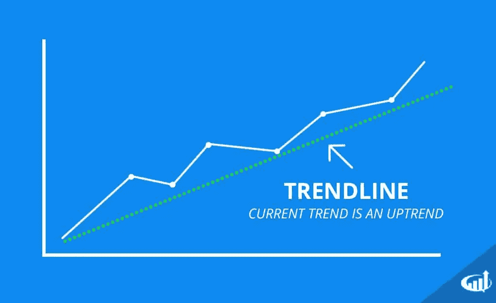

趋势线

1.  趋势-如果一个时间序列在一段时间内表现出正的长期斜率，则它具有上升趋势；如果它具有下降趋势，则它具有下降趋势
2.  季节性——季节性是指周期性波动。季节性总是有固定的频率。冬天，卖大衣的商店的销售额会上升
3.  平稳-如果时间序列的属性不随时间变化，即具有恒定的均值和方差，则称该时间序列是平稳的。
4.  自相关-简单地说，自相关是观测值之间的相似性，是它们之间的时滞的函数。

## 时间序列模型

时间序列模型用于根据历史数据预测事件。常见的类型包括 ARIMA、平滑和移动平均线。并非所有模型都会对同一数据集产生相同的结果，因此根据单个时间序列确定哪种模型效果最佳至关重要。

**基于平滑的模型** —在时间序列预测中，数据平滑是一种统计技术，涉及从时间序列数据集中移除异常值，以使模式更加可见。平滑数据可以消除或减少随机变化，并显示潜在趋势和周期成分。

**移动平均模型**——是一种建模单变量时间序列的常用方法。移动平均指定输出变量线性依赖于当前和各种过去的值。例如 AR、MA、ARMA、ARIMA

**指数平滑模型** —是一种使用指数窗口函数平滑时间序列数据的经验技术。指数平滑是一种简单易学且易于应用的程序，用于根据用户先前的假设(如季节性)进行某些确定。例如霍尔特-温特斯法

# 输入数据—

我用沃尔玛来自 Kaggle 的每周销售数据来做分析。

问题陈述—我们想要预测周销售额，并且我们想要了解假期或任何其他因素对周销售额的影响。

# 探索性数据分析—

现在，让我们在实施任何模型之前首先开始了解数据，这将有助于我们选择正确的模型和方法来进行销售预测。

正如您在表格中看到的，您有周销售额和一些其他功能，这些功能可能有助于我们了解是什么推动了更多的销售，反之亦然。

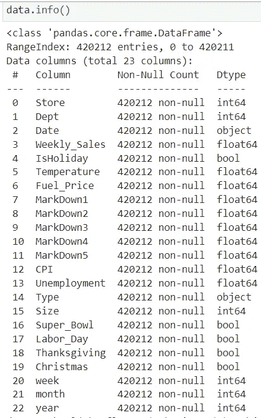

关于输入数据的信息

让我们来理解这些变量的分布—

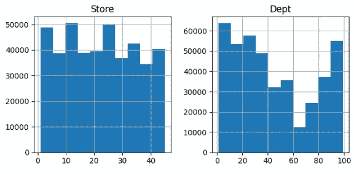

商店和部门的分布

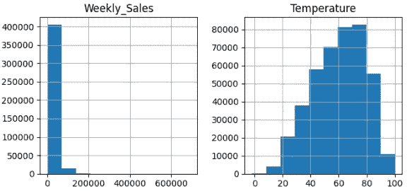

每周销售额和临时雇员的分布

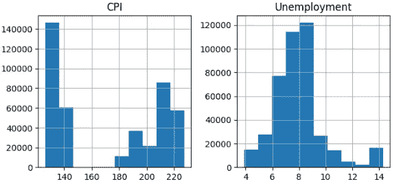

消费物价指数的分布与失业

如图所示，周销售额不是正态分布的。

现在我们来了解一下数值变量和销量之间有没有相关性。

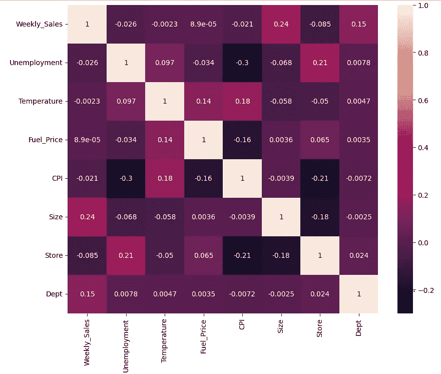

皮尔逊相关

失业、临时雇员、燃料价格、CPI 和规模与周销售额之间的相关性很低。CPI/失业率和店铺/规模负相关。但是部门和规模与周销售额呈正相关(尽管不是很强)

我们有 81 个部门的信息，但总共有 99 个部门。

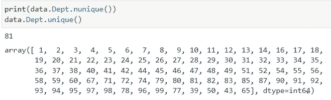

独特的部门

现在让我们来看看这些特性是如何根据周销售额分布的。

在下图中，我们可以看到，编号为 38、40、65、72、90、92、95 的部门的周销售额很高。

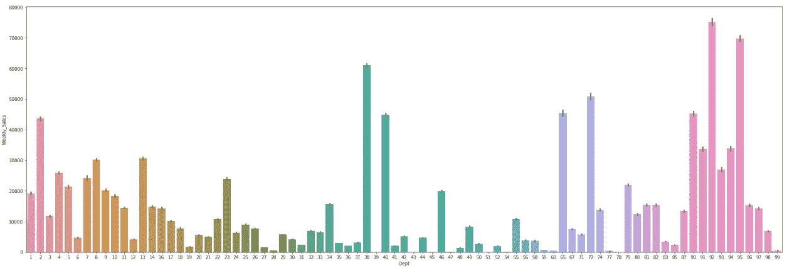

每周销售部门明智

如你所见，A 型的周销量高于 B 型和 c 型。

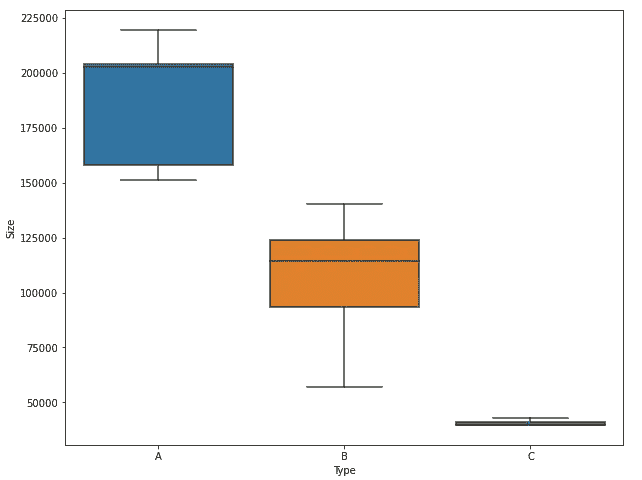

类型的周销售额

现在，让我们想象一下，在超级碗、劳动节、感恩节和圣诞节等节日期间，周销售额是否会上升。

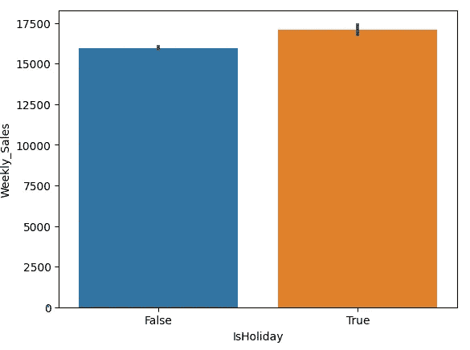

节假日每周销售额

我们可以说，只要有假期，每周销售额就会略有上升。现在让我们来了解一下是哪些节日推动了这些销售。

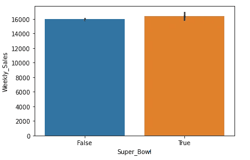

超级碗每周销售额

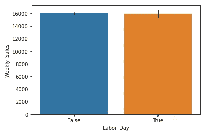

劳动节的每周销售额

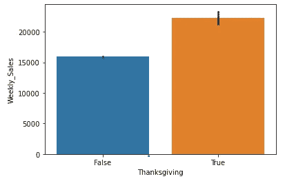

感恩节的每周销售

圣诞节的每周销售额

正如你在上面看到的，只有在感恩节期间，周销售额才会超过一定的数量。它在圣诞节期间下降，在超级碗和劳动节期间几乎没有影响。

一段时间内的销售额—

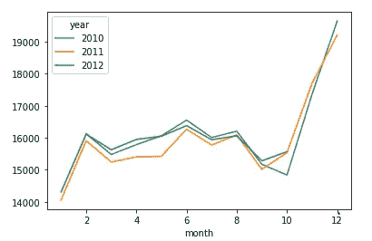

月销售额

2010 年、2011 年和 2012 年这三年的周销售额都在接近年底时上升。

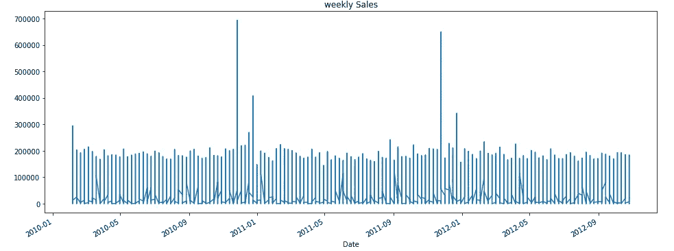

每周销售额

出于理解的目的，我们将尝试所有 3 种建模方法，并将比较结果。但正如上文所见，规模、部门、商店和假期等特征对销售的影响很小，时间序列模型或 LSTM 深度学习模型或监督 ML 模型可能会给出更好的结果。

让我们理解在第 2、3 和 4 部分中

如果你觉得它内容丰富，请给它一个掌声，如果我应该改进什么，请在评论中提及。