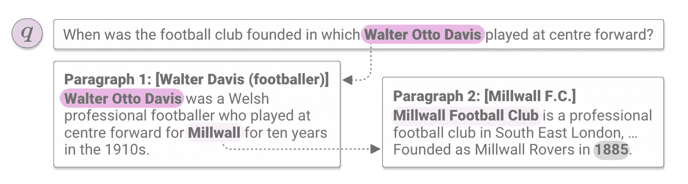
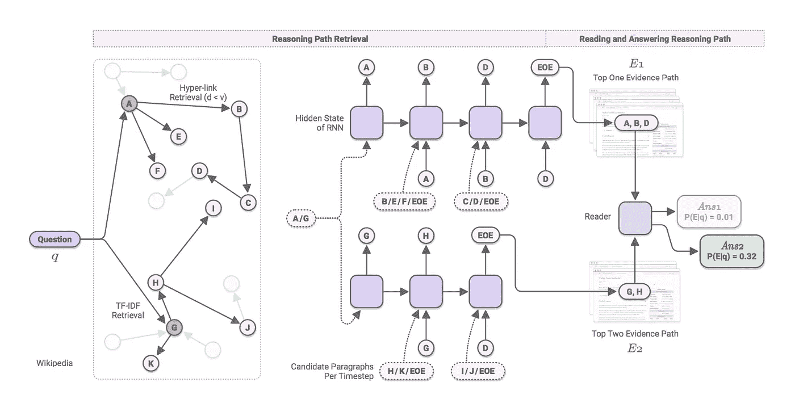
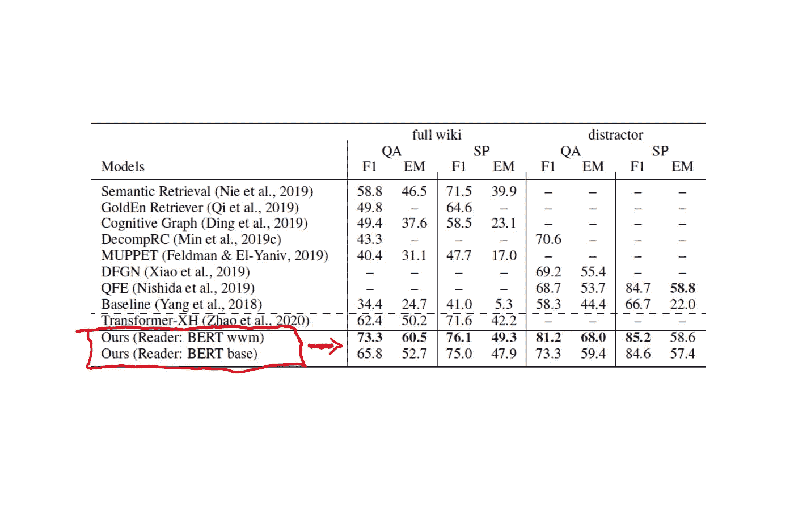
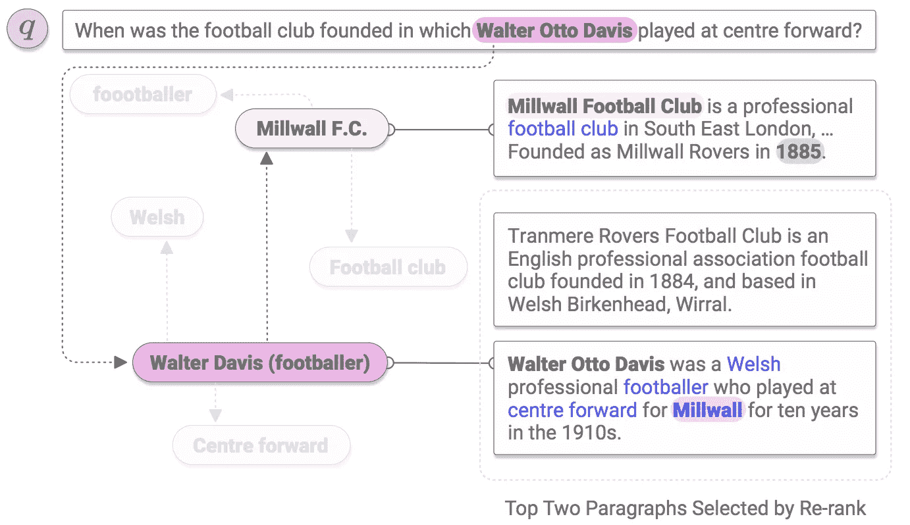

# Salesforce ODQA 是一个用于开放领域问答的开源框架

> 原文：<https://pub.towardsai.net/salesforce-odqa-is-an-open-sources-framework-for-open-domain-question-answering-435bf0d1e9e5?source=collection_archive---------0----------------------->

## [自然语言处理](https://towardsai.net/p/category/nlp)

## 该框架使用多跳问答方法，通过推理维基百科的数据集来回答复杂的问题。

图片来源:Salesforce

> 我最近创办了一份专注于人工智能的教育时事通讯，已经有超过 10 万名订户。《序列》是一份无废话(意思是没有炒作，没有新闻等)的 ML 导向时事通讯，需要 5 分钟阅读。目标是让你与机器学习项目、研究论文和概念保持同步。请通过订阅以下内容来尝试一下:

 [## 序列

### 订阅人工智能世界中最相关的项目和研究论文。受到 85，000 多人的信任…

thesequence.substack.com](https://thesequence.substack.com/) 

问答是一种自然的人类认知机制，在获取知识的过程中起着关键作用。我们不断评估信息，以找到特定问题的答案。多年来，人工智能(AI)系统一直试图以开放领域问答(ODQA)的形式模拟这种认知能力。最近，Salesforce Research [开源了一个基于维基百科图表](https://github.com/AkariAsai/learning_to_retrieve_reasoning_paths)的 ODQA 框架。

ODQA 是近年来自然语言处理研究中最活跃的领域之一。然而，大多数 ODQA 系统在高度受限的环境中运行，其中开放域 QA 系统首先使用计算高效的基于术语的检索器为每个查询选择几个段落，然后读取排名靠前的段落以提取答案。这种方法被称为单一希望问答，尽管这是一个困难的挑战，但它不太像人类的认知过程。通常，我们面对的问题需要检查许多文档来构建一个单一的答案。这已经成为 ODQA 系统的新领域之一。

# 多跳 QA。

试着回答这个问题*沃尔特·奥托·戴维斯踢中锋的足球俱乐部是什么时候成立的？*使用下面列出的两段。在 ODQA 系统的环境中，应该考虑一些挑战。对于示例问题，有必要有效地“跳到”第 2 段(Millwall F.C .)，其中包含了答案(1985)。然而，广泛使用的基于术语的检索可能找不到它，因为关键实体“米尔沃尔足球俱乐部”在问题中没有明确说明。为了回答目标问题，ODQA 系统需要在不同的文档之间进行“多次跳跃”。人工智能理论通常将这种类型的系统称为多跳 QA。

图片来源:Salesforce

多跳问答通常需要找到一个以上的证据文档，其中一个通常由与原始问题的少量词汇重叠或语义关系组成。解决多跳问答问题的关键要素是建立包含回答目标问题所需证据的文档的认知图。

# 维基推理图

构建文档的认知图似乎是我们已经做过的事情。维基百科提供了一个丰富的链接文档的层次数据集，为我们能想到的几乎任何问题提供了证据。按照这种思路，Salesforce 的框架利用维基百科学习检索推理路径，并构建认知图来回答复杂的开放领域问题。

为了构建推理图，Salesforce 框架首先在维基百科上搜索一个复杂问题的答案，我们可能会首先查看一篇我们可以根据问题中的部分信息轻松找到的维基百科文章。如果我们在那里找不到足够的信息，我们可能会点击另一篇高度相关文章的超链接，当我们收集到足够的证据来回答这个问题时，就停止搜索。推理图是使用维基百科文章中的链接构建的。具体来说，该框架使用超链接来构建图的直接边。此外，它还考虑了对称的文档内链接，允许一个段落跳转到同一篇文章中的其他段落。由此产生的维基百科图表紧密相连，涵盖了广泛的主题，为开放领域的问题提供了有用的证据。该图是离线构建的，并在任何问题的训练和推理中重复使用。

使用推理图作为起点，Salesforce 框架依靠递归神经网络(RNN)为给定问题的推理路径建模。在任何给定时间，给定 RNN 的当前隐藏状态，模型从一组候选段落中选择一个段落。初始隐藏状态独立于任何问题或段落，并且基于参数化向量。该模型依赖于 BERT 的令牌表示来独立地编码每个候选段落。之后，RNN 计算候选段落被选中的概率。RNN 选择过程通过对选择历史进行调节来捕获推理路径中段落之间的关系。当[EOE]，证据结束符号，被选择时，该过程被终止，以允许它捕捉给定每个问题的任意长度的推理路径。

图片来源:Salesforce

Salesforce 框架积极利用高效的搜索策略，如波束搜索，可以降低模型的计算复杂性，这在传统上是以前的多跳 QA 方法的一个挑战。

Salesforce 针对几个维基百科数据集评估了其图形检索器框架:HotpotQA、SQuAD Open 和 Natural Questions Open。该模型在所有数据集上都取得了显著的性能，但在使用多跳检索至关重要的 HotpotQA 数据集时表现更佳。一个令人印象深刻的事实是，完整的模型是使用单个 11GB RAM 的 GPU 训练的。下面的矩阵显示了结果。

图片来源:Salesforce

可以说，Salesforce 框架最显著的成就是在场景中构建推理路径的能力，这对于其他多跳模型是不可能的。例如，下图显示了一个场景，其中 Salesforce 图表模型成功检索到正确的推理路径并正确回答，而其他模型(如重新排名)则失败。图表旁边最上面的两段是推理路径上两个实体的介绍性段落，最下面的段落显示的是重新排序选择的错误段落。“Millwall F.C .”具有较少的词汇重叠，并且桥实体“Millwall”没有在给定的问题中陈述。因此，Re-rank 选择了与给定问题有高度词汇重叠的错误段落。

图片来源:Salesforce

salesforce 基于图形的检索框架代表了一种有趣的 ODQA 系统方法。该模型学习顺序检索证据段落以形成推理路径，然后重新排列推理路径，确定从最佳推理路径中提取的最终答案。框架的当前实现[可在 Github](https://github.com/AkariAsai/learning_to_retrieve_reasoning_paths) 中获得，并附有[一篇详细描述底层技术的研究论文](https://arxiv.org/abs/1911.10470)。