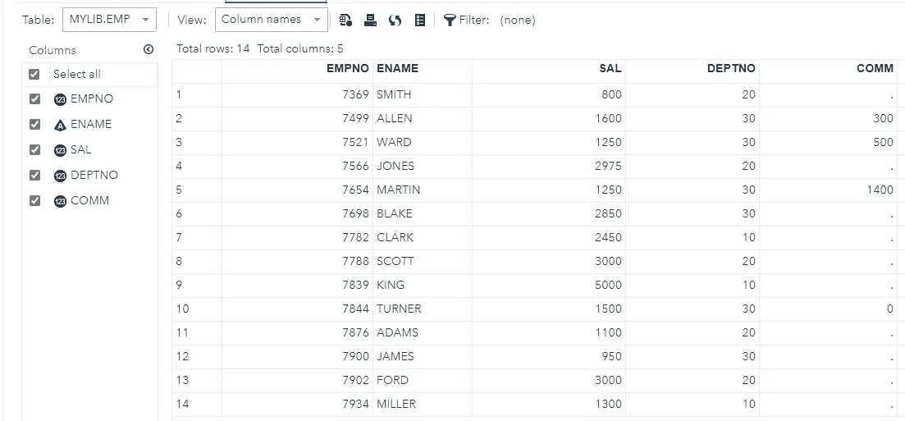
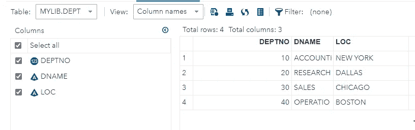
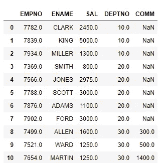
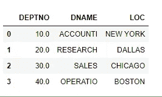
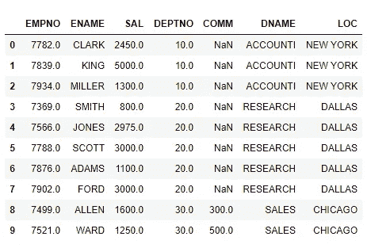
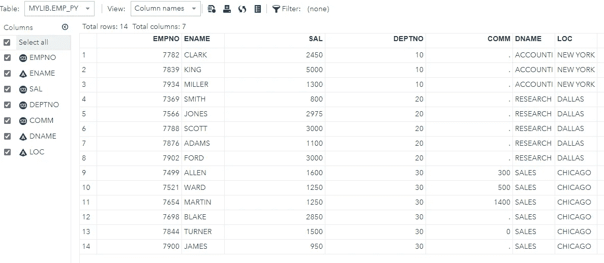

# 使用 Python 和 SAS 进行 ETL

> 原文：<https://pub.towardsai.net/sas-python-interaction-6af10212a609?source=collection_archive---------3----------------------->

## [编程](https://towardsai.net/p/category/programming)


SAS Py

本文的目标是理解 Python 3.x 与 SAS 9.4 大学版的交互。使用 python pandas 库读取 SAS 数据集，操作数据集并将结果写回 SAS。

SAS 大学版是免费的 SAS 软件，可用于教学和学习统计和定量方法。然而，本文的范围仅限于使用 SAS 和 Python 的 ETL 操作。

> #注意:假设安装了 SAS 大学版。

1.  **SAS 库和数据集**

一个 **SAS 库**是一个或多个 SAS 文件/数据集的集合，这些文件/数据集被 SAS 识别，并作为一个单元被引用和存储。每当创建新的会话时，SAS 自动创建两个库 **Work、**临时库**、**和 **SASUSER、**永久库**。**

一个 **SAS 数据集**是一个包含列和行的表格。在 SAS 中，表称为数据集，列称为变量，行称为观察值。在每次观察中，每个变量都有一个特定的值。

用简单的术语或 DB 术语来说，SAS 库可以被解释为模式，而 SAS 数据集可以被理解为具有矩阵结构的 DB 表，该矩阵结构具有行和列。

**2。创建库和数据集**

创建库的 SAS 命令:

```
libname mylib ‘<path>’;
```

创建数据集的 SAS 命令:

```
DATA mylib.emp;
 infile ‘<path>/emp.csv’
 dlm=’,’
 FIRSTOBS=2 DSD; 
 input EMPNO ENAME $ SAL DEPTNO COMM;
run;
```



Emp 数据集

```
DATA mylib.dept;
 infile ‘<path>/dept.csv’
 dlm=’,’
 FIRSTOBS=2 DSD;
 input DEPTNO DNAME $ LOC $;
run;
```



部门数据集

SAS 中的数据集以 SAS 数据格式存储在磁盘上: **sas7bdat。**

**3。使用 Python 读取 SAS 数据集**

```
import pandas as pdemp_df= pd.read_sas(r’D:\VirtualMs\SAS University Edition\myfolders\emp.sas7bdat’,encoding=’utf-8')
emp_df.head(10)
```



emp 数据集

```
dept_df= pd.read_sas(r’D:\VirtualMs\SAS University Edition\myfolders\dept.sas7bdat’,encoding=’utf-8')
dept_df.head(10)
```



部门数据集

数据操作步骤，应用等值联接来合并员工和部门数据集。

```
final_df=pd.merge(emp_df,dept_df[[‘DEPTNO’,’DNAME’,’LOC’]],on=’DEPTNO’,how=’inner’)
final_df.head(10)
```



合并数据

将熊猫数据帧写入磁盘:

```
final_df.to_csv(‘D:\VirtualMs\SAS University Edition\myfolders\emppy.csv’,index=False)
```

**4。从 CSV 文件**创建一个 SAS 表

从 CSV 文件创建表格的 SAS 程序:

```
DATA mylib.emp_py;
 infile ‘/folders/myfolders/emppy.csv’
 dlm=’,’
 FIRSTOBS=2 DSD;
 input EMPNO ENAME $ SAL DEPTNO COMM DNAME $ LOC $;
run;
```



SAS 表数据

上述程序的解释:

**数据步骤:**该步骤包括将所需的数据集加载到 SAS 存储器中，并识别数据集的变量(也称为列)。它还捕获记录，也称为观察。

**Infile:** 指定输入文件的路径和名称，以及分隔符 **dlm，在我们的例子中是**，‘由于 CSV 文件。

**FIRSTOBS:** 指定从哪一行开始读取，2 表示跳过表头，从第一次观察开始读取，这是实际的表头。

总的来说，我们已经使用 Python Pandas 库成功地从 SAS 中读取了数据集，并将数据集写回磁盘，然后用相同的数据集创建了一个表。这个博客到此为止。

感谢大家对内容的支持。