# 在 Tableau 中保存数据:Tableau 桌面专家认证之路

> 原文：<https://pub.towardsai.net/saving-data-in-tableau-a-road-to-tableau-desktop-specialist-certification-d9b4dd0cff8a?source=collection_archive---------2----------------------->

## 第 14 章:关于 Tableau 中各种文件类型的综合指南，包含免费的 Udemy 转储。

欢迎来到第十四章，在这一章中，我们将学习 [Tableau](https://medium.com/u/fcbe60d0bf8b?source=post_page-----d9b4dd0cff8a--------------------------------) 中不同的文件类型。

> 如果你想浏览其他章节，请访问: [**画面:这是什么？为什么它是最好的？；Tableau 桌面专家认证之路。**](https://dakshtrehan.medium.com/tableau-what-it-is-1e2cdff35440)

> 如果您想直接访问 Tableau 桌面专家笔记，请在此处访问它们→[https://dakshtrehan . comment . site/Tableau-Notes-c 13 fceda 97 b 94 BDA 940 edbf 6751 cf 30](https://dakshtrehan.notion.site/Tableau-Notes-c13fceda97b94bda940edbf6751cf303)
> 
> 使用链接访问免费 Tableau 认证转储(有效期至 2022 年 7 月 6 日):
> 
> [https://www . udemy . com/course/tableau-desktop-specialist-certification-dumps-2022/？coupon code = e3f 08189 fa 4 bafae 72 BC](https://www.udemy.com/course/tableau-desktop-specialist-certification-dumps-2022/?couponCode=E3F08189FA4BAFAE72BC)

您创建了一些可视化效果，并设计了一些漂亮的仪表板。现在怎么办？您将如何与利益相关者/其他创建者共享您的工作簿？

Tableau 提供不同的文件类型/扩展名来保存和共享您的数据。

# 目录

*   **。twb 文件**
*   **。twbx 文件**
*   **。hyper/。tde 文件**
*   **。tds 文件**
*   **。tdsx 文件**
*   **总结**
*   **本主题的认证问题示例**

# 。twb 文件

twb 文件的可视提示

**。twb 文件不包含数据源**，但它构成了 Tableau 与数据源交互的方式，即所有连接和映射。此外，**它包含一个或多个工作表，以及零个或多个仪表板。**

**。twb 文件仅对本地目的**有用，即共享。twb 文件没有意义，因为一旦数据目录被修改，它就会崩溃。

**。twb 文件是 XML 文件。**

## 创建. twb 文件

**第一步**:文件>另存为

**第二步:**选择”。twb”扩展。

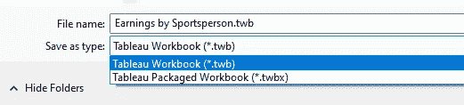

# 。twbx 文件

twbx 文件的可视提示

**。twbx 文件是打包的工作簿，包含工作簿和数据源。**

**。twbx 文件可以共享**,因为它包含数据源的本地副本以及工作表和仪表板。其他人可以用 Tableau Desktop 或 Tableau Reader 轻松打开 twbx 文件。

要保存的默认目录。twbx 文件是*" Tableau Repository>Workbooks "*但是我们可以改变默认位置。

除了数据源的副本之外，一个. twbx 还包括:

*   背景图像
*   自定义地理编码
*   自定义形状
*   本地多维数据集文件
*   Microsoft Access 文件
*   Microsoft Excel 文件
*   Tableau 提取文件(。亢奋或者。tde)
*   文本文件(。csv，。txt 等。)

## 创建. twbx 文件

创建. twbx 文件有两种方法。

**方式 1 →**

步骤 1:文件>另存为

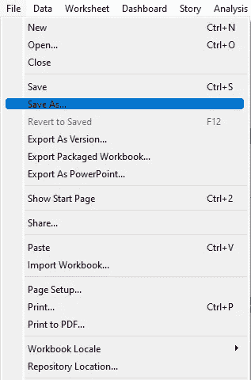

**第二步:**选择”。twbx”分机。

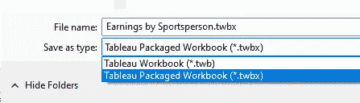

**方式 2 →**

文件>导入打包的工作簿

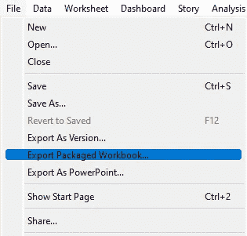

# 。hyper/。tde 文件

超级文件的视觉提示

在第十章中，我们学习了实时连接和提取连接。**以我们使用的提取形式保存我们的文件。hyper/。tde 扩展。**

**。hyper/。tde 格式创建我们数据的本地副本。**当我们希望与同事共享数据源时，这种文件格式非常有用。

**这种格式只包含我们数据的本地副本**，没有工作表或仪表板。但要确保，你不会分享任何机密数据。

**。tde 文件已停止使用，扩展名已更改为. hyper.**

## 创建. hyper 文件

创建. hyper 文件有两种方法。

**方式 1 →**

Step1: Data>" *您的数据源名称* " >提取数据

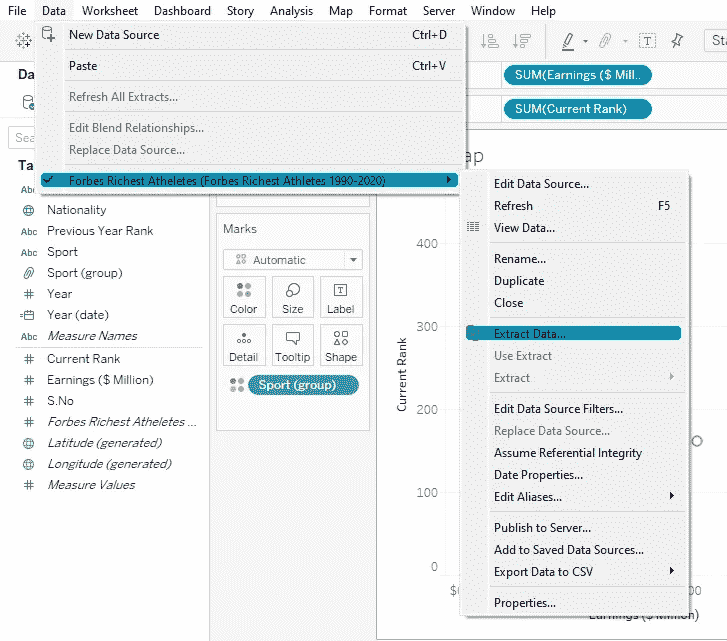

步骤 2:过滤数据(如果需要)并选择是否希望自动刷新数据。点击“提取”。

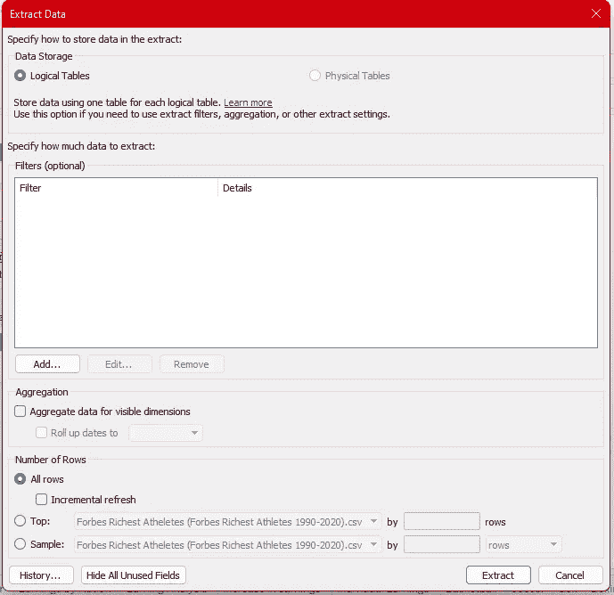

**方式 2 →**

步骤 1:右键单击数据源名称并选择“提取数据”。

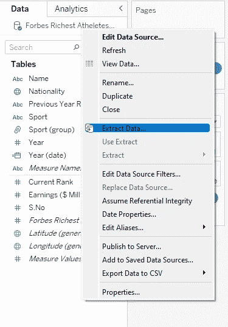

步骤 2:过滤数据(如果需要)并选择是否希望自动刷新数据。点击“提取”。

# 。tds 文件

tds 的视觉提示

**。tds 文件不包含数据源，但包含所有连接和映射，即数据模型以及您所做的其他修改，**如参数、计算字段、默认属性等。

**。tds 不包含工作表或仪表板。**

## 创建. tds 文件

第一步:数据>*“您的数据源”* >添加到已保存的数据源。

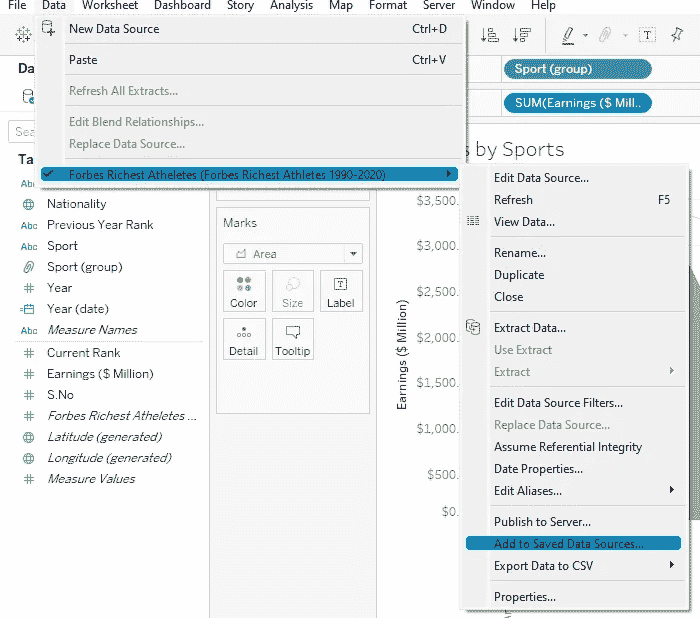

第二步:选择”。tds”文件。

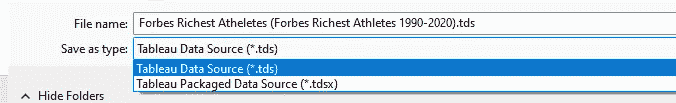

本地保存的 Tableau 数据源(。tds)文件出现在“连接”页面上的“保存的数据源”下。

。默认情况下，tds 文件保存在*‘我的 Tableau 存储库>数据源’中。*

# 。tdsx 文件

tdsx 文件的可视提示

。tdsx 文件是打包的数据源文件。

**。tdsx 包含您的数据副本，以及用户对数据所做的修改(参数、过滤器、计算等)。**

## 创建. tdsx 文件

第一步:数据>*【您的数据源】* >添加到已保存的数据源。

第二步:选择”。tdsx”文件。

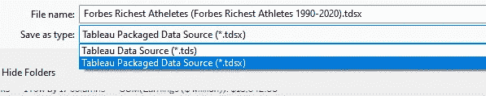

# 总结

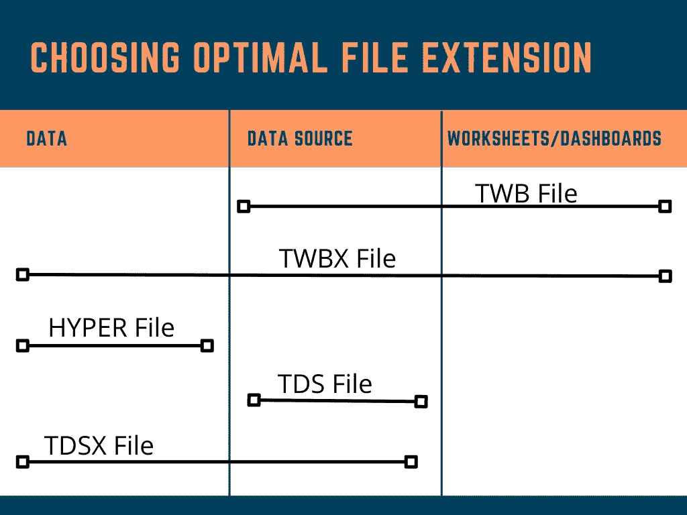

# **本主题的认证问题示例**

**_____________ 包含可视化效果、构建可视化效果所需的信息以及数据源的副本。**

a.。twb
b。twbx
c。tds
d。tdsx

**解决方案:**。twbx

您已经正确清理了一个数据源，创建了一些计算字段，并重命名了一些列。您希望保存这些更改以备将来使用。以下哪一项最能满足这一要求？

a.另存为。tds
b .另存为。twbx
c .另存为。twb
d .另存为。tdsx

**解决方法:**另存为。总溶解固体（Total dissolved solids 的缩写）

**打包的工作簿有加密功能吗？** a .真
b .假

**解:**假

**Tableau 自动将文件存储在哪里？** a .我的 Tableau 库
b .我的文档
c .下载量
d .我的数据源

**解:**我的 Tableau 资源库

**哪个扩展最适合共享数据源和工作表？** 一个。twbx
b。tds
c。tdsx
d。滴滴滴

**解决方案:**。twb

> 使用链接访问免费 Tableau 认证转储(有效期至 2022 年 7 月 6 日):
> 
> [https://www . udemy . com/course/tableau-desktop-specialist-certification-dumps-2022/？coupon code = e3f 08189 fa 4 bafae 72 BC](https://www.udemy.com/course/tableau-desktop-specialist-certification-dumps-2022/?couponCode=E3F08189FA4BAFAE72BC)

# 参考资料:

[1] [Tableau 帮助| Tableau 软件](https://www.tableau.com/support/help)

[2] [个人笔记](https://dakshtrehan.notion.site/Tableau-Notes-c13fceda97b94bda940edbf6751cf303)

[3] [Tableau 桌面专家考试(新花样— 2021) — Apisero](https://apisero.com/tableau-desktop-specialist-exam-new-pattern-2021/)

# 感谢阅读！

请随意鼓掌，这样我就知道这篇文章对你有多有帮助，并在你的社交网络上分享它，这对我很有帮助。

如果你喜欢这篇文章，想了解更多**机器学习，数据科学，Python，BI。请考虑订阅我的时事通讯:**

> [达克什·特雷汉的简讯](https://mailchi.mp/b535943b5fff/daksh-trehan-weekly-newsletter)。

在网上找到我:[www.dakshtrehan.com](http://www.dakshtrehan.com/)

在 LinkedIn 与我联系:[www.linkedin.com/in/dakshtrehan](http://www.linkedin.com/in/dakshtrehan)

阅读我的科技博客:【www.dakshtrehan.medium.com 

在 Instagram 和我联系:【www.instagram.com/_daksh_trehan_ 

# 想了解更多？

[YouTube 是如何利用 AI 推荐视频的？](/how-is-youtube-using-ai-to-recommend-videos-38a142c2d06d)
[利用深度学习检测新冠肺炎](https://towardsdatascience.com/detecting-covid-19-using-deep-learning-262956b6f981)
[无法逃脱的 AI 算法:抖音](https://towardsdatascience.com/the-inescapable-ai-algorithm-tiktok-ad4c6fd981b8)
[GPT-3 向一个 5 岁的孩子解释。](/gpt-3-explained-to-a-5-year-old-1f3cb9fa030b)
[Tinder+AI:一场完美的牵线搭桥？](https://medium.com/towards-artificial-intelligence/tinder-ai-a-perfect-matchmaking-b0a7b916e271)
[使用机器学习卡通化的内幕指南](https://medium.com/towards-artificial-intelligence/an-insiders-guide-to-cartoonization-using-machine-learning-ce3648adfe8)
[谷歌如何做出“哼哼来搜索？”](/how-google-made-hum-to-search-865f224b70d0)
[单行神奇代码执行 EDA！给我 5 分钟，我给你一个深度假！](/one-line-magical-code-to-perform-eda-f83a731fbc35)

> *欢呼*