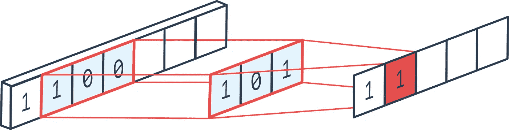

# 用于数据平滑的 Savitzky-Golay 滤波器

> 原文：<https://pub.towardsai.net/savitzky-golay-filter-for-data-smoothing-3b7c1c5e7f69?source=collection_archive---------2----------------------->

## [机器学习](https://towardsai.net/p/category/machine-learning)

数据预处理中最被低估的技术

在任何 ML/AI 工程师或数据科学家的生活中，不成文的规则是“在数据清理和预处理上花费健康的时间”，因为“垃圾进来——垃圾出去”。在为训练/建模准备数据集时，我们忘记了考虑数据中的异常值。

照片由[威尔·迈尔斯](https://unsplash.com/@will_myers?utm_source=medium&utm_medium=referral)在 [Unsplash](https://unsplash.com?utm_source=medium&utm_medium=referral) 上拍摄

# 离群值及其处理方法

异常值是数据中位于其各自变量范围极端的点。例:7 英尺的身高很少出现在任何包含 X 人身高的数据集中。在这个特殊的例子中，高度要么是数据记录不一致，要么是正确的测量值，无论哪种方式，都很难确定，如果不事先处理，它会对模型产生很大影响。

在这种情况下，有许多解决方案可以采用。我们可以使用异常/异常检测算法来消除它们。有许多不同种类的算法可以做到这一点，但我不会在这篇文章中介绍，因为这是一个非常庞大的研究领域，不可能包含在一篇文章中。

还有另一种称为数据平滑的方法，它试图保留通过这些异常点给出的信息，而不是完全删除它们。最佳做法是移除处于极端位置(与数据显著不同)的点，例如高度为 20 英尺的点肯定是异常值，在训练模型时不应进行采样。当数据中偶尔出现异常数据时，平滑技术会更好，例如，AQI 时间序列数据中的突然峰值，这可能是真的，但处理它们是重要的一步。

# 萨维茨基-戈莱滤波器

这就是这个神奇的低通滤波器的用武之地。这主要用于信号处理中，作为信号波动的滤波器。这也可以很好地用于平滑数据。该过滤器试图逼近原始函数，从数据中去除无用的波动/噪声，这些波动/噪声很可能误导您的模型。

# 它是如何工作的

对于熟悉深度学习中的第二卷积概念的人来说，这个过滤器就是这样工作的。对于那些不熟悉的人来说，这很像移动平均技术，但是我们可以指定数据拟合的多项式的阶。

来源: [Peltarion](https://peltarion.com/knowledge-center/documentation/modeling-view/build-an-ai-model/blocks/1d-convolution)

这种过滤器在分析化学和电子学中被广泛使用，在机器学习中大多被忽略，(我决定写这个的原因)。 ***基本上，这个过滤器是围绕数据集的子集进行卷积的，每个子集都用一个多项式函数进行拟合，试图最小化该特定子集的拟合误差，这反过来给我们一组新的点，这些点比以前更加平滑。*** (基本上是带额外步骤的移动平均线变换)

数学推导参见[这里的](https://en.wikipedia.org/wiki/Savitzky%E2%80%93Golay_filter)。

# 用 Python 实现

让我们来看一个真实世界的例子，让我们明白这一点。我们将使用`scipy.signal`包中的`savgol_filter`函数。请看下面我写的简单代码，它演示了这个过滤器是如何工作的。通过试验不同的值，找到了最佳的窗口大小和多项式阶数。采用较大的窗口大小会改变数据的意义太多，因此建议使用奇数编号的小窗口，尽管这些窗口是根据域、情况和各种实验结果来确定的。

我从 yahoo finance 获取了 5 天的 DOGE-USD 数据，并使用所有天的高点来展示我们如何平滑数据，同时保留数据集的原始结构

这会产生以下情节:

DOGE-USD 数据平滑和非平滑对比曲线图

# 结论

在现实世界的例子中，这工作得很好，并且根据我们的需要非常灵活。在这个领域，这一点确实被忽视了，希望我已经阐明了这个概念。如果你对这个想法感兴趣并想了解更多，请参考原文。

感谢您通读。如果你读到这里，我很荣幸。